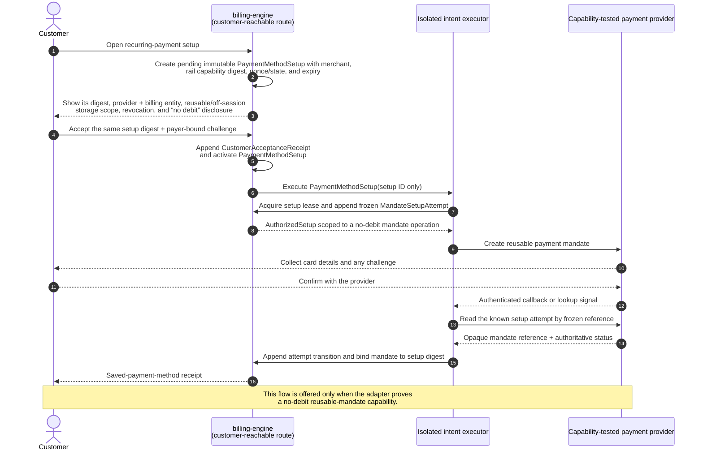
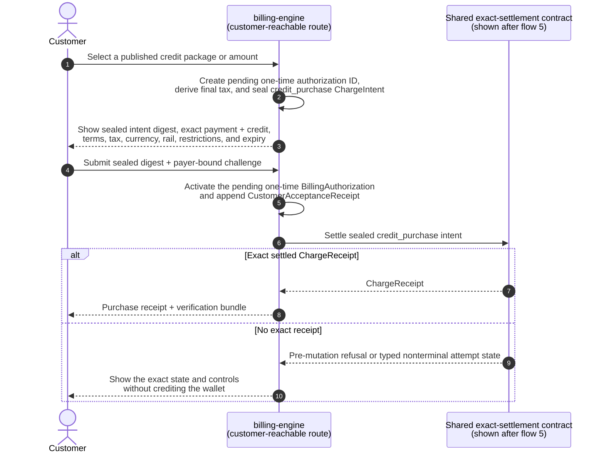
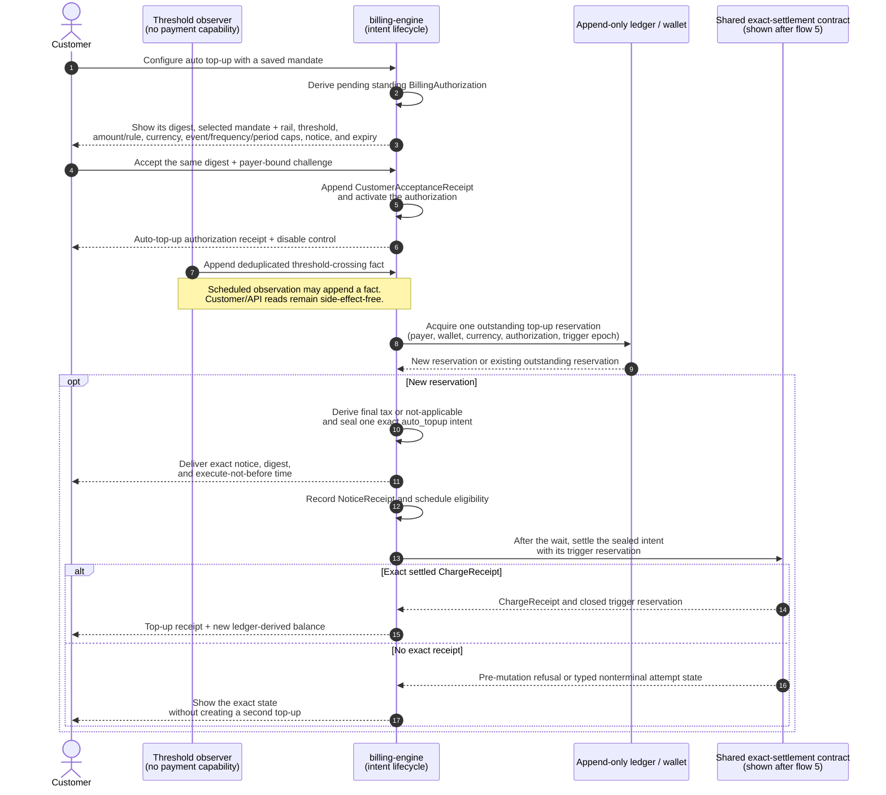
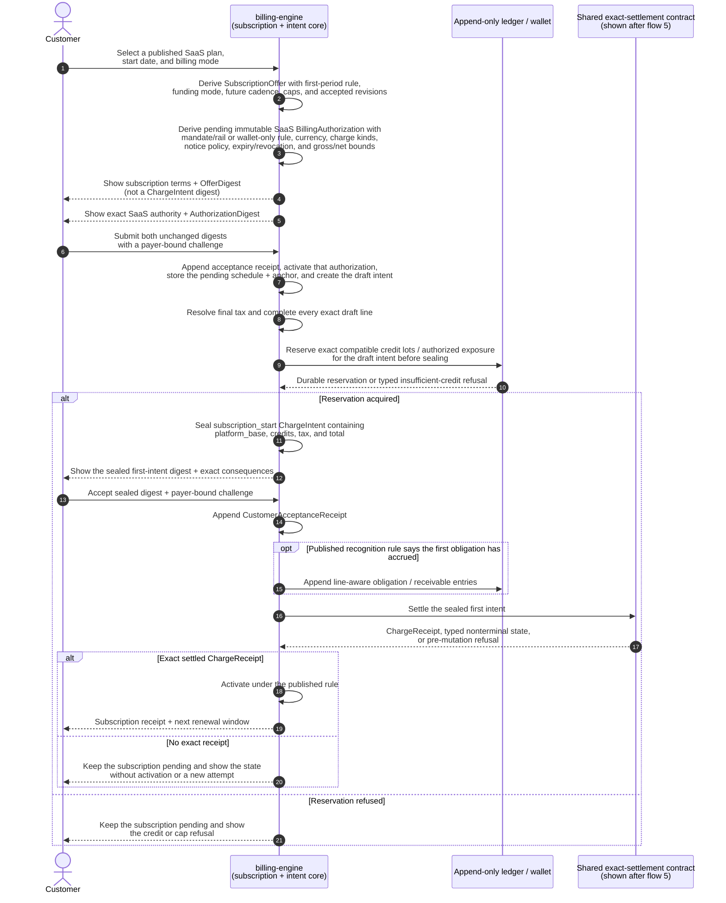
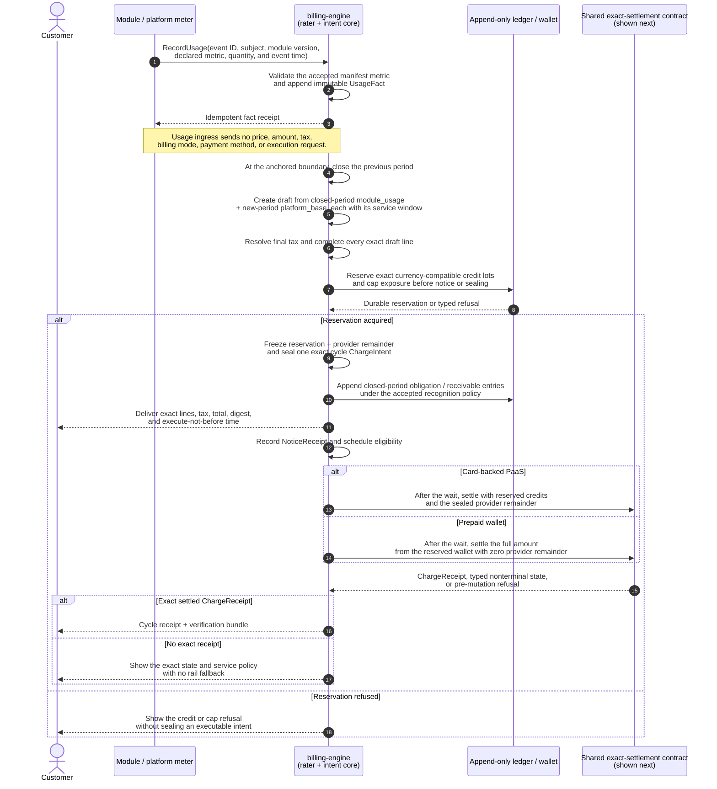
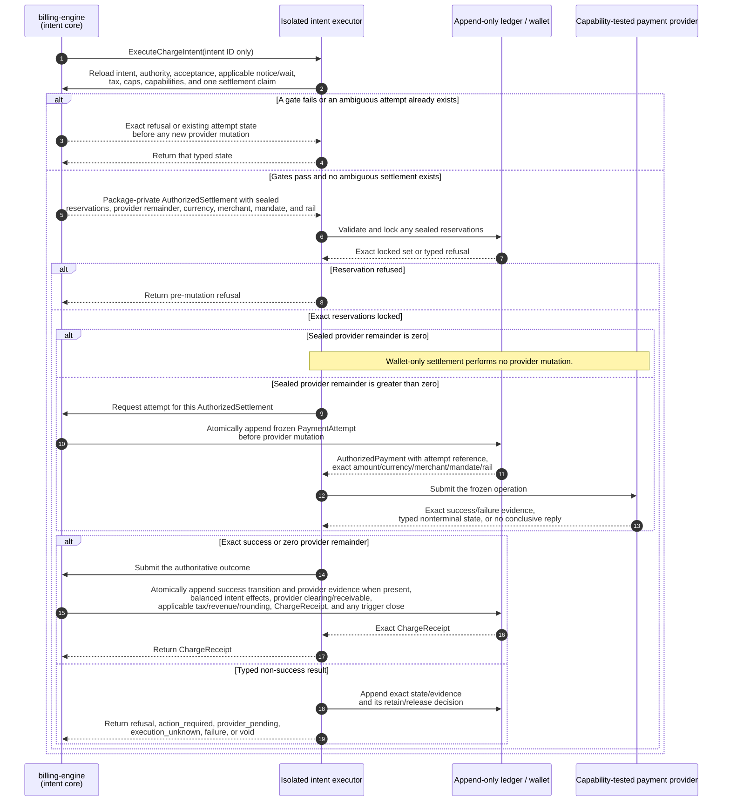
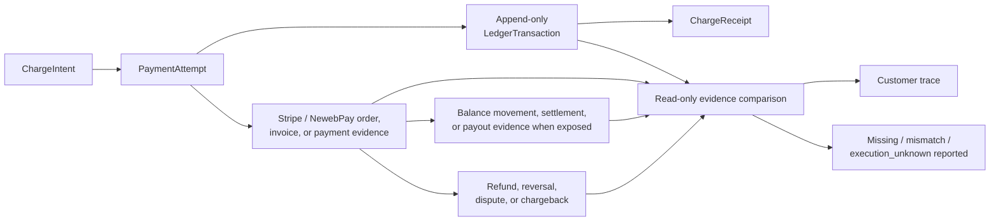

# billing-engine

The public billing boundary for [MirrorStack](https://mirrorstack.ai).

This repository is public so customers and their developers can answer a
question involving real money by reading code and verifying their own receipts:

> **Can MirrorStack collect money for something I was not shown, did not
> authorize, or cannot reproduce?**

The intended answer is no. The current implementation has not reached that
answer yet, and this README starts with that fact.

---

## Status, before anything else

> 🔴 **The current `main` source is not intent-only. Do not read the target docs
> as a claim about production.**

The current engine has strong usage-event, integer-money, idempotency, frozen
attempt, and provider-reconciliation controls. It also contains multiple direct
Stripe-writing paths for cycle collection, proration, module capacity, domains,
credit purchase, auto top-up, and unpaid invoice payment.

The most serious capability leak is structural: a nominal billing-status read
can reach the auto-top-up coordinator and collect from a saved payment method.
Usage ingress and infrastructure synchronization can also reach that coordinator.
A read/query/ingest component that can charge is incompatible with the desired
boundary, whatever the individual function names say.

Other current gaps:

- there is no immutable, customer-visible `ChargeIntent` covering exact lines,
  tax, policies, notice, authorization, build identity, and total;
- exact pre-charge notice is not required or recorded;
- large-charge disclosure is post-charge;
- budgets are alert-only rather than an enforced service/collection stop;
- current price sources include compiled constants and mutable fallbacks without
  a customer-accepted, future-effective price-book digest;
- tax is not implemented—`$0.00` in a UI mock is not a determination;
- the schema and domain are Stripe-shaped, and payment-write credentials are
  present in several binaries;
- the public health answer says only `{"status":"ok"}` and does not identify the
  deployed source/artifact/policy revisions; and
- this repository therefore cannot currently let a customer prove which public
  commit produced a particular charge.

The target design in [`docs/DESIGN.md`](docs/DESIGN.md) is **proposed**. It is
not implemented, deployed, or used by all callers. The weakest reachable money
path defines the real guarantee; adding a stronger intent API beside a legacy
direct-charge path would not make the deployment intent-based.

Automatic merge/promotion is paused while this boundary is designed and
reviewed. No document on this branch authorizes a production rollout.

---

## The short version

| question | current source | required target |
|---|---|---|
| Can a private caller supply an invoice amount? | Most rating is server-derived, but money authority is fragmented across direct paths and mutable policy | Caller reports constrained facts or names an intent action; it never supplies amount, price, tax, total, payment method, provider, notice, or execution time |
| Is the exact charge immutable before collection? | Frozen attempts usually preserve cents/provider recovery shape, not the full customer-verifiable calculation and policy set | One canonical `ChargeIntent` freezes every line, source, policy, tax result, authorization, notice rule, currency, total, and digest |
| Must notice happen before automatic collection? | No universal pre-charge gate; some disclosure is post-charge | Exact intent delivered, durable receipt recorded, public wait elapsed; failure blocks execution |
| Does a budget stop spending/collection? | Current app budget is alert-only | UI and API distinguish alert, service cap, collection cap, and authorization revocation; only implemented controls are called stops |
| Can unknown tax become zero? | No authoritative tax engine exists | `tax.status = unknown` is distinct from final zero and never executable |
| Can internal infrastructure cost become a customer line? | Current models include infrastructure inputs/markup | No. Infrastructure is internal cost; customer lines are only the closed public vocabulary |
| Is Stripe the billing model? | Much of the current schema/state machine is Stripe-shaped | No. Provider-neutral intent/ledger core; Stripe and NewebPay are adapters |
| Can one intent charge through two providers? | No cross-provider model exists | Durable settlement claim permits one success across all rails |
| Can a customer trace Stripe cash flow? | Provider ids/invoice mirror exist, but no complete public receipt graph | Read-only trace links intent → attempt → provider objects → balance/payout/refund/dispute evidence → ledger/receipt |
| Can a customer identify deployed code? | Public health has no SHA/policy identity | `Health`, `Capabilities`, build provenance, transparency commitment, and receipt all bind exact source/artifact/policies |

---

## The target customer money flows

> **Target sequences, not current production:** current `main` still has the
> direct Stripe-writing paths described above. None of these flows is a deployed
> guarantee until every legacy money path is removed and the readiness gates
> pass.

These are separate flows shown in reading order, not one mandatory chain. Auto
top-up depends on a saved payment mandate. Card-backed PaaS subscription depends
on a saved mandate plus separate SaaS authority. Credit purchase is optional.
Period close depends on an accepted subscription and its period anchor.
Money-moving flows invoke the same exact-settlement contract, shown once after
flow 5 so their customer-specific parts stay readable.

| customer term | current API value | target funding rule |
|---|---|---|
| card-backed PaaS | `standard` | reserve eligible credit lots before notice, collect only the sealed provider remainder, then commit both atomically |
| prepaid wallet | `credits` | settle the full intent from the wallet; insufficient authorized credit refuses with no card fallback |
| PaaS credit | not a mode | a possible subscription allowance/benefit; it cannot silently change the funding mode |

The older internal `arrears`/`prepaid` risk state is also separate from these two
customer funding modes. Every amount is integer minor units in one named
currency. Credit lots fund only compatible currency/line kinds. Cross-currency
use requires a separate disclosed FX intent; a provider adapter never converts
silently.

The target evaluates gross service/accrual caps, wallet-credit application,
net external collection caps, and auto-top-up funding caps separately. A small
provider remainder cannot hide a gross obligation above the customer's service
limit.

### 1 · Bind a card for recurring use

Card binding creates a reusable provider mandate and a verifiable setup receipt.
It creates no debit and no `BillingAuthorization`. Subscription and auto top-up
later request their own bounded authority against that mandate.



Card data goes to the provider, not through a private MirrorStack caller. Card
binding also does not start a billing period. Subscription acceptance establishes
the period anchor. Current source instead stamps `accounts.activated_at` from a
Stripe `payment_method.attached` event; that coupling must be removed. If a rail
requires an initial payment to create a reusable token, it must use an exact
customer-authorized payment intent instead of this setup flow.

### 2 · Buy credit once

A one-time credit purchase is customer-present. The engine page shows the exact
money paid and the exact credit received before the customer submits the same
digest.



The customer submission is the exact disclosure and one-time authorization; a
private RPC cannot perform it. The `CustomerAcceptanceReceipt` is challenge-bound,
payer-bound, expiring, and replay-protected; it is not an engine-manufactured
delivery claim. A separate cooling-off period remains a product decision. Credit
becomes spendable only after verified settlement. A browser return is never
success evidence.

Current `StartCreditPurchase` can create and finalize an auto-advance Stripe
invoice before the browser receives its client secret. The target replaces that
prepare-and-charge ambiguity with an explicit describe, accept, then execute
sequence. Unknown tax is a typed refusal, never a zero-tax purchase.

### 3 · Enable recurring auto top-up

Auto top-up reuses a saved mandate, but it does not reuse general SaaS billing
authority. It has its own standing `BillingAuthorization`, digest, limits, notice
rule, receipt, and revocation control.



Disabling auto top-up revokes its authorization and cancels every waiting intent
that has not acquired its execution lease. It does not detach the card or change
SaaS authority. A leased or `execution_unknown` attempt retains its claim and
reservation until exact settlement or authoritative void proof. Pending funding
counts in threshold evaluation, so two observations cannot create two top-ups.

Today `GetServiceStatus`, `GetCreditStanding`, fresh usage ingress, and
infrastructure synchronization can reach the auto-top-up executor. The target
monitor above is deliberately incapable of doing that.

### 4 · Create a SaaS subscription

This is a proposed domain subscription, not a provider-native subscription.
`billing-engine` owns the plan revision, period anchor, renewal schedule, and
every exact charge. Stripe or NewebPay is only a settlement rail and cannot
invent the next renewal amount.

Current source has no `subscriptions` table or create/change/cancel route;
requesting the subscription capability always reports it missing. The existing
“New creation” billing group means app, module-add-on, and domain creation
charges, not subscription creation. Those fragmented immediate/grace paths are
consolidated into exact cycle intents in the target.



The first intent uses the shared settlement contract described after flow 5.
Later renewals always create a new exact intent, notice, wait, and receipt; no
provider-side subscription can calculate or collect a renewal independently.

### 5 · Close module usage and open the new SaaS period

At one account-period boundary, one consolidated intent contains the closed
period's module usage and the newly opened period's SaaS base. This is where the
new period's `platform_base` is proposed for settlement. Every line names its own
service window and recognition rule. There is no infrastructure line and no
per-usage-event payment.



### Shared exact-settlement contract for flows 2–5

Each money-moving flow above passes only a sealed intent id to this contract.
The caller cannot provide or revise an amount, funding split, provider, mandate,
tax result, notice claim, or execution time.



Card-backed PaaS reserves eligible credits before exact notice and commits them
only in the same transaction as verified provider settlement. Prepaid wallet
commits the full reservation atomically with no provider call and no card
fallback. Auto top-up may later fund the wallet only through flow 3; usage
ingress and period close never invoke it synchronously.

`action_required`, `provider_pending`, and `execution_unknown` are appended and
returned as typed states while retaining the settlement claim and reservations.
Customer completion or a callback can resume reconciliation only for that same
frozen attempt; neither creates a new provider operation or rail fallback.
`execution_unknown` records no ledger settlement or `ChargeReceipt`; whether the
provider debited remains unknown until same-provider authoritative
reconciliation. Authoritative failure/void releases the claim and reservations
with append-only evidence. An unaccepted intent's reservation expires with that
intent without mutating history or consuming wallet value.

Failed collection does not erase accrued service. Closed-period usage remains a
line-aware receivable. The new-period base accrues only if the accepted service
start/cancellation policy says that period began; otherwise it is canceled or
superseded without rewriting the closed usage lines.

The current cycle already combines closed-period usage with several new-period
fees, but it moves money directly, has no universal exact notice or final tax,
and records the prepaid-wallet mixed boundary too coarsely. The target keeps each
intent line and each allocated credit lot independently reproducible.

Across all five flows, the isolated intent executor is the only component with a
payment-provider write capability. Its setup operation accepts only a setup id
and is available only for a capability-tested no-debit mandate operation. Its
payment operation accepts only a sealed intent id, reloads every precondition,
and receives the exact provider amount from the engine's package-private
`AuthorizedSettlement`, never from a caller or wallet.

The shared sequence shows the successful funding boundary and typed non-success
handoff once. The full reconciliation state machine is detailed in
[`docs/DESIGN.md` §4](docs/DESIGN.md#4-intent-lifecycle):

- a missing gate, insufficient authorized credit, or unavailable settlement
  claim refuses before any provider mutation;
- authoritative proof that an operation did not and cannot collect appends void
  evidence with no debit and no automatic rail fallback; and
- a timeout or conflict latches `execution_unknown`, retains the settlement
  claim and any reservation, and permits only same-provider read-only
  reconciliation. It records no ledger settlement or receipt and creates no
  retry or provider fallback; whether the provider debited remains unknown.

Read and write provider interfaces are separate. Support/reconciliation can
trace Stripe or NewebPay evidence without possessing the capability to collect,
refund, void, trigger auto top-up, or otherwise mutate a provider.

---

## Payment providers are replaceable rails

The domain model is:

- `PaymentMethodSetup` and `MandateSetupAttempt`: a frozen, expiring,
  capability-tested no-debit provider setup;
- `BillingAuthorization`: bounded one-time or standing customer authority;
- `CreditReservation`: a currency-compatible, uniquely constrained hold that is
  not itself a debit;
- `ChargeIntent`: the exact provider-neutral monetary proposal;
- `CustomerAcceptanceReceipt`: replay-protected proof that the authenticated
  payer submitted one exact digest on an engine-served route;
- `NoticeReceipt`: evidence that the exact proposal was delivered;
- `PaymentAttempt`: one provider-specific attempt and state history;
- `ProviderEvidence`: read-only observations/callback proof from that rail;
- `LedgerTransaction`: append-only monetary truth; and
- `ChargeReceipt`: the customer-verifiable connection across all of them.

Stripe is one adapter. A NewebPay/Taiwan adapter is the next planned rail. The
core does not assume Stripe's draft-invoice/finalize/PaymentIntent lifecycle or
that every provider supports recurring mandates, automatic collection, partial
refunds, the same currencies, or the same callback behavior.

Adapters publish capabilities and pass one conformance suite. Unsupported
operations fail before external mutation. An authenticated provider callback may
reconcile a known attempt but cannot originate or enlarge a charge.

Go implements this with small consumer-owned interfaces, struct composition,
and package-private authorized values—not class inheritance and not one enormous
provider interface.

---

## No silent charge

Automatic collection requires all of these:

```text
immutable exact intent
AND exact notice delivered
AND public waiting period elapsed
AND customer authorization still valid
AND gross obligation within service/accrual caps
AND wallet application matches its reservation and cap
AND net provider remainder within the external collection cap
AND auto-top-up funding within its separate caps, when applicable
AND tax final or explicitly not applicable
AND every policy effective and digest-matching
AND selected rail supports the exact operation/currency
AND a frozen PaymentAttempt exists before provider mutation
AND no prior/ambiguous settlement exists
```

Anything else produces no new provider mutation.

Notice evidence proves delivery under a published rule. It does not prove a
human read an email, and the product will not claim that it does.

The exact delivery channels, recipients, minimum lead time, standing ceilings,
and price-change notice rules are product decisions still under discussion. The
safe skeleton can be implemented before those values; execution stays disabled
until accepted policy supplies them.

---

## What customers may be charged for

The exhaustive target vocabulary is in [`docs/CHARGES.md`](docs/CHARGES.md).
Positive service lines are limited to accepted platform base, module usage,
optional published module-capacity/domain policies, and tax. Credits and
corrections are explicit linked lines.

**Infrastructure is not a customer charge dimension.** Internal compute,
egress, model, provider, and margin data may support operations or developer
settlement, but cannot feed the customer rater or appear as a hidden line.

Payment-provider fees are also internal unless a future public, accepted policy
adds a specific customer charge kind. An adapter cannot append one.

---

## Tax

Tax is designed before it is implemented. [`docs/TAX.md`](docs/TAX.md) defines
the safety boundary:

- immutable effective policy revisions;
- verified customer/jurisdiction evidence;
- exact taxable-basis allocation and integer rounding;
- `final`, `not_applicable`, and non-executable `unknown` states;
- tax frozen before notice and collection;
- append-only refund/correction treatment; and
- no payment-adapter tax changes.

Merchant-of-record, registrations, supported jurisdictions, inclusive/exclusive
display, exemptions/reverse charge, Taiwan business/e-invoice duties, TWD, and
provider choices require accountable legal/tax/finance decisions. They are not
reconstructed from today's code.

---

## Ledger and provider trace

[`docs/LEDGER-AND-RECEIPTS.md`](docs/LEDGER-AND-RECEIPTS.md) separates internal
monetary truth from external evidence.

A customer can follow the evidence chain end to end:



Provider observations are append-only snapshots. A mismatch opens a
reconciliation incident; the engine does not edit its intent/ledger to make a
provider total fit.

Settled history is append-only. Late usage, mistakes, refunds, disputes, tax
changes, and goodwill credits create linked corrections rather than rewriting
the original charge.

---

## Public verification

The target receipt bundle contains the intent, source commitments, formulas,
integer rounding, module/price/tax/terms/notice revisions, authorization,
delivery evidence, engine source/artifact identity, provider attempt/evidence,
and balanced ledger entries.

The planned verifier is:

```text
billing-verify verify charge-bundle.json
```

It recomputes the charge offline. Runtime `Health` and `Capabilities` bind the
deployed commit/artifact, active policy digests, adapter readiness, notice rule,
and an explicit list of reachable legacy money paths.

See [`docs/VERIFICATION.md`](docs/VERIFICATION.md). Planned commands and schemas
are labelled as planned until they exist; a document is not verification.

---

## Documentation map

| document | owns |
|---|---|
| [`docs/DESIGN.md`](docs/DESIGN.md) | normative intent lifecycle, authority boundaries, Go ports/adapters, execution predicate, migration/readiness |
| [`docs/CHARGES.md`](docs/CHARGES.md) | exhaustive customer and non-customer monetary-effect vocabulary |
| [`docs/LEDGER-AND-RECEIPTS.md`](docs/LEDGER-AND-RECEIPTS.md) | append-only monetary truth, attempts, receipts, Stripe/NewebPay cash-flow trace |
| [`docs/TAX.md`](docs/TAX.md) | tax states, policy/evidence, calculation boundary, unresolved legal/product choices |
| [`docs/THREAT-MODEL.md`](docs/THREAT-MODEL.md) | adversaries, trust assumptions, protections, and admitted limits |
| [`docs/VERIFICATION.md`](docs/VERIFICATION.md) | build/deployment proof, verifier, properties, fuzzing, mutation, adapter conformance |
| [`SECURITY.md`](SECURITY.md) | vulnerability reporting, in-scope public claims, and known open issues |

A false or overstated public sentence is a security defect in a repository whose
purpose is customer verification.

---

## Migration rule

The new engine runs in shadow first: derive canonical intents without notice or
money movement, compare every line against current results, and investigate every
difference. Then add authorization, notice, tax, executor isolation, provider
adapters, receipts, and verification.

Callers migrate first. Direct provider routes and credentials are removed last,
after in-flight legacy attempts are drained or explicitly quarantined. Legacy
rows never receive fabricated consent, tax, notice, or policy evidence.

Production intent execution remains disabled until:

- all money effects are mapped and machine-enforced;
- shadow reconciliation has no unexplained difference;
- customer authorization/notice/tax policies are accepted;
- Stripe and NewebPay adapters pass their declared conformance tests;
- public build/receipt verification is available;
- the executor is the only provider writer; and
- `Capabilities` reports zero legacy money paths.

---

## Repository layout

```text
billing-engine/
├── cmd/                         current binaries; target roles become capability-narrow
├── internal/                    domain, adapters, and current implementation
├── migrations/billing/         authoritative current database schema
├── docs/
│   ├── DESIGN.md
│   ├── CHARGES.md
│   ├── LEDGER-AND-RECEIPTS.md
│   ├── TAX.md
│   ├── THREAT-MODEL.md
│   └── VERIFICATION.md
├── SECURITY.md
└── README.md
```

The migrations describe what exists today. These target documents describe what
must be true before the intent-only claim is made. Both statuses remain explicit
during migration.

---

## Running the current checks

```bash
make db         # start local PostgreSQL
make db-init    # apply current migrations
make lint       # go vet
make build      # build current binaries
make test       # current test suite; no production payment calls
```

The future verifier, fuzz, mutation, and provider conformance commands will be
listed only once their scripts exist and are reproducible without production
credentials or paid calls.

## Security

See [`SECURITY.md`](SECURITY.md). Do not place credentials, real customer data,
tax ids, payment methods, or production provider payloads in an issue or test
fixture.

## License

[FSL-1.1-ALv2](LICENSE) — converts to Apache 2.0 two years after release.
