# billing-engine

The public-source implementation and specification of
[MirrorStack](https://mirrorstack.ai)'s private-runtime billing authority.

This repository is public so customers and their developers can answer a scoped
question involving real money by reading code and verifying their own receipts:

> **Can the attested, conforming billing-engine path collect money that was not
> disclosed under the accepted rule, was not authorized, or cannot be
> reproduced?**

The intended answer is no, under the trust assumptions in
[`docs/THREAT-MODEL.md`](docs/THREAT-MODEL.md). Public source cannot prevent a
malicious/replaced executor or any actor holding an unrestricted merchant
credential from charging outside this path. Build attestation, credential
isolation, provider logs, and receipt reconciliation can constrain or expose
that bypass; they cannot make it impossible. The current implementation has not
reached even the scoped answer yet, and this README starts with that fact.

---

## Status, before anything else

> 🔴 **The current `main` source is not intent-only. Do not read the target docs
> as a claim about production.**

The current engine has strong usage-event, integer-money, idempotency, frozen
attempt, and provider-reconciliation controls. It also contains multiple direct
Stripe-writing paths for cycle collection, proration, module capacity, domains,
credit purchase, auto top-up, and unpaid invoice payment.

The most serious capability leak is structural: a nominal billing-status read
can reach the auto-top-up coordinator and collect from a saved payment method.
Usage ingress and infrastructure synchronization can also reach that coordinator.
A read/query/ingest component that can charge is incompatible with the desired
boundary, whatever the individual function names say.

Other current gaps:

- there is no immutable, customer-visible `ChargeIntent` covering exact lines,
  tax, policies, notice, authorization, build identity, and total;
- exact pre-charge notice is not required or recorded;
- large-charge disclosure is post-charge;
- budgets are alert-only rather than an enforced service/collection stop;
- current price sources include compiled constants and mutable fallbacks without
  a customer-accepted, future-effective price-book digest;
- tax is not implemented—any UI mock value, including a positive percentage
  preview, is not an authoritative determination;
- the schema and domain are Stripe-shaped, and payment-write credentials are
  present in several binaries;
- production dispatch currently has `lambda:InvokeFunction` authority over the
  whole account-api action dispatcher rather than a meter-only IAM/action
  capability, even though local metering uses a separate secret;
- both provider-event binaries currently inject Stripe-writing auto-top-up and
  credit-purchase executors into callback routing, so callback-to-writer remains
  a reachable legacy path;
- the current Stripe client inherits stripe-go's nonzero automatic network-retry
  default, so one apparent SDK mutation can hide multiple outbound submissions
  after an ambiguous transport failure;
- the public health answer says only `{"status":"ok"}` and does not identify the
  deployed source/artifact/policy revisions; and
- this repository therefore cannot currently let a customer prove which public
  commit produced a particular charge.

The target design in [`docs/DESIGN.md`](docs/DESIGN.md) is **proposed**. It is
not implemented, deployed, or used by all callers. The weakest reachable money
path defines the real guarantee; adding a stronger intent API beside a legacy
direct-charge path would not make the deployment intent-based.

Automatic merge/promotion is paused while this boundary is designed and
reviewed. No document on this branch authorizes a production rollout.

---

## The short version

| question | current source | required target |
|---|---|---|
| Can a private caller choose what is charged? | Most rating is server-derived, but money authority is fragmented across direct paths and mutable policy | Caller reports constrained facts or relays a closed non-authoritative catalog/template selection; the engine derives every financial field and only independent exact customer proof can authorize it |
| Is the exact charge immutable before collection? | Frozen attempts usually preserve cents/provider recovery shape, not the full customer-verifiable calculation and policy set | One canonical `ChargeIntent` freezes every line, source, policy, tax result, authorization, notice rule, currency, total, and digest |
| Must notice happen before automatic collection? | No universal pre-charge gate; some disclosure is post-charge | Exact intent delivered, durable receipt recorded, public wait elapsed; failure blocks execution |
| Does a budget stop spending/collection? | Current app budget is alert-only | UI and API distinguish alert, service cap, collection cap, and authorization revocation; only implemented controls are called stops |
| Can unknown tax become zero? | No authoritative tax engine exists | `tax.status = unknown` is distinct from final zero and never executable |
| Can internal infrastructure cost become a customer line? | Current models include infrastructure inputs/markup | No. Infrastructure is internal cost; customer lines are only the closed public vocabulary |
| Is Stripe the billing model? | Much of the current schema/state machine is Stripe-shaped | No. Provider-neutral intent/ledger core; Stripe and NewebPay are adapters |
| Can one intent charge through two providers? | No cross-provider model exists | Durable settlement claim permits one success across all rails |
| Can a customer trace Stripe cash flow? | Provider ids/invoice mirror exist, but no complete public receipt graph | Read-only trace links intent → attempt → provider objects → balance/payout/refund/dispute evidence → ledger/receipt |
| Can a customer identify deployed code? | Public health has no SHA/policy identity | `Health`, `Capabilities`, build provenance, transparency commitment, and receipt all bind exact source/artifact/policies |

---

## The target customer money flows

> **Target sequences, not current production:** current `main` still has the
> direct Stripe-writing paths described above. None of these flows is a deployed
> guarantee until every legacy money path is removed and the readiness gates
> pass.

These are separate flows shown in reading order, not one mandatory chain. Auto
top-up depends on a saved payment mandate. Card-backed PaaS subscription depends
on a saved mandate plus separate SaaS authority. Credit purchase is optional.
Period close depends on an accepted subscription and its period anchor.
Money-moving flows invoke the same exact-settlement contract, shown once after
flow 5 so their customer-specific parts stay readable.

### Runtime and trust boundary used by every flow

`billing-engine` is **public source, not a public customer endpoint**. In
production its account API is an IAM-gated Lambda invoked by `api-platform`; in
local development control-plane HTTP RPC uses `X-MS-Internal-Secret` while
`RecordUsage` uses the separate `X-MS-Meter-Secret`.
Customers use a MirrorStack billing UI backed by authenticated `api-platform`
routes. Provider events enter separate binaries. Public HTTPS ingress verifies
callbacks itself only when the adapter uses public-key or dedicated
verification-only material. When callback authentication shares provider-
mutation authority, ingress instead forwards bounded raw bytes and headers to
the fixed enclave verifier described below. The optional EventBridge partner-
bus consumer trusts AWS rule/bus delivery instead of an HMAC. Neither ingress
can expose the account RPC dispatcher in the target.

An adapter declares whether callback authentication uses a public key, a dedicated
verification-only secret, or a secret sharing provider-mutation authority. Only
the first two may live in public ingress. A shared broad MAC/decryption secret stays
inside its exclusive provider-credential enclave; ingress forwards bounded raw
bytes to a fixed verifier there and receives only a replay-bound observation. If
neither topology is enforceable, that callback capability is unsupported.

`api-platform` initiates every account RPC. The engine does not call the
browser or push into the customer-facing API. After asynchronous provider or
scheduler work, the browser reads engine-owned state through an authenticated
`api-platform` route; an independent notifier may separately deliver the
sealed disclosure.

The target adds two deliberately narrow public services beside—not inside—the
private engine account RPC:

- a consent/revocation edge accepts only canonical, customer-signed
  acceptance, cancellation, contact-enrollment, and revocation envelopes and
  appends them to a proof inbox consumed by the private core; and
- a read-only evidence edge serves engine-signed, customer-encrypted
  capabilities and receipts without depending on `api-platform`.

Neither edge has a provider-write interface, accepts a charge amount, or can
dispatch an account action. They are not deployed today. Automatic execution
remains disabled until their separate roles, origins, trust roots, rate limits,
and route/action inventories are deployed and attested.

### Shared customer proof, revocation, and evidence ceremony

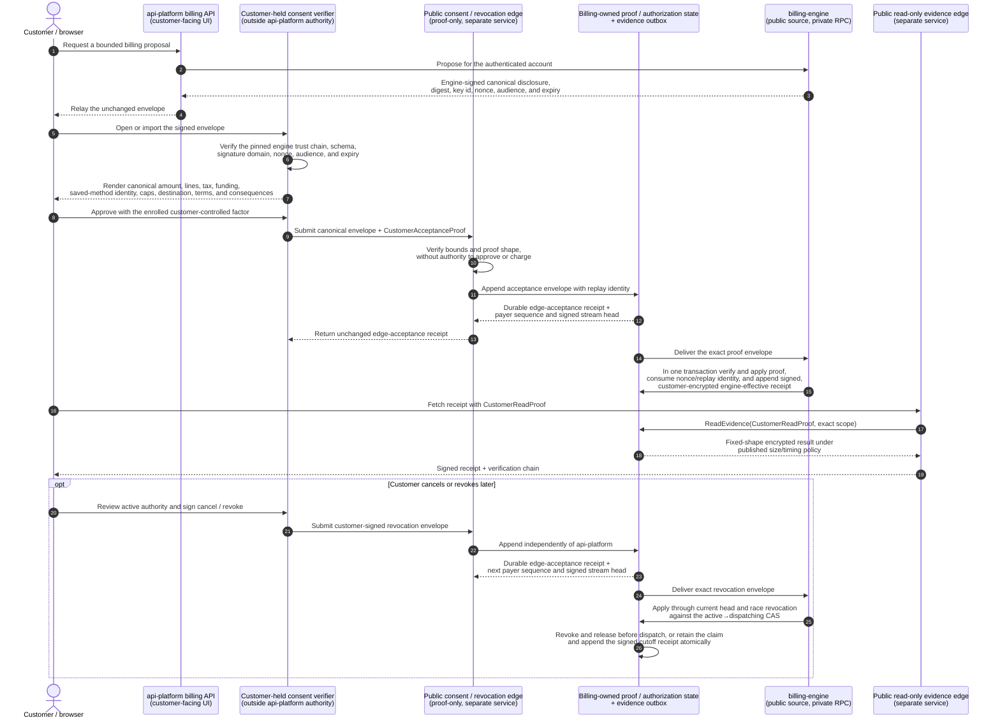

The diagrams therefore distinguish the customer-facing control plane from the
private engine. The control plane may relay an engine-issued challenge and exact
disclosure, but it is not the acceptance or revocation path and its statement
that a customer clicked is never authority. A `CustomerAcceptanceProof` binds
the payer, account, engine audience, exact digest, nonce, expiry, and replay
identity to a customer-controlled factor that neither `api-platform` nor the
consent edge can mint. An opaque digest signature is not enough: the
customer-held verifier validates the engine signature and renders the canonical
amount, lines, caps, destination, and terms before that factor signs. The engine
verifies and atomically consumes the proof. Until this complete path exists,
customer presence is unproven and standing authorization or automatic execution
remains disabled.

The first enrolled factor is not bootstrapped from an `api-platform` login. It
requires an engine challenge, proof of possession, and an independently
verifiable account/organization authority credential under a pinned public root,
or an equivalently attested offline ceremony. Rotation is signed by an existing
factor. Lost-factor recovery uses that independent authority, a public cooling
interval, notice to every existing destination/factor, and a surviving-factor
cancel path; automatic execution and new standing authority are disabled during
cooling. The issuer/recovery roots and policy are published in `Capabilities`.

The proof inbox, settlement claim, and provider-dispatch grant share one
billing-owned serialization boundary. Each payer has a gap-free monotonic
sequence and an authenticated stream head. Before assigning a sequence, the
billing-owned append procedure verifies the engine envelope, factor signature,
schema/size bounds, payer, nonce/replay uniqueness, expiry, and prior head; an
invalid or duplicate envelope cannot jam the stream. The edge returns an
`EdgeAcceptanceReceipt` only after a valid envelope is durably sequenced.
Incremental application advances a per-payer high-watermark under a strict
published batch/transaction budget and never rescans from sequence 1. Claim and
consume transactions lock the same head and proceed only when
`appliedHead == currentHead`; otherwise they fail closed and requeue application.
After catching up, they evaluate revocation, acquire the claim, create an
`active` grant, or CAS it to `dispatching`. A revocation accepted before any
prior/current adverse or customer-collectible path atomically revokes the grant
and releases claim/reservations. If a hold or `client_dispatched` capability
already exists, revocation blocks the next debit/capture but retains the claim
through frozen cleanup. One serialized after the point of no return receives a
receipt identifying the cutoff. A stale, missing, gapped, or
unverifiable head fails closed. Edge acceptance proves durable ordering; only the
later engine-effective receipt proves the command took effect.

Standing automatic settlement additionally requires a fresh signed
`RevocationPathReadinessReceipt` from an independently attested probe of the
public revocation edge(s) and billing proof store. It binds origins/regions,
artifact/root revisions, head consistency, time/max age, and transparency
checkpoint. Missing, stale, inconsistent, or incident-flagged readiness blocks
provider dispatch and wallet settlement. Targeted censorship by every trusted
edge/probe remains an explicit TCB limitation.

The evidence edge is also outside `api-platform` authority. Every sealed intent,
notice/eligibility result, acceptance or revocation result, typed refusal,
nonterminal attempt state, settlement, and correction is committed with a signed,
customer-encrypted evidence record through a billing-owned transactional outbox.
The edge may serve those immutable records but cannot create or edit them. A
`CustomerReadProof` binds the enrolled customer factor to the payer/account,
exact object or bounded collection scope, evidence-edge audience, nonce, expiry,
replay identity, and encryption-key version. The edge verifies that proof against
the billing-owned enrollment by passing it to a narrow billing-owned
`ReadEvidence` procedure. Its role has no table/list/raw-read access. The
procedure atomically verifies and consumes replay identity. Within each published
scope class it uses one status/content type/error shape, fixed ciphertext-size
bucket, minimum latency bucket with bounded jitter, and rate limit for authorized,
absent, and unauthorized requests. This bounds the documented response-shape/
timing oracle; it does not claim perfect network or microarchitectural
indistinguishability. A replaced edge, an `api-platform` identity assertion, or
an opaque id still cannot authorize a cross-tenant read.

| customer term | current API value | target funding rule |
|---|---|---|
| card-backed PaaS | `standard` | reserve eligible credit lots before notice, collect only the sealed provider remainder, then commit both atomically |
| prepaid wallet | `credits` | settle the full intent from the wallet; insufficient authorized credit refuses with no card fallback |
| PaaS credit | not a mode | a possible subscription allowance/benefit; it cannot silently change the funding mode |

The older internal `arrears`/`prepaid` risk state is also separate from these two
customer funding modes. Every amount is integer minor units in one named
currency. Credit lots fund only compatible currency/line kinds. Cross-currency
use is unsupported in this closed vocabulary. The engine must propose a new
same-currency-priced intent under a published price-book revision; a provider
adapter never converts silently.

The target evaluates gross service/accrual caps, wallet-credit application,
net external collection caps, and auto-top-up funding caps separately. A small
provider remainder cannot hide a gross obligation above the customer's service
limit.

Rating/tax credits and stored-value wallet funding are distinct. The first may
reduce `grossObligation`; the second funds it. The receipt proves both equations
without double use:

```text
serviceGrossObligation = positiveServiceLines - eligibleRatingTaxCredits + tax + rounding
fundingGrossObligation = cashPurchasePrincipal + tax + rounding
collectionGrossObligation = sourceRemainingCollectibleReserved
grossObligation = the kind-selected service, funding, or collection obligation
grossObligation = walletFunding + providerRemainder
```

Credit purchase and auto top-up use the funding equation. Their positive cash
principal, exact stored value granted, any explicit bonus, currency/unit,
restrictions, and expiry are digest-bound; bonus output cannot reduce principal.
Collection intents bind the immutable source obligation/receipt, prior
collections/credits/write-offs, exact remaining collectible amount, and unique
source-capacity reservation; they never re-rate or re-tax the source.

### 1 · Bind a card for recurring use

Card binding creates a reusable provider mandate and a verifiable setup receipt.
It creates no debit and no `BillingAuthorization`. Subscription and auto top-up
later request their own bounded authority against that mandate.

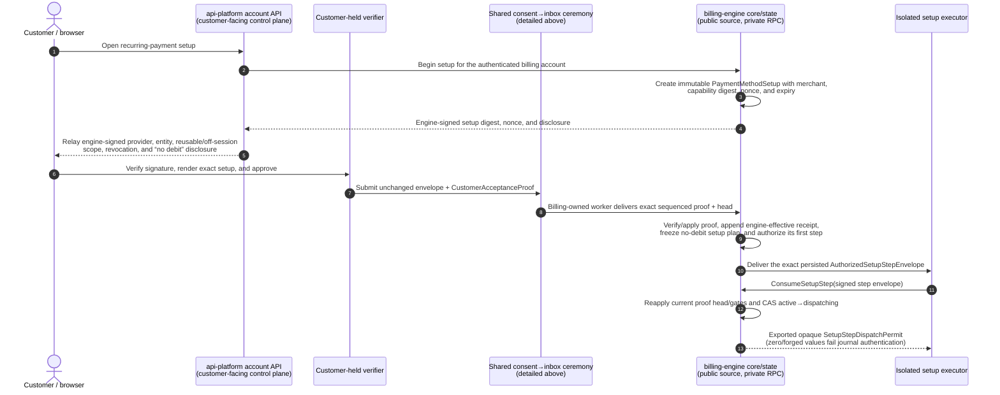

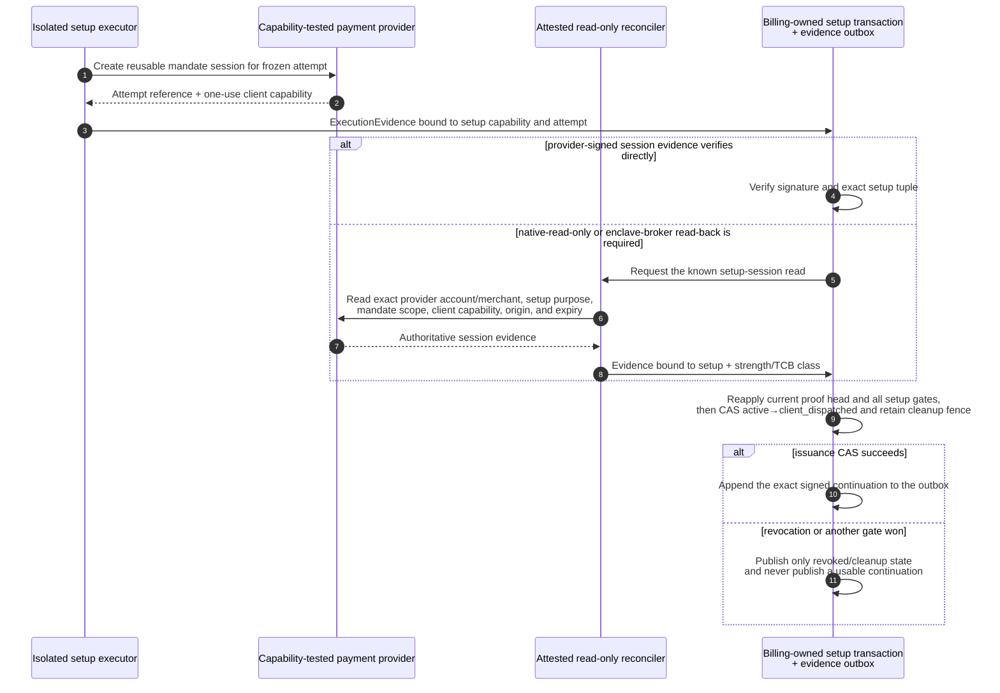

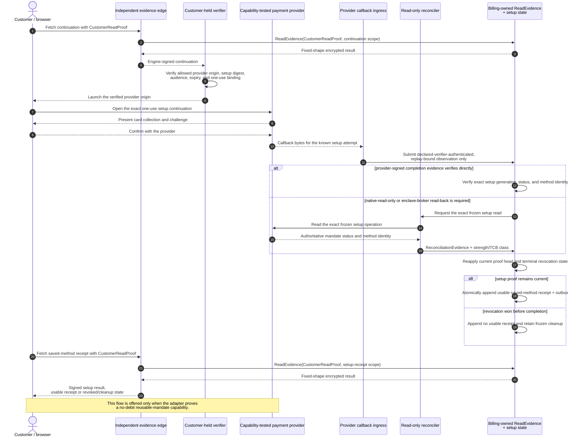

Card data goes to the provider, not through `api-platform` or the engine. The
control plane cannot replace provider evidence or manufacture setup acceptance.
The resulting saved-method receipt binds the setup digest and opaque reference to
provider-verified, customer-readable identity: provider/entity, brand or method
type, masked suffix, expiry where applicable, and mandate scope. Later authority
binds that receipt digest and the independent verifier renders those fields; an
opaque id alone cannot authorize or substitute a different same-payer method.
The setup receipt also binds the engine-effective acceptance receipt and customer-
proof commitment, payer proof-stream sequence/head/cutoff, factor/verifier
revision, dispatch-time and terminal-completion revocation state, exact provider/entity/merchant setup
binding and no-debit
execution plan, every step consume/permit/egress identity, exact setup-executor/
enclave attestation, and either directly verifiable provider-signed evidence or
the exact trusted session/mandate-reader evidence-class attestation when read-back
was used, plus transparency checkpoints, adapter artifact/version, and provider evidence.
Current `Health` is not historical proof; unknown, substituted,
revoked, expired, or wrong-role setup artifacts block later standing authority.
Card binding also does not start a billing period. The exact first subscription
settlement activates the accepted schedule/period anchor and service authority
only when the same responsibility/schedule generation still holds; offer
acceptance alone leaves it pending. Current source instead stamps
`accounts.activated_at` from a Stripe `payment_method.attached` event; that
coupling must be removed. If a rail requires an initial payment to create a
reusable token, it must use an exact customer-authorized payment intent instead
of this setup flow.

Removing a saved method first applies a customer-signed mandate revocation that
immediately cuts off every linked standing authorization and active pre-adverse
grant. A separate purpose/step-typed revoke plan detaches the exact provider
mandate. Its receipt reports engine cutoff and provider status separately;
pending/unknown provider detach never re-enables engine use.

### 2 · Buy credit once

A one-time credit purchase is customer-present. `api-platform` relays the
engine-signed exact money paid and exact credit received; an independent consent
verifier renders those canonical fields before the customer submits the same
digest.

It does not require a saved mandate. Its external funding uses a
customer-present one-time `PaymentInstrumentBinding` that freezes provider,
merchant, allowed provider origins, one-time/no-reuse scope, exact intent,
deterministic operation identity, continuation schema/policy, and expiry. After
dispatch creates the provider session, the core signs the actual continuation
bound to that accepted tuple and frozen attempt. The independent verifier checks
it before the customer enters payment data; the private UI cannot substitute a
URL or reusable method.

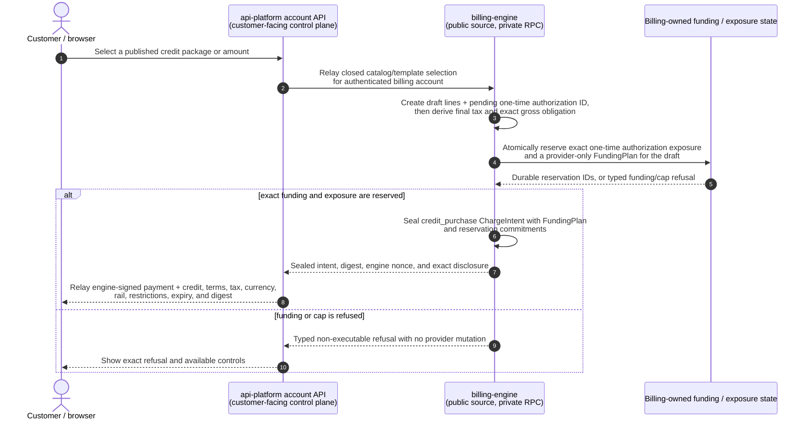

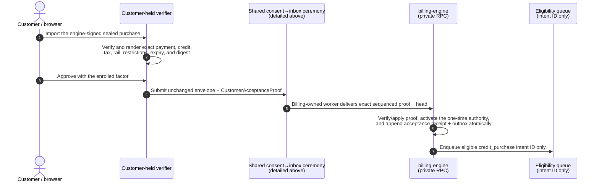

The customer submission is the exact disclosure and one-time authorization.
The independent consent edge appends it to the proof inbox but cannot replace
the `CustomerAcceptanceProof` with its own approval claim. The
`CustomerAcceptanceReceipt` is challenge-bound, payer-bound, expiring, and
replay-protected; it is not an engine-manufactured delivery claim. A separate
cooling-off period remains a product decision. Credit becomes spendable only
after verified settlement. A browser return is never success evidence.
Purchase state and receipts use the shared narrow `CustomerReadProof`/
`ReadEvidence` ceremony; the evidence edge never invokes the private account RPC.

Current `StartCreditPurchase` can create and finalize an auto-advance Stripe
invoice before the browser receives its client secret. The target replaces that
prepare-and-charge ambiguity with an explicit describe, accept, then execute
sequence. Unknown tax is a typed refusal, never a zero-tax purchase.

### 3 · Enable recurring auto top-up

Auto top-up reuses a saved mandate, but it does not reuse general SaaS billing
authority. It has its own standing `BillingAuthorization`, digest, limits, notice
rule, receipt, and revocation control.

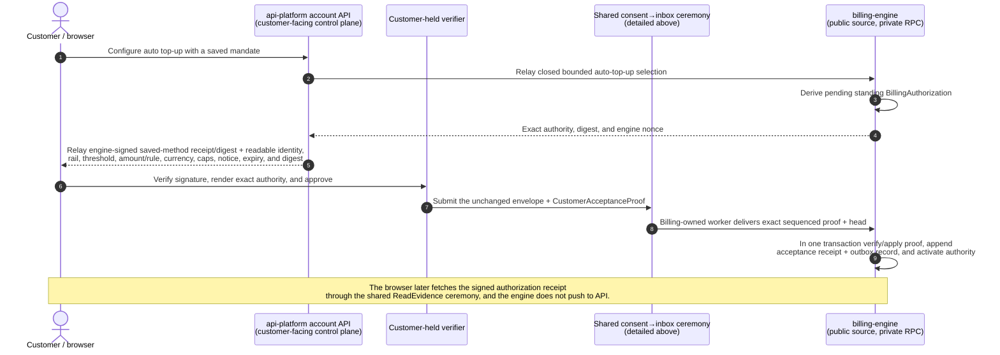

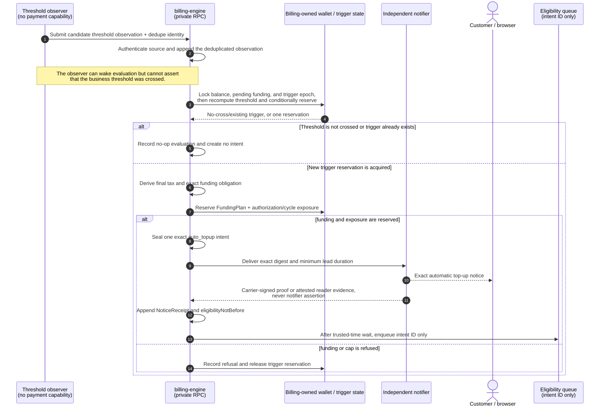

Current top-up state and controls are read through the shared narrow
`CustomerReadProof`/`ReadEvidence` ceremony above; the evidence edge never invokes
the private account dispatcher.

Disabling auto top-up revokes its authorization and cancels every waiting or
claimed intent whose provider-dispatch capability is still `active`. It does not detach the card or change
SaaS authority. A `dispatching`, `provider_pending`, or `execution_unknown`
attempt retains its claim and reservation until exact settlement or authoritative
void proof. Pending funding
counts in threshold evaluation, so two observations cannot create two top-ups.

Today `GetServiceStatus`, `GetCreditStanding`, fresh usage ingress, and
infrastructure synchronization can reach the auto-top-up executor. The target
monitor above is deliberately incapable of doing that.

### 4 · Create a SaaS subscription

This is a proposed domain subscription, not a provider-native subscription.
`billing-engine` owns the plan revision, period anchor, renewal schedule, and
every exact charge. Stripe or NewebPay is only a settlement rail and cannot
invent the next renewal amount.

Current source has no `subscriptions` table or create/change/cancel route;
requesting the subscription capability always reports it missing. The existing
“New creation” billing group means app, module-add-on, and domain creation
charges, not subscription creation. Those fragmented immediate/grace paths are
consolidated into exact cycle intents in the target.

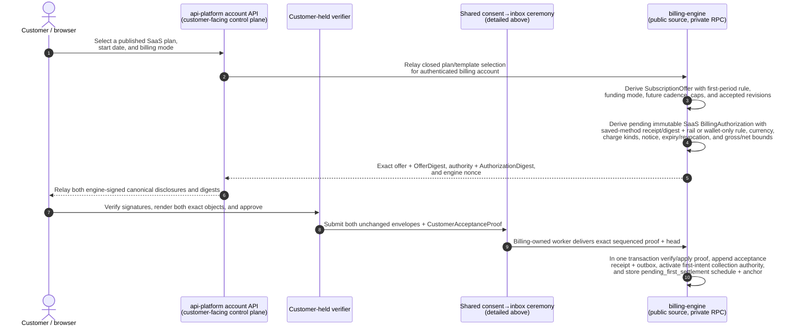

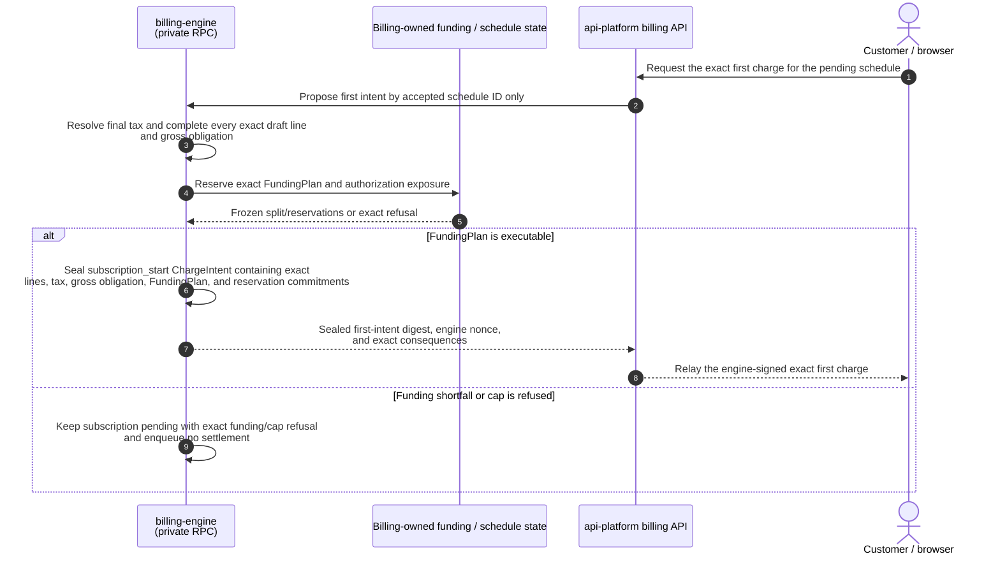

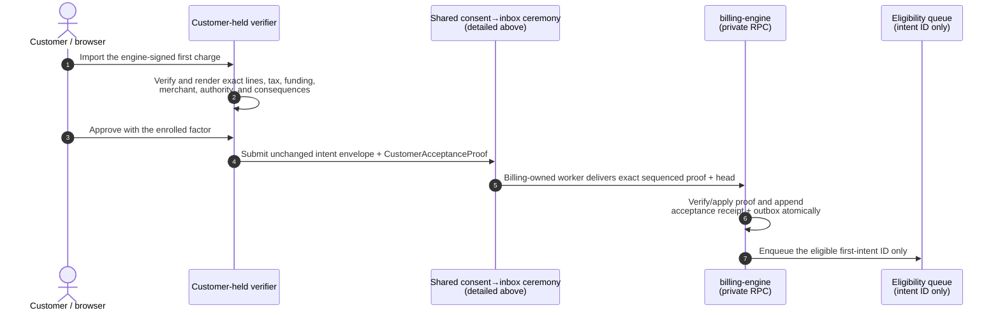

The first intent uses the shared settlement contract described after flow 5.
Wallet settlement first requires the same responsibility/schedule generation.
Only already-dispatched external cash that later settles remains old-payer
evidence for refund/credit/manual resolution without activating service.
Later renewals always create a new exact intent, notice, wait, and receipt; no
provider-side subscription can calculate or collect a renewal independently.
Subscription state is served through the shared narrow `ReadEvidence` procedure,
not through a customer-reachable engine RPC.

### 5 · Close module usage and open the new SaaS period

At one account-period boundary, the engine first partitions compatible source
lines. One consolidated intent may contain the closed period's module usage and
the newly opened period's SaaS base only when they share payer, exact commercial
seller/tax identity, tax profile, currency, service/collection authority, funding
mode/policy, accepted settlement-route policy/instrument class, and window. After
tax and wallet allocation, each group selects one compatible wallet-only or
provider/merchant route and seals that exact composite merchant binding. Every
incompatible group gets its own intent; groups that cannot form a valid intent are
refused or quarantined without affecting compatible groups. This is where the new
period's `platform_base` is
proposed for settlement. Every line names its own service window and recognition
rule. There is no infrastructure line and no per-usage-event payment.

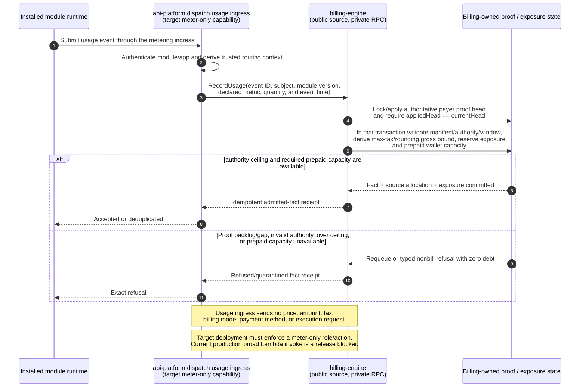

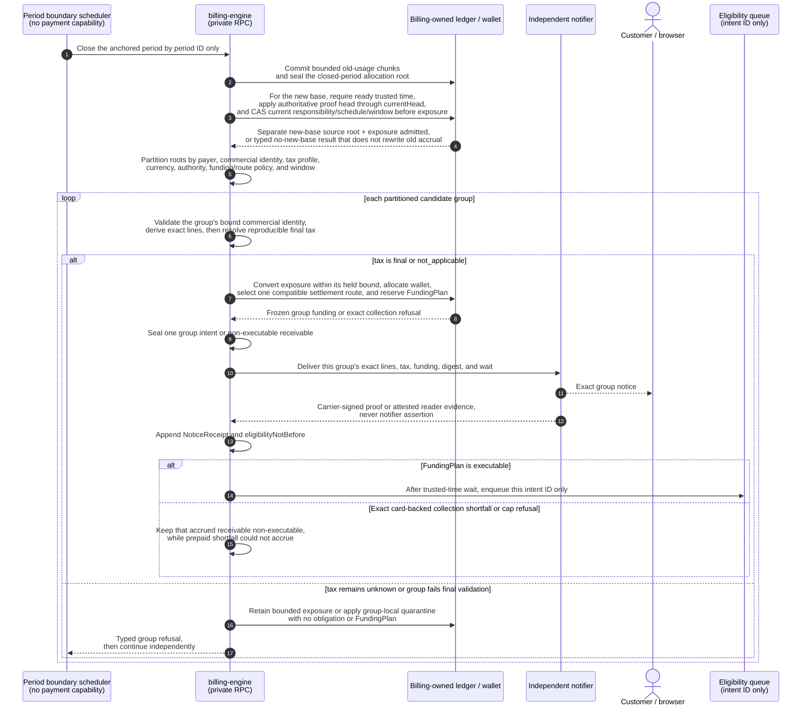

Cycle state is served through the shared narrow `CustomerReadProof`/
`ReadEvidence` ceremony. Valid accrued lines remain source-linked even when
collection funding is refused.

### Shared exact-settlement contract for flows 2–5

Each money-moving flow above passes only a sealed intent id to this contract.
The caller cannot provide or revise an amount, funding split, provider, mandate,
tax result, notice claim, or execution time.

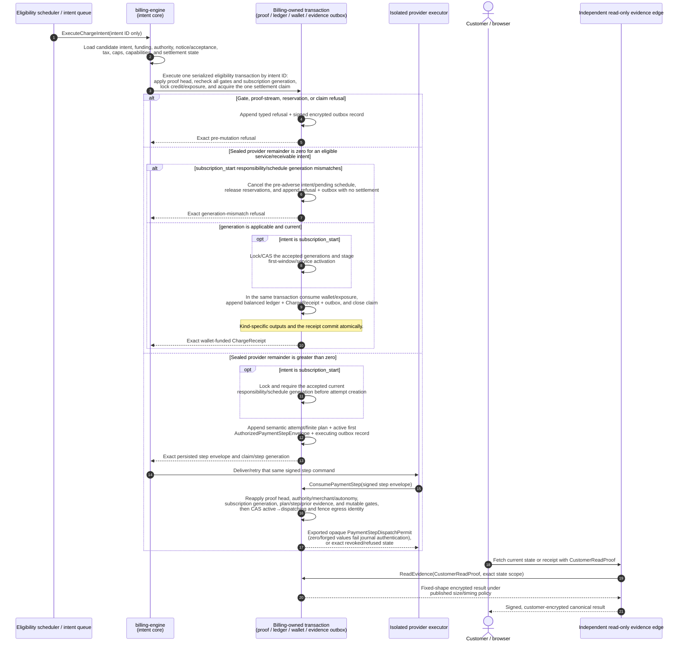

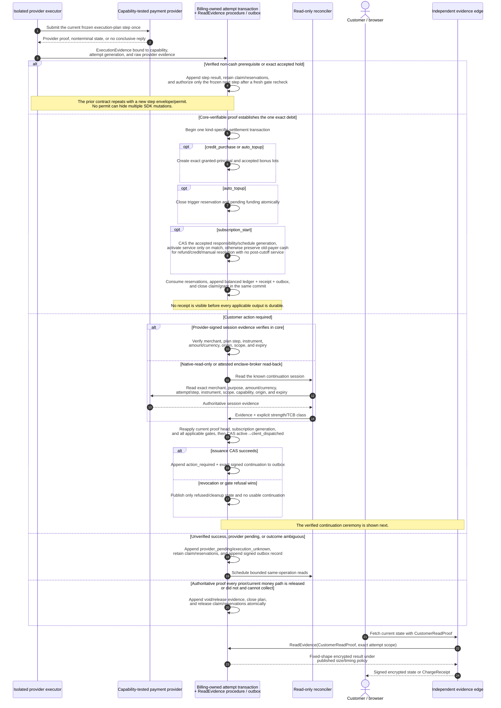

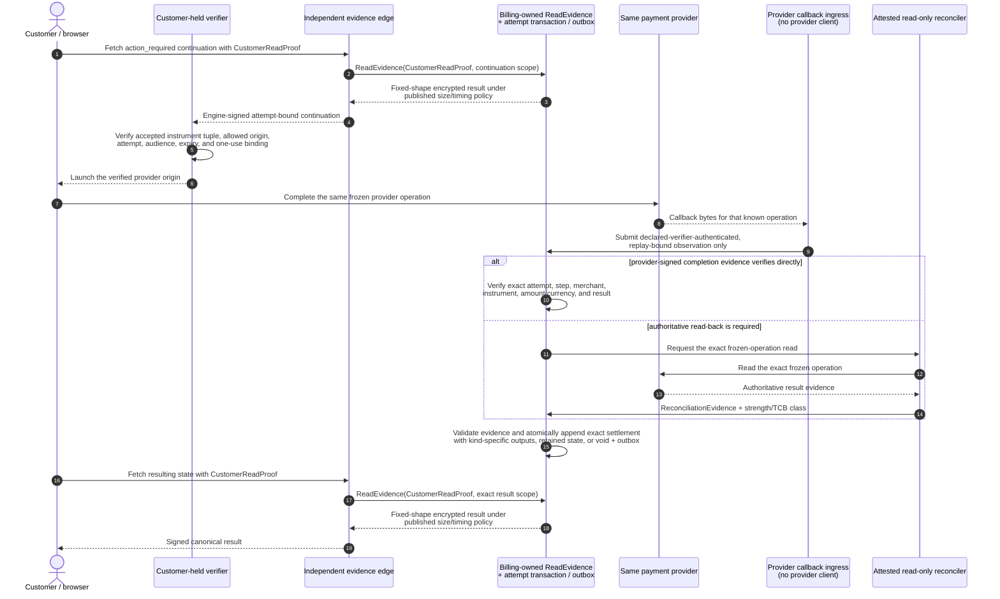

For `subscription_start`, initial claim acquisition and every adverse or
customer-collectible step consume lock and require the same accepted current
responsibility/schedule generation. Those CAS operations serialize with
responsibility transfer. If transfer wins first, the pre-adverse plan/grant is
canceled or refused before cash can move. If dispatch or `client_dispatched` wins
first, the old-payer claim remains fenced through authoritative resolution; any
late cash is recorded for the source-linked refund/credit/manual-resolution path
and cannot activate post-cutoff service.

Card-backed PaaS reserves eligible credits before exact notice and commits them
only in the same transaction as verified provider settlement. Prepaid wallet
commits the full reservation atomically with no provider call and no card
fallback. Auto top-up may later fund the wallet only through flow 3; usage
ingress and period close never invoke it synchronously.

`credit_purchase` and `auto_topup` can never enter the wallet-funded branch:
they create stored value, so their sealed policy requires `walletFunding = 0`
and `providerRemainder = grossObligation`. Auto top-up also re-locks canonical
balance and pending funding at consume time. If the threshold is no longer
crossed before dispatch, it atomically cancels the active intent and releases its
trigger/funding/exposure reservations; after dispatch, ambiguity rules apply.

`action_required`, `provider_pending`, and `execution_unknown` are appended and
returned as typed states while retaining the settlement claim and reservations.
The browser completes an `action_required` step only in the provider-hosted UI.
A provider callback may wake only the public webhook ingress, which submits an
authenticated replay-bound but still non-authoritative observation to core/state
for the same frozen attempt. The core verifies provider-signed evidence directly
when possible; otherwise it asks the credential-separated read-only reconciler
for a same-operation read-back. Neither the browser return nor callback creates a
new provider operation, reaches the executor, declares settlement, or selects a
rail fallback.
`execution_unknown` records no ledger settlement or `ChargeReceipt`; whether the
provider debited remains unknown until same-provider authoritative
reconciliation. Only the core may decide from provider-signed evidence it can
verify directly, or authoritative evidence from either a provider-native read-
only credential or the credential-separated attested enclave broker with its
explicit evidence/TCB class, that the operation did not and cannot collect. Only
that `voided` decision releases
the claim and reservations, and it is recorded append-only. A generic failure or
decline is attempt evidence, not release authority. An unaccepted intent's
reservation expires with that intent
without mutating history or consuming wallet value.

Failed collection does not erase accrued service. Closed-period usage remains a
line-aware receivable. The new-period base accrues only if the accepted service
start/cancellation policy says that period began; otherwise it is canceled or
superseded without rewriting the closed usage lines.

The current cycle already combines closed-period usage with several new-period
fees, but it moves money directly, has no universal exact notice or final tax,
and records the prepaid-wallet mixed boundary too coarsely. The target keeps each
intent line and each allocated credit lot independently reproducible.

An unpaid or funding-refused obligation is collected only through a linked
`collect_receivable` intent. The engine reuses the source's frozen lines/tax
without re-rating, reserves only the remaining receivable capacity, freezes a new
FundingPlan, and posts no second obligation. A customer-present collection uses
fresh exact proof; an automatic one uses current collection authority plus
terminal notice evidence and the public wait. Pending/unknown retains the source
reservation, preventing concurrent double collection.

Across all five flows, each actual provider-enforced mutation-credential scope has
one exclusive attested `ProviderCredentialEnclave` owner. Provider × environment ×
merchant-account × capability is preferred; any broader enforced scope and blast
radius is published and may fail readiness. This is a logical role with isolated
instances, not one global multi-rail vault. Inside an
instance, purpose-matched guarded writers are
the only components allowed to invoke provider mutations. The
customer may use only an engine-signed, attempt-bound, one-use provider-hosted
continuation. Each server-side provider effect persists one non-coercible,
purpose-and-step-signed `Authorized*StepEnvelope` for the currently authorized
finite-plan step. The matching billing-owned consume transaction returns the
matching exported opaque `*StepDispatchPermit` value with
unexported fields/constructor, and only that type can reach its guarded writer.
The writer treats Go's constructible zero value as invalid and authenticates/fences the
permit against the durable consume journal before an SDK call. Setup is no-debit;
void and refund bind
their immutable source attempt, operation, reason, maximum amount, reservation,
and claim generation; none can be reinterpreted as a debit. The
eligibility core—not the executor—consumes the queued intent id and reloads every
precondition. It invokes the payment executor only when a nonzero provider
remainder exists, using one `AuthorizedPaymentStepEnvelope` per exact frozen plan
mutation. Wallet-only settlement never enters the provider executor.
An internal caller, read path, or different deployment role cannot mint an
envelope, obtain a dispatch permit, or reach a writer.

Server-step capabilities have durable states: `active`, `dispatching`,
`submitted_unknown`, `result`, or `revoked`; a customer-hosted collectible step
also uses `client_dispatched` after its issuance CAS. Consumption compare-and-swaps an
`active` capability only after the same transaction re-locks and applies the
authoritative payer proof head and revalidates authorization, expiry,
funding/exposure reservations, tax/policy/build/key/adapter/notice/evidence
readiness, claim generation, and competing-attempt state, before any provider
write. An unconsumed pre-adverse capability may be revoked in the same transaction
that releases its claim; an established hold or `client_dispatched` capability
instead retains the claim through frozen release/cancel/read-back cleanup. A
delayed consumer then fails the CAS.
The `active`→`dispatching` transaction also appends its evidence record and
issues one one-shot provider-write permit. A replay cannot obtain another permit.
The mutation transport also disables SDK/HTTP automatic retries and redirects
and fences the actual outbound request, so one SDK call cannot hide a second
submission after timeout, reset, `429`, or `5xx`. Any inconclusive first send
becomes `submitted_unknown`/`execution_unknown` and permits only read-only
same-operation reconciliation; provider idempotency is not retry authority.
If the executor reports no conclusive result, or its dispatch lease expires
before evidence arrives, a billing-owned watchdog atomically changes the
capability to `submitted_unknown`, the attempt to `execution_unknown`, and
appends the evidence record. The claim cannot be released merely for timeout,
absence on an early read, or capability expiry. Replays return only the recorded
result or unresolved state and schedule same-operation read reconciliation. A
crash after consume but before a provider call can therefore create a
conservative false-positive ambiguity; only authoritative proof that the
operation did not and cannot collect permits void or replacement.

The shared sequence shows the successful funding boundary and typed non-success
handoff once. The full reconciliation state machine is detailed in
[`docs/DESIGN.md` §4](docs/DESIGN.md#4-intent-lifecycle):

- a missing gate, insufficient authorized credit, or unavailable settlement
  claim refuses before any provider mutation;
- authoritative proof that an operation did not and cannot collect appends void
  evidence with no debit and no automatic rail fallback; and
- a timeout or conflict latches `execution_unknown`, retains the settlement
  claim and any reservation, and permits only same-provider read-only
  reconciliation. It records no ledger settlement or receipt and creates no
  retry or provider fallback; whether the provider debited remains unknown.

`provider_pending` also has a bounded same-operation watchdog after the
adapter-declared consistency delay. A lost callback cannot leave the claim
without an observation schedule; reads back off and never create a new operation.

Read and write provider interfaces are separate. Support/reconciliation may
trace Stripe or NewebPay without a provider-write capability only when the
provider enforces a read-only credential, or when a fixed-read broker inside the
same attested `ProviderCredentialEnclave` exposes operation-bound reads to an
external credential-free reconciler. There is no separate owner of a broad
credential. A Go interface alone does not make a shared merchant credential
read-only; without one of those controls the adapter cannot advertise separated
reconciliation or unattended automatic execution.

---

## Payment providers are replaceable rails

The domain model is:

- `PaymentMethodSetup` and `MandateSetupAttempt`: a frozen, expiring,
  capability-tested no-debit provider setup;
- `BillingAuthorization`: bounded one-time or standing customer authority,
  including an exact saved-method receipt/identity or customer-present one-time
  instrument/session binding when external provider funding is permitted;
- `FundingPlan`: the frozen funding mode, exact credit-lot reservations,
  optional provider remainder, authorization-exposure reservations, cap/window
  results, and shortfall/refusal state;
- `CreditReservation`: a currency-compatible, uniquely constrained hold that is
  not itself a debit;
- `AuthorizationExposureReservation`: a unique payer/authorization/cap/window
  hold preventing concurrent intents from spending the same aggregate ceiling;
- `ChargeIntent`: the exact provider-neutral monetary proposal;
- `CustomerAcceptanceReceipt`: replay-protected proof that the engine validated
  a payer-bound exact-digest proof delivered through the independent proof
  inbox; neither the consent edge nor control plane can mint that proof;
- `NoticeReceipt`: evidence that the exact proposal was delivered;
- `PaymentAttempt`: one semantic provider attempt/claim and state history,
  present only when the provider remainder is nonzero; it owns a frozen finite
  plan with one or more uniquely fenced provider step operations;
- `ProviderEvidence`: read-only observations/callback proof from that rail;
- `LedgerTransaction`: append-only monetary truth; and
- `ChargeReceipt`: the customer-verifiable connection across all of them.

Stripe is one adapter. A NewebPay/Taiwan adapter is the next planned rail. The
core does not assume Stripe's draft-invoice/finalize/PaymentIntent lifecycle or
that every provider supports recurring mandates, automatic collection, partial
refunds, the same currencies, or the same callback behavior.

Adapters publish capabilities and pass one conformance suite. Unsupported
operations fail before external mutation. An authenticated provider callback may
reconcile a known attempt but cannot originate or enlarge a charge.

Go implements this with small consumer-owned interfaces, struct composition,
signed purpose envelopes, billing-owned consume transactions, and exported
opaque dispatch-permit structs with unexported fields/constructors plus mandatory
durable journal authentication—not class inheritance and not one enormous
provider interface.

---

## No silent charge

Every collection requires an exact immutable intent and bounded authority. A
fresh customer-present payment uses a `CustomerAcceptanceReceipt` for that exact
intent/window and does not pretend prior notice occurred. Initial settlement-
claim acquisition requires all applicable items below; the notice/wait/readiness
items apply only to `standing_automatic`:

```text
immutable exact intent
AND, for standing_automatic, exact notice delivered
AND, for standing_automatic, the public waiting period elapsed under a ready trusted-time policy
AND customer authorization still valid
AND, for standing automatic collection, the independent revocation path is fresh and ready
AND gross obligation within service/accrual caps
AND wallet application matches its reservation and cap
AND net provider remainder within the external collection cap
AND settled exposure + all active reservations (including this already-reserved intent) stays within every cycle/frequency ceiling
AND auto-top-up funding within its separate caps, when applicable
AND tax independently reproducible final or explicitly not applicable
AND every policy effective and digest-matching
AND every time-sensitive authority, policy, service, notice, and capability cutoff passes the published TimeReadinessPolicy
AND, when provider remainder > 0, selected rail/adapter supports the exact frozen finite plan, evidence class, credential scope, and currency
AND, when provider remainder > 0, a frozen PaymentAttempt exists before provider mutation
AND no prior terminal or nonterminal settlement attempt/grant exists for this initial execution
AND the one settlement claim is atomically available
```

A later finite-plan step does not repeat the initial “no attempt” predicate. It
must reuse the exact retained semantic attempt/claim and reservations, verify the
prior step's authoritative result and the exact next plan index, find no
conflicting step, and recheck every gate applicable to that purpose/effect before
any new exposure-increasing or debit mutation. Protective source-bound release,
void, and mandate-revoke cleanup remains available after debit-only authority,
tax, price, or notice gates are withdrawn; it cannot create a new debit, return,
or mandate.

Before any point of no return, a failed current gate produces no new wallet
settlement or provider mutation and leaves/releases reservations only through its
typed atomic refusal rule. After a hold, provider dispatch, or
`client_dispatched` issuance, later revocation cannot erase reality: the engine
retains the claim, reconciles authoritative evidence, and atomically records the
actual debit/return or verified cleanup with the corresponding reservation and
ledger effects. It never suppresses cash that moved, invents a replacement
operation, or enlarges the accepted amount.

Notice evidence proves that the carrier reported a terminal status that the
published policy defines as destination-delivered. Queue acceptance or
submission is insufficient. This still does not prove a human read an email, and
the product will not claim that it does. Delivery requires carrier-signed proof
the core verifies or an authoritative read-back through an enforced read
credential/attested broker. A notifier's role-authenticated assertion cannot
choose `providerDeliveredAt` or establish the destination/content binding. A
verified bounce, rejection, complaint, destination revocation, or other
policy-invalidating status received before wallet commit, server dispatch, or
`client_dispatched` issuance clears readiness and requires re-notice. After any
such point of no return, the status cannot release the claim or permit replacement;
the engine retains exposure and requires authoritative provider cancellation/
expiry/no-collection or terminal result. Without this evidence and recheck,
automatic execution remains disabled.

The exact delivery channels, recipients, minimum lead time, standing ceilings,
and price-change notice rules are product decisions still under discussion. The
safe skeleton can be implemented before those values; execution stays disabled
until accepted policy supplies them.

---

## What customers may be charged for

The exhaustive target vocabulary is in [`docs/CHARGES.md`](docs/CHARGES.md).
Positive service lines are limited to accepted platform base, module usage,
optional published module-capacity/domain policies, and tax. Credits and
corrections are explicit linked lines.

**Infrastructure is not a customer charge dimension.** Internal compute,
egress, model, provider, and margin data may support operations or developer
settlement, but cannot feed the customer rater or appear as a hidden line.

Payment-provider fees are also internal unless a future public, accepted policy
adds a specific customer charge kind. An adapter cannot append one.

---

## Tax

Tax is designed before it is implemented. [`docs/TAX.md`](docs/TAX.md) defines
the safety boundary:

- immutable effective policy revisions;
- verified customer/jurisdiction evidence;
- exact taxable-basis allocation and integer rounding;
- `final`, `not_applicable`, and non-executable `unknown` states;
- tax frozen before notice and collection;
- append-only refund/correction treatment; and
- no payment-adapter tax changes.

Merchant-of-record, registrations, supported jurisdictions, inclusive/exclusive
display, exemptions/reverse charge, Taiwan business/e-invoice duties, TWD, and
provider choices require accountable legal/tax/finance decisions. They are not
reconstructed from today's code.

---

## Ledger and provider trace

[`docs/LEDGER-AND-RECEIPTS.md`](docs/LEDGER-AND-RECEIPTS.md) separates internal
monetary truth from external evidence.

The independent evidence edge serves the engine-signed bundle as the canonical
path. `api-platform` may relay the same unchanged bytes as a convenience, but is
not required for customer access and cannot alter a node without breaking the
signature:

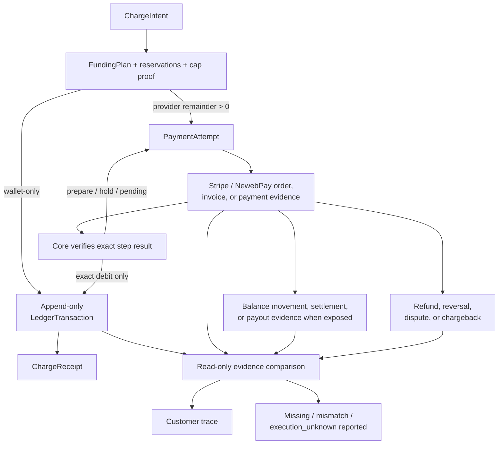

Provider observations are append-only snapshots. A mismatch opens a
reconciliation incident; the engine does not edit its intent/ledger to make a
provider total fit.

Settled history is append-only. Late usage, mistakes, refunds, disputes, tax
changes, and goodwill credits create linked corrections rather than rewriting
the original charge.

---

## Public verification

The target receipt bundle contains the intent, exact commercial seller/tax
identity, final composite merchant-of-record binding plus bounded set/
compatibility proof, tagged authority evidence, frozen funding plan, credit and
authorization-exposure reservations/cap arithmetic, source commitments, formulas,
integer rounding, module/price/tax/terms/notice revisions, authorization, delivery
evidence, signed `BillingDecisionProof`, engine source/artifact identity, and
balanced ledger entries. `BillingDecisionProof` binds the closed key/predicate
schema, authenticated proof head, before/after row commitments and generations,
transaction/build/policy identities, and transactional outbox record. It permits
deterministic replay of the supplied decision chain, but global database non-
omission remains an explicitly trusted runtime claim and is reported as
`state_assurance: attested`. An asynchronous, payer-isolated state transparency
checkpoint may later detect rollback/equivocation without blocking collection.
When the
provider remainder is nonzero it also binds the grant-consume receipt, exact
executor artifact/workload attestation and provider-credential identity,
transparency checkpoint, adapter artifact/version, and provider attempt/evidence.
Any attested notice or reconciliation reader in the trusted path is bound the
same way; current `Health` is not a substitute for historical per-effect evidence.

The planned verifier is:

```text
billing-verify verify charge-bundle.json
```

It recomputes the charge offline. Engine-signed runtime `Health` and
`Capabilities` evidence is available through the independent read-only
evidence edge and may also be relayed through the product control plane; neither
path makes the account RPC customer-reachable. A verifier rejects a relay-
substituted key against its independently pinned billing root. That evidence binds the deployed
commit/artifact, active policy digests, adapter readiness, notice rule, route/IAM
inventory, and an explicit list of reachable legacy money paths.

See [`docs/VERIFICATION.md`](docs/VERIFICATION.md). Planned commands and schemas
are labelled as planned until they exist; a document is not verification.

---

## Documentation map

| document | owns |
|---|---|
| [`docs/DESIGN.md`](docs/DESIGN.md) | normative intent lifecycle, authority boundaries, Go ports/adapters, execution predicate, migration/readiness |
| [`docs/CHARGES.md`](docs/CHARGES.md) | exhaustive customer and non-customer monetary-effect vocabulary |
| [`docs/LEDGER-AND-RECEIPTS.md`](docs/LEDGER-AND-RECEIPTS.md) | append-only monetary truth, attempts, receipts, Stripe/NewebPay cash-flow trace |
| [`docs/TAX.md`](docs/TAX.md) | tax states, policy/evidence, calculation boundary, unresolved legal/product choices |
| [`docs/THREAT-MODEL.md`](docs/THREAT-MODEL.md) | adversaries, trust assumptions, protections, and admitted limits |
| [`docs/VERIFICATION.md`](docs/VERIFICATION.md) | build/deployment proof, verifier, properties, fuzzing, mutation, adapter conformance |
| [`SECURITY.md`](SECURITY.md) | vulnerability reporting, in-scope public claims, and known open issues |

A false or overstated public sentence is a security defect in a repository whose
purpose is customer verification.

---

## Migration rule

The new engine runs in shadow first: derive canonical intents without notice or
money movement, compare every line against current results, and investigate every
difference. Then add authorization, notice, tax, executor isolation, provider
adapters, receipts, and verification.

Callers migrate first. Direct provider routes and credentials are removed last,
after in-flight legacy attempts are drained or explicitly quarantined. Legacy
rows never receive fabricated consent, tax, notice, or policy evidence.

Production intent execution remains disabled until:

- all money effects are mapped and machine-enforced;
- shadow reconciliation has no unexplained difference;
- independently verifiable canonical disclosure and customer-proof verification
  are deployed and attested;
- customer authorization/notice/tax policies are accepted;
- Stripe and NewebPay adapters pass their declared conformance tests;
- public build/receipt verification is available;
- route/IAM inventory and forbidden actor-adjacency checks pass;
- each actual provider-enforced mutation-credential scope has one exclusive
  attested enclave owner, with any broader-than-preferred scope disclosed and
  permit-gated purpose writers; and
- `Capabilities` reports zero legacy money paths.

---

## Repository layout

```text
billing-engine/
├── cmd/                         current binaries; target roles become capability-narrow
├── internal/                    domain, adapters, and current implementation
├── migrations/billing/         authoritative current database schema
├── docs/
│   ├── DESIGN.md
│   ├── CHARGES.md
│   ├── LEDGER-AND-RECEIPTS.md
│   ├── TAX.md
│   ├── THREAT-MODEL.md
│   └── VERIFICATION.md
├── SECURITY.md
└── README.md
```

The migrations describe what exists today. These target documents describe what
must be true before the intent-only claim is made. Both statuses remain explicit
during migration.

---

## Running the current checks

```bash
make db         # start local PostgreSQL
make db-init    # apply current migrations
make lint       # go vet
make build      # build current binaries
make test       # current test suite; no production payment calls
```

The future verifier, fuzz, mutation, and provider conformance commands will be
listed only once their scripts exist and are reproducible without production
credentials or paid calls.

## Security

See [`SECURITY.md`](SECURITY.md). Do not place credentials, real customer data,
tax ids, payment methods, or production provider payloads in an issue or test
fixture.

## License

[FSL-1.1-ALv2](LICENSE) — converts to Apache 2.0 two years after release.
