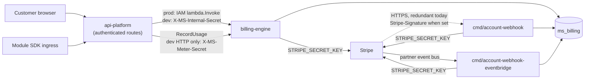
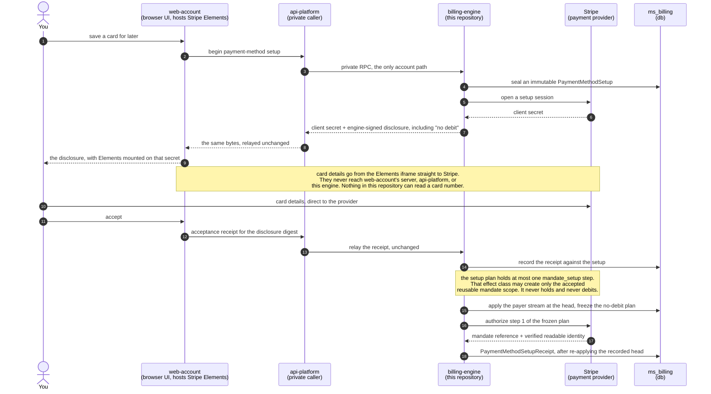
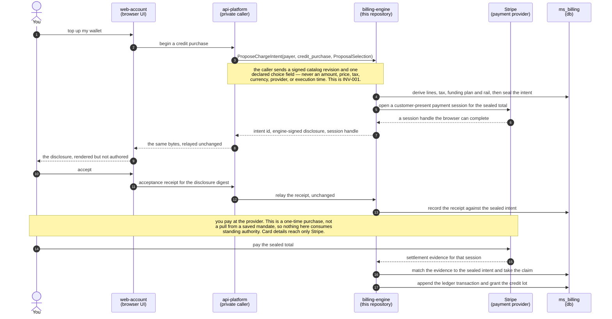
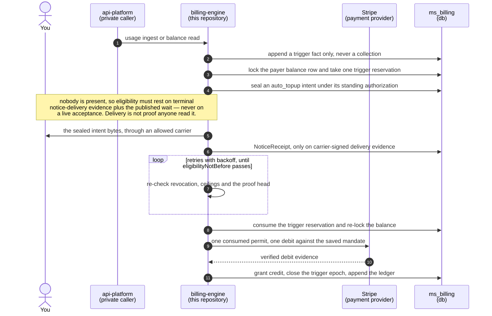
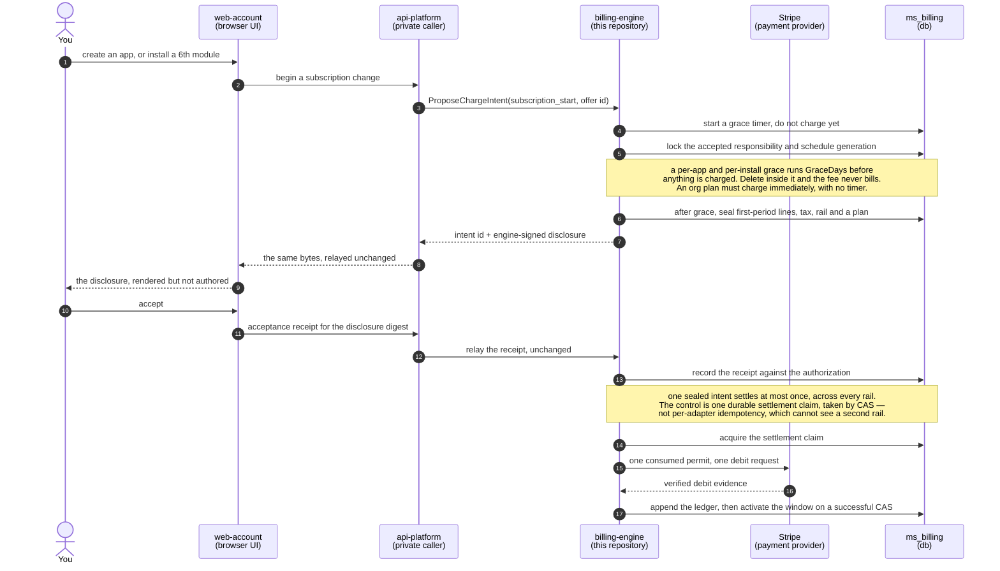
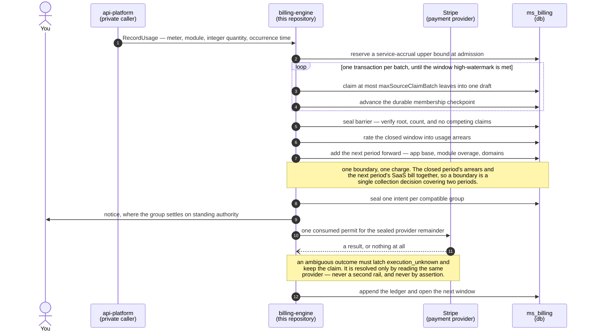

# billing-engine

The public-source billing authority for [MirrorStack](https://mirrorstack.ai).
It holds the Stripe credentials, the `ms_billing` schema, subscription and
invoice mirror state, usage metering, and the credit wallet. `api-platform`
calls it over private RPC. The only surface a customer reaches directly is a
static health answer that touches neither the dispatcher nor the database
(`cmd/account-api/main.go:829-842`).

The repository is public so a customer or their developer can answer one scoped
question about real money by reading code and checking their own receipt:

> **Can this billing path collect money that was not disclosed under the accepted
> rule, was not authorized, or cannot be reproduced?**

The intended answer is no, and public source alone cannot deliver it. The limits
of the claim are in [`SECURITY.md#adversary-model`](SECURITY.md#adversary-model).

## Status, before anything else

> 🔴 **The target architecture is proposed. The code on `main` does not
> implement it.** Read [`docs/DESIGN.md`](docs/DESIGN.md) as a specification to
> build, never as a description of production.

- The most serious known structural gap is a capability leak. The nominal
  `GetServiceStatus` read reaches the auto-top-up trigger and can collect from a
  saved payment method (`internal/account/billing/service.go:475`,
  `internal/account/credit/coordinator.go:316`, `:363`). A component that reads
  must not be able to charge.
- The public health answer is the literal `{"status":"ok"}`, returned by the
  Lambda before the dispatcher runs (`cmd/account-api/main.go:836-842`). It does
  not name the deployed commit, so a customer cannot yet tie a charge to a
  public source revision.
- Every other current defect is enumerated in exactly one place,
  [`SECURITY.md#known-current-gaps`](SECURITY.md#known-current-gaps). No other
  file in this repository keeps a second list.

Automatic promotion is paused while this boundary is designed. No document on
this branch authorizes a rollout.

## Runtime and trust boundary

`billing-engine` is public source, not a public endpoint. Six facts define the
deployed boundary, each citable in the tree:

- In production the account API is a Lambda invoked by `api-platform` by ARN and
  gated by IAM `lambda:InvokeFunction`. The RPC dispatcher is not exposed through
  API Gateway (`cmd/account-api/main.go:11-16`, `:821-827`). One API Gateway
  route reaches the same Lambda: `/billing/healthz` returns a static 200 before
  the dispatcher (`cmd/account-api/main.go:18-25`, `:829-842`).
- In local development the control-plane RPC routes check `X-MS-Internal-Secret`
  (`internal/shared/auth/internal_secret.go:80`). `RecordUsage` sits behind a
  separate `X-MS-Meter-Secret` header, so the metering credential rotates on its
  own (`cmd/account-api/main.go:774-777`, `internal_secret.go:81`). Both secrets
  are fail-closed: an unset secret returns 503 (`internal_secret.go:54-61`).
- Provider events enter through separate binaries, never the RPC dispatcher. Both
  receivers are built and uploaded per commit
  (`.github/workflows/publish.yml:37-38`).
- Stripe events are intended to arrive over EventBridge. Only Stripe can publish
  to that partner bus, and only this receiver's rule can invoke on it, so
  `cmd/account-webhook-eventbridge` verifies no HMAC
  (`cmd/account-webhook-eventbridge/main.go:1-11`).
- `cmd/account-webhook` verifies `Stripe-Signature` only when
  `STRIPE_WEBHOOK_SECRET` is set. An empty secret rejects every signed delivery
  (`cmd/account-webhook/main.go:81-89`,
  `internal/shared/stripe/client.go:640-645`). For Stripe that HTTPS receiver is
  redundant today. A future rail such as NewebPay may still need one.
- Card data goes to the payment provider. This engine opens a setup-mode
  Checkout Session and never reads a card number
  (`internal/shared/stripe/client.go:96-111`).



## Repository layout

```text
billing-engine/
├── cmd/
│   ├── account-api/                 internal RPC Lambda; local HTTP on :8091
│   ├── account-webhook/             Stripe HTTPS webhook receiver (redundant)
│   ├── account-webhook-eventbridge/ Stripe EventBridge receiver (dual-run)
│   ├── billing-cycle/               scheduled per-period usage charge driver
│   ├── infra-egress-sync/           pulls CDN egress totals from Cloudflare
│   ├── infra-ssr-compute-sync/      pulls SSR compute totals from CloudWatch
│   └── pm-default-backfill/         one-shot Stripe default-payment-method repair
├── internal/                        domain services, adapters, sqlc-generated db
├── migrations/billing/              the database schema — see its README for apply order
├── docs/                            DESIGN.md, VERIFICATION.md
├── SECURITY.md
├── CLAUDE.md                        contributor and agent working rules
└── README.md
```

The first six binaries are built and uploaded per commit. `pm-default-backfill`
is not, and is run by hand (`.github/workflows/publish.yml:35-41`).

## Running the current checks

```bash
make db         # start local PostgreSQL 17 in Docker
make db-init    # apply migrations/billing/
make lint       # go vet
make build      # go build ./...
make test       # unit tests; no external calls
```

`make test-integration` needs a reachable Docker daemon, not the `make db`
instance. Each test boots its own ephemeral Postgres 17 container and skips when
Docker is unreachable (`internal/shared/testutil/db.go:28-58`). The verifier, fuzz,
mutation, and adapter-conformance commands described in
[`docs/VERIFICATION.md`](docs/VERIFICATION.md) will be listed here once their
scripts exist and run without production credentials.

## Documentation map

Read the status section above first. Everything under `docs/` is target design.
`docs/DESIGN.md` is the normative specification; every other file links into it
rather than restating it.

| document | owns |
|---|---|
| [`docs/DESIGN.md`](docs/DESIGN.md) | the target specification: INV-001..INV-014, the durable model, intent lifecycle, provider ports, charge vocabulary, tax, ledger, migration gate, open product decisions |
| [`docs/VERIFICATION.md`](docs/VERIFICATION.md) | evidence levels, the charge bundle contract, the offline verifier, the static architecture checks enforced against this tree |
| [`SECURITY.md`](SECURITY.md) | reporting policy, the adversary model, trust assumptions, and the one register of known current gaps |
| [`CLAUDE.md`](CLAUDE.md) | working rules for a contributor or agent editing this repository |
| [`migrations/billing/`](migrations/billing/) | the schema that exists today, plus its apply order and cutover notes |

Cross-repository references, which describe what runs today rather than the
target:

- [`mirrorstack-docs/architecture/billing-flow.md`](https://github.com/mirrorstack-ai/mirrorstack-docs/blob/main/architecture/billing-flow.md)
  documents the current end-to-end flows with their invariants, failure modes,
  and performance budgets.
- [`mirrorstack-docs/api/billing/account-api.md`](https://github.com/mirrorstack-ai/mirrorstack-docs/blob/main/api/billing/account-api.md)
  documents the current RPC surface, and
  [`mirrorstack-docs/db/ms_billing/`](https://github.com/mirrorstack-ai/mirrorstack-docs/tree/main/db/ms_billing)
  documents the schema.

If `tables.md` in mirrorstack-docs disagrees with `migrations/billing/`, the
migration wins and the doc is the bug.

## The target design, in one page

Five customer money journeys run through the lifecycle in
[`docs/DESIGN.md#4-intent-lifecycle`](docs/DESIGN.md#4-intent-lifecycle). Their
intent kinds are tabulated in
[`docs/DESIGN.md#85-funding-and-collection-intents`](docs/DESIGN.md#85-funding-and-collection-intents).
Each gets a diagram below.

> 🔴 **Read every one of the five as a specification.** None is deployed, and
> none is a guarantee you hold today. Each diagram is written in "must" for that
> reason. Every durable type they name returns zero files from
> `git grep <Type> -- '*.go'` on `main`
> ([`docs/DESIGN.md#3-the-durable-model`](docs/DESIGN.md#3-the-durable-model)).

---

### Flow 1 · bind a card for recurring use

Saving a card must be the cheapest thing you can do with money, in the sense
that it moves none. This is the flow the other four depend on, so it is the one
whose blast radius must stay smallest.

**Target, not deployed.** `PaymentMethodSetup` and its receipt are unbuilt.



Four things this diagram makes obvious:

- **Your card number never enters this repository.** Step 10 goes from the
  Elements iframe to Stripe. `web-account` renders the field but its server
  never sees the value, and neither `api-platform` nor this engine is on that
  path. What comes back in step 17 is a mandate reference, not a card.
- **No arrow creates authority to charge you.** Step 16 authorizes one
  `mandate_setup` step and nothing more. Subscription and auto top-up must each
  request their own authority against that mandate later. The effect classes are
  enumerated in
  [`docs/DESIGN.md#8-what-customers-may-be-charged-for`](docs/DESIGN.md#8-what-customers-may-be-charged-for).
- **Steps 8 and 9 relay bytes the engine signed, and steps 12 and 13 relay your
  answer back.** `api-platform` must author neither. It could also assert an
  acceptance you never gave. The engine records what it was told and can
  reproduce it later, which is detection, not prevention —
  [`docs/DESIGN.md#inv-006`](docs/DESIGN.md#inv-006).
- 🔴 **Step 18 is where today's code diverges, and it costs you a billing
  period.** A Stripe `payment_method.attached` event currently stamps
  `accounts.activated_at` (`internal/account/webhook/handlers.go:132`), so
  saving a card starts a cycle. It is filed in
  [`SECURITY.md#known-current-gaps`](SECURITY.md#known-current-gaps).

---

### Flow 2 · buy credit

A one-time, customer-present purchase of stored value. It is the simplest money
movement in the set, which makes it the clearest place to see who is allowed to
decide the amount.

**Target, not deployed.** `ChargeIntent` and `FundingPlan` are unbuilt.



Four things this diagram makes obvious:

- **Step 14 is you paying, not us pulling.** A one-time purchase is settled by a
  customer-present payment at the provider. No saved mandate is consumed and no
  standing authority is spent, which is what separates this flow from
  [flow 3](#flow-3--auto-top-up-a-credit-wallet-from-a-saved-mandate).
- **INV-006's trust assumption applies here too.** The gate is the relayed
  acceptance receipt in steps 11 to 13, which `api-platform` could invent. The
  provider evidence in step 15 proves the money moved, never who accepted —
  [`docs/DESIGN.md#inv-006`](docs/DESIGN.md#inv-006).
- **The amount you typed enters as a choice, not as a price.** The engine
  re-derives currency, lines, tax and eligibility from the template it signed,
  then seals the total in step 4 before any session exists —
  [`docs/DESIGN.md#inv-001`](docs/DESIGN.md#inv-001).
- 🔴 **Today `StartCreditPurchase` is sequenced wrong.** It finalizes an
  auto-advance invoice (`internal/account/creditpurchase/executor.go:271`,
  `internal/shared/stripe/client.go:454-456`) before returning the browser its
  client secret (`internal/account/billing/credit.go:624-635`). It is filed in
  [`SECURITY.md#known-current-gaps`](SECURITY.md#known-current-gaps).

A credit purchase must never be funded by credit: `walletFunding = 0` and
`providerRemainder = grossObligation`, so the wallet cannot buy itself. The
kind-specific equations are in
[`docs/DESIGN.md#8-what-customers-may-be-charged-for`](docs/DESIGN.md#8-what-customers-may-be-charged-for).

---

### Flow 3 · auto top-up a credit wallet from a saved mandate

The only flow in the set with nobody present. That absence is the entire
difficulty: there is no acceptance to check at the moment of the debit, so
something else must carry the authority.

**Target, not deployed.** `AutoTopupTriggerReservation` and `NoticeReceipt` are
unbuilt. Read the first bullet after the diagram before the diagram itself.



Four things this diagram makes obvious:

- 🔴 **Step 1 must not be able to reach step 9, and today it can.** A nominal
  billing-status read can reach the auto-top-up executor and collect from a
  saved payment method. It is the register's most serious entry —
  [`SECURITY.md#known-current-gaps`](SECURITY.md#known-current-gaps).
- **Step 3 is a reservation, not a counter.** Two concurrent triggers cannot
  both pass, because the trigger key is unique and the predicate is recomputed
  under the same lock at consume time —
  [`docs/DESIGN.md#inv-008`](docs/DESIGN.md#inv-008).
- **The wait in the loop starts at delivery, not at sealing.** A late delivery
  moves eligibility later, so the waiting period can never be consumed before
  the notice arrives — [`docs/DESIGN.md#inv-005`](docs/DESIGN.md#inv-005).
- 🔴 **The minimum lead time is not a number yet.** It is an open product
  decision published through `Capabilities`, never a hidden deployment constant
  ([`docs/DESIGN.md#12-open-product-decisions`](docs/DESIGN.md#12-open-product-decisions)).
  Turning on general billing must never turn this flow on.

---

### Flow 4 · start or change a card-backed subscription

Recurring money, on a rail that offers to run the recurrence for us. Declining
that offer is the point of the flow.

**Target, not deployed.** `ProviderExecutionPlan`, `PaymentAttempt` and
`SubscriptionOffer` are unbuilt. What ships is a subscription-capability stub:
`Ensure` always reports `subscription` missing
(`internal/account/billing/service.go:101-105`, `:188-190`). The grace and
allowance numbers below are shipped today and are named where they are cited.



Four things this diagram makes obvious:

- **A SaaS fee is not charged the moment you trigger it.** Creating an app, or
  taking the account past its included modules, starts a grace timer instead.
  `GraceDays = 3` and `IncludedModules = 5` (`internal/account/usage/bill.go:118`,
  `:52`). After grace, one over-allowance install bills `$1.00` prorated
  (`internal/account/usage/bill.go:96`,
  `internal/account/cycle/overage.go:175`). The recurring boundary leg instead
  prices `$5.00` per block of 5 (`internal/account/usage/bill.go:70`,
  `internal/account/cycle/charge.go:283`). An app deleted inside its grace is
  never billed, and each install timer carries its own grace. Org plans are the
  exception: that tier is not built, and when it ships it must charge
  immediately with no timer.
- **Step 15 is one request, and that is a transport property.** Automatic SDK
  and HTTP retries must be off, `MaxNetworkRetries` set to zero, and a guard at
  the request boundary refuses a second send for that permit —
  [`docs/DESIGN.md#5-payment-providers-are-adapters`](docs/DESIGN.md#5-payment-providers-are-adapters).
- **Nothing in the picture lets Stripe schedule the next period.** The frozen
  autonomy policy forbids provider-managed subscriptions, auto-advance, smart
  retries, dunning debits and delayed capture. None of them can race your
  revocation through the claim CAS in step 14.
- **Changing the plan or the rail after the seal in step 6 is a new intent.** A sealed
  intent is never edited, and a replacement carries new funding, digest,
  disclosure and claim — [`docs/DESIGN.md#inv-008`](docs/DESIGN.md#inv-008).

---

### Flow 5 · close a module usage period and open the new one

The largest flow, and the only one where the money is discovered rather than
requested. Millions of metered leaves must become one charge exactly once.

**Target, not deployed.** `BillableSourceAllocation` and `ServiceAccrualExposure`
are unbuilt.



Five things this diagram makes obvious:

- **Step 2 is at admission, and it is deliberately early.** Deferring the
  ceiling to close would turn a prepaid wallet into an unauthorized credit
  line, because the service is already rendered. 🔴 Product budgets are
  alert-only today and never stop accrual
  (`internal/account/budget/service.go:260`), filed in
  [`SECURITY.md#known-current-gaps`](SECURITY.md#known-current-gaps).
- **A boundary charges backward and forward at once.** Steps 6 and 7 put the
  closed period's usage arrears and the next period's advance charges — flat app
  base, module overage, domains — into one total
  (`internal/account/cycle/charge.go:296-299`). Apps still inside `GraceDays`
  are excluded from the advance base and join at the next boundary.
- **The loop exists so close is not one enormous transaction.** Batches claim
  leaves and checkpoint; only the small seal barrier in step 5 is
  all-or-nothing. A leaf may enter one allocation lineage, enforced by a
  database constraint — [`docs/DESIGN.md#inv-008`](docs/DESIGN.md#inv-008).
- **No arrow lets `api-platform` choose the grouping key.** The namespace is
  derived inside the engine from accepted schedule and metric state, so a
  regrouped call cannot make a source consumable twice.
- **The latch after step 11 has no timeout release.** An operator may attach
  evidence and still cannot clear it —
  [`docs/DESIGN.md#5-payment-providers-are-adapters`](docs/DESIGN.md#5-payment-providers-are-adapters).

---

### What all five have in common

This is what "intent-based" buys, and it is the point of the whole design:
**`api-platform` cannot charge you for something unrelated.** It does not send a
charge. It names a payer and picks one option from a catalog the engine signed,
and the engine derives the rest. A caller that wants to bill something outside
that closed vocabulary has no way to express it — there is no field for it.

Each money-moving journey must pass a single sealed intent id to one settlement
contract. The caller must not be able to supply the amount, the funding split,
the provider, the mandate, the tax result, the notice claim, or the execution
time. The engine must derive every financial field.

That much holds even though the engine trusts `api-platform` about *who*
accepted ([INV-006](docs/DESIGN.md#inv-006)). The two are separate: a caller that
can misreport a customer still cannot invent a charge kind or an amount.

- **No silent charge.** Every collection must satisfy one execution predicate
  before any provider mutation. That predicate has exactly one owner:
  [`docs/DESIGN.md#executechargeintent`](docs/DESIGN.md#executechargeintent).
  Every other mention must link to that anchor instead of restating the clauses,
  so the clause list cannot drift.
- **One intent settles at most once**, across every rail, through a single
  durable settlement claim rather than per-adapter idempotency —
  [`docs/DESIGN.md#inv-008`](docs/DESIGN.md#inv-008).
- **Payment providers are adapters.** Stripe is the only rail with a client
  today (`internal/shared/stripe/client.go`). NewebPay is the next planned one
  and holds only a reserved wire shape
  (`internal/account/billing/types.go:338-342`). An
  ambiguous provider outcome must latch `execution_unknown`, and must be
  resolved by reading the same provider, never by a second rail —
  [`docs/DESIGN.md#5-payment-providers-are-adapters`](docs/DESIGN.md#5-payment-providers-are-adapters).
- **What customers may be charged for** is a closed vocabulary —
  [`docs/DESIGN.md#8-what-customers-may-be-charged-for`](docs/DESIGN.md#8-what-customers-may-be-charged-for).
- **Tax** must resolve to one of three states. `unknown` must never become zero
  and must never be executable — [`docs/DESIGN.md#9-tax`](docs/DESIGN.md#9-tax).
- **Ledger and receipts** must be append-only, with provider observations held
  as read-only snapshots —
  [`docs/DESIGN.md#10-ledger-and-receipts`](docs/DESIGN.md#10-ledger-and-receipts).
- **Verification** covers the charge bundle a customer will recompute offline
  ([the charge bundle contract](docs/VERIFICATION.md#3-canonical-charge-bundle))
  and the architecture checks that run against this tree
  ([`docs/VERIFICATION.md#7-static-architecture-checks`](docs/VERIFICATION.md#7-static-architecture-checks)).

### Infrastructure cost and the customer line

**Target.** Internal infrastructure cost must not be a customer charge
dimension. Compute, egress, model, provider, and margin figures may support
operations and developer settlement. They must not feed the customer rater, and
they must not appear as a line whose displayed arithmetic does not reconcile.

**Present state.** Infrastructure already reaches a customer-visible line, with
a markup applied to it. Both rows are filed in
[`SECURITY.md#known-current-gaps`](SECURITY.md#known-current-gaps):

- The multiplier is `infraMarkupNum = 12` over `infraMarkupDen = 10`, so a
  reserved metric is charged at cost x 1.2
  (`internal/account/cycle/types.go:59-60`).
- The live path runs `RecordInfraUsage` (`internal/account/usage/infra.go:326`)
  into `AppInfraBill` and `AppModuleInfraBill`
  (`internal/account/usage/bill.go:509`, `:522`), served by `GetAppBill` and
  `GetAccountBill` (`cmd/account-api/main.go:690`, `:696`) behind
  `/apps/{appId}/settings/billing` and web-account `/me/billing`.
- The wire fields are `infra_total_micros`, `infra_lines`, and
  `module_infra_lines` (`internal/account/usage/types.go:438`, `:449`, `:460`).
- The x12/10 factor is applied inside the query for any `infra.*` or
  `platform.*` metric (`internal/account/db/usage.sql.go:102-104`).
- The displayed `UnitPriceMicros` is the pre-markup cost of goods, while
  `ChargedMicros` already includes the markup
  (`internal/account/usage/types.go:446-448`). Quantity multiplied by the
  displayed unit price therefore does not equal the charge shown beside it.
  That difference is undisclosed to the customer today.

The live priced catalog is `migrations/billing/019_infra_catalog_hygiene.up.sql`,
`020_p1_infra_catalog_seed.up.sql`, `045_ssr_compute_metrics.up.sql` and
`046_ssr_egress_metrics.up.sql`, plus `018_ai_model_prices.up.sql` for
`ms_billing.metric_model_prices`. Migration 019 demoted 017's `infra.compute.ms`
row to a deprecated alias, which `022_drop_compute_alias.up.sql` then deleted,
and `019_infra_catalog_hygiene.up.sql` sets
`infra.egress.bytes` to `unit_price_micros = 0`.

## Migration and readiness

The target engine must run in shadow first: derive intents without notice and
without money movement, compare every line against the current result, and
investigate every difference. Callers must migrate first. Direct provider routes
and credentials must be removed last, after in-flight legacy attempts drain or
are quarantined. Legacy rows must never receive fabricated consent, tax, notice,
or policy evidence.

The conditions that must all hold before production intent execution is enabled
are listed in
[`docs/DESIGN.md#11-migration-and-readiness-gate`](docs/DESIGN.md#11-migration-and-readiness-gate).
The product decisions still open — notice lead time, standing ceilings,
merchant-of-record, jurisdictions, and price-change notice — are listed in
[`docs/DESIGN.md#12-open-product-decisions`](docs/DESIGN.md#12-open-product-decisions).

## Security

See [`SECURITY.md`](SECURITY.md). Do not put credentials, real customer data,
tax ids, payment methods, or production provider payloads into an issue, a test
fixture, or a commit. A public sentence in this repository that overstates what
the code does is itself a defect worth reporting, because the purpose of the
repository is customer verification.

## License

[FSL-1.1-ALv2](LICENSE) — converts to Apache 2.0 two years after release.
