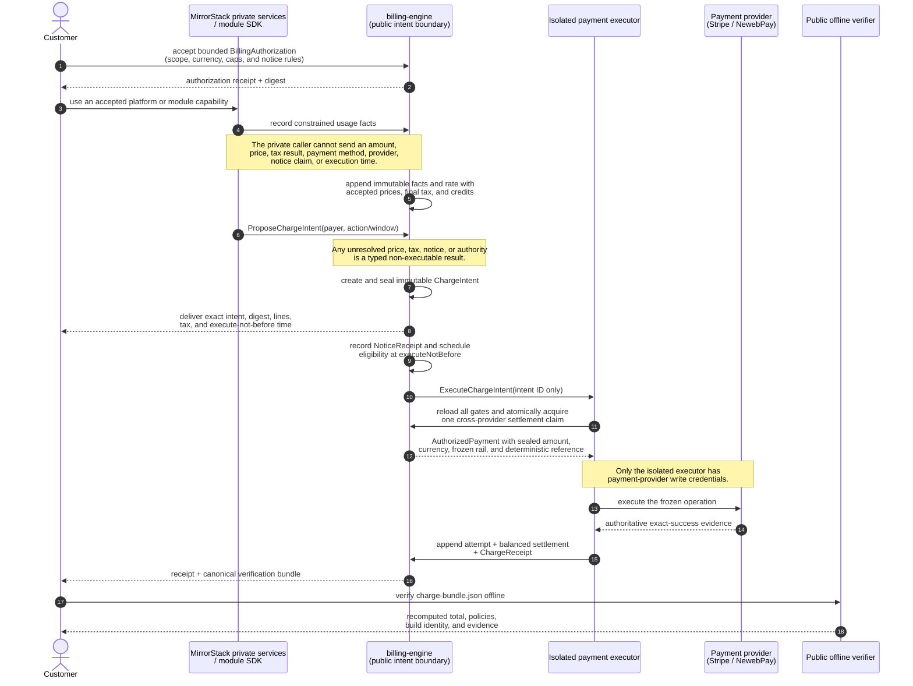
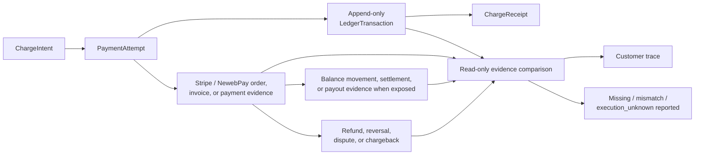

# billing-engine

The public billing boundary for [MirrorStack](https://mirrorstack.ai).

This repository is public so customers and their developers can answer a
question involving real money by reading code and verifying their own receipts:

> **Can MirrorStack collect money for something I was not shown, did not
> authorize, or cannot reproduce?**

The intended answer is no. The current implementation has not reached that
answer yet, and this README starts with that fact.

---

## Status, before anything else

> 🔴 **The current `main` source is not intent-only. Do not read the target docs
> as a claim about production.**

The current engine has strong usage-event, integer-money, idempotency, frozen
attempt, and provider-reconciliation controls. It also contains multiple direct
Stripe-writing paths for cycle collection, proration, module capacity, domains,
credit purchase, auto top-up, and unpaid invoice payment.

The most serious capability leak is structural: a nominal billing-status read
can reach the auto-top-up coordinator and collect from a saved payment method.
Usage ingress and infrastructure synchronization can also reach that coordinator.
A read/query/ingest component that can charge is incompatible with the desired
boundary, whatever the individual function names say.

Other current gaps:

- there is no immutable, customer-visible `ChargeIntent` covering exact lines,
  tax, policies, notice, authorization, build identity, and total;
- exact pre-charge notice is not required or recorded;
- large-charge disclosure is post-charge;
- budgets are alert-only rather than an enforced service/collection stop;
- current price sources include compiled constants and mutable fallbacks without
  a customer-accepted, future-effective price-book digest;
- tax is not implemented—`$0.00` in a UI mock is not a determination;
- the schema and domain are Stripe-shaped, and payment-write credentials are
  present in several binaries;
- the public health answer says only `{"status":"ok"}` and does not identify the
  deployed source/artifact/policy revisions; and
- this repository therefore cannot currently let a customer prove which public
  commit produced a particular charge.

The target design in [`docs/DESIGN.md`](docs/DESIGN.md) is **proposed**. It is
not implemented, deployed, or used by all callers. The weakest reachable money
path defines the real guarantee; adding a stronger intent API beside a legacy
direct-charge path would not make the deployment intent-based.

Automatic merge/promotion is paused while this boundary is designed and
reviewed. No document on this branch authorizes a production rollout.

---

## The short version

| question | current source | required target |
|---|---|---|
| Can a private caller supply an invoice amount? | Most rating is server-derived, but money authority is fragmented across direct paths and mutable policy | Caller reports constrained facts or names an intent action; it never supplies amount, price, tax, total, payment method, provider, notice, or execution time |
| Is the exact charge immutable before collection? | Frozen attempts usually preserve cents/provider recovery shape, not the full customer-verifiable calculation and policy set | One canonical `ChargeIntent` freezes every line, source, policy, tax result, authorization, notice rule, currency, total, and digest |
| Must notice happen before automatic collection? | No universal pre-charge gate; some disclosure is post-charge | Exact intent delivered, durable receipt recorded, public wait elapsed; failure blocks execution |
| Does a budget stop spending/collection? | Current app budget is alert-only | UI and API distinguish alert, service cap, collection cap, and authorization revocation; only implemented controls are called stops |
| Can unknown tax become zero? | No authoritative tax engine exists | `tax.status = unknown` is distinct from final zero and never executable |
| Can internal infrastructure cost become a customer line? | Current models include infrastructure inputs/markup | No. Infrastructure is internal cost; customer lines are only the closed public vocabulary |
| Is Stripe the billing model? | Much of the current schema/state machine is Stripe-shaped | No. Provider-neutral intent/ledger core; Stripe and NewebPay are adapters |
| Can one intent charge through two providers? | No cross-provider model exists | Durable settlement claim permits one success across all rails |
| Can a customer trace Stripe cash flow? | Provider ids/invoice mirror exist, but no complete public receipt graph | Read-only trace links intent → attempt → provider objects → balance/payout/refund/dispute evidence → ledger/receipt |
| Can a customer identify deployed code? | Public health has no SHA/policy identity | `Health`, `Capabilities`, build provenance, transparency commitment, and receipt all bind exact source/artifact/policies |

---

## The target boundary

> **Target sequence, not current production:** current `main` still has the
> direct Stripe-writing paths described above. This flow is not deployed until
> every legacy money path is removed and the readiness gates pass.



Only the isolated executor has a payment-provider write capability. It receives
an intent id and reloads every precondition; it never accepts an amount from a
caller.

The sequence shows the success path. Its fail-closed branches are detailed in
[`docs/DESIGN.md` §4](docs/DESIGN.md#4-intent-lifecycle):

- a missing gate or unavailable settlement claim refuses before any provider
  mutation;
- authoritative proof that an operation did not and cannot collect appends void
  evidence with no debit and no automatic rail fallback; and
- a timeout or conflict latches `execution_unknown`, retains the settlement
  claim, and permits only same-provider read-only reconciliation. It creates no
  settlement, receipt, retry, or provider fallback.

Read and write provider interfaces are separate. Support/reconciliation can
trace Stripe or NewebPay evidence without possessing the capability to collect,
refund, void, trigger auto top-up, or otherwise mutate a provider.

---

## Payment providers are replaceable rails

The domain model is:

- `BillingAuthorization`: bounded one-time or standing customer authority;
- `ChargeIntent`: the exact provider-neutral monetary proposal;
- `NoticeReceipt`: evidence that the exact proposal was delivered;
- `PaymentAttempt`: one provider-specific attempt and state history;
- `ProviderEvidence`: read-only observations/callback proof from that rail;
- `LedgerTransaction`: append-only monetary truth; and
- `ChargeReceipt`: the customer-verifiable connection across all of them.

Stripe is one adapter. A NewebPay/Taiwan adapter is the next planned rail. The
core does not assume Stripe's draft-invoice/finalize/PaymentIntent lifecycle or
that every provider supports recurring mandates, automatic collection, partial
refunds, the same currencies, or the same callback behavior.

Adapters publish capabilities and pass one conformance suite. Unsupported
operations fail before external mutation. An authenticated provider callback may
reconcile a known attempt but cannot originate or enlarge a charge.

Go implements this with small consumer-owned interfaces, struct composition,
and package-private authorized values—not class inheritance and not one enormous
provider interface.

---

## No silent charge

Automatic collection requires all of these:

```text
immutable exact intent
AND exact notice delivered
AND public waiting period elapsed
AND customer authorization still valid
AND total within every ceiling
AND tax final or explicitly not applicable
AND every policy effective and digest-matching
AND selected rail supports the exact operation/currency
AND no prior/ambiguous settlement exists
```

Anything else produces no provider mutation.

Notice evidence proves delivery under a published rule. It does not prove a
human read an email, and the product will not claim that it does.

The exact delivery channels, recipients, minimum lead time, standing ceilings,
and price-change notice rules are product decisions still under discussion. The
safe skeleton can be implemented before those values; execution stays disabled
until accepted policy supplies them.

---

## What customers may be charged for

The exhaustive target vocabulary is in [`docs/CHARGES.md`](docs/CHARGES.md).
Positive service lines are limited to accepted platform base, module usage,
optional published module-capacity/domain policies, and tax. Credits and
corrections are explicit linked lines.

**Infrastructure is not a customer charge dimension.** Internal compute,
egress, model, provider, and margin data may support operations or developer
settlement, but cannot feed the customer rater or appear as a hidden line.

Payment-provider fees are also internal unless a future public, accepted policy
adds a specific customer charge kind. An adapter cannot append one.

---

## Tax

Tax is designed before it is implemented. [`docs/TAX.md`](docs/TAX.md) defines
the safety boundary:

- immutable effective policy revisions;
- verified customer/jurisdiction evidence;
- exact taxable-basis allocation and integer rounding;
- `final`, `not_applicable`, and non-executable `unknown` states;
- tax frozen before notice and collection;
- append-only refund/correction treatment; and
- no payment-adapter tax changes.

Merchant-of-record, registrations, supported jurisdictions, inclusive/exclusive
display, exemptions/reverse charge, Taiwan business/e-invoice duties, TWD, and
provider choices require accountable legal/tax/finance decisions. They are not
reconstructed from today's code.

---

## Ledger and provider trace

[`docs/LEDGER-AND-RECEIPTS.md`](docs/LEDGER-AND-RECEIPTS.md) separates internal
monetary truth from external evidence.

A customer can follow the evidence chain end to end:



Provider observations are append-only snapshots. A mismatch opens a
reconciliation incident; the engine does not edit its intent/ledger to make a
provider total fit.

Settled history is append-only. Late usage, mistakes, refunds, disputes, tax
changes, and goodwill credits create linked corrections rather than rewriting
the original charge.

---

## Public verification

The target receipt bundle contains the intent, source commitments, formulas,
integer rounding, module/price/tax/terms/notice revisions, authorization,
delivery evidence, engine source/artifact identity, provider attempt/evidence,
and balanced ledger entries.

The planned verifier is:

```text
billing-verify verify charge-bundle.json
```

It recomputes the charge offline. Runtime `Health` and `Capabilities` bind the
deployed commit/artifact, active policy digests, adapter readiness, notice rule,
and an explicit list of reachable legacy money paths.

See [`docs/VERIFICATION.md`](docs/VERIFICATION.md). Planned commands and schemas
are labelled as planned until they exist; a document is not verification.

---

## Documentation map

| document | owns |
|---|---|
| [`docs/DESIGN.md`](docs/DESIGN.md) | normative intent lifecycle, authority boundaries, Go ports/adapters, execution predicate, migration/readiness |
| [`docs/CHARGES.md`](docs/CHARGES.md) | exhaustive customer and non-customer monetary-effect vocabulary |
| [`docs/LEDGER-AND-RECEIPTS.md`](docs/LEDGER-AND-RECEIPTS.md) | append-only monetary truth, attempts, receipts, Stripe/NewebPay cash-flow trace |
| [`docs/TAX.md`](docs/TAX.md) | tax states, policy/evidence, calculation boundary, unresolved legal/product choices |
| [`docs/THREAT-MODEL.md`](docs/THREAT-MODEL.md) | adversaries, trust assumptions, protections, and admitted limits |
| [`docs/VERIFICATION.md`](docs/VERIFICATION.md) | build/deployment proof, verifier, properties, fuzzing, mutation, adapter conformance |
| [`SECURITY.md`](SECURITY.md) | vulnerability reporting, in-scope public claims, and known open issues |

A false or overstated public sentence is a security defect in a repository whose
purpose is customer verification.

---

## Migration rule

The new engine runs in shadow first: derive canonical intents without notice or
money movement, compare every line against current results, and investigate every
difference. Then add authorization, notice, tax, executor isolation, provider
adapters, receipts, and verification.

Callers migrate first. Direct provider routes and credentials are removed last,
after in-flight legacy attempts are drained or explicitly quarantined. Legacy
rows never receive fabricated consent, tax, notice, or policy evidence.

Production intent execution remains disabled until:

- all money effects are mapped and machine-enforced;
- shadow reconciliation has no unexplained difference;
- customer authorization/notice/tax policies are accepted;
- Stripe and NewebPay adapters pass their declared conformance tests;
- public build/receipt verification is available;
- the executor is the only provider writer; and
- `Capabilities` reports zero legacy money paths.

---

## Repository layout

```text
billing-engine/
├── cmd/                         current binaries; target roles become capability-narrow
├── internal/                    domain, adapters, and current implementation
├── migrations/billing/         authoritative current database schema
├── docs/
│   ├── DESIGN.md
│   ├── CHARGES.md
│   ├── LEDGER-AND-RECEIPTS.md
│   ├── TAX.md
│   ├── THREAT-MODEL.md
│   └── VERIFICATION.md
├── SECURITY.md
└── README.md
```

The migrations describe what exists today. These target documents describe what
must be true before the intent-only claim is made. Both statuses remain explicit
during migration.

---

## Running the current checks

```bash
make db         # start local PostgreSQL
make db-init    # apply current migrations
make lint       # go vet
make build      # build current binaries
make test       # current test suite; no production payment calls
```

The future verifier, fuzz, mutation, and provider conformance commands will be
listed only once their scripts exist and are reproducible without production
credentials or paid calls.

## Security

See [`SECURITY.md`](SECURITY.md). Do not place credentials, real customer data,
tax ids, payment methods, or production provider payloads in an issue or test
fixture.

## License

[FSL-1.1-ALv2](LICENSE) — converts to Apache 2.0 two years after release.
