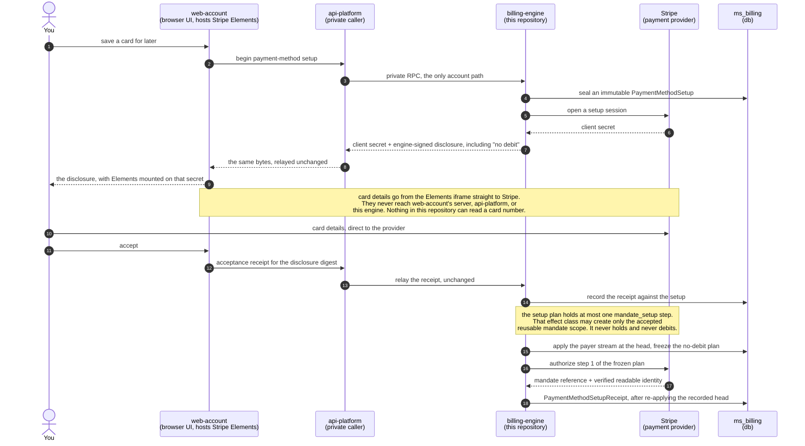
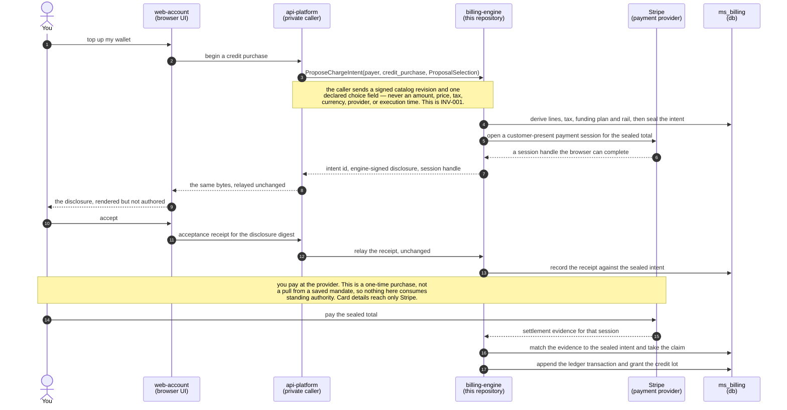
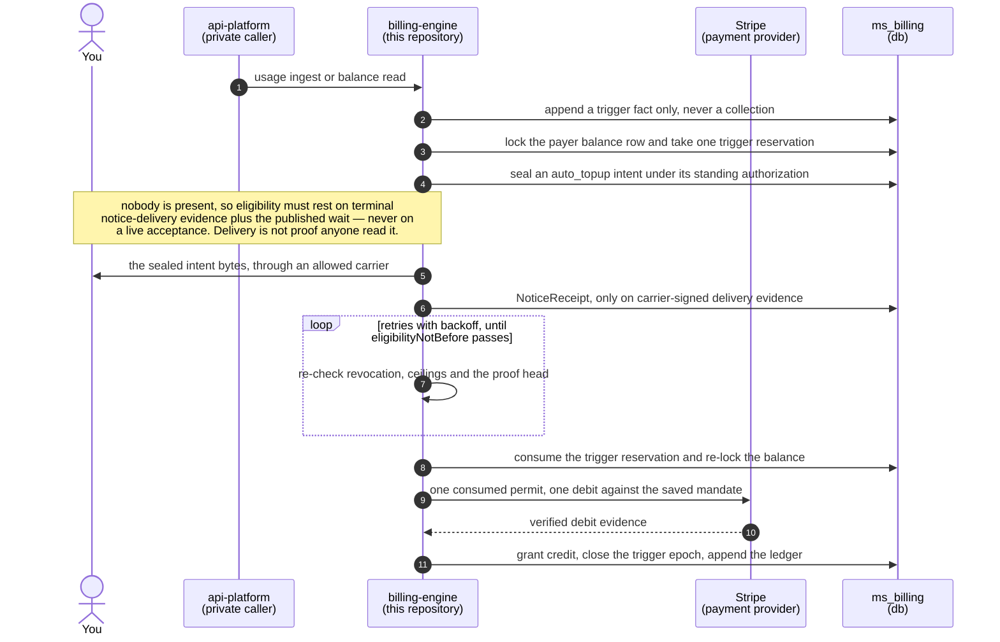
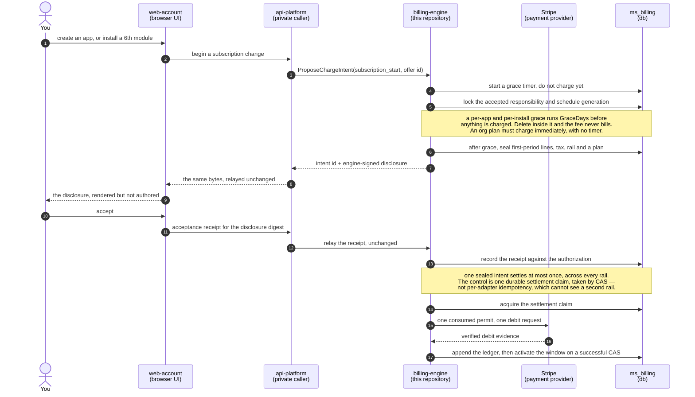
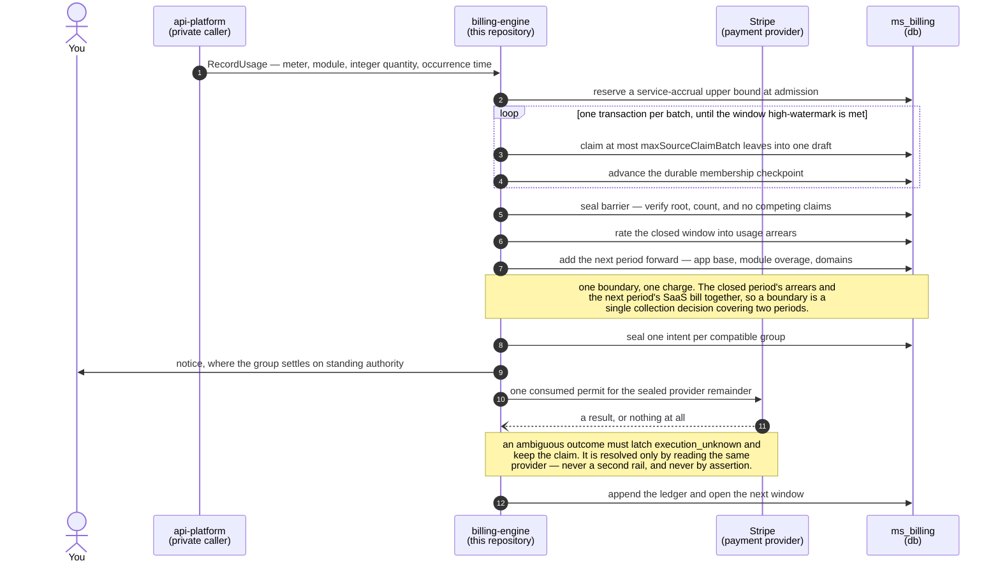
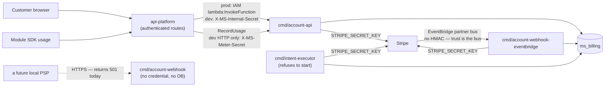

# billing-engine

The billing service for [MirrorStack](https://mirrorstack.ai). It owns the
`ms_billing` schema, meters usage, and holds the payment-provider credentials —
every Stripe call in the platform is meant to live behind
`internal/shared/stripe/`. `api-platform` calls it over a private RPC surface;
nothing you write calls it directly.

**If you build modules on MirrorStack, this repository exists so you can check
the platform's arithmetic instead of trusting it.** It is public source, not a
public endpoint. Start with [`docs/VERIFICATION.md`](docs/VERIFICATION.md) —
it is the inventory of what can be checked from outside, and what cannot.

Two honest headlines before anything else:

- **No new charge can be collected by this service today.** Every billing leg
  now derives a charge and seals it as a proposal instead of collecting it
  (`internal/account/cycle/boundary_charges.go` `proposeBoundary`,
  `internal/account/cycle/overage.go` `proposeModuleOverage`,
  `internal/account/autotopup/executor.go` `proposeAutoTopUp`,
  `internal/account/creditpurchase/executor.go` `proposePurchase`). The one
  binary that can collect, `cmd/intent-executor`, refuses to start — see
  below. What still moves money are two crash-recovery paths that finish a
  charge an earlier run had already put in front of Stripe
  (`internal/architecture/allowlist.go`, the `COLLECT:` entries).
- **You cannot yet verify that you get paid.** Developer revenue share is
  written but unreachable, and the platform's take rate is a Go constant, not a
  published policy. Details in *What you cannot check yet*.

## What you can check yourself

Each of these is a command you can run against a clone at this commit. None
needs production access.

| what you can establish | how |
|---|---|
| the number of ways this tree can take money is measured, not asserted | `go test ./internal/architecture/` — `TestReportedLegacyMoneyPathCountIsTrue` re-derives the count with an AST scan and fails if `capabilities.LegacyMoneyPaths` disagrees. It is `3` (`internal/account/capabilities/capabilities.go`), and `internal/architecture/allowlist.go` names each site and what it charges for. |
| nothing can collect on the new rail | `cmd/intent-executor/main.go` `readiness` refuses to start unless `INTENT_EXECUTOR_ENABLED` is set, the build is stamped, **and** `LegacyMoneyPaths == 0`. It is 3, so the executor exits 1. Its `environment()` also returns every permission gate false. |
| the charge vocabulary is closed | `go test ./internal/intent/` — `internal/intent/catalog.go` holds exactly seven kinds (`platform_base`, `module_usage`, `tax`, `subscription_start`, `credit_purchase`, `auto_topup`, `collect_receivable`) and `Seal` rejects anything else. `TestEveryCatalogKindSeals` pins the count at 7. |
| a sealed charge cannot be edited in the database without detection | `intent.Rehydrate` (`internal/intent/chargeintent.go`) recomputes the digest, the subtotal, the total and the provider remainder on every load and refuses a mismatch. A restored backup, a replicated row and a hand-edit fail identically. `migrations/billing/063_seal_every_sealed_column.up.sql` enforces the freeze in Postgres too. |
| the evidence trust root is real and pinned in source | `internal/shared/signing/trustroot.go` ships one `billing-evidence` key. Its id is derived from its own public bytes, `NewTrustRoot` refuses a mismatch at startup, and the slice is unexported so no package can append to it at runtime. Pinning the public half is not provisioning the private one — a deployment without seed material can verify, not sign. |
| which build answered you | `.github/workflows/publish.yml` stamps commit, environment, artifact and role into `internal/shared/buildinfo` for every published binary, and `cmd/intent-executor` refuses an unstamped build. |

`docs/VERIFICATION.md` says which of these amount to a proof and which only
amount to evidence.

## What you cannot check yet

These are gaps, stated as gaps. None of them is scheduled here.

- **Developer settlement is not wired.** `SettleDevelopers`
  (`internal/account/cycle/service.go`) has no non-test caller —
  `cmd/billing-cycle` calls `RollupPeriod` and `RunBillingCycle` and never it —
  so `ms_billing.developer_settlements` has no writer in any running binary.
  Inside it, `infraMicros` is hardcoded `0` and the developer id is never
  resolved from a module.
- **The take rate is not a published policy.** `publishedTakeNum = 15` and
  `privateTakeNum = 30` are Go constants (`internal/account/cycle/types.go`)
  with no revision id, no effective date and no acceptance. A module whose
  visibility lookup fails defaults to the 30% take, in the platform's favour.
- **A sealed intent does not carry your module's line.** `intent.Line` has
  meter, module, module version, quantity and unit price, but the only
  production producer collapses every line to quantity 1 with the whole amount
  as the unit price (`internal/intent/proposer/proposer.go`). The digest
  attests to one opaque number.
- **No price book exists.** Every leg seals the literal
  `unpublished/pending-decision-12` for its terms, price-book, notice, tax and
  routing revisions (`internal/account/cycle/domain_charges.go`,
  `internal/account/autotopup/executor.go`).
- **There is no verifier and no evidence read path.** `cmd/` holds ten
  binaries and none of them verifies a charge; there is no `testdata`
  directory and no golden vectors; migration 068 revokes
  `ms_billing.evidence_records` from the read-only role.
- **There is no sub-tenant billing principal.** `migrations/billing/001_init.up.sql`
  constrains an account owner to `user` or `org`. Your own customers exist only
  as `usage_events.subject`, which `internal/account/usage/types.go` states is
  never consulted for billing identity.

## What gets charged, and to whom

Every rate below is a constant in this tree, not a description of one. Read
them against the first headline: these are the rates the engine derives a
charge *from*, and today that derivation ends in a sealed proposal.

| line | rate | source |
|---|---|---|
| platform base fee, per app per period | $20.00 | `internal/account/usage/bill.go` `BaseFeeMicros` |
| installed-module allowance, pooled account-wide | 5 modules | `internal/account/usage/bill.go` `IncludedModules` |
| module overage, sold in whole blocks of 5 | $5.00 per block ($1.00 amortized per module) | `internal/account/usage/bill.go` `ModuleBlockFeeMicros`, `ModuleOverageFeeMicros` |
| custom domain, each, recurring | $2.00 | `internal/account/usage/bill.go` `DomainFeeMicros` |
| grace before a new app or install is billed | 3 days | `internal/account/usage/bill.go` `GraceDays` |
| your module's metered usage | the module's declared `unit_price_micros`, no markup | `internal/account/db/usage.sql.go` |
| reserved `infra.*` / `platform.*` metrics | cost × 1.2 | `internal/account/cycle/types.go` `infraMarkupNum`/`Den` |

Two things about that table are worth saying plainly:

- **An app deleted inside its grace window is never billed**, and each module
  install carries its own timer.
- **The infrastructure line's displayed arithmetic does not reconcile.**
  `UnitPriceMicros` on an infra line is the raw pre-markup cost, while
  `ChargedMicros` beside it already includes the ×1.2
  (`internal/account/usage/types.go`). Quantity × displayed unit price
  therefore does not equal the charge shown next to it, and that difference is
  not disclosed to the customer today. It is filed in the known-gaps register
  in [`SECURITY.md`](SECURITY.md).

Card details never enter this repository. The only provider session it opens
for card capture is a setup-mode Checkout Session
(`internal/shared/stripe/client.go` `CreateCheckoutSession`); the card goes
from the browser's Stripe Elements iframe to Stripe, and what comes back here
is a payment-method reference.

## How MirrorStack charges you — the five flows

The rates above are collected through five customer money journeys. They run
through the lifecycle in
[`docs/DESIGN.md#4`](docs/DESIGN.md#4--what-happens-after-you-accept); their
intent kinds are tabulated in
[`docs/DESIGN.md#6`](docs/DESIGN.md#6--what-you-can-be-charged-for). Each gets
a diagram below.

> 🔴 **Read every one of the five as a specification.** None is deployed, and
> none is a guarantee you hold today. Each diagram is written in "must" for that
> reason. Every durable type they name returns zero files from
> `git grep <Type> -- '*.go'` on `main`
> ([`docs/DESIGN.md#3`](docs/DESIGN.md#3--what-must-be-true-before-any-money-moves)).

---

### Flow 1 · bind a card for recurring use

Save a card once; move no money doing it. The other four flows depend on the mandate this one creates. **Target, not deployed:** `PaymentMethodSetup` and its receipt are unbuilt.



- **Your card number never enters this repository.** Step 10 goes from the Elements iframe to Stripe; step 17 returns a mandate reference, not a card.
- **No arrow creates authority to charge you.** Step 16 authorizes one `mandate_setup` step; subscription and auto top-up must each request their own authority later ([`docs/DESIGN.md#6`](docs/DESIGN.md#6--what-you-can-be-charged-for)).
- **Steps 8–9 and 12–13 relay bytes, unchanged.** `api-platform` authors neither — and could assert an acceptance you never gave; the engine records what it was told, which is detection, not prevention ([INV-006](docs/DESIGN.md#inv-006)).
- 🔴 **Today, step 18 starts a billing period.** `payment_method.attached` stamps `accounts.activated_at` (`internal/account/webhook/handlers.go:132`) — [known gap](SECURITY.md#known-current-gaps).

---

### Flow 2 · buy credit

A one-time, customer-present purchase of stored value — the clearest place to see who decides the amount. **Target, not deployed:** `ChargeIntent` and `FundingPlan` are unbuilt.



- **Step 14 is you paying, not us pulling.** No saved mandate is consumed and no standing authority is spent — the difference from [flow 3](#flow-3--auto-top-up-a-credit-wallet-from-a-saved-mandate).
- **The amount you typed is a choice, not a price.** The engine re-derives currency, lines, tax and eligibility from the template it signed and seals the total in step 4 ([INV-001](docs/DESIGN.md#inv-001)). Credit never funds credit: `walletFunding = 0`, `providerRemainder = grossObligation`.
- **The acceptance in steps 11–13 is relayed and could be invented**; the provider evidence in step 15 proves the money moved, never who accepted ([INV-006](docs/DESIGN.md#inv-006)).
- 🔴 **Today `StartCreditPurchase` proposes and does not collect.** The collector that finalized an invoice before the browser had its client secret is gone; the leg seals a `credit_purchase` intent (`internal/account/billing/credit.go:156`, `:696`; `internal/account/creditpurchase/executor.go:782`) and the executor refuses to start while a legacy money path remains. What is left is the pre-cutover recovery path — [known gap](SECURITY.md#known-current-gaps).

---

### Flow 3 · auto top-up a credit wallet from a saved mandate

The only flow with nobody present: there is no acceptance to check at the moment of the debit, so standing authority must carry it. **Target, not deployed:** `AutoTopupTriggerReservation` and `NoticeReceipt` are unbuilt.



- 🔴 **Step 1 must not reach step 9; today it still reaches step 3.** An ordinary status or ingest read can arm the trigger. The trigger no longer collects (it proposes a sealed intent the executor refuses to consume), but a read with a side effect is still a read with a side effect — [known gap](SECURITY.md#known-current-gaps).
- **Step 3 is a reservation, not a counter.** The trigger key is unique and the predicate is recomputed under the same lock at consume time, so two concurrent triggers cannot both pass ([INV-008](docs/DESIGN.md#inv-008)).
- **The wait starts at delivery, not at sealing.** A late notice moves eligibility later ([INV-005](docs/DESIGN.md#inv-005)).
- 🔴 **The minimum lead time is not a number yet** — an open product decision published through `Capabilities` ([`docs/DESIGN.md#12`](docs/DESIGN.md#12--what-we-have-not-decided)). Turning on general billing must never turn this flow on.

---

### Flow 4 · start or change a card-backed subscription

Recurring money on a rail that offers to run the recurrence for us; declining that offer is the point. **Target, not deployed:** `ProviderExecutionPlan`, `PaymentAttempt` and `SubscriptionOffer` are unbuilt; `Ensure` reports `subscription` missing (`internal/account/billing/service.go:105`, `:188-193`). The grace and allowance numbers below are shipped.



- **A fee is not charged the moment you trigger it.** A new app or an install past the included 5 starts a 3-day grace timer (`GraceDays`, `IncludedModules` — `internal/account/usage/bill.go:118`, `:52`); after grace, one over-allowance install bills $1.00 prorated (`bill.go:37`, `internal/account/cycle/overage.go:195-204`) and the boundary leg prices $5.00 per block of 5 (`bill.go:70`, `internal/account/cycle/charge.go:306`). Deleted inside grace = never billed. Org tiers are unbuilt and must charge immediately when they ship.
- **Step 15 is one request, as a transport property.** SDK/HTTP retries off, `MaxNetworkRetries = 0`, and a guard refuses a second send for the permit ([`docs/DESIGN.md#5`](docs/DESIGN.md#5--paying-and-what-happens-when-the-answer-never-comes)).
- **Stripe never schedules the next period.** Provider-managed subscriptions, auto-advance, smart retries, dunning debits and delayed capture are all forbidden, so none can race your revocation through the claim CAS in step 14.
- **Changing plan or rail after the seal in step 6 is a new intent**, with new funding, digest, disclosure and claim ([INV-008](docs/DESIGN.md#inv-008)).

---

### Flow 5 · close a module usage period and open the new one

The largest flow, and the only one where money is discovered rather than requested: millions of metered leaves become one charge, exactly once. **Target, not deployed:** `BillableSourceAllocation` and `ServiceAccrualExposure` are unbuilt.



- **Step 2 gates at admission, deliberately early.** A ceiling checked only at close would turn a prepaid wallet into an unauthorized credit line. 🔴 Budgets are alert-only today and never stop accrual (`internal/account/budget/service.go:260`) — [known gap](SECURITY.md#known-current-gaps).
- **A boundary charges backward and forward at once.** Steps 6–7 put the closed period's usage arrears and the next period's advance base, module overage and domains into one total (`internal/account/cycle/charge.go:306-322`); apps still inside grace join at the next boundary.
- **The loop keeps close from being one enormous transaction.** Batches claim leaves and checkpoint; only the seal barrier in step 5 is all-or-nothing, and a leaf enters one allocation lineage by database constraint ([INV-008](docs/DESIGN.md#inv-008)).
- **`api-platform` cannot choose the grouping key** — it is derived inside the engine, so a regrouped call cannot make a source consumable twice.
- **The latch after step 11 has no timeout release**; an operator may attach evidence and still cannot clear it ([`docs/DESIGN.md#5`](docs/DESIGN.md#5--paying-and-what-happens-when-the-answer-never-comes)).

---

### What all five have in common

This is what "intent-based" buys, and it is the point of the whole design:
**`api-platform` cannot charge you for something unrelated.** It does not send a
charge. It names a payer and picks one option from a catalog the engine signed,
and the engine derives the rest. A caller that wants to bill something outside
that closed vocabulary has no way to express it — there is no field for it.

Each money-moving journey must pass a single sealed intent id to one settlement
contract. The caller must not be able to supply the amount, the funding split,
the provider, the mandate, the tax result, the notice claim, or the execution
time. The engine must derive every financial field.

That much holds even though the engine trusts `api-platform` about *who*
accepted ([INV-006](docs/DESIGN.md#inv-006)). The two are separate: a caller that
can misreport a customer still cannot invent a charge kind or an amount.

- **No silent charge.** Every collection must satisfy one execution predicate
  before any provider mutation. That predicate has exactly one owner:
  [`docs/DESIGN.md#executechargeintent`](docs/DESIGN.md#executechargeintent).
  Every other mention must link to that anchor instead of restating the clauses,
  so the clause list cannot drift.
- **One intent settles at most once**, across every rail, through a single
  durable settlement claim rather than per-adapter idempotency —
  [`docs/DESIGN.md#inv-008`](docs/DESIGN.md#inv-008).
- **Payment providers are adapters.** Stripe is the only rail with a client
  today (`internal/shared/stripe/client.go`). NewebPay is the next planned one
  and holds only a reserved wire shape
  (`internal/account/billing/types.go:338-342`). An
  ambiguous provider outcome must latch `execution_unknown`, and must be
  resolved by reading the same provider, never by a second rail —
  [`docs/DESIGN.md#5-payment-providers-are-adapters`](docs/DESIGN.md#5--paying-and-what-happens-when-the-answer-never-comes).
- **What customers may be charged for** is a closed vocabulary —
  [`docs/DESIGN.md#8-what-customers-may-be-charged-for`](docs/DESIGN.md#6--what-you-can-be-charged-for).
- **Tax** must resolve to one of three states. `unknown` must never become zero
  and must never be executable — [`docs/DESIGN.md#9-tax`](docs/DESIGN.md#7--tax-and-what-it-refuses-to-guess).
- **Ledger and receipts** must be append-only, with provider observations held
  as read-only snapshots —
  [`docs/DESIGN.md#10-ledger-and-receipts`](docs/DESIGN.md#8--where-the-money-is-written-down).
- **Verification** covers the charge bundle a customer will recompute offline
  ([the charge bundle contract](docs/VERIFICATION.md#3-canonical-charge-bundle))
  and the architecture checks that run against this tree
  ([`docs/VERIFICATION.md#7-static-architecture-checks`](docs/VERIFICATION.md#7-static-architecture-checks)).

### Infrastructure cost and the customer line

**Target.** Internal infrastructure cost must not be a customer charge
dimension. Compute, egress, model, provider, and margin figures may support
operations and developer settlement. They must not feed the customer rater, and
they must not appear as a line whose displayed arithmetic does not reconcile.

**Present state.** Infrastructure already reaches a customer-visible line, with
a markup applied to it. Both rows are filed in
[`SECURITY.md#known-current-gaps`](SECURITY.md#known-current-gaps):

- The multiplier is `infraMarkupNum = 12` over `infraMarkupDen = 10`, so a
  reserved metric is charged at cost x 1.2
  (`internal/account/cycle/types.go:63-64`).
- The live path runs `RecordInfraUsage` (`internal/account/usage/infra.go:346`)
  into `AppInfraBill` and `AppModuleInfraBill`
  (`internal/account/usage/bill.go:509`, `:522`), served by `GetAppBill` and
  `GetAccountBill` (`cmd/account-api/main.go:284`, `:291`) behind
  `/apps/{appId}/settings/billing` and web-account `/me/billing`.
- The wire fields are `infra_total_micros`, `infra_lines`, and
  `module_infra_lines` (`internal/account/usage/types.go:455`, `:466`, `:477`).
- The x12/10 factor is applied inside the query for any `infra.*` or
  `platform.*` metric (`internal/account/db/usage.sql.go:124-131`).
- The displayed `UnitPriceMicros` is the pre-markup cost of goods, while
  `ChargedMicros` already includes the markup
  (`internal/account/usage/types.go:325`). Quantity multiplied by the
  displayed unit price therefore does not equal the charge shown beside it.
  That difference is undisclosed to the customer today.

The live priced catalog is `migrations/billing/019_infra_catalog_hygiene.up.sql`,
`020_p1_infra_catalog_seed.up.sql`, `045_ssr_compute_metrics.up.sql` and
`046_ssr_egress_metrics.up.sql`, plus `018_ai_model_prices.up.sql` for
`ms_billing.metric_model_prices`. Migration 019 demoted 017's `infra.compute.ms`
row to a deprecated alias, which `022_drop_compute_alias.up.sql` then deleted,
and `019_infra_catalog_hygiene.up.sql` sets
`infra.egress.bytes` to `unit_price_micros = 0`.

---

## Runtime and trust boundary

`billing-engine` is public source, not a public endpoint. Each fact below is
citable in the tree.

- In production the account API is a Lambda invoked by `api-platform` by ARN
  and gated by IAM `lambda:InvokeFunction`. The RPC dispatcher is not exposed
  through API Gateway (`cmd/account-api/main.go`, package comment and
  `lambdaInvokeHandler`).
- Two surfaces are publicly reachable. `api.mirrorstack.ai/billing/healthz` is
  mapped onto the same Lambda and returns a static `{"status":"ok"}` before the
  dispatcher runs — it names no commit, so a charge cannot yet be tied to a
  public source revision from outside. The `cmd/account-webhook` ingress URL
  answers every request with `501` and the body
  `no payment provider is wired to this endpoint`.
- In local development the control-plane RPC routes check
  `X-MS-Internal-Secret`, and `RecordUsage` sits behind a separate
  `X-MS-Meter-Secret` so the metering credential rotates on its own
  (`cmd/account-api/main.go` `buildRouter`,
  `internal/shared/auth/internal_secret.go`). Both are fail-closed: an unset
  secret returns 503, never open (`secretGuard`).
- **Stripe events arrive over an EventBridge partner bus and nothing else
  receives them.** Only Stripe's AWS account may publish to that bus and only
  this receiver's rule may consume it, so no HMAC is checked anywhere
  (`cmd/account-webhook-eventbridge/main.go`). The `webhook.Verifier` there is
  a constructor argument built from the empty string — a reject-all verifier
  that `ProcessTrusted` never calls.
- **`cmd/account-webhook` no longer verifies anything, holds no provider
  credential and touches no database.** The Stripe verifier, the
  `Stripe-Signature` header and `STRIPE_WEBHOOK_SECRET` are gone. The binary is
  kept deliberately empty because a local PSP outside Stripe's supported
  countries cannot publish to an AWS partner bus, and an HTTP URL pinned in a
  PSP registration must survive. The first such provider has to bring its own
  verifier: the Stripe seam does not generalize.



## Repository layout

```text
billing-engine/
├── cmd/
│   ├── account-api/                 internal RPC Lambda; local HTTP on :8091
│   ├── account-webhook/             empty HTTP ingress for a future local PSP; 501
│   ├── account-webhook-eventbridge/ the only receiver of Stripe events
│   ├── billing-cycle/               scheduled per-period rollup + proposal driver
│   ├── infra-egress-sync/           pulls CDN egress totals from Cloudflare
│   ├── infra-ssr-compute-sync/      pulls SSR compute totals from CloudWatch
│   ├── intent-executor/             the only collector; refuses to start today
│   ├── intent-shadow/               read-only reconciliation gate; no write port
│   ├── pm-default-backfill/         one-shot default-payment-method repair
│   └── signing-keygen/              generates a signing key; prints a secret
├── internal/
│   ├── account/                     the shipped billing services and sqlc db
│   ├── architecture/                the static checks CI runs over this tree
│   ├── billingperiod/               period-window arithmetic
│   ├── intent/                      sealed charge intents, catalog, predicate
│   ├── meteringlock/                the shared advisory-lock namespace
│   ├── provider/stripeadapter/      the intent rail's only provider adapter
│   └── shared/                      auth, buildinfo, config, signing, stripe
├── migrations/billing/              the database schema — see its README
├── scripts/                         local DB init and read-only SQL probes
├── docs/                            DESIGN.md, VERIFICATION.md
├── SECURITY.md
├── CLAUDE.md                        contributor and agent working rules
└── README.md
```

`.github/workflows/publish.yml` builds and uploads **eight** of the ten
binaries per commit. `pm-default-backfill` and `signing-keygen` are not
published and are run by hand.

## Running it locally

```bash
make db         # start PostgreSQL 17 in Docker (docker-compose.yml)
make db-init    # psql -f scripts/init-db.sql
make lint       # go vet ./...
make build      # go build ./...
make test       # go test ./...   — unit tests, no external calls
```

`scripts/init-db.sql` applies the migrations it lists explicitly; it currently
stops at `066_intent_groups.up.sql`, so apply `067`–`069` by hand if you need
them.

`make test-integration` runs `REQUIRE_DOCKER=1 go test -tags=integration -race
./...`. It does not use the `make db` instance — each test boots its own
ephemeral Postgres 17 container through testcontainers
(`internal/shared/testutil/db.go` `NewTestDB`). Without `REQUIRE_DOCKER=1` an
unreachable daemon makes the suite *skip* while still printing `ok`.

Two read-only tools ship here and need no provider credential:

- `cmd/intent-shadow` rates closed billing periods through the intent rater and
  exits non-zero on any difference it cannot explain. It compiles in no
  provider client, notifier or writer, so "moves no money" is a property of the
  binary rather than a promise about it.
- `scripts/legacy-drop-preconditions.sql` is every-statement-`SELECT` and
  reports `READY`/`BLOCKED` per legacy path:
  `psql "$DATABASE_URL" -v ON_ERROR_STOP=1 -f scripts/legacy-drop-preconditions.sql`.

There is no offline charge verifier in this tree. `docs/VERIFICATION.md` says
what one would have to do.

## Documentation map

| document | owns |
|---|---|
| [this README §How MirrorStack charges you](#how-mirrorstack-charges-you--the-five-flows) | the five customer money flows — bind a card, buy credit, auto top-up, subscription, period close — as sequence diagrams, written in "must" |
| [`docs/VERIFICATION.md`](docs/VERIFICATION.md) | what you can check, how strong each check is, the charge-bundle contract, and what CI enforces against this tree |
| [`docs/DESIGN.md`](docs/DESIGN.md) | the target specification — invariants, the durable model, intent lifecycle, provider ports, the charge vocabulary, tax, ledger, and the migration gate. Read it as a specification to build, not as a description of production. |
| [`SECURITY.md`](SECURITY.md) | reporting policy, the adversary model, trust assumptions, and the single register of known current gaps |
| [`CLAUDE.md`](CLAUDE.md) | working rules for a contributor editing this repository |
| [`migrations/billing/`](migrations/billing/) | the schema that exists today, plus its apply order |

Known defects are enumerated in exactly one place, the known-gaps register in
[`SECURITY.md`](SECURITY.md). No other file here keeps a second list.

Cross-repository references describing what runs today:

- [`mirrorstack-docs/architecture/billing-flow.md`](https://github.com/mirrorstack-ai/mirrorstack-docs/blob/main/architecture/billing-flow.md) — end-to-end flows, invariants, failure modes.
- [`mirrorstack-docs/api/billing/account-api.md`](https://github.com/mirrorstack-ai/mirrorstack-docs/blob/main/api/billing/account-api.md) — the RPC surface, and [`mirrorstack-docs/db/ms_billing/`](https://github.com/mirrorstack-ai/mirrorstack-docs/tree/main/db/ms_billing) — the schema.

If those docs disagree with `migrations/billing/`, the migration wins and the
doc is the bug.

## What the design is for, and where it stands

The property the intent model is built for is narrow: **`api-platform` should
not be able to charge you for something unrelated.** It names a payer and picks
one option from a catalog the engine signed, and the engine derives the rest.
Part of that is enforced today and part is not, and the difference is visible in
the tree rather than implied:

- **Enforced.** The charge kind is closed at seal — `intent.Seal` refuses any
  kind outside `internal/intent/catalog.go`, and a row edited afterwards fails
  `Rehydrate`.
- **Not enforced yet.** Seven request fields still let the caller state a number
  or assert a fact the engine ought to derive, including
  `StartCreditPurchaseRequest.AmountMicros` and `GrantCreditsRequest.Actor`.
  Each is listed with its reason in
  `internal/architecture/request_fields_allowlist.go`, and
  `go test ./internal/architecture/` fails the build on an eighth. The list is
  the debt, kept where it cannot be forgotten.
- **Assumed, not checked.** The engine trusts `api-platform` about *who*
  accepted. A caller that misreports a customer still cannot invent a charge
  kind, but it can misattribute one.

`docs/DESIGN.md` carries the invariants and the reasoning;
`docs/VERIFICATION.md` carries which parts are checkable today.

## Security

See [`SECURITY.md`](SECURITY.md). Do not put credentials, real customer data,
tax ids, payment methods, or production provider payloads into an issue, a test
fixture, or a commit. **A sentence in this repository that overstates what the
code does is itself a defect worth reporting**, because the purpose of the
repository is letting you check the code rather than the sentence.

## License

[FSL-1.1-ALv2](LICENSE) — converts to Apache 2.0 two years after release.
