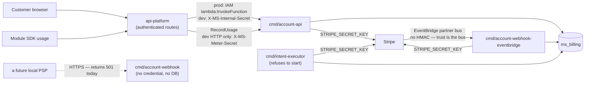

# billing-engine

The billing service for [MirrorStack](https://mirrorstack.ai). It owns the
`ms_billing` schema, meters usage, and holds the payment-provider credentials —
every Stripe call in the platform is meant to live behind
`internal/shared/stripe/`. `api-platform` calls it over a private RPC surface;
nothing you write calls it directly.

**If you build modules on MirrorStack, this repository exists so you can check
the platform's arithmetic instead of trusting it.** It is public source, not a
public endpoint. Start with [`docs/VERIFICATION.md`](docs/VERIFICATION.md) —
it is the inventory of what can be checked from outside, and what cannot.

Two honest headlines before anything else:

- **No new charge can be collected by this service today.** Every billing leg
  now derives a charge and seals it as a proposal instead of collecting it
  (`internal/account/cycle/boundary_charges.go` `proposeBoundary`,
  `internal/account/cycle/overage.go` `proposeModuleOverage`,
  `internal/account/autotopup/executor.go` `proposeAutoTopUp`,
  `internal/account/creditpurchase/executor.go` `proposePurchase`). The one
  binary that can collect, `cmd/intent-executor`, refuses to start — see
  below. What still moves money are two crash-recovery paths that finish a
  charge an earlier run had already put in front of Stripe
  (`internal/architecture/allowlist.go`, the `COLLECT:` entries).
- **You cannot yet verify that you get paid.** Developer revenue share is
  written but unreachable, and the platform's take rate is a Go constant, not a
  published policy. Details in *What you cannot check yet*.

## What you can check yourself

Each of these is a command you can run against a clone at this commit. None
needs production access.

| what you can establish | how |
|---|---|
| the number of ways this tree can take money is measured, not asserted | `go test ./internal/architecture/` — `TestReportedLegacyMoneyPathCountIsTrue` re-derives the count with an AST scan and fails if `capabilities.LegacyMoneyPaths` disagrees. It is `3` (`internal/account/capabilities/capabilities.go`), and `internal/architecture/allowlist.go` names each site and what it charges for. |
| nothing can collect on the new rail | `cmd/intent-executor/main.go` `readiness` refuses to start unless `INTENT_EXECUTOR_ENABLED` is set, the build is stamped, **and** `LegacyMoneyPaths == 0`. It is 3, so the executor exits 1. Its `environment()` also returns every permission gate false. |
| the charge vocabulary is closed | `go test ./internal/intent/` — `internal/intent/catalog.go` holds exactly seven kinds (`platform_base`, `module_usage`, `tax`, `subscription_start`, `credit_purchase`, `auto_topup`, `collect_receivable`) and `Seal` rejects anything else. `TestEveryCatalogKindSeals` pins the count at 7. |
| a sealed charge cannot be edited in the database without detection | `intent.Rehydrate` (`internal/intent/chargeintent.go`) recomputes the digest, the subtotal, the total and the provider remainder on every load and refuses a mismatch. A restored backup, a replicated row and a hand-edit fail identically. `migrations/billing/063_seal_every_sealed_column.up.sql` enforces the freeze in Postgres too. |
| the evidence trust root is real and pinned in source | `internal/shared/signing/trustroot.go` ships one `billing-evidence` key. Its id is derived from its own public bytes, `NewTrustRoot` refuses a mismatch at startup, and the slice is unexported so no package can append to it at runtime. Pinning the public half is not provisioning the private one — a deployment without seed material can verify, not sign. |
| which build answered you | `.github/workflows/publish.yml` stamps commit, environment, artifact and role into `internal/shared/buildinfo` for every published binary, and `cmd/intent-executor` refuses an unstamped build. |

`docs/VERIFICATION.md` says which of these amount to a proof and which only
amount to evidence.

## What you cannot check yet

These are gaps, stated as gaps. None of them is scheduled here.

- **Developer settlement is not wired.** `SettleDevelopers`
  (`internal/account/cycle/service.go`) has no non-test caller —
  `cmd/billing-cycle` calls `RollupPeriod` and `RunBillingCycle` and never it —
  so `ms_billing.developer_settlements` has no writer in any running binary.
  Inside it, `infraMicros` is hardcoded `0` and the developer id is never
  resolved from a module.
- **The take rate is not a published policy.** `publishedTakeNum = 15` and
  `privateTakeNum = 30` are Go constants (`internal/account/cycle/types.go`)
  with no revision id, no effective date and no acceptance. A module whose
  visibility lookup fails defaults to the 30% take, in the platform's favour.
- **A sealed intent does not carry your module's line.** `intent.Line` has
  meter, module, module version, quantity and unit price, but the only
  production producer collapses every line to quantity 1 with the whole amount
  as the unit price (`internal/intent/proposer/proposer.go`). The digest
  attests to one opaque number.
- **No price book exists.** Every leg seals the literal
  `unpublished/pending-decision-12` for its terms, price-book, notice, tax and
  routing revisions (`internal/account/cycle/domain_charges.go`,
  `internal/account/autotopup/executor.go`).
- **There is no verifier and no evidence read path.** `cmd/` holds ten
  binaries and none of them verifies a charge; there is no `testdata`
  directory and no golden vectors; migration 068 revokes
  `ms_billing.evidence_records` from the read-only role.
- **There is no sub-tenant billing principal.** `migrations/billing/001_init.up.sql`
  constrains an account owner to `user` or `org`. Your own customers exist only
  as `usage_events.subject`, which `internal/account/usage/types.go` states is
  never consulted for billing identity.

## What gets charged, and to whom

Every rate below is a constant in this tree, not a description of one. Read
them against the first headline: these are the rates the engine derives a
charge *from*, and today that derivation ends in a sealed proposal.

| line | rate | source |
|---|---|---|
| platform base fee, per app per period | $20.00 | `internal/account/usage/bill.go` `BaseFeeMicros` |
| installed-module allowance, pooled account-wide | 5 modules | `internal/account/usage/bill.go` `IncludedModules` |
| module overage, sold in whole blocks of 5 | $5.00 per block ($1.00 amortized per module) | `internal/account/usage/bill.go` `ModuleBlockFeeMicros`, `ModuleOverageFeeMicros` |
| custom domain, each, recurring | $2.00 | `internal/account/usage/bill.go` `DomainFeeMicros` |
| grace before a new app or install is billed | 3 days | `internal/account/usage/bill.go` `GraceDays` |
| your module's metered usage | the module's declared `unit_price_micros`, no markup | `internal/account/db/usage.sql.go` |
| reserved `infra.*` / `platform.*` metrics | cost × 1.2 | `internal/account/cycle/types.go` `infraMarkupNum`/`Den` |

Two things about that table are worth saying plainly:

- **An app deleted inside its grace window is never billed**, and each module
  install carries its own timer.
- **The infrastructure line's displayed arithmetic does not reconcile.**
  `UnitPriceMicros` on an infra line is the raw pre-markup cost, while
  `ChargedMicros` beside it already includes the ×1.2
  (`internal/account/usage/types.go`). Quantity × displayed unit price
  therefore does not equal the charge shown next to it, and that difference is
  not disclosed to the customer today. It is filed in the known-gaps register
  in [`SECURITY.md`](SECURITY.md).

Card details never enter this repository. The only provider session it opens
for card capture is a setup-mode Checkout Session
(`internal/shared/stripe/client.go` `CreateCheckoutSession`); the card goes
from the browser's Stripe Elements iframe to Stripe, and what comes back here
is a payment-method reference.

## Runtime and trust boundary

`billing-engine` is public source, not a public endpoint. Each fact below is
citable in the tree.

- In production the account API is a Lambda invoked by `api-platform` by ARN
  and gated by IAM `lambda:InvokeFunction`. The RPC dispatcher is not exposed
  through API Gateway (`cmd/account-api/main.go`, package comment and
  `lambdaInvokeHandler`).
- Two surfaces are publicly reachable. `api.mirrorstack.ai/billing/healthz` is
  mapped onto the same Lambda and returns a static `{"status":"ok"}` before the
  dispatcher runs — it names no commit, so a charge cannot yet be tied to a
  public source revision from outside. The `cmd/account-webhook` ingress URL
  answers every request with `501` and the body
  `no payment provider is wired to this endpoint`.
- In local development the control-plane RPC routes check
  `X-MS-Internal-Secret`, and `RecordUsage` sits behind a separate
  `X-MS-Meter-Secret` so the metering credential rotates on its own
  (`cmd/account-api/main.go` `buildRouter`,
  `internal/shared/auth/internal_secret.go`). Both are fail-closed: an unset
  secret returns 503, never open (`secretGuard`).
- **Stripe events arrive over an EventBridge partner bus and nothing else
  receives them.** Only Stripe's AWS account may publish to that bus and only
  this receiver's rule may consume it, so no HMAC is checked anywhere
  (`cmd/account-webhook-eventbridge/main.go`). The `webhook.Verifier` there is
  a constructor argument built from the empty string — a reject-all verifier
  that `ProcessTrusted` never calls.
- **`cmd/account-webhook` no longer verifies anything, holds no provider
  credential and touches no database.** The Stripe verifier, the
  `Stripe-Signature` header and `STRIPE_WEBHOOK_SECRET` are gone. The binary is
  kept deliberately empty because a local PSP outside Stripe's supported
  countries cannot publish to an AWS partner bus, and an HTTP URL pinned in a
  PSP registration must survive. The first such provider has to bring its own
  verifier: the Stripe seam does not generalize.



## Repository layout

```text
billing-engine/
├── cmd/
│   ├── account-api/                 internal RPC Lambda; local HTTP on :8091
│   ├── account-webhook/             empty HTTP ingress for a future local PSP; 501
│   ├── account-webhook-eventbridge/ the only receiver of Stripe events
│   ├── billing-cycle/               scheduled per-period rollup + proposal driver
│   ├── infra-egress-sync/           pulls CDN egress totals from Cloudflare
│   ├── infra-ssr-compute-sync/      pulls SSR compute totals from CloudWatch
│   ├── intent-executor/             the only collector; refuses to start today
│   ├── intent-shadow/               read-only reconciliation gate; no write port
│   ├── pm-default-backfill/         one-shot default-payment-method repair
│   └── signing-keygen/              generates a signing key; prints a secret
├── internal/
│   ├── account/                     the shipped billing services and sqlc db
│   ├── architecture/                the static checks CI runs over this tree
│   ├── billingperiod/               period-window arithmetic
│   ├── intent/                      sealed charge intents, catalog, predicate
│   ├── meteringlock/                the shared advisory-lock namespace
│   ├── provider/stripeadapter/      the intent rail's only provider adapter
│   └── shared/                      auth, buildinfo, config, signing, stripe
├── migrations/billing/              the database schema — see its README
├── scripts/                         local DB init and read-only SQL probes
├── docs/                            DESIGN.md, VERIFICATION.md
├── SECURITY.md
├── CLAUDE.md                        contributor and agent working rules
└── README.md
```

`.github/workflows/publish.yml` builds and uploads **eight** of the ten
binaries per commit. `pm-default-backfill` and `signing-keygen` are not
published and are run by hand.

## Running it locally

```bash
make db         # start PostgreSQL 17 in Docker (docker-compose.yml)
make db-init    # psql -f scripts/init-db.sql
make lint       # go vet ./...
make build      # go build ./...
make test       # go test ./...   — unit tests, no external calls
```

`scripts/init-db.sql` applies the migrations it lists explicitly; it currently
stops at `066_intent_groups.up.sql`, so apply `067`–`069` by hand if you need
them.

`make test-integration` runs `REQUIRE_DOCKER=1 go test -tags=integration -race
./...`. It does not use the `make db` instance — each test boots its own
ephemeral Postgres 17 container through testcontainers
(`internal/shared/testutil/db.go` `NewTestDB`). Without `REQUIRE_DOCKER=1` an
unreachable daemon makes the suite *skip* while still printing `ok`.

Two read-only tools ship here and need no provider credential:

- `cmd/intent-shadow` rates closed billing periods through the intent rater and
  exits non-zero on any difference it cannot explain. It compiles in no
  provider client, notifier or writer, so "moves no money" is a property of the
  binary rather than a promise about it.
- `scripts/legacy-drop-preconditions.sql` is every-statement-`SELECT` and
  reports `READY`/`BLOCKED` per legacy path:
  `psql "$DATABASE_URL" -v ON_ERROR_STOP=1 -f scripts/legacy-drop-preconditions.sql`.

There is no offline charge verifier in this tree. `docs/VERIFICATION.md` says
what one would have to do.

## Documentation map

| document | owns |
|---|---|
| [`docs/VERIFICATION.md`](docs/VERIFICATION.md) | what you can check, how strong each check is, the charge-bundle contract, and what CI enforces against this tree |
| [`docs/DESIGN.md`](docs/DESIGN.md) | the target specification — invariants, the durable model, intent lifecycle, provider ports, the charge vocabulary, tax, ledger, and the migration gate. Read it as a specification to build, not as a description of production. |
| [`SECURITY.md`](SECURITY.md) | reporting policy, the adversary model, trust assumptions, and the single register of known current gaps |
| [`CLAUDE.md`](CLAUDE.md) | working rules for a contributor editing this repository |
| [`migrations/billing/`](migrations/billing/) | the schema that exists today, plus its apply order |

Known defects are enumerated in exactly one place, the known-gaps register in
[`SECURITY.md`](SECURITY.md). No other file here keeps a second list.

Cross-repository references describing what runs today:

- [`mirrorstack-docs/architecture/billing-flow.md`](https://github.com/mirrorstack-ai/mirrorstack-docs/blob/main/architecture/billing-flow.md) — end-to-end flows, invariants, failure modes.
- [`mirrorstack-docs/api/billing/account-api.md`](https://github.com/mirrorstack-ai/mirrorstack-docs/blob/main/api/billing/account-api.md) — the RPC surface, and [`mirrorstack-docs/db/ms_billing/`](https://github.com/mirrorstack-ai/mirrorstack-docs/tree/main/db/ms_billing) — the schema.

If those docs disagree with `migrations/billing/`, the migration wins and the
doc is the bug.

## What the design is for, and where it stands

The property the intent model is built for is narrow: **`api-platform` should
not be able to charge you for something unrelated.** It names a payer and picks
one option from a catalog the engine signed, and the engine derives the rest.
Part of that is enforced today and part is not, and the difference is visible in
the tree rather than implied:

- **Enforced.** The charge kind is closed at seal — `intent.Seal` refuses any
  kind outside `internal/intent/catalog.go`, and a row edited afterwards fails
  `Rehydrate`.
- **Not enforced yet.** Seven request fields still let the caller state a number
  or assert a fact the engine ought to derive, including
  `StartCreditPurchaseRequest.AmountMicros` and `GrantCreditsRequest.Actor`.
  Each is listed with its reason in
  `internal/architecture/request_fields_allowlist.go`, and
  `go test ./internal/architecture/` fails the build on an eighth. The list is
  the debt, kept where it cannot be forgotten.
- **Assumed, not checked.** The engine trusts `api-platform` about *who*
  accepted. A caller that misreports a customer still cannot invent a charge
  kind, but it can misattribute one.

`docs/DESIGN.md` carries the invariants and the reasoning;
`docs/VERIFICATION.md` carries which parts are checkable today.

## Security

See [`SECURITY.md`](SECURITY.md). Do not put credentials, real customer data,
tax ids, payment methods, or production provider payloads into an issue, a test
fixture, or a commit. **A sentence in this repository that overstates what the
code does is itself a defect worth reporting**, because the purpose of the
repository is letting you check the code rather than the sentence.

## License

[FSL-1.1-ALv2](LICENSE) — converts to Apache 2.0 two years after release.
