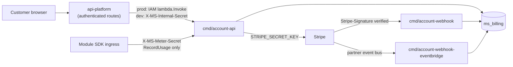

# billing-engine

The public-source billing authority for [MirrorStack](https://mirrorstack.ai).
It holds the Stripe credentials, the `ms_billing` schema, subscription and
invoice mirror state, usage metering, and the credit wallet. `api-platform`
calls it over private RPC; customers never reach it directly.

The repository is public so a customer or their developer can answer one scoped
question about real money by reading code and checking their own receipt:

> **Can this billing path collect money that was not disclosed under the accepted
> rule, was not authorized, or cannot be reproduced?**

The intended answer is no, and public source alone cannot deliver it. The limits
of the claim are in [`SECURITY.md#adversary-model`](SECURITY.md#adversary-model).

## Status, before anything else

> 🔴 **The target architecture is proposed. The code on `main` does not
> implement it.** Read [`docs/DESIGN.md`](docs/DESIGN.md) as a specification to
> build, never as a description of production.

- The most serious known structural gap is a capability leak: a nominal
  billing-status read can reach the auto-top-up executor and collect from a
  saved payment method. A component that reads must not be able to charge.
- The public health answer is the literal `{"status":"ok"}`
  (`cmd/account-api/main.go:786`). It does not name the deployed commit, so a
  customer cannot yet tie a charge to a public source revision.
- Every other current defect is enumerated in exactly one place,
  [`SECURITY.md#known-current-gaps`](SECURITY.md#known-current-gaps). No other
  file in this repository keeps a second list.

Automatic promotion is paused while this boundary is designed. No document on
this branch authorizes a rollout.

## Runtime and trust boundary

`billing-engine` is public source, not a public endpoint. Four facts define the
deployed boundary, each citable in the tree:

- In production the account API is a Lambda invoked by `api-platform` by ARN and
  gated by IAM `lambda:InvokeFunction`. It is not exposed through API Gateway
  (`cmd/account-api/main.go:11-16`, `:821-827`).
- In local development the control-plane RPC routes check `X-MS-Internal-Secret`
  (`internal/shared/auth/internal_secret.go:80`). `RecordUsage` sits behind a
  separate `X-MS-Meter-Secret` header, so the metering credential rotates on its
  own (`cmd/account-api/main.go:771-777`, `internal_secret.go:81`). Both secrets
  are fail-closed: an unset secret returns 503 (`internal_secret.go:17-46`).
- Provider events enter through separate binaries, never the RPC dispatcher.
  `cmd/account-webhook` verifies the `Stripe-Signature` header. The EventBridge
  receiver verifies no HMAC, trusting instead a partner bus only Stripe can
  publish to (`cmd/account-webhook-eventbridge/main.go:1-12`).
- Card data goes to the payment provider. It passes through neither
  `api-platform` nor this engine.



## Repository layout

```text
billing-engine/
├── cmd/
│   ├── account-api/                 internal RPC Lambda; local HTTP on :8091
│   ├── account-webhook/             Stripe HTTPS webhook receiver
│   ├── account-webhook-eventbridge/ Stripe EventBridge receiver (dual-run)
│   ├── billing-cycle/               scheduled per-period usage charge driver
│   ├── infra-egress-sync/           pulls CDN egress totals from Cloudflare
│   ├── infra-ssr-compute-sync/      pulls SSR compute totals from CloudWatch
│   └── pm-default-backfill/         one-shot Stripe default-payment-method repair
├── internal/                        domain services, adapters, sqlc-generated db
├── migrations/billing/              the database schema — see its README for apply order
├── docs/                            DESIGN.md, VERIFICATION.md
├── SECURITY.md
├── CLAUDE.md                        contributor and agent working rules
└── README.md
```

## Running the current checks

```bash
make db         # start local PostgreSQL 17 in Docker
make db-init    # apply migrations/billing/
make lint       # go vet
make build      # go build ./...
make test       # unit tests; no external calls
```

`make test-integration` needs a running local database. The verifier, fuzz,
mutation, and adapter-conformance commands described in
[`docs/VERIFICATION.md`](docs/VERIFICATION.md) will be listed here once their
scripts exist and run without production credentials.

## Documentation map

Read the status section above first. Everything under `docs/` is target design.
`docs/DESIGN.md` is the normative specification; every other file links into it
rather than restating it.

| document | owns |
|---|---|
| [`docs/DESIGN.md`](docs/DESIGN.md) | the target specification: INV-001..INV-014, the durable model, intent lifecycle, provider ports, charge vocabulary, tax, ledger, migration gate, open product decisions |
| [`docs/VERIFICATION.md`](docs/VERIFICATION.md) | evidence levels, the charge bundle contract, the offline verifier, the static architecture checks enforced against this tree |
| [`SECURITY.md`](SECURITY.md) | reporting policy, the adversary model, trust assumptions, and the one register of known current gaps |
| [`CLAUDE.md`](CLAUDE.md) | working rules for a contributor or agent editing this repository |
| [`migrations/billing/`](migrations/billing/) | the schema that exists today, plus its apply order and cutover notes |

Cross-repository references, which describe what runs today rather than the
target:

- [`mirrorstack-docs/architecture/billing-flow.md`](https://github.com/mirrorstack-ai/mirrorstack-docs/blob/main/architecture/billing-flow.md)
  documents the current end-to-end flows with their invariants, failure modes,
  and performance budgets.
- [`mirrorstack-docs/api/billing/account-api.md`](https://github.com/mirrorstack-ai/mirrorstack-docs/blob/main/api/billing/account-api.md)
  documents the current RPC surface, and
  [`mirrorstack-docs/db/ms_billing/`](https://github.com/mirrorstack-ai/mirrorstack-docs/tree/main/db/ms_billing)
  documents the schema.

If `tables.md` in mirrorstack-docs disagrees with `migrations/billing/`, the
migration wins and the doc is the bug.

## The target design, in one page

Five customer money journeys are specified in
[`docs/DESIGN.md#4-intent-lifecycle`](docs/DESIGN.md#4-intent-lifecycle). None is
a deployed guarantee.

1. Bind a card for recurring use.
2. Buy credit.
3. Auto top-up a credit wallet from a saved mandate.
4. Start or change a card-backed subscription.
5. Close a module usage period and open the new one.

Each money-moving journey must pass a single sealed intent id to one settlement
contract. The caller must not be able to supply the amount, the funding split,
the provider, the mandate, the tax result, the notice claim, or the execution
time. The engine must derive every financial field.

- **No silent charge.** Every collection must satisfy one execution predicate
  before any provider mutation. That predicate has exactly one owner:
  [`docs/DESIGN.md#executechargeintent`](docs/DESIGN.md#executechargeintent).
  Every other mention must link to that anchor instead of restating the clauses,
  so the clause list cannot drift.
- **One intent settles at most once**, across every rail, through a single
  durable settlement claim rather than per-adapter idempotency —
  [`docs/DESIGN.md#inv-008`](docs/DESIGN.md#inv-008).
- **Payment providers are adapters.** Stripe is the only rail with code today
  (`internal/shared/stripe/client.go`); NewebPay is the next planned one. An
  ambiguous provider outcome must latch `execution_unknown`, and must be
  resolved by reading the same provider, never by a second rail —
  [`docs/DESIGN.md#5-payment-providers-are-adapters`](docs/DESIGN.md#5-payment-providers-are-adapters).
- **What customers may be charged for** is a closed vocabulary —
  [`docs/DESIGN.md#8-what-customers-may-be-charged-for`](docs/DESIGN.md#8-what-customers-may-be-charged-for).
- **Tax** must resolve to one of three states. `unknown` must never become zero
  and must never be executable — [`docs/DESIGN.md#9-tax`](docs/DESIGN.md#9-tax).
- **Ledger and receipts** must be append-only, with provider observations held
  as read-only snapshots —
  [`docs/DESIGN.md#10-ledger-and-receipts`](docs/DESIGN.md#10-ledger-and-receipts).
- **Verification** covers the charge bundle a customer will recompute offline
  ([the charge bundle contract](docs/VERIFICATION.md#3-canonical-charge-bundle))
  and the architecture checks that run against this tree
  ([`docs/VERIFICATION.md#7-static-architecture-checks`](docs/VERIFICATION.md#7-static-architecture-checks)).

### Infrastructure cost and the customer line

**Target.** Internal infrastructure cost must not be a customer charge
dimension. Compute, egress, model, provider, and margin figures may support
operations and developer settlement. They must not feed the customer rater, and
they must not appear as a line whose displayed arithmetic does not reconcile.

**Present state.** Infrastructure already reaches a customer-visible line, with
a markup applied to it:

- The multiplier is `infraMarkupNum = 12` over `infraMarkupDen = 10`, so a
  reserved metric is charged at cost x 1.2
  (`internal/account/cycle/types.go:59-60`).
- The live path runs `RecordInfraUsage` (`internal/account/usage/infra.go:326`)
  into `AppInfraBill` and `AppModuleInfraBill`
  (`internal/account/usage/bill.go:509`, `:522`), served by `GetAppBill` and
  `GetAccountBill` (`cmd/account-api/main.go:690`, `:696`) behind
  `/apps/{appId}/settings/billing` and web-account `/me/billing`.
- The wire fields are `infra_total_micros`, `infra_lines`, and
  `module_infra_lines` (`internal/account/usage/types.go:438`, `:449`, `:460`).
- The x12/10 factor is applied inside the query for any `infra.*` or
  `platform.*` metric (`internal/account/db/usage.sql.go:102-104`).
- The displayed `UnitPriceMicros` is the pre-markup cost of goods, while
  `ChargedMicros` already includes the markup
  (`internal/account/usage/types.go:446-448`). Quantity multiplied by the
  displayed unit price therefore does not equal the charge shown beside it.
  That difference is undisclosed to the customer today.

The live priced catalog is `migrations/billing/019_infra_catalog_hygiene.up.sql`,
`020_p1_infra_catalog_seed.up.sql`, `045_ssr_compute_metrics.up.sql` and
`046_ssr_egress_metrics.up.sql`, plus `018_ai_model_prices.up.sql` for
`ms_billing.metric_model_prices`. Migration 017's compute alias row was removed
by `022_drop_compute_alias.up.sql`, and `019_infra_catalog_hygiene.up.sql` sets
`infra.egress.bytes` to `unit_price_micros = 0`.

## Migration and readiness

The target engine must run in shadow first: derive intents without notice and
without money movement, compare every line against the current result, and
investigate every difference. Callers must migrate first. Direct provider routes
and credentials must be removed last, after in-flight legacy attempts drain or
are quarantined. Legacy rows must never receive fabricated consent, tax, notice,
or policy evidence.

The conditions that must all hold before production intent execution is enabled
are listed in
[`docs/DESIGN.md#11-migration-and-readiness-gate`](docs/DESIGN.md#11-migration-and-readiness-gate).
The product decisions still open — notice lead time, standing ceilings,
merchant-of-record, jurisdictions, and price-change notice — are listed in
[`docs/DESIGN.md#12-open-product-decisions`](docs/DESIGN.md#12-open-product-decisions).

## Security

See [`SECURITY.md`](SECURITY.md). Do not put credentials, real customer data,
tax ids, payment methods, or production provider payloads into an issue, a test
fixture, or a commit. A public sentence in this repository that overstates what
the code does is itself a defect worth reporting, because the purpose of the
repository is customer verification.

## License

[FSL-1.1-ALv2](LICENSE) — converts to Apache 2.0 two years after release.
