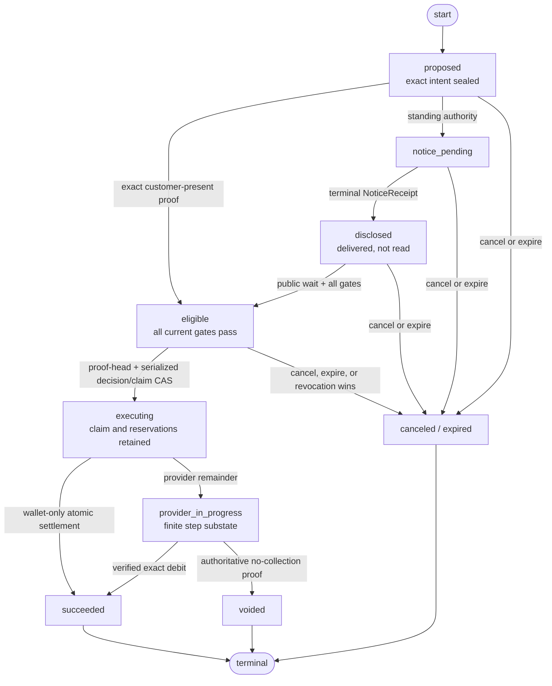
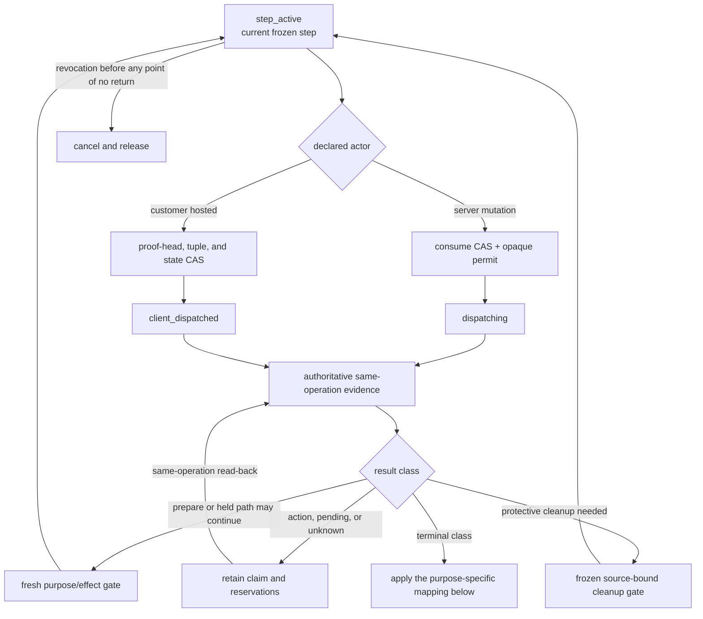
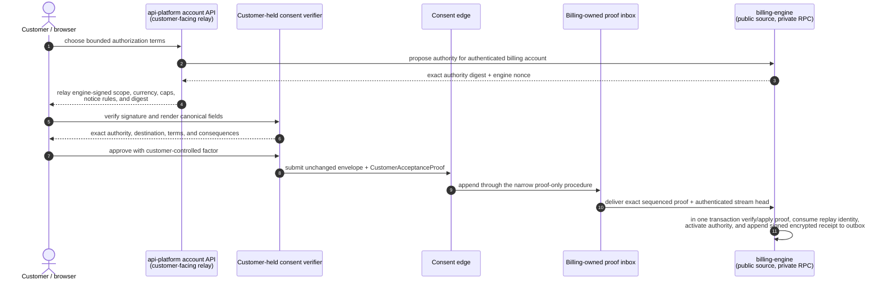
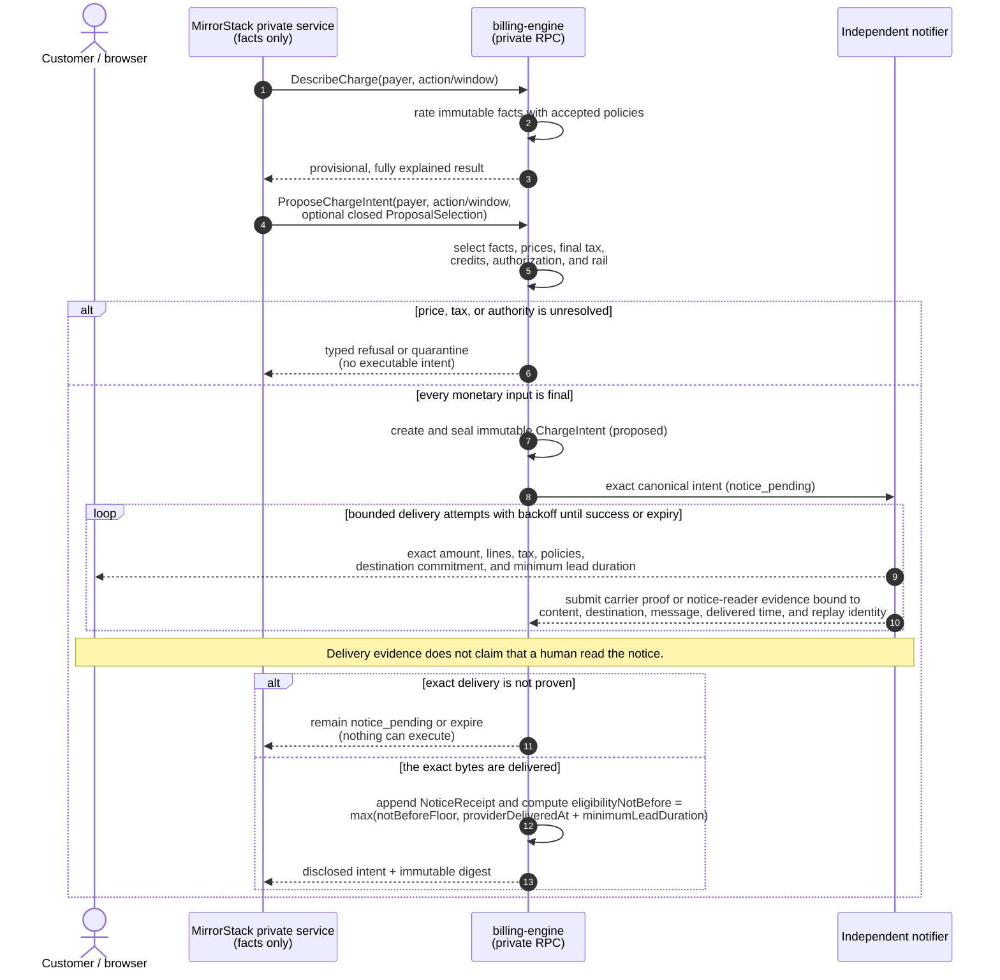
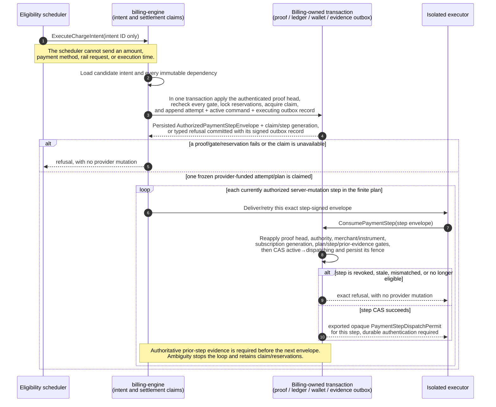
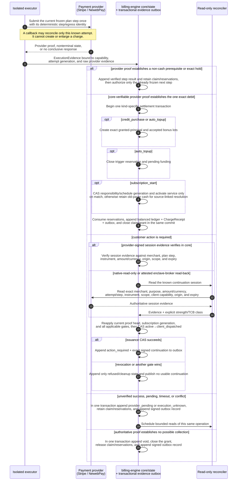
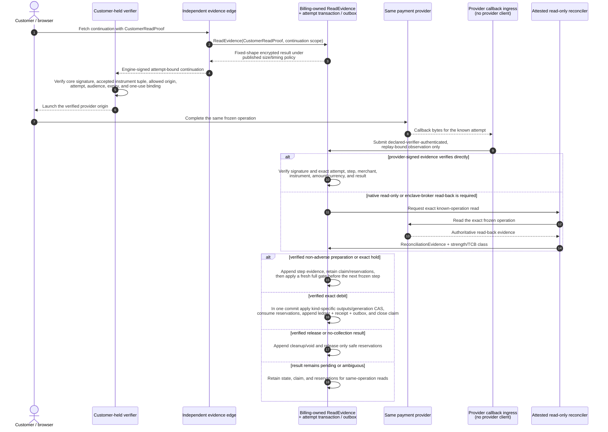
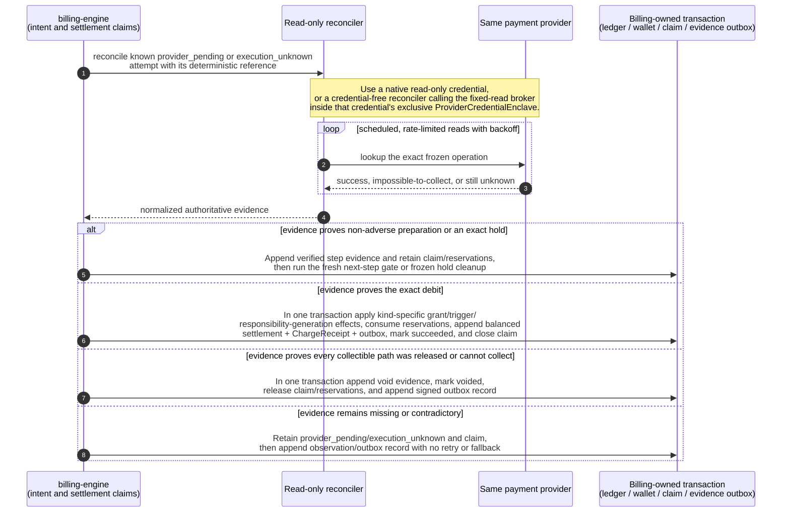
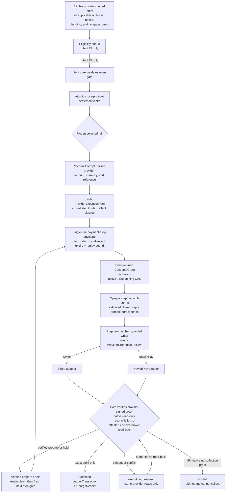

# The intent-only billing engine

The target shape of `billing-engine`: MirrorStack's private services report
facts and ask for a billing outcome, but they cannot name an amount, construct an
invoice line, select a tax result, claim that notice was delivered, or cause a
payment-provider mutation directly.

> **Status: proposed, not implemented, not deployed.**
>
> The current `main` branch contains several direct Stripe-writing paths. It has
> strong idempotency and recovery controls, but it does not have the immutable
> customer-visible intent, notice, authorization, and isolated execution boundary
> defined here. Until every legacy money-moving path is removed and
> `Capabilities` reports `legacyMoneyPaths: 0`, this repository must not claim
> that production billing is intent-only.
>
> Automatic merging and promotion of billing-engine changes are paused while
> this design is under review. This document describes the destination, not
> permission to charge under unfinished rules.

The question this repository must let a customer's developers settle is:

> **Can the attested, conforming billing-engine path collect money for an amount,
> reason, tax treatment, or price revision that was not disclosed under the
> accepted rule and authorized?**

The desired answer is no under the stated trusted-computing-base assumptions,
and each part must be reproducible from public code and independently available
customer evidence. This design cannot prevent a malicious/replaced executor or
another holder of an unrestricted merchant credential from charging out of band;
attestation, credential isolation, provider logs, and reconciliation make that
bypass constrained or detectable, not impossible.

---

## 1. Why reliable charging is not enough

The current engine already protects many operational invariants: integer money,
usage-event idempotency, frozen charge amounts, deterministic provider keys, and
reconciliation after ambiguous failures. Those controls answer:

> If the system decided to charge $N, can a crash accidentally charge $N twice?

They do not answer:

> Why was $N permitted, which accepted terms produced it, was the exact total
> disclosed before collection, and can the customer recompute it?

A billing run created immediately before a provider request is an execution
record, not customer intent. A mutable draft invoice hidden from the customer is
not notice. A post-charge "large amount" badge is not a pre-charge control. An
alert-only budget is not a stop.

This rebuild therefore separates five facts that are currently too close
together:

1. what happened (`UsageFact`),
2. what rules apply (`PriceBookRevision` and `TaxDetermination`),
3. what the customer authorized (`BillingAuthorization`),
4. what exact monetary effect is proposed (`ChargeIntent`), and
5. what an external rail actually did (`PaymentAttempt` and `ChargeReceipt`).

No one record substitutes for another.

---

## 2. The invariants

These are normative. A route, adapter, migration, or operator tool that violates
one is an architecture change, not an implementation detail.

### INV-001: the private caller cannot make money authoritative

Usage ingress may carry a payer or app subject, a declared meter, a module and
module version, an exact quantity/value, an occurrence time, and an idempotency
key. It may not carry `amount`, `price`, `rate`, `currency`, `subtotal`, `tax`,
`discount`, `credit`, `total`, `invoiceLine`, `paymentMethod`, `provider`,
`executeAt`, or notice/authorization status.

Customer product routes are a separate proposal surface. `api-platform` may relay
one closed, non-authoritative `ProposalSelection`: an engine-signed catalog or
template revision, an offer/template id, and only the bounded customer-choice
fields that template declares. A variable top-up or credit amount is permitted
only as such a bounded choice; it is not a charge amount. The core verifies the
template signature/range, derives currency, lines, tax, funding, provider and
method eligibility itself, returns an engine-signed exact proposal, and treats
nothing as authorized until the independent proof ceremony binds that exact
proposal. Free-form derived money fields, mutable catalog objects, and a private
caller's approval statement are rejected.

The closed request vocabulary is enforced by source/reflection tests. A new
field is rejected by default until its authority and consequence are documented.

### INV-002: one derivation powers preview and settlement

`DescribeCharge`, `ProposeChargeIntent`, invoice presentation, ledger posting,
and the offline verifier use the same pure rating model and canonical encoding.
There is no frontend formula and no alternate provider formula.

### INV-003: a sealed intent never changes

Once an exact `ChargeIntent` is sealed, none of its source references, lines,
policy versions, tax result, currency, rounding result, payer, authorization,
notice policy, execution window, or total may be updated. A one-unit change
creates a new intent, supersedes the old one, and repeats every required notice
and authorization check.

### INV-004: unknown derivation or eligibility input cannot dispatch an effect

Missing or conflicting usage provenance, price policy, module manifest,
authorization, tax, notification evidence, payment-rail capability, or build
identity quarantines the intent. It never silently becomes zero, uses a mutable
fallback, guesses a jurisdiction, or calls a provider with a partial total.

### INV-005: no collection before exact notice

Automatic collection requires durable evidence that the exact sealed intent was
delivered under its notice policy and that
`NoticeReceipt.eligibilityNotBefore` has passed.
Notification failure is a failed control and blocks execution.

Delivery evidence proves that the carrier reported the configured destination in
a terminal status that the accepted notice policy defines as
destination-delivered. Queue acceptance or submission is insufficient. This does
not prove that a human read the message, and no document or UI may claim
otherwise.

### INV-006: every debit has customer authority

Every debit references a valid `BillingAuthorization`. The authorization is
either one-time, for one exact intent, or standing, with bounded charge kinds,
currencies, cadence, price/terms revisions, per-charge and per-cycle ceilings,
notice rules, effective time, and expiry.

A private service credential cannot create, accept, widen, or revive an
authorization by assertion. `api-platform` may relay the signed disclosure,
but acceptance and revocation enter through the separate proof-only consent
edge and append-only inbox. The engine activates authority only after independently
verifying a `CustomerAcceptanceProof` that binds the payer, account, engine
audience, exact displayed digest, nonce, expiry, and replay identity to a factor
the private caller cannot mint.

### INV-007: each mutation-capable credential has one exclusive enclave owner

`ProviderCredentialEnclave` is a logical role with one exclusive enclave owner
per actual mutation-credential scope. The engine prefers separate provider ×
environment × merchant-account × capability credentials, but it cannot claim a
narrower boundary than the provider actually enforces. Any credential spanning
multiple merchant accounts or capabilities publishes that exact scope and blast
radius; readiness fails when the accepted merchant policy forbids it. This is not
one global process or vault containing every rail's secrets. Inside an instance,
only purpose-matched guarded writers may set up a mandate, collect, finalize,
void, or refund, and each writer requires the matching consumed dispatch permit.
If a provider offers a genuinely read-only credential, a reader outside the
enclave may hold it. If it does not, a fixed-read broker must run inside the same
attested enclave and expose only operation-bound read procedures; no separate
service owns a duplicate broad credential for that scope.

Callback authentication follows the same actual credential boundary. Each adapter
declares `CallbackAuthCredentialClass` as `public_key`,
`dedicated_verification_only`, or `shared_mutation_scope`, with exact provider-
enforced scope and attested workload owner. Public ingress may hold only the first
two classes. If callback MAC/decryption requires a secret that can also mutate the
merchant account, ingress accepts only strictly bounded raw bytes/required headers
and forwards them to a fixed `VerifyCallback` procedure inside the same exclusive
`ProviderCredentialEnclave`; that procedure returns a typed, replay-bound
observation and exposes no provider read/write method. The public workload never
receives the secret. Unknown scope, duplicate ownership, unbounded parsing, or a
provider that cannot support either path makes callbacks `unsupported` and keeps
dependent automatic flows not ready.

The eligibility core accepts an intent identifier, reloads sealed state, and
evaluates every execution precondition. Only then may it persist a single-use,
audience-bound authorized provider operation. Setup, payment, mandate revocation,
void, and refund
use purpose-signed, non-coercible capability types with different predicates and
bounds. The enclave accepts only successfully consumed permits, never an ordinary
intent request or caller-supplied amount. Compromise of the enclave together with
its broad credential remains an explicit trusted-computing-base limit.

### INV-008: one intent can settle at most once across all providers

An intent has no provider attempt when wallet-only, otherwise exactly one frozen
semantic `PaymentAttempt` and finite `ProviderExecutionPlan`. The plan may contain
one or more uniquely fenced step operations; no operation outside it is allowed.
A second attempt or rail requires a
linked replacement intent with new funding, digest, disclosure, and eligibility.
A durable cross-provider settlement claim, reordered callbacks, retries, or an
ambiguous timeout cannot produce a second settlement.

### INV-009: provider callbacks reconcile; they never originate money

A webhook, return URL, or server callback must match a known `PaymentAttempt`,
intent, provider/merchant account, currency, exact amount, and either (a) an
authoritative provider payer identity or (b) an authenticated deterministic
operation reference that uniquely binds to the frozen local payer/attempt. The
adapter declares which payer-correlation evidence it supports. The callback may
confirm or refute only that known attempt; it cannot create an intent, enlarge an
amount, choose a new payer, or insert a customer charge line.

### INV-010: infrastructure is not a customer charge dimension

Internal infrastructure cost may be measured for operations, publisher
settlement, or margin analysis, but it is outside the customer rating boundary.
The customer charge vocabulary contains no `infrastructure` line and no hidden
infrastructure multiplier. Platform costs must be recovered through a published
base or module price already covered by the customer's terms.

### INV-011: settled history is append-only

Late usage, pricing mistakes, tax corrections, disputes, refunds, and goodwill
credits never rewrite a settled intent or ledger entry. They produce a new,
linked adjustment, credit, reversal, or refund record with its own reason and
receipt.

### INV-012: source and policy identity are externally visible

Each intent and receipt names the engine Git commit, built artifact digest,
canonical schema version, terms revision, price-book digest, tax-policy digest,
and payment-adapter version. The private `Health` and `Capabilities` actions
produce engine-signed running identity. The independent evidence edge is the
canonical customer path; `api-platform` may relay the unchanged bytes as a
convenience but cannot replace them with a bare `ok` claim.

### INV-013: proof ordering and execution claim are one serialization boundary

The consent edge appends customer-signed commands to one billing-owned, gap-free,
monotonic stream per payer. An edge acceptance is returned only after durable
sequence assignment. Both claim acquisition and provider-dispatch capability
consumption lock the same stream, verify its authenticated head, and consume
every sequence through that head. A stale, missing, gapped, or unverifiable head
fails closed. A revocation accepted before the capability changes from `active`
to `dispatching` therefore revokes it and wins; one serialized after that CAS
receives the exact already-dispatching cutoff. Wall-clock arrival order is not
authority.

### INV-014: customer evidence does not depend on the private relay

Every sealed intent, proof result, notice/eligibility result, refusal,
nonterminal attempt state, settlement, revocation, and correction commits a
signed, customer-encrypted evidence record through a billing-owned transactional
outbox. The independent evidence edge can serve but cannot create or mutate those
records. Reads require a payer-bound `CustomerReadProof`; an `api-platform`
identity assertion or possession of an object id is insufficient.

---

## 3. The durable model

### `UsageFact`

An immutable observation from an allowed producer. A fact contains no money.

Required identity includes:

- globally unique event id,
- producer and producer schema version,
- payer/account subject and app subject,
- module id and immutable module version where applicable,
- declared meter id and kind,
- exact integer/decimal quantity in the meter's declared scale,
- occurrence and ingestion times, and
- provenance needed to detect replay or cross-tenant substitution.

Producer-supplied occurrence time is not service-authority time by assertion. The
safe default is the billing-owned sequenced admission time. An earlier occurrence
time may be used only with independently verifiable source-clock evidence, a
published bounded-lateness rule, an authenticated closed-window high-watermark,
and proof the event was generated before the authority/revocation cutoff. A
post-revocation or post-close fact carrying an older bare timestamp is quarantined
and nonbillable. The admission transaction races revocation and window close on
the same authority/checkpoint rows; private producers cannot backdate into a
superseded authorization.

Corrections are new facts that reference the original. Deletion is not a billing
correction mechanism.

### `PriceBookRevision`

An immutable, content-addressed set of customer prices with a publication time,
future effective window, currency, rounding rules, and terms revision. A module
price is bound to an immutable module billing-manifest version. A later publish
cannot alter a rate that already accrued under an earlier revision.

There is no mutable "current price" fallback in rating. If a fact cannot resolve
one exact effective revision, rating stops.

Price books and module billing manifests are canonical typed declarative data,
never executable plugins or arbitrary scripts. Publication enforces versioned
limits for artifact bytes, metrics per manifest, tiers/brackets, expression nodes/
depth, aggregation-window fan-out, input/output bytes, evaluation fuel, and memory;
the language has no I/O, clock, randomness, recursion, dynamic imports, or
unbounded iteration. Core and offline verifier use the identical interpreter and
limits. Max+1, unknown operators, or resource exhaustion refuses publication or
quarantines evaluation with no debt. These are per-artifact/evaluation bounds, not
a small global module-count limit: installed modules are addressed by indexed
module-version/meter keys, and period aggregation/sealing proceeds in bounded
chunks under the existing source/intent limits.

### `TaxDetermination`

A versioned result with one of three semantic states:

- `final`: an amount and the evidence/rule that produced it,
- `not_applicable`: an explicit reason tax does not apply, or
- `unknown`: insufficient or unavailable evidence.

`final` may legitimately contain a zero amount. `unknown` is not zero and an
intent carrying it is never executable. An executable result also commits the
customer-factor-bound `TaxProfileReceipt`, any required issuer validation,
content-addressed public rule artifact, deterministic calculation/verifier
revision, committed input root, and
`verificationClass: independently_reproducible`. A proprietary/provider-attested
number is `unknown(unsupported_verification)`. See [`TAX.md`](TAX.md).

### `MerchantOfRecordBinding`

The model separates the identity that creates the legal/tax obligation from the
route that later settles it, then joins them explicitly:

- `CommercialIdentityBinding` contains the legal seller/billing entity, tax-
  registration set and market, customer currency, and revision. Price, source
  allocation, wallet compatibility, and `TaxDetermination` bind this identity.
- `SettlementRouteBinding` is either canonical `core_wallet` settlement with
  provider fields absent, or one exact provider, merchant account, rail,
  environment, and route revision.
- `MerchantOfRecordBinding` is the intent-local pair of those bindings plus the
  compatibility-policy digest proving that the selected route may settle for the
  selected commercial identity.

This split removes a circular dependency. The engine first selects one exact
accepted `CommercialIdentityBinding`, resolves final tax, and obtains the tax-
inclusive `grossObligation`. It then allocates compatible wallet value. A zero
provider remainder selects the canonical `core_wallet` route; a nonzero remainder
selects one accepted provider route and instrument under the published routing
tie-break. Only then does the engine form and seal the exact composite
`MerchantOfRecordBinding`. Settlement-route selection cannot change price, tax,
or gross obligation. A tax rule that depends on provider, merchant account, or
rail is unsupported in this closed target and returns
`unknown(unsupported_settlement_sensitive_tax)` rather than entering a fixed-
point guess. `collect_receivable` preserves its source `CommercialIdentityBinding`
and tax while selecting a newly authorized compatible route; it never re-rates or
re-taxes the source.

A `BillingAuthorization` binds a canonical content-addressed
`MerchantBindingSet` plus routing constraints. The set stores unique, canonically
ordered commercial identities, settlement routes, and allowed compatibility
edges. It publishes `maxMerchantBindingSetBytes`, `maxMerchantBindings`,
`maxMerchantMembershipProofBytes`, `maxMerchantProofDepth`, and
`maxMerchantProofHashOps`. Selection carries one indexed/Merkle membership and
compatibility proof, never a scan of the entire set. Core and offline verifier
apply identical limits and canonical ordering. A duplicate, ambiguous, max+1, or
over-depth set/proof refuses publication or authority; it is never truncated.

The exact composite binding or its digest appears in `ChargeIntent`,
`NoticeReceipt`, `PaymentAttempt`, customer-action continuation, provider
evidence, ledger transaction, and receipt bundle. `TaxDetermination` instead
contains the exact commercial identity and accepted merchant-set/compatibility-
policy digests, which the final composite must match. Payment-method setup binds
the canonical `ProviderMerchantSetupBinding`—provider, environment, legal entity,
merchant account, and reusable scope—before later route selection. A provider or
routing policy cannot substitute merchant account B for seller A, even when
amount, currency, and payer still match. Authorization evaluation proves bounded
set membership; seal, grant consumption, continuation signing, provider
reconciliation, and offline verification require exact composite equality from
the sealed intent onward.

### `BillingAuthorization`

Customer authority to create monetary effects. The authorization binds:

- payer identity and billing entity,
- `one_time` or `standing` kind,
- permitted customer charge kinds,
- permitted currencies and payment rails,
- permitted closed provider-step effect classes and, if `funds_hold` is allowed,
  per-hold and aggregate concurrent-hold amount, duration, count (target default:
  one unreleased hold per charge plan), plus required frozen release/void semantics,
- content-addressed `MerchantBindingSet`, bounded membership/compatibility-proof
  limits, and routing constraints,
- customer-selected funding mode, eligible wallet/credit policy, and whether an
  external remainder is allowed;
- terms, price-book, and tax-policy revisions or accepted change policies,
- exact customer-factor-bound tax-profile receipt revision/digest,
- separate gross-obligation, wallet-application, external-provider-remainder,
  per-charge, and per-cycle ceilings,
- cadence and notice policy,
- mandatory `ProviderAutonomyPolicy = no_autonomous_future_debit` and the
  provider-object disable/cancel/read-back capability that enforces it,
- accepted provider evidence-strength class and exact credential/enclave scope;
  a change from native signed/read-only proof to a broader shared-TCB path is a
  new authority revision, not an adapter implementation detail,
- engine-owned billing-channel enrollment revision and destination commitment,
- effective time, expiry, and revocation semantics,
- when a provider remainder may be nonzero, an exact
  `PaymentInstrumentBinding`: either (a) immutable saved-method setup
  receipt/digest, provider-verified readable identity (provider/entity, brand or
  type, masked suffix, expiry where applicable, mandate scope), and opaque
  reference; or (b) customer-present one-time-session policy bound to provider,
  merchant, exact intent, deterministic operation identity, allowed origins,
  continuation schema/policy, expiry, and no reusable scope; and
- the digest of the disclosure accepted by the customer.

Each authorization also has an `AuthorizationScopeKey`, lineage revision, and
predecessor digest. The scope key separates intentionally independent authority
families—for example SaaS service/collection, auto top-up, and a bounded
receivable-collection family—while grouping revisions that must not coexist.
The payer proof-stream transaction activates revision N and terminally
supersedes N-1 atomically. Claim and consume accept only the current lineage
head; every still-`active` grant from an older revision is revoked and released
in that transaction, while `dispatching`/ambiguous work remains fenced and
visible.

Exposure rows are keyed by authorization scope/window, not merely revision id,
so replacing a cap or saved method cannot reset already settled or reserved
exposure. Activation migrates no money: it carries the same settled/active
scope totals forward. If a lower ceiling is already exceeded, the new revision
may revoke future execution but cannot create capacity until exposure falls
within the accepted bound. Raising a ceiling or replacing a method requires the
new exact ceremony and never lets old and new revisions spend concurrently.

Service/accrual authority and collection authority are separately evaluated even
when carried by one authorization record. Every service fact/line must reference
the authorization revision that permitted that service and obligation at its
service time. Later revocation stops future accrual under the accepted service
policy but does not erase an already accrued receivable. Wallet consumption or
external collection additionally requires collection authority to be current and
unrevoked in the settlement/consume transaction. A line with no effective
service/accrual authority is quarantined rather than turned into customer debt.

### `SubscriptionOffer` and `SubscriptionScheduleReceipt`

A MirrorStack SaaS subscription is a billing-domain schedule, never a provider-
native subscription. The immutable engine-signed `SubscriptionOffer` binds payer,
app/product and plan revision, exact `CommercialIdentityBinding`, accepted
settlement-route policy/instrument constraints, currency and funding mode,
cadence/time zone/period anchor, first-period boundaries and proration, base and
usage recognition rules, first-charge treatment, renewal proposal window,
cancellation cutoff, accepted change policy, service/accrual and collection
authority scopes/ceilings, expiry, and offer digest. The customer verifier renders
and signs that exact offer and its matching `BillingAuthorization`.

Target policy is settlement-gated activation. Accepting the offer records a
`pending_first_settlement` schedule and may activate collection authority for the
exact first intent, but creates no billable service window and grants no service-
accrual authority. The exact first `subscription_start` settlement transaction
locks and compare-and-swaps the same accepted responsibility and schedule
generations. Only on a match does it atomically write
`SubscriptionScheduleReceipt(status=active)`, open the accepted first service
window/anchor, and enable only the bound service authority. A
funding refusal, cancellation, revocation, pending provider result, or crash leaves
the schedule pending and cannot admit billable usage. Later period schedulers name
only the schedule/period id; the core derives boundaries from the receipt. A
schedule change or re-anchor creates a replacement offer/proof and cannot rewrite
an opened period. Provider subscriptions, auto-advance, and provider renewal
schedules remain disabled.

### `BillingResponsibilityTransfer`

Changing an app/account's paying user or organization is a typed cutoff, never a
field update. `BillingResponsibilityTransfer` binds old/new payer and legal entity,
app/account, exact effective cutoff, and independent authority from both sides,
plus schedule/source/exposure/receivable treatment and digest. No generic operator
or legal-override field may substitute either proof in this target. A future
involuntary transfer would require its own public threat model, authority type,
appeal/cooling process, and receipt before it becomes supported. The cutoff seals the old service window
and starts a new canonical allocation namespace/window; facts cannot be backdated
across it. Already accrued obligations/receivables always remain with the old
payer. Liability/receivable reassignment is unsupported in this closed target; it
would require a separately designed charge effect and cannot be represented by a
responsibility transfer.

Activation atomically revokes old-payer active pre-adverse grants and future
service authority. An old pending-first-settlement intent/plan that has not reached
an adverse or customer-collectible point is canceled with its pending schedule.
Old `dispatching`, `hold_active`, `client_dispatched`, or ambiguous work remains
fenced to the old payer through settlement or frozen cleanup and cannot be
recreated for the new payer. If such an old first charge settles after the cutoff,
it remains truthful old-payer cash evidence but fails the responsibility/schedule
activation CAS: it opens no post-cutoff service and enters a source-linked refund,
old-payer credit, or explicit manual-resolution policy. Mandates, wallet lots, tax
profiles, notice destinations, and authorizations never transfer implicitly; the
new payer completes its own setup/authority/notice ceremony. Source allocation
lineage and settled history remain append-only. `BillingResponsibilityTransferReceipt`
binds the common transfer commitment, both audience-specific proofs/cutoffs,
partitioned source/exposure state, retained old claims, new schedule/authority
state, `BillingDecisionProof`, and two separately encrypted outbox views.

The private `ProposeBillingResponsibilityTransfer` action may name only the
app/account, old and new payer identifiers, and one closed transfer-policy
selection. It rejects identical payer ids and requires the old payer to equal the
current responsibility-generation owner. The engine derives a future cutoff,
proof deadline, activation deadline, and the closed activation-failure
disposition: old administrative responsibility remains, the blocked interval is
never billable, and service stays stopped until the old payer accepts fresh
service/collection authority bound to the failure receipt or a new transfer
activates. It signs a common canonical core containing the identities, account,
cutoff/deadlines, non-transfer semantics, exact failure disposition, and hiding
commitments to payer-private state, plus two audience-specific disclosure
digests. A private caller cannot choose a hidden consequence, supply either
payer's approval, or turn an existing session/IAM assertion into proof.

The old and new payer import their own engine-signed view into separate customer-
held verifiers. The old-payer view may open that payer's retained obligations,
claims, and canceled state. The new-payer view shows the shared cutoff and non-
transfer consequences plus only opaque commitments to old-payer financial state;
it exposes no old amount, provider/mandate reference, tax/payment detail, or claim
state. Each verifier independently renders its view and signs a distinct
`CustomerAcceptanceProof` over the common transfer digest, exact cutoff/deadlines
and failure disposition, its audience, and its audience-specific disclosure
digest. Both rendered views show that disposition. The proof-only edge
appends each proof to its own payer stream; neither proof or disclosure can be
copied into, or substitute for, the other stream.

`ApplyBillingResponsibilityTransfer(transferID)` accepts no proof bytes. Its one
serializable transaction locks the two payer proof heads in canonical payer-id
order, bounded-applies each stream through its authenticated current head, and
requires `appliedHead == currentHead` for both. It then verifies two distinct,
factor-bound, unrevoked proofs over the same common digest/cutoff and their exact
audience views; rechecks that the old payer still owns the current responsibility
generation; and locks the responsibility/schedule/source/exposure generations.
The activation CAS may commit only when the trusted time uncertainty interval is
wholly at or after the accepted cutoff and not beyond the activation deadline.
It atomically writes the new responsibility generation, source partitions,
`BillingDecisionProof`, and two payer-encrypted receipt/outbox records sharing one
transaction/transfer commitment.

The proof deadline is before the cutoff. If both proofs are not engine-effective
by that deadline, the transfer expires before becoming due and old responsibility
remains unchanged. Once both proofs are effective, the scheduled transfer becomes
an admission barrier at the cutoff. Usage admission and period seal lock the same
due-transfer generation: before the cutoff they may admit only old-payer windows
ending no later than it; at or after the cutoff they admit neither old nor new
facts until the activation CAS resolves. After activation, facts are never
repartitioned: old-side facts at/after the cutoff remain refused/quarantined, and
new-side facts require the new payer's independently active service authority. If
the worker misses the activation deadline, the transfer becomes
`activation_failed` and old administrative responsibility remains, but billable
admission stays stopped. It resumes only after the old payer accepts fresh
service/collection authority bound to the failure receipt or a new future-cutoff
transfer activates. The blocked interval is never backdated into debt.

An early clock interval, gap, backlog, stale/revoked factor, mismatched digest/
cutoff/view, lock-budget exhaustion, or generation race requeues or refuses the
whole transition with no partial effect. This action is the only transfer apply
path; ordinary private RPC credentials cannot assert either proof or bypass either
payer stream.

The engine stores provider references as opaque, provider-scoped identifiers.
For saved methods, the independent consent verifier renders the method identity
and setup-receipt binding before acceptance. For a customer-present one-time
instrument, it renders provider/entity, merchant, one-time/no-reuse scope and
allowed origins plus deterministic operation/continuation policy before
acceptance. After dispatch creates the session, the core signs the actual
continuation bound to that accepted tuple and frozen attempt; the verifier checks
it before card entry. An opaque provider reference alone is not
informed consent and cannot be substituted, even with another method owned by
the same payer. Provider secrets and reusable payment credentials never enter a
public receipt.

The core signs that actual continuation only after core-verifiable provider-signed
session evidence or the credential-separated attested read-back path verifies the
provider account/merchant, setup-versus-debit purpose, amount/currency when
applicable, intent/setup/attempt/operation, one-use/no-reuse or mandate scope,
client capability, allowed origin, and expiry. An executor/adapter assertion is
not sufficient even when it repeats the accepted tuple. A rail that exposes no
such evidence cannot offer this customer-present continuation flow.

A stable opaque token is not assumed to preserve method identity. Before an
unattended dispatch, the adapter must either attest that the mandate/reference
identity is immutable or use a credential-enforced authoritative read to compare
provider, entity/merchant, mandate scope, brand/type, masked suffix, expiry, and
provider revision with the accepted setup receipt. Any security-relevant change
revokes/refuses an `active` grant and requires a new setup receipt,
authorization, intent, disclosure, and proof. A narrowly disclosed updater policy
may cover only enumerated non-material changes and still produces a signed update
receipt; an adapter that supports neither immutable identity nor safe read-back
cannot advertise unattended saved-method readiness.

The resulting `PaymentMethodSetupReceipt` is a historical verification bundle.
It binds the exact engine-effective `CustomerAcceptanceReceipt` and underlying
customer-proof commitment, accepted setup digest, payer proof-stream sequence,
head/cutoff, enrolled-factor and verifier-release revisions, and revocation state
at setup dispatch and again at terminal setup completion. Completion reapplies the
current proof head; if revocation won, the engine refuses a usable saved-method
receipt, retains cleanup state, and revokes/releases the provider mandate through
the frozen plan. It also binds the setup envelope and grant-consume receipt,
`SetupStepDispatchPermit`
identity, setup-executor artifact/workload attestation and provider-credential
identity, transparency checkpoint, and adapter artifact/version. It then binds
either directly core-verifiable provider-signed setup/session/mandate evidence or,
when read-back is required, the exact trusted session/mandate-reader artifact,
workload, credential/enclave-scope attestation, and normalized provider evidence,
plus the readable method identity/scope. Current `Health` cannot replace
these per-setup bindings. Unknown, substituted, revoked, expired, or wrong-role
artifacts block setup completion and any later standing authority that references
the receipt.

Mandate removal is a separate non-coercible operation, not payment `void`. A
customer-signed `MandateRevocation` binds the setup receipt/digest, readable
method identity, provider/entity/merchant, reason, proof-stream cutoff, and exact
purpose-typed `ProviderExecutionPlan`. Applying it first terminally revokes every
standing authorization lineage and still-`active` grant that references the
method. That engine cutoff is immediate even if provider detach remains pending.
Only then may the core persist the next
`AuthorizedMandateRevokeStepEnvelope`; its consume returns a
`MandateRevokeStepDispatchPermit` for exactly one guarded revoke-plan step.

Provider-signed or trusted read-back evidence produces a
`MandateRevocationReceipt` with separate `engineRevokedAt` and provider status.
Pending/unknown provider revocation never re-enables the method. If the provider
cannot revoke by a safely bounded server operation, the engine still blocks its
own future use and discloses a verified provider-hosted removal path or the fact
that external mandate retention is unsupported. A browser return cannot claim
provider revocation.

Revocation blocks future intents and any waiting intent whose authority no
longer validates. It does not erase an already-settled obligation; the UI must
state the exact cutoff.

### `CustomerProofStream`

The public consent/revocation edge has only an append procedure into
billing-owned storage. Each candidate envelope contains the payer/account,
purpose, exact object/digest, enrolled-factor revision, engine audience, nonce,
expiry, replay identity, prior sequence/head commitment, and customer signature.
Before assigning a sequence, the billing-owned procedure verifies the engine
envelope/signature, schema and strict size bounds, enrolled-factor signature,
nonce/replay uniqueness, payer binding, expiry, and prior-head rule. Invalid or
duplicate candidates consume no sequence and cannot jam the stream. The append
then assigns the next gap-free sequence and returns a signed
`EdgeAcceptanceReceipt` only after durability. The receipt proves ordering, not
that the engine has applied the command; the core independently re-verifies it
before effect.

The core tracks a per-payer applied high-watermark and advances it incrementally
with a priority proof worker. It never rescans from sequence 1. Every obligation-
creating usage/base-window admission, claim acquisition, and capability consumption
locks the same authoritative stream-head row and may
apply only the bounded remainder allowed by the published
`maxProofApplyBatch`/transaction-time budget. They proceed only when
`appliedHead == currentHead`; if a gap, stale/unverifiable head, or larger backlog
remains, they fail closed and requeue proof application without admitting a
billable fact/window, reserving service exposure, acquiring a claim, or performing
a dispatch CAS. Once caught up, the same admission transaction re-evaluates
service authority/revocation/window state before reserving exposure; the claim
transaction re-evaluates
authorization/revocation, then acquires the claim and creates an `active`
capability. Before provider dispatch, the capability-consume transaction repeats
the same bounded head/apply check and races revocation on the same state row. If
revocation wins before any adverse or customer-collectible step, it atomically
marks the capability `revoked`, cancels the pre-dispatch attempt/intent, and
releases claim/reservations. If an earlier hold or customer-collectible
continuation already exists, revocation instead blocks the next debit/capture and
retains the claim through the frozen release/cancel/read-back cleanup. If the
dispatch or collectible-issuance CAS wins,
the engine-effective revocation receipt names that cutoff and never claims a
successful cancellation. The edge cannot mint customer proof, skip a sequence
without detection, or report a command effective merely because it accepted it.

### `AuthorityEvidence`

Every payment-method setup or customer debit/collection bundle carries a tagged,
mutually exclusive authority branch rather than an unconditional notice field.
Refund/correction/dispute authority uses its separately typed source-linked
policy and is not coerced into these tags:

- `setup_customer_present` binds the exact setup acceptance/proof,
  `ProviderMerchantSetupBinding`, payer sequence/head/cutoff, factor/verifier
  revision, nonce/expiry/replay, and dispatch-time revocation state. It explicitly
  contains no debit `BillingAuthorization`;
- `debit_customer_present` binds the exact engine-effective
  `CustomerAcceptanceReceipt`, underlying customer-proof commitment, accepted
  intent/digest, exact current `BillingAuthorization` (one-time or standing) and evaluated
  scope/caps/instrument/lineage revision, payer stream sequence/head/cutoff,
  factor and verifier-release revisions, nonce/expiry/replay identity, and
  dispatch-time authority/revocation check; or
- `standing_automatic` binds the current `BillingAuthorization` lineage head and
  its engine-effective acceptance receipt/proof with the same proof-stream and
  factor fields, plus the exact terminal `NoticeReceipt`, completed public wait,
  fresh `RevocationPathReadinessReceipt`, and evaluation that the selected plan's
  effect classes/hold bounds fit the accepted authority.

A setup receipt always uses `setup_customer_present`, which cannot verify as debit
authority. A one-time credit purchase, subscription first charge, or
manual collection does not fabricate a notice. An automatic charge cannot
substitute fresh exact-intent proof for an unrelated authorization scope, or vice
versa.
The grant-consume/ledger receipt records the selected tag and exact gate evidence,
so offline verification can establish why execution was allowed.

### `BillingDecisionProof`

A standalone bundle cannot prove that the engine omitted no competing claim,
reservation, wallet spend, or authorization revision merely by listing the rows
it chose. Real-time exclusion therefore remains inside the explicitly trusted
billing state boundary: serializable transactions, row/range locks, unique
constraints, generation CAS, and the payer proof-head lock cover authorization
lineage/exposure windows, wallet lots, settlement/step claims, trigger epochs,
source/receivable/refund capacity, and the transactional evidence outbox. No
external witness is placed in the synchronous payment path.

`BillingDecisionProof` is the signed transition evidence emitted by that trusted
transaction. Its versioned closed schema binds the exact derived key set and
predicate, before/after row versions and commitments, authenticated proof head,
transaction/claim generations, build and policy identities, commit timestamp,
and matching outbox record. The public verifier can detect omitted required
fields, changed inputs, arithmetic errors, stale generations within the supplied
chain, or receipt substitution. It cannot independently prove that a compromised
core/database hid a competing row or alternate history. Reports therefore expose
`state_assurance: attested` and never describe this evidence as global
non-omission proof.

After commit, opaque payer/account-isolated transition roots may be batched into
an asynchronous witnessed `BillingStateTransparencyLog`. Customer bundles contain
no sibling numeric totals or Merkle-sum metadata for another payer. The verifier
pins the witness-set policy outside the runtime—identities/keys, signature domain,
threshold, genesis checkpoint, and cross-signed rotation/revocation—and caches/
gossips consistency proofs. This can detect later rollback, equivocation, or
split view; it is audit evidence, not execution authority, and delayed witness
publication never delays or authorizes a charge. Missing log evidence reports
`state_transparency: pending|unsupported`; a conflicting signed history is
`invalid` and opens an incident. Collusion by the trusted billing state plus the
witness threshold, or isolation from all gossip before publication, remains an
explicit limit.

### Customer-factor bootstrap, rotation, and recovery

The first customer factor cannot be enrolled from an `api-platform` bearer,
session, email assertion, or private IAM/internal-secret claim. The target
ceremony starts with an engine-signed enrollment challenge and requires both
proof of possession of the new factor and an independently verifiable
`AccountAuthorityCredential` issued under a pinned public identity root (or an
offline identity ceremony with equivalent, explicitly attested authority). For
organizations, the credential and threshold policy identify the owner/admin
quorum allowed to enroll billing factors. The private UI may relay bytes only.

An existing enrolled factor may rotate to a new factor by signing the exact
rotation envelope in the payer proof stream. Lost-factor recovery uses the same
independent identity root or a documented offline recovery authority, a public
cooling interval, notification to every existing enrolled destination/factor,
and a cancel path for any surviving factor. During recovery cooling, new standing
authority and automatic execution are disabled. Completion atomically revokes
old factor revisions, advances the stream head, records the recovery authority,
policy, and checkpoint, and appends a customer-encrypted receipt. Manual
operators cannot shorten cooling or assert identity by themselves.

The identity issuer, customer factor/verifier device, and any offline recovery
authority are explicit trusted-computing-base members. Their root, credential
schema, revocation/status evidence, threshold rules, and cooling durations must
be published in `Capabilities`; unsupported or unverifiable bootstrap/recovery
keeps automatic execution disabled.

The customer-held verifier also has an explicit trusted-display contract. A web
verifier runs at an independently distributed top-level origin with an attested
release, CSP `frame-ancestors 'none'` (or an equally strong framing control),
`Cross-Origin-Opener-Policy: same-origin`, launches external pages with
`rel=noopener`/an equivalent opener-null guarantee, accepts no opener-controlled
navigation/message as approval, and uses an origin-bound factor challenge. Native
verifiers are `unsupported` until each OS has a versioned public profile and
conformance suite covering signed application/deep-link association, independently
pinned release/root, opener/deep-link substitution, overlay/occlusion/accessibility
automation, application-bound factor challenge/gesture, and update/revocation.
“Equivalent OS isolation” alone cannot report readiness. Canonical amount/lines, seller, payment method,
caps, destination, terms, and consequences must be visible before a distinct,
non-programmatic approval gesture; private UI scripts cannot frame, overlay,
autosubmit, or forward that gesture. Acceptance receipts bind the verifier
origin/release/checkpoint. Missing or stale verifier-isolation readiness disables
new acceptance; a historical accepted proof remains verifiable after that release
ages out. The verifier/device/release chain is an
explicit TCB member rather than an implied trusted display.

Standing automatic settlement also requires a fresh
`RevocationPathReadinessReceipt`. An independently attested probe binds the public
edge origins/regions, artifact and trust-root revisions, billing proof-store head
consistency, observed time, maximum age, and transparency checkpoint after a
fixed challenge/append-readiness check. Stale, missing, inconsistent, or incident-
flagged readiness blocks both provider dispatch and wallet settlement. This
limits outage-based denial of revocation; targeted censorship by every trusted
edge/probe remains an explicit TCB limit and cannot be hidden as cryptographic
prevention.

### `FundingPlan`, `CreditReservation`, and `AuthorizationExposureReservation`

Every intent freezes one provider-neutral funding plan before disclosure. It
contains the customer-selected funding mode, exact compatible credit-lot
allocations and reservation ids, gross obligation, wallet application, optional
external provider remainder, authorization-exposure reservation ids, cap/window
evaluations, and an exact executable, shortfall, or cap-refused state.

Rating credits and stored-value funding are different domains. Promotional,
adjustment, and tax credits may reduce the obligation under public rating/tax
rules. A wallet lot funds the resulting obligation and never appears as a second
negative line or changes taxable basis. The canonical equations are kind-specific:

```text
serviceGrossObligation = positiveServiceLines - eligibleRatingTaxCredits + tax + rounding
fundingGrossObligation = cashPurchasePrincipal + tax + rounding
collectionGrossObligation = sourceRemainingCollectibleReserved
grossObligation = serviceGrossObligation OR fundingGrossObligation OR collectionGrossObligation, selected by intent kind
grossObligation = walletFunding + providerRemainder
```

For `credit_purchase` and `auto_topup`, the intent digest and receipt bind the
positive `cashPurchasePrincipal`, exact `creditGranted`, any explicit
`bonusCredit`, unit/currency, restrictions, and expiry. Bonus output never reduces
principal or enters the funding equation.

For `collect_receivable`, the digest and receipt bind the source intent/receipt/
ledger references, original obligation, prior collections, applied credits and
write-offs, exact remaining collectible amount, and unique source-capacity
reservation. `collectionGrossObligation` is that reserved remainder; it is not
re-rated, re-taxed, or accepted from a caller.

Each credit source is typed `rating_credit` or `stored_value`, never both, and a
source id/lot has a unique-use constraint across those domains. In all target
schemas, `ChargeIntent.total` is removed or is a versioned alias for
`grossObligation`; it never means the provider remainder.

A stored-value lot binds owner, issuing/legal-liability entity, currency/unit,
market, permitted charge kinds, restrictions, and expiry. Compatibility requires
equality with the selected `CommercialIdentityBinding` seller/market/currency.
Cross-entity wallet-liability transfer is unsupported in this closed target;
currency equality alone never makes a lot compatible.

Funding work is bounded by versioned hard limits published in `Capabilities`,
including `maxFundingLotsPerIntent`, maximum rollup depth/arity/constituents and
constituent-proof work, and maximum canonical allocation-proof bytes.
Virtual lot selection is deterministic (compatibility, actual expiry/effective
time, accepted priority, then original stable lot id). If an otherwise valid allocation exceeds a limit, sealing queues
bounded append-only `WalletLotRollup` compaction or returns a typed capacity
refusal; it never skips value or expands a settlement lock set. A rollup is a
semantics-preserving indexed commitment, not a new economic lot. It may bucket
only identical owner, issuer/legal liability, currency, market, semantic kind,
restrictions, and actual eligibility/expiry semantics, or retain ordered sublots.
It preserves each constituent's original order, remaining amount, source lineage,
and unique-use state so allocation and funding-output clawback are identical
before/after compaction. An ordered range+aggregate proof establishes deterministic
earliest-compatible-lot selection and remaining value without scanning every
constituent; its bytes and verification operations are capped. A verifier may
expand a root only within the same published depth/arity/constituent-work limits.
Max+1 or nested-overflow input queues bounded compaction or receives a typed
capacity refusal. Settlement never waits on unbounded compaction or proof work.

Each owner/entity/currency wallet has exactly one canonical active lot-index
generation. Compaction locks that generation and every target constituent/range,
refuses while any target has an active allocation/refund/clawback reservation,
creates the rollup/proof, then atomically flips the active generation and retires
the old lookup indexes without deleting history. Allocation and clawback
reservations bind the active generation plus exact constituent ranges/amounts and
are acquired by aggregate/range CAS; a stale-generation proof, original-lot view,
overlapping sibling rollup, or second reservation fails. Crash recovery exposes
either the complete old generation or the complete new generation, never both.

Lot expiry uses that same generation/range serialization boundary. A deferred
prepaid-service reservation may use a lot only when the customer-accepted lot
terms explicitly preserve its reserved slice beyond nominal expiry until the
bound service window reaches terminal consume or release. A lot without that
rule may fund only a same-transaction wallet settlement completed while the lot
is eligible; it cannot back deferred service exposure. Admission without the
preservation proof is refused with no service or debt. The reservation binds the
rule, reserved time, service window and scheduled close, nominal expiry,
range/amount, generation, and `TimeReadinessPolicy` revision.

An expiry worker locks the active generation and the exact constituent/range. It
may retire only unreserved value. It cannot expire, roll up, reallocate, refund,
or claw back a reserved slice. Nominal expiry prevents new allocations, while a
contractually preserved slice remains eligible only for its already-bound service
window; close consumes its exact amount and releases surplus atomically. Refund,
clawback, compaction, close, and expiry all use the same range fence. A crash or
race therefore leaves either the reservation or the terminal expiry/transition,
never both, and never converts prepaid service into arrears or card fallback.

Funding eligibility is a closed policy by intent kind. `credit_purchase` and
`auto_topup` create stored value, so they cannot consume stored-value lots or
rating/tax credits: `walletFunding = 0` and
`providerRemainder = grossObligation`. Any bonus credit is an explicit output line
under the accepted package/promotion policy and is granted only after verified
external settlement. Service-obligation intents may use the accepted wallet/
provider split. The sealer and consume-grant transaction both enforce the kind
policy; an adapter cannot override it.

Aggregate ceilings are reservation-backed, not read-then-check counters. For
each authorization/cap/window, planning locks exposure rows in deterministic
order and requires:

```text
settled exposure + active reservations excluding candidate + candidate
  <= accepted ceiling
```

It then creates unique reservations for gross obligation, wallet application,
external provider remainder, and frequency/count caps as applicable. Two
concurrent intents therefore cannot each spend the same remaining cycle limit.
The execution transaction re-locks and revalidates those reservations. They are
consumed into settled exposure with settlement, retained through
`action_required`, `provider_pending`, and `execution_unknown`, and released only
by a pre-dispatch cancellation/revocation, expiry before dispatch, or
authoritative no-collection close. Every transition is atomic with claim,
credit-lot reservations, ledger state, and evidence outbox.

Authorization exposure is gross and monotonic within its accepted window by
default. A verified pre-debit void/release frees the matching active reservation,
but a settled debit, established hold occurrence, and frequency/count use are not
restored by refund, chargeback, dispute credit, reversal, write-off, or later
negative ledger balance. Re-crediting cap capacity requires a separately accepted,
explicit `CapRecreditPolicy` or new authorization that binds the source effect,
amount/count restored, window, and anti-loop ceiling. It is never inferred from net
ledger balance.

Card-backed PaaS may combine reserved credit with one nonzero provider
remainder. Prepaid wallet requires the full amount from compatible settled
credit reserved at service admission and freezes a zero provider remainder. A
shortfall refuses/quarantines new prepaid service before accrual; it cannot create
wallet-only arrears and never falls back to a card. A replacement funding plan
creates a replacement intent and releases the superseded reservations
append-only. Wallet-only settlement is committed by the core and ledger without
a `PaymentAttempt` or provider executor.

### `AutoTopupTriggerReservation`

An automatic top-up begins only by acquiring one durable trigger reservation in
the same transaction that locks the payer/currency balance row. Its unique key
binds only payer, auto-top-up `AuthorizationScopeKey`/lineage head, currency,
canonical balance version/trigger epoch, and threshold-policy revision.
Observation dedupe identity and the one owning candidate intent are stored as
evidence/owner fields, not uniqueness dimensions; a concurrent observer resolves
the existing reservation. Its creation evidence records settled balance and
`otherPendingFunding` excluding this candidate. Both planning and consume use:

```text
projectedBalance = settledBalance + otherPendingFunding(excluding candidate)
triggerEligible = projectedBalance < acceptedThreshold
```

Consume re-locks those rows, recomputes the predicate, and records the exact
snapshot/result/time. If another funding operation has recovered the balance,
the still-`active` intent is canceled and its trigger/funding/exposure reservations
are released atomically. Once dispatch begins, `action_required`,
`provider_pending`, `execution_unknown`, and `submitted_unknown` retain the
trigger and pending-funding entry. Verified settlement atomically grants exactly
the digest-bound `creditGranted` and bonus lots, updates canonical balance,
consumes/closes the trigger epoch and pending-funding entry, consumes exposure and
claim, and appends ledger/receipt/outbox records. Authoritative no-collection
proof releases them atomically. A crash cannot grant value without closing the
trigger or close the trigger without recording the value/result.

### `RefundIntent`, `RefundPlan`, and `RefundCapacityReservation`

Every `RefundIntent` is a separately typed immutable return effect, not a
`ChargeIntent` and never valid as debit authority. It binds payer/entity, exact
source charge/settlement/ledger/provider commitments, return reason and typed
customer/policy/operator/external authority evidence, line-and-tax reversal,
currency, `RefundPlan`, capacity reservation, provider execution plan when any,
build/policy identities, and its own digest. It has no `FundingPlan`, debit
`BillingAuthorization`, collection notice, or provider debit remainder.

Every refund intent references one immutable settled source effect and acquires a
source/currency-linked refundable-capacity reservation in the same transaction
that freezes its exact refund amount, operation identity, claim generation, and
outbox record. The transaction locks the source row and requires:

```text
candidate refund <= max(0,
  original refundable amount
  - settled refunds
  - active refund reservations
  - observed or conservatively reserved external source-return effects)
```

External source-return effects include every verified reversal, chargeback,
dispute credit, or other provider/ledger effect that the published finance policy
says reduces remaining collectible/refundable source value. Pending or ambiguous
versions reserve their conservative maximum. Their callbacks and refund planning
serialize on the same source-capacity row. Externally imposed effects are always
appended even if they arrive after a full refund and push net return above the
original amount; that overflow opens an incident/negative-recovery state and
blocks new refunds rather than hiding provider truth to preserve the equation.

The matching `AuthorizedRefundStepEnvelope` binds that reservation id. Verified
refund settlement consumes it into settled source-return capacity. A pre-dispatch
cancellation or authoritative proof that the operation did not and cannot refund
releases it. `dispatching`, `submitted_unknown`, provider-pending, or ambiguous
refund evidence retains both reservation and claim. Concurrent partial refunds
therefore cannot each read and spend the same remainder, and an operator cannot
clear capacity by assertion.

The frozen `RefundPlan` also allocates the returned value to the original funding
sources: exact line/tax return, each consumed wallet-lot restoration, and one
provider-return remainder. Provider return never exceeds the source's verified
provider settlement minus settled/active/ambiguous external returns. Wallet-only
refunds restore reserved lots in a ledger/outbox transaction with no
`PaymentAttempt` or provider executor. For mixed funding, verified provider refund
settlement atomically commits the reserved wallet restorations and external
return; pending/unknown retains every route reservation. If a policy cannot
reproduce this allocation, the refund mode is non-executable rather than sending
gross obligation to the provider.

When the source is `credit_purchase` or `auto_topup`, cash return additionally
requires a `GrantedValueClawbackReservation` over the exact source-created
`creditGranted` and bonus lots. By default the refund is executable only to the
extent the corresponding granted lots remain unspent and can be frozen; spent
value is not silently turned into a negative wallet. Pending/unknown provider
return keeps those lots unavailable. Verified return atomically cancels the
reserved granted value, records the cash return, consumes refund/source capacity,
and appends receipt/outbox evidence. A different partial-refund or negative-
recovery rule requires a separately published and accepted deterministic policy;
otherwise the request is refused with the non-refundable amount disclosed.

### `ReceivableCollectionReservation`

A funding-refused or previously unpaid service obligation remains one immutable,
line-aware receivable. Later collection creates a linked `collect_receivable`
intent; it never re-rates the source, edits its failed `FundingPlan`, or posts a
second receivable. In one source-row transaction the core derives the exact
remaining collectible amount after settled collections, credits, write-offs, and
active collection reservations. An unresolved original funding/settlement claim
or attempt (`action_required`, pending, unknown, or dispatching) conservatively
reserves its full possible collection capacity unless authoritative evidence has
proved it cannot collect. Only the remainder after that reservation may be frozen
in a new provider-neutral `FundingPlan`.

Customer-present collection requires fresh exact proof. Standing collection
requires current collection authority, terminal notice evidence, and the public
wait. Settlement reduces the source receivable and consumes the reservation in
the same ledger/outbox transaction. `action_required`, provider-pending, or
unknown retains it; pre-dispatch cancellation or authoritative no-collection
proof releases it. Concurrent collection intents therefore cannot collect the
same outstanding amount twice.

### `BillableSourceAllocation`

At ingest, the core derives each immutable leaf id and canonical anchored
allocation namespace/window from accepted schedule/metric state; a caller cannot
choose a regrouping key. A `SourceObligationKey` contains that namespace, subject,
charge kind, and canonical leaf fact or anchored service-window identity. A
database uniqueness/exclusion constraint permits each leaf or provably disjoint
interval/slice to enter only one draft allocation lineage.

Period close never locks millions of leaves in one transaction. A bounded worker
claims at most published `maxSourceClaimBatch` leaves per transaction into one
draft, writes sorted chunk commitments, and advances a durable membership
checkpoint. A small final seal-barrier transaction runs only after the canonical
source window is closed and every expected leaf/chunk through its authenticated
high-watermark is present; it locks the draft summary, verifies the complete
membership root/count/bounds and absence of competing claims, and atomically
marks that root owned by the intent. Alternate aggregates and overlapping windows
cannot bypass leaf constraints. An abandoned unsealed draft may release claims
only under a bounded append-only cleanup protocol; a sealed/recognized source
never releases them.

An aggregate must
commit the exact leaf set; the allocation uniquely
consumes every core-derived leaf, or a provably disjoint interval/slice under the
published source schema with a database uniqueness/exclusion constraint.
Aggregate ids, alternate partitioning, and overlapping windows are never
uniqueness authority. Responsible payer/entity, currency, and manifest/price/terms
revisions are derived values stored on the allocation, never uniqueness
dimensions; changing responsibility, output currency, or policy cannot make the
same source consumable twice. Usage facts and recurring base windows therefore
belong to one allocation lineage for all history, not merely while live. Sealing
is all-or-nothing at the summary barrier; a crash cannot leave unclaimed lines
inside a sealed intent, and each worker transaction has a strict work/time budget.
Repeating the same proposal returns the same allocation set/intent; a competing
proposal over any already allocated source refuses.

A replacement intent transfers the allocation append-only only after the prior
intent is terminally non-dispatchable, and the two can never both be executable.
An ownership/responsibility transfer is a separately authorized append-only
lineage transition that preserves the same source key; it never creates a second
allocation. A settled allocation is terminally consumed and never reusable.
`collect_receivable` references the existing source obligation and its collection
capacity instead of allocating the service again. Source keys are deterministically
sharded. Each seal/transfer/terminal consume updates only its shard's sparse-
Merkle root under the same local uniqueness/CAS transaction that is execution
authority. Bounded epoch workers later batch opaque allocation-shard roots into
the asynchronous `BillingStateTransparencyLog` under a distinct
`source_allocation` signature domain. Execution never waits for that audit batch
and there is no second witness service or global per-charge signing hot spot.

The receipt carries the signed local shard old→new commitment, allocation-lineage
inclusion proof, shard sequence, and transaction/outbox binding. When the
asynchronous epoch exists, a later evidence update adds its global-root inclusion
and consistency proof without changing the charge. Missing publication is
`pending`/`unsupported`, while a conflicting signed root is invalid and opens an
incident. This gives compact audit evidence without pretending that an offline
customer can independently prove a non-omitted row inside the trusted live
database.

### `ServiceAccrualExposure`

Every billable service authority has a finite service-time accrual ceiling,
independent of the product budget control. `alert_only` describes the current UI
budget and does not mean unbounded liability. Service admission—not later
collection—requires current `TimeReadinessPolicy`, then locks and applies the
authenticated current payer proof-stream
head, requires `appliedHead == currentHead`, then locks the authorization scope/
window and atomically reserves a published deterministic **gross-obligation** upper bound for each usage fact or
recurring base window, including maximum rating amount, tax, and rounding under
the accepted policies. The bound derives inside the core from immutable price/
manifest/terms/tax evidence; the meter cannot supply it. Tiered or late-arriving usage needs a published
order-independent upper-bound rule. If no safe gross bound is derivable, the fact is
quarantined/non-billable rather than becoming debt.

If the bounded proof-apply budget cannot catch up, admission requeues/fails closed
with no billable fact, base window, debt, exposure, or wallet hold. The allocation
records fact/window, service-time authority revision, prior
settled/accrued/active exposure, candidate bound, and accepted ceiling. Concurrent
facts race the same scope row, so only exposure within the accepted authority
ceiling can accrue.
Period close converts the reserved exposure into exact rated lines and releases
only after proving exact service gross (including final tax/rounding) is no greater
than the held bound; it releases the proven difference in the same source-
allocation/ledger transaction. An over-bound result is quarantined/nonbillable. It
never counts the exposure twice. Facts beyond that authority are nonbillable/
quarantined and never become customer debt. A separately accepted
`hard_service_cap` may also stop product service at a lower user budget; the
current budget remains alert-only until that cutoff policy is decided and
implemented. If the deployment cannot enforce the mandatory authority ceiling at
service time, it cannot create the obligation at all.

For true prepaid wallet mode, the same service-admission transaction also
reserves compatible settled wallet capacity for that deterministic upper bound.
Insufficient wallet capacity refuses/quarantines the service fact or triggers the
separately accepted service-stop policy; it cannot create wallet-only arrears.
Period close replaces the upper-bound hold with the exact rated wallet allocation
and releases only the proven surplus. Card-backed PaaS may accrue a receivable
within its service-authority ceiling; prepaid mode may not.

### `ChargeIntent`

The complete proposed monetary effect. It includes:

- intent id, schema version, payer, account, and billing period/action,
- canonical `MerchantOfRecordBinding` and tagged source authority: service/cycle
  uses `SourceObligationKey` + `BillableSourceAllocation`; `credit_purchase` uses
  one-time acceptance/replay identity; `auto_topup` uses its trigger reservation/
  epoch; `subscription_start` uses the accepted `SubscriptionOffer`, pending-
  schedule identity, and exact first-intent acceptance/replay; `collect_receivable`
  uses source capacity,
- each line's kind, source ids, quantity, unit/rate rule, exact arithmetic,
- positive-service-line subtotal, rating/tax credits, taxable basis, tax,
- for a funding intent, cash purchase principal, credit granted, explicit bonus,
  unit/currency, restrictions, and expiry,
- for a collection intent, source intent/receipt/ledger commitments, original
  obligation, prior collections/credits/write-offs, remaining collectible amount,
  and source-capacity reservation,
  `grossObligation`, currency, and settlement rounding,
- price, module-manifest, tax-profile, tax-rule artifact/calculation, and terms
  revisions and digests,
- authorization id and the ceiling evaluated,
- frozen `FundingPlan` and credit-reservation commitments,
- selected payment rail, merchant-account policy, and opaque mandate/payment
  `PaymentInstrumentBinding` covered by that authorization when the external
  provider remainder is nonzero,
- exact adapter artifact/version, capability-set digest, readiness-policy digest,
  required provider-evidence class, and actual credential/enclave scope; these
  must equal the attempt and every step, unless a separately accepted immutable
  upgrade policy explicitly names the permitted replacement artifact,
- frozen `ProviderAutonomyPolicy = no_autonomous_future_debit`,
- exact digest of the finite `ProviderExecutionPlan`, including every step,
  effect class, amount bound, prerequisite, expiry, and cleanup branch,
- canonical notice bytes, enrolled destination commitment, notice policy, and
  minimum lead duration and `notBeforeFloor`,
- engine source/artifact identity,
- creation and expiry times, and
- a digest covering every field above.

The schema publishes hard `maxIntentLines`, `maxIntentCanonicalBytes`,
`maxDisclosureBytes`, `maxSourceProofBytes`, and `maxReceiptBundleBytes` limits.
Before sealing, compatible micro-lines may be deterministically aggregated only
under their declared meter/window rule while preserving a committed, expandable
source allocation. If the result still exceeds a limit, the engine returns a
typed refusal or creates deterministic linked intents that are each separately
disclosed/authorized under the accepted split policy. It never truncates lines,
source proof, or customer-visible total.

No provider invoice id belongs in the intent. Payment providers are execution
rails, not the source of the debt.

### `NoticeReceipt`

Evidence that an allowed carrier reported the exact intent digest and
customer-readable explanation as destination-delivered under the accepted notice
policy. It records the destination class (not unredacted personal data in public
exports), channel, provider message id, terminal delivery status,
provider-delivered time, content digest, enrolled-destination
commitment/revision, policy revision, and `eligibilityNotBefore`.

`eligibilityNotBefore` is append-only and equals the later of the sealed
`notBeforeFloor` and `providerDeliveredAt + minimumLeadDuration`. A delayed
delivery therefore moves eligibility later; it can never consume the waiting
period before delivery. A billing-contact change requires independent customer
proof and the published cooling rule. It invalidates or re-notices every waiting
intent whose destination commitment no longer matches.

Every money-authoritative time check uses the billing-owned monotonic time source
under the published `TimeReadinessPolicy`: authenticated wall-clock source,
maximum uncertainty/skew, maximum forward step, rollback handling, and freshness.
This includes proof-envelope and authorization expiry, policy/effective windows,
service/base-window admission and period seal, responsibility cutoffs, notice
eligibility, setup/customer-hosted capability and permit expiry, and every claim/
consume transition. The resulting receipt and `BillingDecisionProof` bind the
policy revision and observed uncertainty interval. A jump, rollback, disagreement,
stale synchronization, or interval overlapping the disallowed side of any cutoff
fails closed with no new debt/capability/effect. Recovery can delay execution but
cannot manufacture elapsed notice time, pre-expiry authority, or a prior service
window. Provider-funded, wallet-only, setup, and admission paths use the same
readiness predicate.

Carrier queue acceptance, submission, or an intermediate status cannot create a
`NoticeReceipt`. A verified bounce, rejection, complaint, destination revocation,
or policy-invalidating status accepted before any adverse/customer-collectible
point—wallet commit, server `dispatching` CAS, or `client_dispatched` issuance—
atomically clears readiness; the intent must be re-noticed and complete a new wait.
Every such CAS locks/rechecks the same notice state. After a point of no return, a
notice status alone cannot release the claim or authorize replacement: it blocks
any not-yet-dispatched next debit, while the existing operation retains claim/
exposure until authoritative provider cancel/expiry/no-collection or terminal
result. The rule therefore covers wallet-only settlement and customer-hosted
collection, not only server dispatch.

A private caller or notifier assertion cannot establish delivery. A
`NoticeReceipt` requires carrier-signed evidence the core can verify directly, or
an authoritative carrier read-back through a credential-separated, attested
notice reader. The evidence binds exact content digest, enrolled-destination
commitment/revision, message id, terminal status, carrier-delivered time, policy, audience,
and replay identity. If the carrier exposes neither trustworthy proof nor safe
read-back, automatic notice is not `ready`. Where an attested notice reader is
necessary, it is explicitly part of the trusted computing base.

### `ProviderExecutionPlan`

Every setup, payment, void, refund, or mandate-revocation provider effect freezes
a one-step plan or a finite purpose-typed ordered plan before customer disclosure/
authorization. A flow that requires create/finalize, authorize/capture, or
another series cannot hide those calls behind one permit. Every step binds a
deterministic step id, operation kind/index, expected provider object kind and
metadata, amount or maximum, currency, prerequisite authoritative evidence,
expiry, one distinct egress identity, and an effect class:
`non_adverse_prepare`, `mandate_setup`, `funds_hold`, `debit`, `return`, or
`release`. `mandate_setup` is no-debit but may create only the exact accepted
reusable scope under `setup_customer_present` proof. A hold is an
adverse monetary effect, not harmless preparation; it binds the independently
accepted amount/duration and retains exposure/claim on ambiguity. A prepare step
is non-adverse only if it cannot mint a customer-usable or provider-autonomous
path to funds; otherwise it is classified as `funds_hold`/collectible and remains
fenced until authoritative disable/expiry evidence. A create step cannot freeze a provider
reference that does not exist yet; verified output appends that reference and the
next envelope binds it. A setup plan contains at most one `mandate_setup` output
for the exact accepted reusable scope. A charge plan contains at most one `debit` step for
exactly the sealed provider remainder; a refund plan contains at most one `return`
step for exactly its provider-return remainder. Other mutation steps may prepare,
place an exact accepted hold, or release/void, but cannot move partial cash.
Reconciliation is a read-only evidence prerequisite, never a plan mutation step
and never consumes a dispatch permit.
Multiple captures/returns require separately authorized linked intents. Void stays
source-bound, and setup stays no-debit. This keeps every verified cash movement
atomic with one full ledger settlement instead of leaving partial cash unposted.

Purpose/effect compatibility is an exhaustive generated schema rule, not adapter
prose:

| plan/envelope purpose | allowed mutation effect classes |
|---|---|
| `setup` | `non_adverse_prepare`, `mandate_setup`, source-bound `release` cleanup |
| `payment` | `non_adverse_prepare`, exact disclosed `funds_hold`, exact sealed `debit`, source-bound `release` cleanup |
| `refund` | `non_adverse_prepare`, exact source-linked `return`, source-bound `release` cleanup |
| `void` | source-bound `release` only |
| `mandate_revoke` | source-bound `release` only |

A setup verification hold is unsupported: a rail that requires one must use a
separately disclosed and authorized payment/hold intent, never hide it in setup.
The generated validator rejects every other purpose/effect pair before customer
disclosure, envelope persistence, consume, and adapter invocation. It also checks
the purpose-specific cardinality/amount/source rules below. The customer-hosted
actor does not widen this matrix.

Every hold/release relationship and maximum duration is disclosed and reserved in
authorization exposure. The plan may not exceed the accepted aggregate concurrent
hold amount/count; by default it permits at most one unreleased hold. A later hold
requires authoritative release evidence for the prior hold unless the customer
explicitly accepted a larger aggregate policy. Pending/unknown holds retain the
full aggregate exposure.

`maxProviderPlanSteps`, `maxProviderPlanBranches`,
`maxProviderPlanCanonicalBytes`, and maximum cleanup depth are versioned hard
limits in the schema and adapter capability digest. Max+1 or a nested/hidden
branch refuses before disclosure. “Finite” without those operational bounds is
not a readiness claim.

The core persists a separate purpose/step-signed envelope and the grant consumer
returns a separate permit for each server mutation. Every step consume reapplies
the current payer proof head, authority lineage, and all mutable gates. A
revocation accepted after a genuinely non-adverse prepare step but before the
next hold/debit step blocks that step. Revocation after an established hold blocks
capture and may issue only the already frozen release/void plan. Once a hold,
debit, or return step is dispatching,
ambiguity stays fenced. The next step cannot be authorized until provider-signed
or trusted authoritative read-back evidence establishes the prior step's exact
result. Crash or ambiguity between steps keeps
the attempt claim and reservations and permits same-operation reads only. A
permit is never reused for a second SDK call, and a composite adapter method may
not hide multiple mutations. An adapter that cannot expose and reconcile every
required mutation reports the multi-step capability unsupported. Customer-hosted
continuation activity is bound to the same plan but is not a server credential
call.

Each step also names its actor: `server_mutation` or `customer_hosted`. A
customer-hosted capability declares exactly one closed effect class:
`mandate_setup`, `funds_hold`, or `debit`, with exact scope/amount, hold duration,
cardinality, expiry, cancel/read-back behavior, and cleanup branch. A provider
session that can choose hold versus debit, combine hold+capture, create broader
mandate scope, or hide another mutation is unsupported. Immediately before
signing/publishing any such capability, the core reapplies the proof head and all gates,
checks the exact one-use short expiry/origin/instrument/amount or mandate scope, and CASes the step
to `client_dispatched`; that issuance is its point of no return. Claim and exposure
remain until authoritative settlement or provider cancellation/expiry evidence
proves the capability cannot collect or create the mandate. A later revocation cannot be reported as
having blocked collection unless the provider cancel/read-back cleanup won. If a
provider-hosted step can only authenticate/prepare and a later server debit is
required, it is explicitly `customer_prepare_only`; the later debit still needs a
fresh server-step consume CAS.

### `PaymentAttempt`

The one semantic provider attempt/claim for a provider-funded `ChargeIntent`, or
for a separately authorized `RefundIntent`. It owns one or more uniquely fenced
step operations from the frozen plan and
contains:

- exact `MerchantOfRecordBinding`, provider, and merchant-account identity,
- adapter version and declared capability set,
- opaque external object identifiers,
- the exact intent id/digest, payer, currency, and provider minor-unit amount,
- deterministic attempt/idempotency reference,
- tagged operation binding: a debit records the actual provider instrument/
  mandate/session identity or authoritative commitment and requires equality with
  the accepted `PaymentInstrumentBinding`; a refund records the exact parent
  source provider object, `RefundPlan` allocation, and provider return destination,
- frozen `ProviderAutonomyPolicy` and verified provider-object configuration,
- frozen `ProviderExecutionPlan`, current step, and every step-specific
  envelope/consume/egress identity,
- customer-action/redirect state when required,
- verified callback and reconciliation history, and
- an append-only state transition log.

Provider-generated object identifiers, transient status, and callback/
reconciliation history live here, not in ledger semantics. `ChargeIntent` still
freezes every security-relevant selected-route binding required before disclosure:
composite merchant identity, rail/merchant policy, instrument, adapter/capability/
evidence/credential scope, autonomy policy, and complete execution plan.
Terminal evidence must match the selected debit/refund tag. A same-payer but
different instrument cannot settle a debit; a refund to a different source or
destination cannot settle the refund plan.
The mandatory autonomy policy forbids provider-managed subscriptions, auto-advance,
smart retries, dunning debits, delayed auto-capture, or any future operation the
engine did not separately authorize through a fresh step consume. Provider-
managed future retry/capture schedules are not supported in the intent-only
target because they cannot race revocation through the core CAS. Unsupported
disable/cancel/read-back capability is non-executable for that flow.

### `LedgerTransaction` and `ChargeReceipt`

The append-only ledger is monetary truth. A successful provider object without a
balanced ledger settlement remains a reconciliation incident, not a second
source of truth. Every transaction balances to zero and references the intent,
payer, correction chain, and payment attempt where one exists.

The customer receipt packages the intent; exact `MerchantOfRecordBinding`;
calculation/policy proof; applicable source-allocation checkpoint and
`ServiceAccrualExposure`; the frozen funding/reservation arithmetic; and the exact
tagged `AuthorityEvidence` branch. Notice/wait/readiness appears only inside the
standing branch. Auto-top-up additionally carries the trigger creation snapshot,
reservation/epoch, pending-funding identity, and consume-time recheck. When the
external provider remainder is nonzero, it also carries the exact autonomy and
execution plans, every step envelope/consume/permit/egress identity, attempt,
provider evidence class/TCB, actual debit instrument binding, and terminal
evidence. It also carries the exact `BillingDecisionProof`: closed key/predicate
schema, authenticated proof head, before/after row commitments and generations,
transaction/build/policy identities, and matching outbox record. An asynchronous
state-log inclusion may be attached later. Finally it carries balanced ledger
entries and the outbox checkpoint. The public verifier can recompute deterministic
amounts and gates from the supplied chain and reports runtime-state completeness
as `attested`, not independently proven. See
[`LEDGER-AND-RECEIPTS.md`](LEDGER-AND-RECEIPTS.md).

The ledger transition and its signed, customer-encrypted evidence record commit
atomically through a durable outbox. The evidence edge has no table, list, or raw
outbox read. Its only data capability calls the billing-owned `ReadEvidence`
procedure, which verifies and atomically consumes a `CustomerReadProof` and
performs only the exact scoped fetch. For each published scope class, authorized,
absent, and unauthorized requests use one constant status/content type/error
shape, a fixed padded ciphertext size (or a published finite size bucket), a
minimum response-time bucket plus bounded jitter, and the same rate limit. The
proof binds the enrolled factor to payer/account, exact object or bounded
collection scope, edge audience, nonce, expiry, replay identity, and encryption-
key version. These controls bound the documented response-shape/timing oracle;
they do not claim perfect network or microarchitectural indistinguishability.
Residual co-residency, congestion, and upstream timing leakage are explicit TCB
limits and are covered by conformance measurements.

---

## 4. Intent lifecycle

The canonical intent lifecycle is deliberately small. Provider step detail is a
substate, not a second way to settle an intent:



The finite provider-step substate is canonical for setup, payment, mandate
revocation, void, and refund plans. Only payment's exact `debit` result can settle
a charge intent; a prepare or hold result can only enable a freshly rechecked next
step:



The terminal node is not a generic success transition. Mandate setup first repeats
the terminal proof-head/revocation check; exact debit/return applies its kind-
specific outputs and balanced ledger atomically; release/no-collection closes only
its source; every other result remains retained. The table below gives the payment
mapping, while the purpose/effect matrix defines setup, refund, void, and mandate-
revoke results.

Terminal non-settlement exits are `canceled`, `expired`, and `voided`.
Superseding an intent creates a new intent; it does not edit the old one.

Attempt state is subordinate to intent state and never releases the core-owned
claim by itself:

| payment-attempt evidence | intent state / claim consequence |
|---|---|
| no attempt; typed gate or funding refusal | retain the current pre-execution intent state; no claim exists |
| wallet-only atomic commit | `succeeded`; no `PaymentAttempt` exists |
| `created`, `dispatching`, or verified non-adverse result | `provider_in_progress`; retain claim and reservations; authorize a next step only after a fresh full gate |
| `hold_active` | retain claim/exposure and allow only a freshly authorized capture or frozen release/void cleanup |
| `client_dispatched` | customer-collectible point of no return; retain claim/reservations through provider cancellation/expiry proof or settlement |
| `provider_pending` | provider substate remains pending; retain claim and reservations |
| `customer_action_required` | `action_required`; retain claim and reservations |
| `execution_unknown` | `execution_unknown`; retain claim and reservations; same-operation reads only |
| core-verifiable exact debit | `succeeded`; commit ledger/credits and close claim atomically |
| authoritative proof every prior/current collectible provider path was released or did not and cannot collect | `voided`; release claim/reservations atomically |
| generic decline, failure, missing, or contradictory evidence | attempt evidence only; never releases a claim unless it proves the no-collection condition above |

The sequence below shows a standing authorization established before a later
charge proposal. A one-time authorization is never generic or pre-intent: the
engine first seals the exact intent/disclosure, then the customer proof activates
authority bound only to that digest and short execution window.





The private caller names only the payer and action/window, or relays the closed
non-authoritative `ProposalSelection` defined above. The engine derives every
financial field, and any unresolved input fails closed. Notice retries are
bounded and backed off; waiting is scheduled rather than implemented as a busy
poll.

Execution uses a separate capability path:

The sequence below is specifically the nonzero external-provider branch.
Wallet-only intents acquire the same core-owned settlement claim and commit
their frozen reservations directly in the ledger; they never enter the provider
executor and create no `PaymentAttempt`.



Only after that billing-owned consume transaction may the provider call occur:



An `action_required` continuation is useful only after provider-signed,
provider-native read-only, or explicitly shared-TCB enclave-broker verification:



Only the scoped `ProviderCredentialEnclave` owns a mutation-capable credential;
only its permit-gated purpose writers may invoke mutations. A fixed-read broker
inside that enclave may share the broad credential but exposes no write operation
to the external reconciler. Role authentication proves which component sent
evidence; it does not prove the evidence is true. Immediate settlement therefore
requires provider-signed evidence the core can verify, a provider-native read-
only reconciler, or an attested same-enclave broker whose shared TCB is explicit.
Otherwise the core retains
`provider_pending` or `execution_unknown` and the same claim. The adapter
capability statement identifies which evidence strength it supports.

Ambiguous outcome reconciliation is deliberately separate:



An ambiguous result retains the single settlement claim. Only same-provider
read-only reconciliation can resolve it; an operator may attach evidence but
cannot clear the latch by assertion.

### `DescribeCharge`

Read-only and side-effect free. It returns a provisional, fully explained view
using the same rater as sealing. It touches no notifier and no payment rail.

An estimate is labelled with every unresolved input. It cannot be transformed
into an executable intent by relabelling it as final.

### `ProposeChargeIntent`

Names a payer and billing action/window, optionally with one validated closed
`ProposalSelection` for a customer-initiated product proposal. The engine selects
all facts, policies, lines, tax inputs, authorization candidates, currency,
notice policy, provider/method eligibility, and execution time. The caller cannot
make any derived field or eligibility decision authoritative.

The output is either a complete immutable intent or a typed refusal. There is no
"best effort" monetary subset.

### Notice and waiting

The notifier sends the exact canonical intent. A material change after delivery
always means a new digest, new notice, and new wait. The minimum lead time and
which destinations count as delivered are unresolved product decisions and are
published by `Capabilities`; they are never hidden deployment constants.

### `ExecuteChargeIntent`

The scheduler queues an intent id only. The eligibility core loads all state and
requires this predicate:

```text
intent is immutable
AND intent state is eligible
AND payer proof stream has an authenticated, gap-free current head
AND every accepted proof sequence through that head is applied in this claim transaction
AND exact CommercialIdentityBinding matches tax/source/wallet state, and the final MerchantOfRecordBinding has a bounded accepted membership/compatibility proof matching notice, funding, and rail
AND applicable source allocation/checkpoint and ServiceAccrualExposure are valid and uniquely owned
AND authorization is the valid, unrevoked current AuthorizationScopeKey lineage head with carried exposure
AND (
  debit_customer_present AuthorityEvidence binds fresh exact acceptance/proof, current one-time-or-standing authorization, factor/verifier revision, and execution window
  OR (
    standing_automatic AuthorityEvidence binds the standing-authorization acceptance proof
    AND its exact notice is terminally delivered
    AND now >= its NoticeReceipt.eligibilityNotBefore
    AND its RevocationPathReadinessReceipt is fresh and checkpoint-consistent
  )
)
AND grossObligation <= every applicable gross ceiling
AND FundingPlan proves gross = wallet allocation + sealed provider remainder
AND every credit lot is compatible, available, uniquely reserved, and within cap
AND every authorization exposure reservation is unique/current and, because this intent is already reserved, settled + all active reservations stays within its accepted window ceiling
AND FundingPlan mode, credit policy, split, provider permission, and gross/wallet/provider caps equal the accepted authorization
AND, for auto_topup, its trigger reservation is current and the consume-time projectedBalance excluding this candidate remains below the accepted threshold
AND, for subscription_start, the accepted responsibility/schedule generation is locked with claim acquisition and equals the current account generation
AND tax is independently reproducible final or explicitly not_applicable
AND every policy is published, effective, and digest-matching
AND TimeReadinessPolicy is ready and its trusted uncertainty interval lies wholly on the permitted side of every evaluated proof/authority/policy/notice/service/transfer/capability cutoff
AND (
  providerRemainder == 0
  OR (
    selected rail supports the currency and exact finite ProviderExecutionPlan
    AND ProviderAutonomyPolicy is no broader than accepted authority and the adapter can enforce/read it
    AND the first provider step, genesis prerequisite, purpose/effect matrix, amount, expiry, and cleanup branch match the frozen plan
    AND (
      saved_mandate binding is immutable or authoritatively read back to equal PaymentInstrumentBinding and its provider autonomy state is verified
      OR customer_present_one_time binding has a prepare step bound to the accepted tuple even though its provider session identity does not exist yet, and verified creation evidence must prove autonomy settings before client_dispatched or any next adverse step
    )
    AND the scoped ProviderCredentialEnclave, writer, adapter, credential, evidence class, and artifact checkpoints are ready
  )
)
AND no prior terminal or nonterminal settlement, attempt, or grant exists for this initial execution
AND the core-owned settlement claim is available for atomic acquisition
```

Anything else is a refusal with no provider mutation.

`AuthorizeNextProviderStep` is a distinct transition, not another initial
execution. It always requires the same immutable source/plan, retained claim and
needed reservations, current proof head, a terminal authoritative result for the
immediately prior step, the exact next plan index, and no conflicting step. For
`subscription_start`, every adverse (`funds_hold`/`debit`) or customer-
collectible (`client_dispatched`) authorization and consume transaction also locks
and requires that same accepted responsibility/schedule generation to remain
current. The transfer, initial-claim, server-dispatch, and client-dispatch CASes
serialize on that generation row. If transfer wins, the pre-adverse grant/plan is
canceled or refused before money can move. If dispatch wins, the old-payer claim
remains fenced through authoritative resolution and late cash follows the source-
linked refund/credit/manual-resolution policy without opening post-cutoff service.
Its remaining predicate is purpose/effect-specific. `mandate_setup`, payment prepare,
hold, and debit require the applicable live setup/debit authority plus every gate
that can create or increase exposure. A refund `return` requires current typed
refund authority, source/refund capacity, and any granted-value clawback—not
debit authority or collection notice. A customer-protective `release`, void, or
mandate-revoke step instead requires the exact engine-effective revocation/typed
source authority, retained claim/plan/object, current trusted build/key/adapter
and object binding, and proof that it can only reduce exposure. It does not
require revoked debit authority or withdrawn tax/price/notice/standing-readiness
gates to become valid again. A create-step output for a customer-
present session is checked against the accepted merchant, instrument tuple,
object kind, origin/scope, amount/currency, and autonomy policy before the core
signs a continuation, then checked again before any hold/debit step. Revocation
between steps blocks the next adverse step as defined by the plan. Missing or
ambiguous prior evidence retains the claim and cannot advance, retry under a new
identity, or create a replacement attempt.

### Customer-triggered payment

A one-time payment may become executable within its short customer-present
window when the customer verifies the engine-signed canonical disclosure and
the independent proof inbox delivers a `CustomerAcceptanceProof`. The engine
verifies that the
proof binds the same payer, account, audience, digest, nonce, expiry, and replay
identity to a factor the private caller cannot mint. The internal caller's
statement that the page was shown or clicked has no effect.

Signing an opaque digest is insufficient when the private UI may lie about what
it displayed. The acceptance ceremony must render the engine-signed canonical
fields in an independently verifiable consent client or origin before the
customer-controlled factor signs them. Until that presentation and proof path is
implemented and deployment-attested, customer presence is unproven and automatic
execution remains disabled.

The two gates are mutually exclusive: a fresh exact-intent acceptance receipt is
the customer-present gate, while a standing authorization requires a
`NoticeReceipt` and delivery-relative wait. Whether a separate cooling-off
period applies to one-time payments is a product decision. Automatic collection
always follows the standing authorization's published notice period.

### Consolidation

Recurring base fees, module usage, module capacity, custom-domain charges, and
only other applicable kinds already present in the closed [`CHARGES.md`](CHARGES.md)
catalog should normally become one cycle intent per compatible group. A
group requires equality of payer, exact `CommercialIdentityBinding`, tax profile,
currency, service/collection authority, funding mode/policy, accepted settlement-
route set/policy, instrument class, and window. The engine deterministically
partitions incompatible sources into separate intents, then selects one exact
compatible settlement route after tax and wallet allocation; an invalid group is
refused or quarantined without contaminating another group. Immediate proration
and per-module timer charges are removed rather than copied into multiple intent
executors. A charge that genuinely must occur separately needs its own documented
kind and authorization scope.

Auto top-up is a separate opt-in intent family with a separate standing
authorization, threshold, amount, frequency ceiling, payment method, notice
policy, and receipt. Enabling general billing never silently enables auto top-up.

---

## 5. Payment providers are adapters

The desired engine supports Stripe today and a NewebPay Taiwan adapter next.
Neither provider defines the domain model.



### Go structure: composition and narrow ports

Go does not use class inheritance. The equivalent boundary is built with small
interfaces defined by their consumers and composed structs. Permit struct names
are exported so adapters in another package can implement the writer ports; their
fields and constructors are unexported. Another package can still construct the
zero value, so type shape is not the authority boundary. Before exposing any
operation fields or making an SDK call, every writer asks the durable egress
journal to authenticate the permit id/MAC, purpose, provider scope, claim/step
generation, and unused state. Zero, copied, fabricated, mismatched, and stale
values fail closed.

The target is not one large `PaymentProvider` interface. Read and write
capabilities are deliberately separate:

```go
// Available to support, reconciliation, and customer trace views.
type PaymentReader interface {
	Capabilities(context.Context) (RailCapabilities, error)
	LookupAttempt(context.Context, AttemptReference) (ProviderEvidence, error)
	TraceCashFlow(context.Context, AttemptReference) (ProviderTrace, error)
}

// Grant envelopes are accepted only by the billing-owned grant consumer.
// Exported opaque structs are usable as cross-package parameters. Their fields
// and constructors are private; zero values are invalid. ValidateAndFence returns
// the read-only operation view only after durable journal authentication.
type PaymentStepDispatchPermit struct { /* unexported authenticated fields */ }

// SetupStepDispatchPermit, MandateRevokeStepDispatchPermit,
// VoidStepDispatchPermit, and RefundStepDispatchPermit are distinct opaque types.
type GrantConsumer interface {
    ConsumeSetupStep(context.Context, AuthorizedSetupStepEnvelope) (SetupStepDispatchPermit, error)
    ConsumePaymentStep(context.Context, AuthorizedPaymentStepEnvelope) (PaymentStepDispatchPermit, error)
    ConsumeMandateRevokeStep(context.Context, AuthorizedMandateRevokeStepEnvelope) (MandateRevokeStepDispatchPermit, error)
    ConsumeVoidStep(context.Context, AuthorizedVoidStepEnvelope) (VoidStepDispatchPermit, error)
    ConsumeRefundStep(context.Context, AuthorizedRefundStepEnvelope) (RefundStepDispatchPermit, error)
}

// Each purpose writer executes exactly one journal-validated closed plan step.
type SetupStepWriter interface {
    ExecuteSetupStep(context.Context, SetupStepDispatchPermit) (ProviderResult, error)
}
type PaymentStepWriter interface {
    ExecutePaymentStep(context.Context, PaymentStepDispatchPermit) (ProviderResult, error)
}
type MandateRevokeStepWriter interface {
    ExecuteMandateRevokeStep(context.Context, MandateRevokeStepDispatchPermit) (ProviderResult, error)
}
type VoidStepWriter interface {
    ExecuteVoidStep(context.Context, VoidStepDispatchPermit) (ProviderResult, error)
}
type RefundStepWriter interface {
    ExecuteRefundStep(context.Context, RefundStepDispatchPermit) (ProviderResult, error)
}
```

For each currently authorized plan step, the core persists exactly one of
`AuthorizedSetupStepEnvelope`, `AuthorizedPaymentStepEnvelope`,
`AuthorizedMandateRevokeStepEnvelope`, `AuthorizedVoidStepEnvelope`, or
`AuthorizedRefundStepEnvelope` after passing that step's full predicate. These
are a tagged, non-coercible union: each has its own signature domain and binds
purpose, immutable source setup/intent/attempt, operation, provider/merchant,
payer, amount and currency or maximum amount where relevant, claim generation,
issuer, audience, environment, key id, expiry, nonce, and capability id. An
envelope can be decoded only as input to the matching consume procedure; it
cannot be passed to a provider writer.

Across a process boundary the core signs that exact envelope for one executor
role. Before any provider write, the executor invokes a billing-owned consume
transaction that re-locks and applies the authenticated payer proof head and
revalidates the closed predicate for that purpose/effect. Exposure-creating setup/
payment steps require current applicable authority, intent/capability expiry,
funding/exposure, tax/policy, merchant/autonomy/plan, prior-step, build/key/
adapter/notice/evidence, claim-generation, and standing-readiness gates. Refund
return uses its source-linked refund/clawback predicate. Release/void/mandate-
revoke cleanup uses the exact retained source/plan/object and current safe writer
identity, but deliberately does not require expired/revoked debit authority or
withdrawn price/tax/notice gates; it can only reduce exposure. A next-step consume
requires the same retained attempt/claim rather than the initial no-attempt rule.
It then compare-and-swaps that step's `active` to `dispatching` only while all
remain current. That transaction persists the deterministic step fence, appends the dispatching
evidence record, and returns exactly one one-shot provider-write permit. A replay
never returns another write permit. If the executor reports no conclusive result,
or its dispatch lease expires before evidence arrives, a billing-owned watchdog
atomically changes the capability to `submitted_unknown`, the attempt to
`execution_unknown`, and appends the corresponding evidence record. A crash
after consume but before a provider call can therefore create a conservative
false-positive ambiguity; recovery performs read-only same-operation
reconciliation and never invents a retry permission.

Only a successful consume returns the matching exported opaque step-permit
value. Provider adapters accept that type, never an envelope or ordinary request
DTO. Before every provider SDK call, the guarded writer sends the permit to the
durable egress guard; only successful authentication returns the matching closed,
read-only `Frozen*Step` variant (including effect class and bounds) and atomically
fences its permit id, claim/step generation, and deterministic provider operation.
The writer performs exactly that one SDK mutation; it cannot hide a composite
create/confirm/capture sequence. The fence prevents a second local submission;
provider idempotency remains defense in depth. Compile-time negative tests prove
that raw/deserialized envelopes cannot call any writer method.

"One SDK mutation" also means one outbound mutation request. Every mutation
transport disables SDK/HTTP automatic network retries and automatic redirects
(for Stripe, `MaxNetworkRetries` is explicitly zero) and places an instrumented
permit-aware `RoundTripper`/equivalent at the actual request boundary. The guard
durably marks the permit egress before the first send and refuses every second
mutation transmission for that permit, including an SDK retry after timeout,
connection reset, `429`, or `5xx`. A transport with retries/redirects that cannot
be disabled or intercepted is unsupported and cannot report ready. No-response or
non-conclusive response moves the capability to `submitted_unknown` and the
attempt to `execution_unknown`; recovery performs bounded read-only lookup of the
same deterministic operation and never retransmits the mutation. Provider
idempotency keys reduce provider-side duplicate risk but never authorize another
outbound request.

An unconsumed `active` step capability is changed to `revoked` in the same
transaction that releases its step reservation. The semantic attempt claim and
funding/authorization exposure are released only when no unresolved prior adverse
or collectible provider object exists and authoritative evidence proves every
money path was released or did not and cannot collect. A conclusively established
hold therefore retains the claim through its frozen release/void cleanup even
though its existence is not ambiguous. A delayed consumer fails its CAS. Policy/key/adapter
withdrawal may proactively revoke affected `active` grants, but the consume-time
recheck remains mandatory. A `dispatching` or
`submitted_unknown` capability prevents release merely because of timeout,
expiry, or an early provider read that found nothing. Release then requires the
executor/egress consumer to be durably fenced plus authoritative proof that the
operation did not and cannot later collect; otherwise the claim remains. Server-
step capability states are `active`, `dispatching`, `submitted_unknown`, `result`,
and `revoked`; a customer-hosted collectible step additionally uses
`client_dispatched` after the issuance CAS and before authoritative resolution.
Every transition binds the same claim generation and deterministic operation
reference.

`ExecutionEvidence`,
`ReconciliationEvidence`, and `NoticeEvidence` use different role credentials,
action audiences, and signature domains and bind the originating capability or
attempt generation plus the raw provider/notice evidence digest. The core, not
the evidence producer, decides the state transition.

No public or ordinary internal request can deserialize an authorized value.
The scheduler's interface is narrower still: it supplies only an intent id to
the eligibility core. The executor never consumes an ordinary queue message.

The Stripe and NewebPay packages adapt their SDKs and wire formats to these
domain ports. No Stripe SDK type, NewebPay request field, provider invoice
status, or webhook payload crosses into the intent or ledger packages.

### Adapter capability contract

Each adapter publishes machine-readable capabilities, including:

- supported currencies and settlement-unit exponent,
- customer-initiated and automatic collection,
- reusable mandate/payment-method support,
- redirect or other customer-action flow,
- asynchronous server callback and return-page semantics,
- callback-auth credential class/scope, raw request byte/header/time bounds,
  verifier artifact/owner, replay policy, and whether verification is public-key,
  dedicated verification-only, or fixed inside the exclusive credential enclave,
- authorize/capture, void, refund, and partial-refund support,
- provider idempotency and lookup/reconciliation support,
- mutation-transport retry/redirect policy and proof that each consumed permit
  can emit at most one outbound mutation request at the actual transport boundary,
- the closed finite plan-step inventory and proof that each SDK mutation is one
  visible step rather than a composite call,
- explicit disable/cancel/read-back controls for provider subscriptions,
  auto-advance, smart retry, dunning, and delayed capture; any enabled or
  unverifiable provider-autonomous future-debit path makes the flow not ready,
- settlement evidence strength (`provider_signed`,
  `native_readonly_reconciler`, `attested_enclave_broker_readback`, or
  `executor_assertion_only`), including the exact credential/enclave scope, and
- expected provider-consistency delay plus bounded polling/backoff and escalation
  schedule. The claim/ambiguity latch itself has no timeout-based release.

The engine never assumes every provider behaves like Stripe. If a requested flow
needs a capability the selected adapter lacks, the intent remains non-executable
under that flow. Any customer-present manual collection is a new exact intent and
must pass the same proof, tax, funding, claim, capability, and receipt lifecycle;
there is no operator/direct-provider exception.

`executor_assertion_only` is never enough to append `succeeded`. When the
provider does not expose core-verifiable signatures, authoritative read-back
uses either a provider-enforced read-only credential held by the separately
attested reconciler or a fixed-read broker inside `ProviderCredentialEnclave`.
In the second case the external reconciler holds no provider credential and the
receipt binds the broker/enclave artifact, workload, credential identity, and
egress-policy attestation. A broad credential is never assigned to a separate
reader and called read-only.

### Provider selection

The customer's accepted authorization names permitted rails and currencies. The
engine may choose among those rails according to published routing policy before
the intent is disclosed; the selected rail and routing-policy digest are then
frozen in the intent. A private caller cannot select a weaker adapter to bypass
notice, authentication, tax, ceilings, or reconciliation. Changing rail after
disclosure creates a replacement intent and repeats notice/authorization checks.

Locale alone never authorizes a payment method or currency. The supported
NewebPay products, recurring-payment capabilities, callback authentication,
TWD settlement behavior, and refund semantics must be documented from the
actual merchant agreement and adapter tests before that rail reports ready.

### Money representation

Rating uses exact integer arithmetic in a documented scale tied to a named
currency. Sealing performs the one documented conversion to that currency's
provider settlement unit. Adapters receive the already-authorized minor-unit
`providerRemainder`—never `grossObligation` or wallet funding—and may not re-rate
it.

There is no implicit foreign exchange, and FX conversion is not in the target's
closed effect vocabulary. If a payer changes currency, the engine proposes a new
same-currency-priced intent under a published price-book revision. An adapter fee
is an internal cost unless it is an enumerated, authorized customer line in
[`CHARGES.md`](CHARGES.md).

### Ambiguous outcomes

A timeout after a provider request produces `execution_unknown`, not an automatic
retry. The adapter re-reads by deterministic reference and verifies provider,
merchant account, amount, currency, intent metadata, and its declared correlation
mode: authoritative provider payer identity or an authenticated deterministic
operation reference uniquely bound to the frozen local payer/attempt. Only
provider-authoritative evidence that the operation did not and cannot collect
permits the attempt to close as `voided`; any later provider operation requires a
linked replacement intent with new funding, digest, disclosure/proof, and claim,
and is never an automatic rail fallback. If the
provider cannot offer a safe lookup, the attempt remains `execution_unknown`.
Manual investigation may attach evidence but cannot clear the ambiguity latch by
assertion.

### Read-only provider cash-flow trace

Provider neutrality does not mean losing Stripe visibility. `PaymentReader`
reconnects a receipt to the provider and returns a normalized, read-only trace.
The canonical diagram and API contract are in
[`LEDGER-AND-RECEIPTS.md` §6](LEDGER-AND-RECEIPTS.md#6-cash-flow-trace-api).

Normal receipt and trace reads return append-only local evidence immediately and
make no provider call. An explicit refresh follows only exact stored references,
uses a rate-limited or batched `PaymentReader`, and appends observations without
changing the intent or ledger.

The name `PaymentReader` is a code boundary, not a credential guarantee. This
path may be advertised as read-only only when the provider enforces a read-only
credential, or when a fixed-read broker inside that credential's exclusive
attested `ProviderCredentialEnclave` owner exposes only fixed,
operation-bound reads to an external credential-free reconciler. If neither
control is possible, the adapter cannot report separated reconciliation or
readiness for unattended automatic execution; process interfaces alone do not
contain a compromised enclave.

For Stripe, the adapter follows the Stripe objects and balance evidence that are
actually available for the account and API version. For NewebPay, the adapter
maps its order, payment, callback, settlement, and refund evidence into the same
normalized graph only where the contracted API exposes those relationships.
Unsupported edges are reported as unsupported, never invented.

Every observation records provider account, external id/type, amount, currency,
status, observed time, adapter version, and a digest of the canonical evidence.
Repeated observations are append-only snapshots so a later provider status
cannot rewrite what was observed earlier.

The provider trace corroborates the ledger and explains where cash went. It is
not allowed to create a customer obligation or silently repair a ledger total.
A mismatch opens a reconciliation incident and blocks dependent effects until a
typed resolution is recorded.

---

## 6. Capability separation

The boundary is enforced with separate binaries/IAM roles or equivalently narrow
process capabilities, not with comments around one omnipotent service.

| component | may do | must not do |
|---|---|---|
| `api-platform` account/applications API | authenticate customer product routes; relay one closed non-authoritative `ProposalSelection` and unchanged signed disclosures/evidence | make candidate fields authoritative; claim customer approval; become the only cancellation/evidence path; send money fields to executor |
| usage ingress | validate and append constrained facts | read payment credentials; price; charge |
| pure rater | derive lines with immutable inputs | network, clock, database writes, provider calls |
| tax resolver | obtain/version tax evidence and public rule artifacts | collect money; silently return zero; call proprietary-only results verified |
| intent sealer | append an immutable intent | notify; execute; edit a sealed intent |
| customer-held consent verifier | pin the billing root, verify engine signatures, render canonical fields, and obtain customer-factor proof | trust opaque private-UI text; accept a runtime-supplied root; access provider writes |
| public consent/revocation edge | verify envelope/proof shape and append through the narrow payer-stream procedure | mint proof; skip/renumber accepted commands; dispatch account RPC; access provider writes |
| billing-owned proof inbox | assign gap-free payer sequence/head and serialize proof application with claim acquisition | accept an unsigned customer command; treat edge acceptance as engine effect |
| notifier | deliver exact sealed content and relay carrier proof | assert terminal delivery/delivered time; write core state; alter totals; authorize; charge |
| attested notice reader | use an enforced read credential/broker to read one known message | invent delivered time/terminal status/destination/content; access provider writes |
| eligibility scheduler | queue eligible intent ids | provide amounts or payment methods |
| provider-credential enclave | alone hold any payment credential capable of mutation; run purpose-matched guarded writers and, only where native read-only credentials do not exist, a fixed-read broker | expose the broad credential; accept ordinary ids/caller money; coerce setup/payment/mandate-revoke/void/refund authority; decide claim/reservation release |
| payment executor inside enclave | atomically consume one-use, purpose-typed provider capabilities and invoke the matching guarded writer | accept ordinary ids/caller money; accept a mismatched permit; expose a general provider client |
| webhook ingress | authenticate/deduplicate callback bytes and enqueue an untrusted known-attempt observation | receive a provider client; read or write provider state; originate/enlarge/settle a charge |
| read-only reconciler | read known attempts through a native read-only credential or the enclave's fixed-read procedure and submit normalized evidence | hold a mutation-capable credential; reach payment writes; originate/enlarge/settle a charge |
| trusted billing-core transaction / ledger writer | commit only the purpose-typed state transition produced after core invariant validation; share the same transaction with reservations, claim, receipt, and outbox | expose a generic route/queue; accept api-platform, executor, callback, adapter, or operator DTOs; infer success from unverified evidence |
| billing evidence outbox | atomically retain signed encrypted state evidence | publish a state not committed by core/ledger |
| public evidence edge | verify `CustomerReadProof` and serve immutable encrypted evidence | trust an api-platform identity claim; reveal cross-tenant existence; mint/edit evidence; access provider writes |
| public verifier | recompute a receipt and public tax rule read-only | accept a runtime-supplied trust root; access provider secrets or mutate state |
| infrastructure analytics | calculate internal cost/margin | feed customer rating or invoice lines |

CI inventories imports, provider credentials, and provider-write symbols. A new
provider mutation or mutation-capable credential outside
`ProviderCredentialEnclave` fails the build. The executor interface contains no
method that accepts an arbitrary caller-provided amount.

---

## 7. What callers may send

The complete target vocabulary spans several separately credentialed surfaces.
Customer-facing product routes live in `api-platform` and may relay unchanged
signed disclosures plus one closed non-authoritative `ProposalSelection` as
defined by INV-001. Customer acceptance, cancellation, contact enrollment, and
revocation arrive through the separate proof-only edge and inbox. Provider
writes are not RPC actions; the executor consumes only purpose-typed capabilities.

| surface / action | caller-supplied selection | monetary effect |
|---|---|---|
| metering / `RecordUsage` | declared subject, meter, module version, quantity, occurrence, event id | core validates the fact and atomically reserves authorization-bounded `ServiceAccrualExposure` (plus wallet capacity for prepaid), or quarantines/refuses it; no settlement or provider write |
| private core / `DescribeCharge` | payer + action/window + optional closed `ProposalSelection` | none; engine derives every financial field |
| private core / `ProposeChargeIntent` | payer + action/window + optional closed `ProposalSelection` | seals an exact proposal; no provider write |
| private core / `ProposeBillingResponsibilityTransfer` | app/account + old/new payer ids + closed transfer-policy selection | derives and signs one canonical transfer envelope; no transfer, authority, or provider write |
| consent edge / `AppendCustomerProof` | unchanged engine envelope + customer-factor proof | append-only proof ordering; no direct monetary effect |
| proof inbox / `ApplyCustomerProofs` | payer stream + authenticated head | may establish/revoke bounded authority or cancel before provider-dispatch CAS; no provider write |
| private core / `ApplyBillingResponsibilityTransfer` | transfer id only | after locking/applying both payer heads and verifying two exact factor-bound proofs, atomically CASes responsibility/source generations; no provider write or liability/wallet transfer |
| private core / `ExecutePaymentMethodSetup` | accepted setup id only | persists only the next no-debit `AuthorizedSetupStepEnvelope`; no provider write |
| private core / `ExecuteChargeIntent` / next-step authorizer | intent id or existing claim + verified prior step | persists only the next plan-bounded `AuthorizedPaymentStepEnvelope`; no provider write |
| private core / `RequestMandateRevocation` | engine-effective customer revocation + exact setup receipt | first revokes linked authority/active grants, then persists only the next `AuthorizedMandateRevokeStepEnvelope`; no provider write |
| private core / `RequestVoid` | known unsettled attempt + typed reason | persists only the next source-bound `AuthorizedVoidStepEnvelope`; no provider write |
| private core / `RequestRefund` | settled source + reserved `RefundIntent` + typed reason | persists only the next refund-plan-bounded `AuthorizedRefundStepEnvelope`; no provider write |
| grant consumer / consume purpose step | matching `Authorized*StepEnvelope` | after full current-step recheck/CAS, returns the matching opaque `*StepDispatchPermit`; no provider write |
| guarded setup-step writer | `SetupStepDispatchPermit` only | one no-debit setup-plan step |
| guarded payment-step writer | `PaymentStepDispatchPermit` only | one closed payment-plan step (`prepare`, exact hold, debit, or release) |
| guarded mandate-revoke-step writer | `MandateRevokeStepDispatchPermit` only | one exact mandate-revoke plan step; cannot debit/refund |
| guarded void-step writer | `VoidStepDispatchPermit` only | one known-operation void-plan step; cannot debit/refund |
| guarded refund-step writer | `RefundStepDispatchPermit` only | one bounded refund-plan step; cannot debit/setup |
| evidence ingress / `SubmitNoticeEvidence` | notice role + core-verifiable carrier proof/read-back bound to exact notice | none by assertion; core decides eligibility |
| evidence ingress / `SubmitExecutionEvidence` | executor role + capability/attempt-bound evidence | none by assertion; core validates |
| evidence ingress / `SubmitReconciliationEvidence` | reconciler role + attempt-bound evidence | none by assertion; core validates |
| public provider callback ingress | bounded raw bytes/headers; public-key or dedicated verification-only secret, otherwise fixed same-enclave `VerifyCallback` | authenticated replay-bound observation only; no account action or provider read/write |
| private core / `CancelChargeIntent` or `RevokeBillingAuthorization` | applied customer proof or typed operator policy reason | blocks future execution; cannot erase settlement |
| private read / `GetChargeReceipt` or `TracePayment` | exact owned reference + verified read scope | none |
| evidence edge / `ReadEvidence` | `CustomerReadProof` | none |
| private read / `Capabilities` or `Health` | none | none |

Only the proof-inbox role may deliver applied customer proof; possession
of an account-RPC transport credential grants no authority. The engine accepts
only a proof over its own challenge and engine-signed canonical disclosure,
bound to a customer-controlled factor whose signing authority is outside both
`api-platform` and the consent edge. A boolean such as `accepted: true`, a
bearer identity assertion, or an opaque digest selected by a private caller is
never a control.

Administrative corrections also name an existing intent/ledger entry and a
typed correction reason. The engine derives the reversal or credit. An operator
cannot post an arbitrary customer debit through a generic adjustment endpoint.

---

## 8. Pricing, module manifests, tax, and customer lines

The exhaustive customer-visible effect vocabulary lives in
[`CHARGES.md`](CHARGES.md). If a positive charge kind is not documented there,
the engine cannot produce it.

Key boundaries are:

- platform base pricing is an immutable, future-effective price-book revision;
- each billable module metric is declared in a versioned module billing
  manifest, with no mutable version-less fallback;
- module developers report usage facts but cannot send prices during usage;
- material price changes follow a published notice/grandfathering policy;
- tax is a separately versioned determination, never a hidden percentage;
- credits reduce an intent through explicit source entries; and
- infrastructure remains internal cost and never appears as a customer line.

The public receipt explains quantity, unit/rate/tier, source, arithmetic,
rounding, credits, taxable basis, tax rule, and total for every line.

---

## 9. Stops, ceilings, and already-accrued obligations

The word "budget" is not sufficient. Each control states which consequence it
has:

- `alert`: records and delivers a threshold event; never described as a stop,
- `service_cap`: prevents new billable work after the threshold,
- `collection_cap`: prevents automatic collection above the authorized amount,
- `authorization_revocation`: blocks new/waiting intents under that authority,
- `auto_topup_disable`: prevents new top-up intents, and
- `account_close`: stops new accrual and begins a disclosed finalization flow.

The product must decide whether the UI's current "stop" means service cap,
collection cap, or both. Until that is decided and implemented, the control is
labelled alert-only.

No stop silently forgives already-accrued debt. `DescribeCharge` must show the
amount accrued before the cutoff, and any later attempt to collect it still
requires an executable intent and its notice/authorization rules.

Lowering a ceiling or revoking authority while an intent waits is honored at
execution time. Raising or widening a ceiling requires a new customer ceremony
and replacement intent bound to the new authorization/evaluated ceiling, with a
new digest and any required disclosure/notice. Broader authority is never rebound
to an already sealed intent.

---

## 10. Public verification and deployment identity

Each settled charge has a downloadable canonical bundle that includes:

- intent and digest, exact tax/source `CommercialIdentityBinding`, and final
  composite `MerchantOfRecordBinding` with bounded set/compatibility proof,
- applicable tagged source authority: leaf/window allocation root and
  `SourceAllocationCheckpoint` update/inclusion proof, one-time replay identity,
  auto-top-up trigger, receivable capacity, or responsibility/schedule generation,
- source event/aggregate ids or privacy-preserving hashes and applicable
  `ServiceAccrualExposure` reservation-to-exact-line arithmetic,
- module and billing-manifest versions,
- calculation steps and rounding,
- terms, price-book, tax-policy, and notice-policy digests,
- tax evidence and status,
- exact tagged debit `AuthorityEvidence`: either `debit_customer_present`
  acceptance/proof plus current one-time-or-standing authorization and dispatch
  cutoff, or `standing_automatic` authorization
  acceptance/proof plus terminal notice, wait, and the exact
  `RevocationPathReadinessReceipt`/probe origin, artifact/root/head, observed/max-
  age, incident state, and checkpoint,
- authorization scope/lineage head, evaluated ceilings, carried exposure, and
  consume-time validity,
- frozen `FundingPlan`, credit and authorization-exposure reservation ids,
  allocations, and cap/window arithmetic,
- for `auto_topup`, `AutoTopupTriggerReservation`, canonical creation balance/
  other-pending-funding snapshot, owning intent/epoch, consume-time recheck
  snapshot/result/time, and atomic credit/bonus grant + trigger/pending close,
- exact `BillingDecisionProof`: payer-isolated closed key/predicate schema,
  authenticated proof head, before/after row commitments/generations, transaction
  and outbox binding, plus asynchronous state-log inclusion/consistency when
  published,
- engine Git commit, artifact/container digest, build provenance,
- when the provider remainder is nonzero, exact `ProviderAutonomyPolicy` and
  finite `ProviderExecutionPlan`; every step envelope/consume/opaque-permit/
  egress-journal identity and effect class; exact enclave/executor artifact,
  workload, scoped provider-credential and adapter attestations/checkpoints;
  attempt transitions; actual accepted instrument binding; and normalized
  provider evidence with its explicit evidence-strength/TCB class,
- when notice or settlement evidence depends on an attested read-back path, that
  exact reader artifact/workload/credential attestation and effective
  transparency checkpoint, and
- balanced ledger transaction and correction chain.

These are historical per-effect bindings, not a reference to whichever `Health`
response is current later. Unknown, revoked, expired, wrong-role, or substituted
executor/reader attestation makes the bundle unverifiable and blocks automatic
execution when that artifact is in the trusted path.

The target repository will ship an offline verifier:

```text
billing-verify verify charge-bundle.json
```

It recomputes without contacting MirrorStack or a payment provider. Sensitive
customer facts are available only to the owning payer, while code, schemas,
policies, golden vectors, and the verification algorithm are public.

The private `Health` and `Capabilities` actions return engine-signed evidence;
`api-platform` may relay it, but this does not expose the account RPC publicly.
`Health` includes exact build identity on every response, including unhealthy
ones. `Capabilities` includes at least:

- target-design and receipt schema versions,
- active price, terms, tax, notice, and routing policy digests,
- price-book/module-manifest interpreter identity and artifact/metric/tier/
  expression/input/output/fuel/memory hard limits,
- tax-rule artifact/interpreter identity and artifact/input/output-byte, AST
  node/depth, fuel, and memory limits,
- canonical `MerchantBindingSet` digest plus set/member/proof-byte, proof-depth,
  and proof-hash-operation limits,
- provider-adapter versions and readiness, including callback-auth credential
  class/scope, bounded raw request/header/time policy, verifier artifact/owner,
  replay policy, and whether verification occurs in public ingress or the
  exclusive credential enclave; plus zero-retry/no-redirect mutation-transport
  configuration and permit-aware outbound-request fence identity,
- executor and notifier readiness,
- configured minimum notice policy,
- `TimeReadinessPolicy` source, uncertainty/skew/forward-step/rollback bounds,
  current readiness, and policy revision,
- funding-lot and rollup depth/arity/constituent-proof-work hard limits,
- wallet canonical-index generation and compaction/reservation readiness,
- whether the customer-facing relay, independently verifiable disclosure, and
  customer-proof verifier are ready,
- trusted-display profiles and conformance revisions per platform; native profiles
  remain explicitly `unsupported` until the complete platform suite passes,
- public verifier and asynchronous `BillingStateTransparencyLog` audit readiness
  as separate signed fields (the
  source-allocation domain is a distinct signature domain in the same log), and
- an explicit count and names of reachable legacy money paths.

An unstamped build says `unknown` and cannot execute. Production enablement
requires `legacyMoneyPaths: 0`.

---

## 11. Migration and readiness gate

The rebuild proceeds without trusting the new calculator on day one:

1. Publish these documents as proposed and keep current gaps prominent.
2. Inventory every provider mutation and add a CI allow-list that names it.
3. Build the pure rater, canonical schemas, versioned policy store, and verifier.
4. Generate shadow intents from current usage without notifying or moving money.
5. Reconcile shadow totals against current invoices until every difference is
   explained; never tune the rater to hide an unexplained difference.
6. Add authorizations, notice receipts, tax fail-closed behavior, ceilings, and
   the customer review/download surface.
7. Give each mutation-capable provider credential one exclusive scoped enclave
   owner and expose writes only through its permit-gated purpose writers.
8. Implement Stripe as the first adapter and NewebPay as an independent adapter
   against the same conformance suite.
9. Test crash, duplicate, reorder, ambiguous response, rail switch, notification
   outage, tax outage, revocation, and concurrent ceiling changes.
10. Migrate every caller to intents first, then remove direct charge code and
    revoke legacy provider credentials.
11. Enable collection only when `Capabilities` proves the whole deployment is
    intent-only and a manual billing/security review accepts the evidence.

The weakest reachable path defines the guarantee. Shipping an intent surface
next to a legacy direct-charge route does not make the deployment intent-based.

### Current money paths that require migration

At the time this proposal was written, current `main` includes provider effects
for cycle collection, app creation/proration, module capacity/overage, custom
domains, manual invoice payment, manual credit purchase, and auto top-up. The
exhaustive, source-linked inventory belongs in [`CHARGES.md`](CHARGES.md) and
must be generated/checked by CI before cutover.

---

## 12. Product decisions still required

These do not block documenting or implementing the safe skeleton. They do block
production execution, which fails closed until each is settled in a proposed
and then accepted ADR:

1. what counts as delivered notice, which contacts receive it, and the minimum
   lead time for automatic collection;
2. exact standing-authorization ceilings, cadence, expiry, and renewal;
3. whether the budget "stop" pauses billable service, blocks collection, or
   both;
4. price-change notice, module-version grandfathering, and cancellation policy;
5. merchant-of-record and tax responsibility, inclusive/exclusive display,
   location evidence, exemptions, reverse charge, rounding, and refunds;
6. supported currencies, TWD pricing, and whether any FX is offered;
7. NewebPay products/capabilities allowed by the merchant agreement;
8. proration, late usage, negative totals, small balances, notice-delivery retry
   scheduling, read-only reconciliation backoff, and separately authorized
   replacement-intent policy—never mutation retransmission;
9. payer/organization transfer UX/cutoffs and the source-linked collection,
   refund, credit, write-off, or manual treatment of retained old-payer
   obligations—never liability/receivable reassignment; and
10. retention and customer export rules for financial evidence and personal
    data.

Until accepted, documentation names these as decisions rather than reconstructing
business policy from current constants or code comments.
