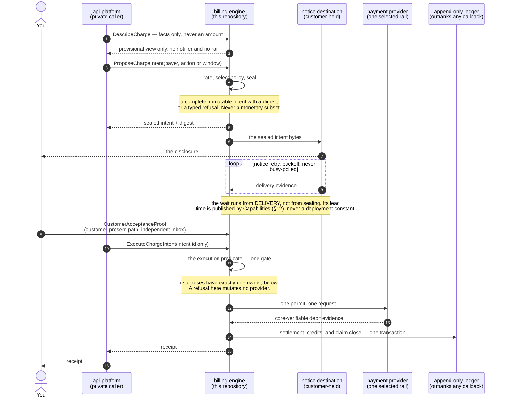
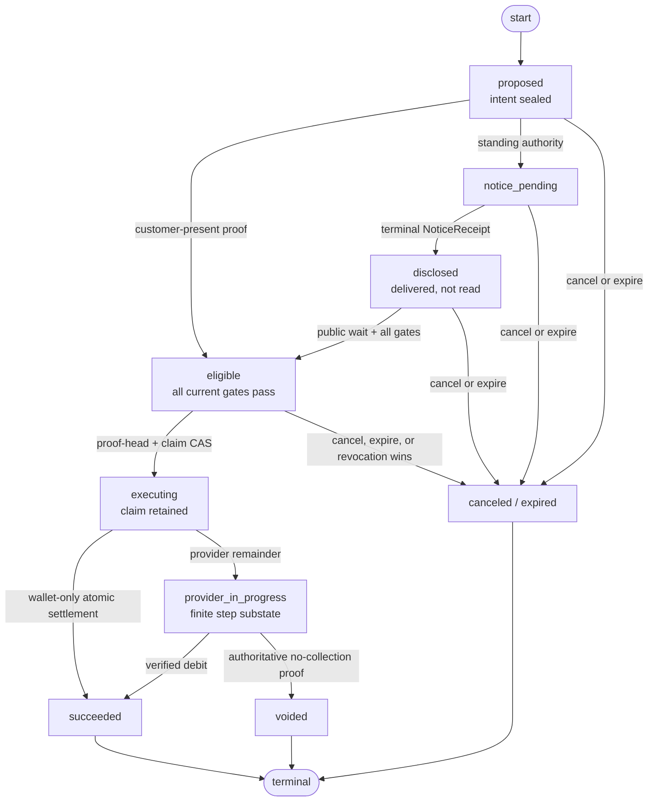
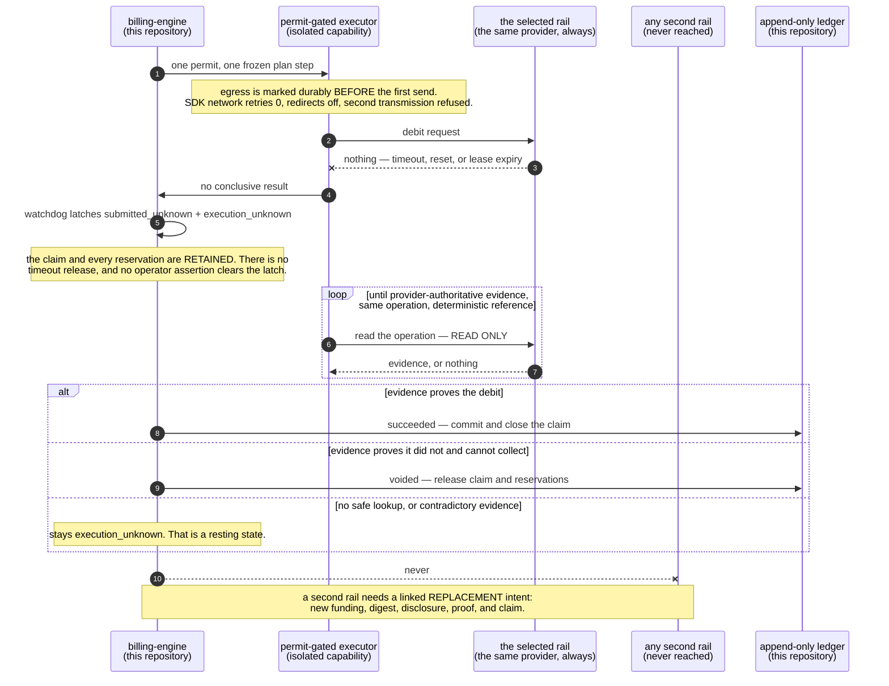

# The intent-only billing engine

The target shape of `billing-engine`. MirrorStack's private services report facts
and ask for a billing outcome. They must not name an amount, build an invoice
line, select a tax result, claim that notice was delivered, or cause a
payment-provider mutation.

> **Status: target design. Not implemented, not deployed.**
>
> Every type named in §3 returns zero files from `git grep <Type> -- '*.go'` on
> `main`, and each is marked `(unbuilt)` at its heading. Present-state facts about
> shipped code appear here only with a file path and line number. The one
> enumeration of current defects lives in
> [`SECURITY.md` § Known current gaps](../SECURITY.md#known-current-gaps).
>
> This document is the destination, not permission to charge under unfinished
> rules.

The question this repository must let a customer's developers settle:

> **Can the conforming billing-engine path collect money that was never
> disclosed and authorized under the accepted rule?** The amount, the reason, the
> tax treatment, and the price revision each have to survive that question.

The target answer is no, under the trust assumptions in
[`SECURITY.md` § Adversary model](../SECURITY.md#adversary-model). This design
cannot stop a replaced executor, or another holder of an unrestricted merchant
credential, from charging out of band; attestation, credential isolation, and
reconciliation make that bypass constrained or detectable, not impossible.

## Contents

1. [Why reliable charging is not enough](#1-why-reliable-charging-is-not-enough)
2. [The invariants](#2-the-invariants) — INV-001 … INV-014
3. [The durable model](#3-the-durable-model)
4. [Intent lifecycle](#4-intent-lifecycle) — including [`ExecuteChargeIntent`](#executechargeintent)
5. [Payment providers are adapters](#5-payment-providers-are-adapters)
6. [Capability separation](#6-capability-separation)
7. [What callers may send](#7-what-callers-may-send)
8. [What customers may be charged for](#8-what-customers-may-be-charged-for)
9. [Tax](#9-tax)
10. [Ledger and receipts](#10-ledger-and-receipts)
11. [Migration and readiness gate](#11-migration-and-readiness-gate)
12. [Open product decisions](#12-open-product-decisions)

[`VERIFICATION.md`](VERIFICATION.md) owns the charge-bundle field contract and
the static architecture checks CI runs. [`../SECURITY.md`](../SECURITY.md) owns
the adversary model and the current-gap register.

---

## 1. Why reliable charging is not enough

The shipped engine already protects operational invariants. Money is integer,
usage events dedupe on `event_id`
(`internal/account/db/queries/usage.sql:210`), charge amounts freeze before
dispatch, and ambiguous failures reconcile. Those controls answer one question:

> If the system decided to charge $N, can a crash accidentally charge $N twice?

They do not answer the question a customer asks:

> Why was $N permitted? Which accepted terms produced it? Was the total disclosed
> before collection? Can I recompute it myself?

Four substitutions are why. A billing run created moments before a provider
request is an execution record, not customer intent. A mutable draft invoice the
customer cannot see is not notice. A post-charge "large amount" badge is not a
pre-charge control. An alert-only budget is not a stop — today's budget service
is alert-only by design (`internal/account/budget/service.go:260`).

The rebuild separates five facts that currently sit too close together: what
happened (`UsageFact`); what rules apply (`PriceBookRevision`,
`TaxDetermination`); what the customer authorized (`BillingAuthorization`); what
effect is proposed (`ChargeIntent`); and what an external rail actually did
(`PaymentAttempt`, `ChargeReceipt`). No one record may substitute for another.

---

## 2. The invariants

These are normative. A route, adapter, migration, or operator tool that violates
one is an architecture change, not an implementation detail. Every normative rule
carries an INV id; reference it by id, never by paraphrase.

Five of the fourteen carry the money on their own and should be built first:
[INV-006](#inv-006), [INV-007](#inv-007), [INV-008](#inv-008),
[INV-013](#inv-013), and the reservation-backed ceilings in
[§3 Funding and reservations](#funding-and-reservations).

### INV-001

**The private caller cannot make money authoritative.**

Usage ingress may carry a payer or app subject, a declared meter, a module and
module version, an integer quantity, an occurrence time, and an idempotency key.

It must not carry `amount`, `price`, `rate`, `currency`, `subtotal`, `tax`,
`discount`, `credit`, `total`, `invoiceLine`, `paymentMethod`, `provider`,
`executeAt`, or notice and authorization status.

Customer product routes are a separate surface. `api-platform` may relay one
closed, non-authoritative `ProposalSelection`: an engine-signed catalog revision,
an offer id, and only the choice fields that template declares. A variable
top-up amount is such a declared choice; it is not a charge amount. The core
verifies the template signature and range, then derives currency, lines, tax,
funding, and eligibility itself. Free-form money fields and a caller's approval
statement must be rejected, and a new request field is rejected by default until
its authority and consequence are documented.

### INV-002

**One derivation powers preview and settlement.** `DescribeCharge`,
`ProposeChargeIntent`, invoice presentation, ledger posting, and the offline
verifier must use the same pure rating model and the same canonical encoding. No
frontend formula and no per-provider formula may exist.

### INV-003

**A sealed intent never changes.** Once a `ChargeIntent` is sealed, none of these
may be updated: source references, lines, policy versions, tax result, currency,
rounding, payer, authorization, notice policy, execution window, or total. A
one-unit change must create a new intent, supersede the old one, and repeat every
notice and authorization check.

### INV-004

**An unknown derivation or eligibility input cannot dispatch an effect.** Missing
or conflicting usage provenance, price policy, module manifest, authorization,
tax, notification evidence, rail capability, or build identity must quarantine
the intent. It must never silently become zero, use a mutable fallback, guess a
jurisdiction, or call a provider with a partial total.

### INV-005

**No collection before notice.** Automatic collection requires durable evidence
that the sealed intent was delivered byte-for-byte under its notice policy, and
that `NoticeReceipt.eligibilityNotBefore` has passed. Notification failure is a
failed control and must block execution.

Delivery evidence proves the carrier reported the configured destination in a
terminal status the accepted policy defines as destination-delivered; queue
acceptance is not sufficient. This does not prove a human read the message, and
no document or UI may claim otherwise.

### INV-006

**Every debit has customer authority.** Every debit must reference a valid
`BillingAuthorization`. It is either one-time, for one sealed intent, or
standing. A standing authorization declares charge kinds, currencies, cadence,
price and terms revisions, ceilings, notice rules, effective time, and expiry.

A private service credential must not create, accept, widen, or revive an
authorization by assertion. `api-platform` may relay the signed disclosure;
acceptance and revocation enter only through the proof-only consent edge and its
append-only inbox. The engine may activate authority only after independently
verifying a `CustomerAcceptanceProof` that binds payer, account, engine audience,
displayed digest, nonce, expiry, and replay identity to a factor the private
caller cannot mint.

### INV-007

**Each mutation-capable credential has one exclusive attested
`ProviderCredentialEnclave` owner.**

This is the single owner of this rule; every other file links here instead of
restating it.

- `ProviderCredentialEnclave` is a logical role with one exclusive owner per
  actual mutation-credential scope. That owner's workload attestation must verify
  at the readiness gate before any dispatch.
- The engine prefers separate provider × environment × merchant-account ×
  capability credentials, and must not claim a narrower boundary than the
  provider itself enforces.
- A credential spanning several merchant accounts must publish that scope and
  blast radius; readiness fails when the merchant policy forbids it.
- This is not one global process or vault holding every rail's secrets.
- Only purpose-matched guarded writers may set up a mandate, collect, finalize,
  void, or refund, each requiring its matching consumed dispatch permit.

A path may be called read-only under exactly one of two conditions:

1. the provider **enforces** a read-only credential, which a reader outside the
   enclave may then hold; or
2. a fixed-read broker runs inside that same attested enclave and exposes only
   operation-bound read procedures to a credential-free reconciler.

A Go interface named `PaymentReader` is not sufficient, because type shape is not
a credential boundary. If neither condition holds, the adapter must not report
separated reconciliation or readiness for unattended execution.

Callback authentication follows the same actual boundary. Each adapter declares
`CallbackAuthCredentialClass` as `public_key`, `dedicated_verification_only`, or
`shared_mutation_scope`, naming the provider-enforced scope and attested workload
owner, and public ingress may hold only the first two. If callback verification
needs a secret that can also mutate the merchant account, ingress forwards the
declared raw bytes and headers to a fixed `VerifyCallback` procedure inside the
same enclave. That procedure returns a typed, replay-bound observation and
exposes no provider read or write method; the public workload never receives the
secret. Unknown scope, duplicate ownership, or a provider supporting neither path
makes callbacks `unsupported`.

The eligibility core accepts an intent identifier, reloads sealed state, and
evaluates every execution precondition. Only then may it persist a single-use,
audience-bound provider operation, using purpose-signed, non-coercible capability
types. The enclave accepts only successfully consumed permits, never an ordinary
intent request or a caller-supplied amount. Compromise of the enclave together
with its credential is a declared trusted-computing-base limit.

### INV-008

**One intent settles at most once, across all providers.**

- A wallet-only intent has no provider attempt. Any other intent has one frozen
  semantic `PaymentAttempt` and one finite `ProviderExecutionPlan`.
- The plan may hold several uniquely fenced step operations. No operation outside
  the plan is permitted.
- A second attempt, or a second rail, requires a linked replacement intent with
  new funding, digest, disclosure, and eligibility.

The control is a durable cross-provider settlement claim, not per-adapter
idempotency, because per-adapter idempotency cannot see a second rail. Reordered
callbacks, retries, and an ambiguous timeout must not produce a second
settlement.

### INV-009

**Provider callbacks reconcile; they never originate money.** A webhook, return
URL, or server callback must match a known `PaymentAttempt`, intent, provider and
merchant account, currency, and amount. It must also match either an
authoritative provider payer identity, or an authenticated deterministic
operation reference uniquely bound to the frozen local payer and attempt; the
adapter declares which it supports. A callback may confirm or refute only that
known attempt. It must not create an intent, enlarge an amount, choose a new
payer, or insert a customer charge line.

### INV-010

**Infrastructure is not a customer charge dimension.**

Target rule: internal infrastructure cost may be measured for operations,
publisher settlement, or margin analysis, but must sit outside the customer
rating boundary. The customer charge vocabulary must contain no `infrastructure`
line and no hidden multiplier. Platform costs must be recovered through a
published base or module price already covered by the customer's terms.

**Present state — the shipped code does the opposite.** `infra.*` and
`platform.*` metrics are ingested by `RecordInfraUsage`
(`internal/account/usage/infra.go:326`). They are priced from the same
`metric_definitions` and `metric_model_prices` tables module usage reads. They
are then marked up by `infraMarkupNum = 12` over a denominator of 10
(`internal/account/cycle/types.go:59`). `AppInfraBill` and `AppModuleInfraBill`
render them as the customer-visible 基礎設施 line
(`internal/account/usage/bill.go:509`, `:522`). `GetAppBill` and `GetAccountBill`
serve the wire fields `infra_total_micros`, `infra_lines`, and
`module_infra_lines` (`cmd/account-api/main.go:690`, `:696`).

The displayed `UnitPriceMicros` is pre-markup COGS while `ChargedMicros` includes
the 12/10 markup (`internal/account/usage/types.go:446-448`), so quantity times
the displayed unit price does not equal the charge. That customer-visible
reconciliation gap is filed in
[`SECURITY.md` § Known current gaps](../SECURITY.md#known-current-gaps); whether
the plane is removed or disclosed is open in [§12](#12-open-product-decisions).

### INV-011

**Settled history is append-only.** Late usage, pricing mistakes, tax
corrections, disputes, refunds, and goodwill credits must never rewrite a settled
intent or ledger entry. Each produces a new linked adjustment, credit, reversal,
or refund record with its own reason and receipt.

### INV-012

**Source and policy identity are externally visible.** Each intent and receipt
must name the engine Git commit, built artifact digest, schema version, terms
revision, price-book digest, tax-policy digest, and adapter version. `Health` and
`Capabilities` produce engine-signed running identity. The independent evidence
edge is the customer path; `api-platform` may relay the unchanged bytes but must
not replace them with a bare `ok` claim.

### INV-013

**Proof ordering and the execution claim are one serialization boundary.**

The consent edge appends customer-signed commands to one billing-owned, gap-free,
monotonic stream per payer. An edge acceptance is returned only after durable
sequence assignment.

Exactly two operations lock that payer stream:

1. **claim acquisition** — the transaction acquiring the core-owned settlement
   claim; and
2. **provider-dispatch capability consumption** — the transaction CASing a step
   from `active` to `dispatching`.

Both must, in the same transaction, lock the payer stream head row; require
`appliedHead == currentHead` on the authenticated head; apply every accepted
sequence through that head within the published `maxProofApplyBatch`; and carry a
generation CAS, so a delayed consumer fails rather than commits. A stale,
missing, gapped, or unverifiable head must fail closed.

**No third locker.** The metering ingest path must not take this lock. Usage
admission races revocation and window close on the authority and checkpoint rows
instead, which is where those cutoffs live. Adding metering here would make one
Postgres row the throughput ceiling for a customer's whole billing activity, and
today that path is a lock-free idempotent insert
(`internal/account/db/queries/usage.sql:210`).

A revocation accepted before the capability changes from `active` to
`dispatching` therefore revokes it and wins. One serialized after that CAS
receives the already-dispatching cutoff. Wall-clock arrival order is not
authority.

### INV-014

**Customer evidence does not depend on the private relay.** A signed,
customer-encrypted evidence record must commit through a billing-owned
transactional outbox for each of these: a sealed intent, a proof result, a notice
or eligibility result, a refusal, a nonterminal attempt state, a settlement, a
revocation, and a correction. The independent evidence edge may serve those
records but must not create or mutate them. Reads require a payer-bound
`CustomerReadProof`; an `api-platform` identity assertion, or possession of an
object id, is not sufficient.

---

## 3. The durable model

Every type here returns zero files from `git grep <Type> -- '*.go'` on `main`, so
each heading carries `(unbuilt)`. Each entry gives purpose, the fields that carry
a security property, and the invariant it enforces. Nothing else.

| type | enforces | build status |
|---|---|---|
| `UsageFact` | INV-001, INV-004 | unbuilt |
| `PriceBookRevision` | INV-002, INV-004 | unbuilt |
| `TaxDetermination` | INV-004 | unbuilt; see [§9](#9-tax) |
| `MerchantOfRecordBinding` | INV-003, INV-009 | unbuilt |
| `BillingAuthorization` | INV-006 | unbuilt |
| `SubscriptionOffer` | INV-006 | unbuilt; a live stub waits at `internal/account/billing/service.go:101-105` |
| `BillingResponsibilityTransfer` | INV-006, INV-011 | unbuilt; open items in [§12](#12-open-product-decisions) |
| `CustomerProofStream` | INV-013, INV-014 | unbuilt |
| `AuthorityEvidence` | INV-005, INV-006 | unbuilt |
| `BillingDecisionProof` | INV-012, INV-014 | unbuilt |
| Customer-factor bootstrap | INV-006 | unbuilt |
| `FundingPlan`, `CreditReservation`, `AuthorizationExposureReservation` | INV-006 | unbuilt |
| `AutoTopupTriggerReservation` | INV-006, INV-008 | unbuilt |
| `RefundIntent`, `RefundPlan`, `RefundCapacityReservation` | INV-011 | unbuilt |
| `ReceivableCollectionReservation` | INV-008, INV-011 | unbuilt |
| `BillableSourceAllocation` | INV-008, INV-011 | unbuilt |
| `ServiceAccrualExposure` | INV-006 | unbuilt |
| `ChargeIntent` | INV-003 | unbuilt |
| `NoticeReceipt` | INV-005 | unbuilt |
| `ProviderExecutionPlan` | INV-007, INV-008 | unbuilt |
| `PaymentAttempt` | INV-008, INV-009 | unbuilt |
| `LedgerTransaction`, `ChargeReceipt` | INV-011, INV-012, INV-014 | unbuilt; see [§10](#10-ledger-and-receipts) |

### Facts and pricing

#### `UsageFact` (unbuilt)

An immutable observation from an allowed producer, carrying no money. Enforces
INV-001 and INV-004. Identity must carry a unique event id and the producer and
schema version. It must also carry the payer and app subject, the module id and
immutable module version, the declared meter id and kind, an integer quantity in
the meter's scale, occurrence and ingestion times, and provenance sufficient to
detect replay.

**Clock authority.** The producer's occurrence time is not service authority by
assertion. This is the anti-backdating control and it does not compress away:

- The default authority is the billing-owned sequenced admission time.
- An earlier occurrence time needs four things together: independently verifiable
  source-clock evidence; a published lateness rule with its numeric window; an
  authenticated closed-window high-watermark; and proof the event was generated
  before the authority or revocation cutoff.
- A post-revocation or post-close fact carrying an older bare timestamp must be
  quarantined and nonbillable. It is not admitted and then corrected.
- Admission races revocation and window close on the authority and checkpoint
  rows, so a private producer cannot backdate into a superseded authorization.

Corrections are new facts referencing the original; deletion is not a billing
correction mechanism.

#### `PriceBookRevision` (unbuilt)

An immutable, content-addressed price set with an effective window, currency,
rounding rules, and terms revision. Enforces INV-002 and INV-004. A module price
binds an immutable module billing-manifest version, a later publish must not
alter a rate that already accrued, and rating has no mutable "current price"
fallback: if a fact cannot resolve one effective revision, rating stops. A price
book is declarative rate data plus a version id — tiers, brackets, aggregation
kind, per-model rates, proration, rounding — never an executable plugin, and its
evaluation limits are in [§9](#9-tax).

#### `TaxDetermination` (unbuilt)

A versioned result in one of three semantic states: `final`, `not_applicable`, or
`unknown`. Enforces INV-004. `final` may legitimately carry a zero amount, while
`unknown` is not zero and an intent carrying it is never executable. The state
machine, the `verificationClass` enum, and the authority boundary are owned by
[§9](#9-tax).

#### `MerchantOfRecordBinding` (unbuilt)

Pairs `CommercialIdentityBinding` — the legal seller creating the tax obligation
— with `SettlementRouteBinding` and a compatibility-policy digest. Enforces
INV-003 and INV-009. The order is normative and removes a circular dependency:
pick the identity, resolve final tax and obtain `grossObligation` (equations in
[§8](#8-what-customers-may-be-charged-for)), allocate wallet value, then select
the route and seal. Route selection must not change price, tax, or gross
obligation. Authorization proves membership in the content-addressed
`MerchantBindingSet` by indexed proof; seal and every later check require exact
composite equality, so a routing policy cannot substitute merchant account B for
seller A.

### Authority and proof

#### `BillingAuthorization` (unbuilt)

Customer authority to create monetary effects. Enforces INV-006. Beyond the
payer, kind, and effective window, the fields that carry a control are: permitted
charge kinds, currencies, rails and provider-step effect classes; the
`MerchantBindingSet`; separate gross-obligation, wallet, provider-remainder,
per-charge and per-cycle ceilings; the notice policy; a mandatory
`ProviderAutonomyPolicy = no_autonomous_future_debit`; the accepted
evidence-strength class with its credential and enclave scope; a
`PaymentInstrumentBinding` when a provider remainder may be nonzero; and the
digest of the disclosure the customer accepted.

**Scope keys and lineage.** Each authorization has an `AuthorizationScopeKey`, a
lineage revision, and a predecessor digest. The scope key separates independent
authority families — service and collection, auto top-up, receivable collection —
while grouping revisions that must not coexist. The payer proof-stream
transaction activates revision N, supersedes N-1, and revokes every still-`active`
older grant, atomically; claim and consume accept only the current lineage head.

**Exposure survives replacement.** Exposure rows are keyed by authorization scope
and window, not by revision id, so replacing a cap or a saved payment method
cannot reset already-settled or already-reserved exposure. Activation migrates no
money: it carries the same settled and active scope totals forward.

> If a lowered ceiling is already exceeded, the new revision may revoke future
> execution. It must not create capacity. Capacity returns only when exposure
> falls back within the accepted bound.

Raising a ceiling or replacing a method requires a new acceptance ceremony, and
old and new revisions must never spend concurrently.

**Service and collection authority are evaluated separately**, even when one
record carries both. Every service fact must reference the revision that
permitted that service at its service time. Later revocation stops future accrual
but does not erase an accrued receivable, while wallet consumption or external
collection additionally requires collection authority to be current inside the
settlement transaction. A line with no effective service authority must be
quarantined, never turned into customer debt.

#### `SubscriptionOffer` and `SubscriptionScheduleReceipt` (unbuilt)

A MirrorStack subscription is a billing-domain schedule, never a provider-native
one. Enforces INV-006; a live stub waits at
`internal/account/billing/service.go:101-105`. Activation must be
settlement-gated: accepting the offer records a `pending_first_settlement`
schedule that opens no billable service window. The first `subscription_start`
settlement transaction compare-and-swaps the accepted responsibility and schedule
generations, and only on a match enables the bound service authority. Provider
subscriptions, auto-advance, and provider renewal schedules stay disabled.

#### `BillingResponsibilityTransfer` (unbuilt)

Changing an app or account's paying party is a typed cutoff, never a field
update. Enforces INV-006 and INV-011. Four other passages depend on these rules:
the cutoff seals the old service window and starts a new allocation namespace, so
facts cannot be backdated across it; already-accrued obligations always remain
with the old payer; old `dispatching`, `hold_active`, `client_dispatched`, or
ambiguous work stays fenced to the old payer; and mandates, wallet lots, tax
profiles and authorizations never transfer implicitly.

`ApplyBillingResponsibilityTransfer(transferID)` accepts no proof bytes: one
serializable transaction locks both payer proof heads in payer-id order, requires
`appliedHead == currentHead` for both, verifies two distinct factor-bound proofs,
and CASes the responsibility, schedule, source, and exposure generations. A
missed deadline expires the transfer or yields `activation_failed`, and the
blocked interval is never backdated into debt. Involuntary transfer, appeal and
cooling, and liability reassignment are unresolved; see
[§12](#12-open-product-decisions).

#### `CustomerProofStream` (unbuilt)

The mechanism behind [INV-013](#inv-013) and [INV-014](#inv-014). The public
consent and revocation edge has only an append procedure into billing-owned
storage. Each envelope carries the payer and account, purpose, object digest,
factor revision, engine audience, nonce, expiry, replay identity, prior head
commitment, and customer signature. Before assigning a sequence the billing-owned
procedure verifies all of them plus the schema size limits; an invalid candidate
consumes no sequence and must not jam the stream. The signed
`EdgeAcceptanceReceipt` returns only after durability and proves ordering, not
application.

The core advances a per-payer applied high-watermark with a priority worker and
must never rescan from sequence 1. The two lockers named in
[INV-013](#inv-013) apply at most `maxProofApplyBatch` inside the
transaction-time budget and fail closed on a gap or stale head; usage admission
is not one of them. If revocation wins before any adverse step, the capability
becomes `revoked` and claim and reservations are released atomically. If the
dispatch CAS wins, the revocation receipt names that cutoff and must not claim a
successful cancellation.

#### `AuthorityEvidence` (unbuilt)

Every setup or debit bundle carries a tagged, mutually exclusive authority
branch, not an unconditional notice field. Enforces INV-005 and INV-006.

- `setup_customer_present` — the setup acceptance and proof, payer sequence, head
  and cutoff, factor revision, and dispatch-time revocation state. It contains no
  debit `BillingAuthorization`.
- `debit_customer_present` — the engine-effective `CustomerAcceptanceReceipt`,
  the accepted intent digest, and the current authorization with its evaluated
  scope, caps, instrument and lineage revision.
- `standing_automatic` — the current lineage head and its acceptance proof, the
  terminal `NoticeReceipt`, the completed public wait, and a fresh
  `RevocationPathReadinessReceipt`.

A setup receipt must never verify as debit authority, a one-time purchase must
not fabricate a notice, and an automatic charge must not borrow intent proof from
an unrelated scope. Refund, correction, and dispute authority use their own
source-linked types. The ledger receipt records the selected tag, so offline
verification can establish why execution was allowed.

#### `BillingDecisionProof` (unbuilt)

Signed transition evidence emitted by the trusted billing transaction. Enforces
INV-012 and INV-014. A bundle cannot prove the engine omitted no competing claim
merely by listing the rows it chose, so real-time exclusion stays inside the
trusted billing state boundary: serializable transactions, row and range locks,
unique constraints, generation CAS, and the payer proof-head lock. No external
witness sits in the synchronous payment path. The closed schema binds the derived
key set and predicate, row commitments, the authenticated proof head, claim
generations, build and policy identities, and the outbox record. The verifier can
detect omitted fields, changed inputs, arithmetic errors, and receipt
substitution, but cannot prove a compromised core hid a competing row, so reports
expose `state_assurance: attested` — the attester being the deployed build.

**Transparency log — deliberately minimal.** Opaque payer-isolated transition
roots may later be published to an append-only log with a published signed head.
That is audit evidence, never execution authority, and publication must never
delay or authorize a charge. Missing publication reports
`state_transparency: pending|unsupported`; a conflicting signed history is
`invalid` and opens an incident. Witness quorums, threshold signatures, and
gossip are out of scope until a second independent relay exists.

#### Customer-factor bootstrap, rotation, and recovery (unbuilt)

The first customer factor must not be enrolled from an `api-platform` bearer, a
session, an email assertion, or a private IAM claim. Enforces INV-006. The
ceremony requires proof of possession of the new factor plus an independently
verifiable `AccountAuthorityCredential` under a pinned public identity root.
Lost-factor recovery uses that root or a documented offline recovery authority,
plus a published cooling interval and notification to every enrolled destination;
operators must not shorten cooling or assert identity themselves.

A web verifier must run at an independently distributed top-level origin with an
attested release, `frame-ancestors 'none'`, and opener-null external launches,
accepting no opener-controlled navigation as approval. Amount and lines, seller,
payment method, caps, destination, and consequences must be visible before a
distinct, non-programmatic approval gesture. Native verifiers stay `unsupported`
until each OS has a versioned public profile. The identity issuer, the verifier
device, and any offline recovery authority are declared trusted-computing-base
members whose roots must be published in `Capabilities`.

### Funding and reservations

#### `FundingPlan`, `CreditReservation`, `AuthorizationExposureReservation` (unbuilt)

Every intent freezes one provider-neutral funding plan before disclosure.
Enforces INV-006. The plan carries the funding mode, credit-lot allocations and
reservation ids, gross obligation, wallet application, optional provider
remainder, exposure reservation ids, cap and window evaluations, and an
executable, shortfall, or cap-refused state.

**Two credit domains that must never merge.**

- A `rating_credit` — promotional, adjustment, or tax credit — reduces the
  obligation under public rating and tax rules.
- A `stored_value` lot funds the resulting obligation. It must never appear as a
  second negative line and must never change taxable basis.
- Each credit source is typed `rating_credit` or `stored_value`, never both.
- A source id or lot carries a unique-use constraint across those two domains, so
  it cannot be subtracted from the obligation and then spent again as funding.

That typing rule is the mechanism; the double-spend it prevents is named in
[`SECURITY.md`](../SECURITY.md#known-current-gaps), which links back here. The
`grossObligation` equations by intent kind live in
[§8](#8-what-customers-may-be-charged-for). In every target schema
`ChargeIntent.total` is removed, or is a versioned alias for `grossObligation`.

**Lot selection.** A stored-value lot binds owner, issuing entity, currency,
market, permitted charge kinds, restrictions, and expiry, and compatibility
requires equality with the selected seller, market, and currency. Selection order
is deterministic — compatibility, actual expiry, accepted priority, then original
stable lot id — read under the account lock. Exceeding the published
`maxFundingLotsPerIntent` returns a typed capacity refusal and never skips value.
Lot-index structure is deferred; any indexed-commitment scheme is a later
revision with its own measured trigger.

**Deferred prepaid-service expiry preservation.** A lot may back a deferred
prepaid reservation under one condition only: the customer-accepted lot terms
preserve its reserved slice beyond nominal expiry, until the bound service window
reaches terminal consume or release.

- A lot without that rule may fund only a same-transaction wallet settlement
  completed while the lot is eligible. It must not back deferred exposure.
- Admission without the preservation proof is refused, with no service, no debt.
- The reservation binds the rule, reserved time, service window and scheduled
  close, nominal expiry, range and amount, and `TimeReadinessPolicy` revision.
- An expiry worker locks the same serialization boundary as allocation and the
  constituent range. It may retire only unreserved value, and must not expire,
  reallocate, refund, or claw back a reserved slice.
- Nominal expiry prevents new allocations. A preserved slice stays eligible only
  for its bound service window; close consumes its amount and releases surplus.
- Refund, clawback, close, and expiry share that range fence, so a crash leaves
  either the reservation or the terminal expiry, never both. It must never
  convert prepaid service into arrears or a card fallback.

This binds to live code. Credit lots carry a nullable `expires_at`
(`migrations/billing/048_credit_wallet.up.sql:60-61`), and `WalletSpendableLots`
filters on `(lot.expires_at IS NULL OR lot.expires_at > CURRENT_TIMESTAMP)`
(`internal/account/db/queries/credit_wallet.sql:270-292`). A grant can therefore
be filtered out mid-service-window today.

**Funding eligibility is closed by intent kind.** `credit_purchase` and
`auto_topup` create stored value, so they must not consume stored-value lots or
rating credits: `walletFunding = 0` and `providerRemainder = grossObligation`.
Any bonus credit is an explicit output line granted only after verified external
settlement, enforced by both the sealer and the consume-grant transaction.

**Reservation-backed ceilings.** Aggregate ceilings are reservation-backed, not
read-then-check counters. For each authorization, cap, and window, planning locks
exposure rows in deterministic order and requires:

```text
settled exposure + active reservations excluding candidate + candidate
  <= accepted ceiling
```

It then creates unique reservations for gross obligation, wallet application,
provider remainder, and frequency or count caps, so two concurrent intents cannot
each spend the same remaining cycle limit. Reservations are consumed into settled
exposure at settlement, retained through `action_required`, `provider_pending`,
and `execution_unknown`, and released only by a pre-dispatch cancellation or
revocation, expiry before dispatch, or an authoritative no-collection close.

**Exposure is gross and monotonic** within its accepted window by default. A
verified pre-debit void or release frees its matching active reservation. A
settled debit, an established hold occurrence, and frequency or count use are
never restored — not by refund, chargeback, dispute credit, reversal, or
write-off.
Re-crediting cap capacity requires a separately accepted `CapRecreditPolicy`
binding the source effect, the amount restored, the window, and an anti-loop
ceiling; it must never be inferred from net ledger balance.

Prepaid wallet requires the full amount from compatible settled credit reserved
at service admission and freezes a zero provider remainder. A shortfall refuses
or quarantines new prepaid service before accrual; it must not create wallet-only
arrears and must never fall back to a card. Wallet-only settlement commits in the
core and ledger with no `PaymentAttempt` and no provider executor.

#### `AutoTopupTriggerReservation` (unbuilt)

An automatic top-up may begin only by acquiring one durable trigger reservation,
in the same transaction that locks the payer and currency balance row. Enforces
INV-006 and INV-008. Its unique key binds only the payer, the auto-top-up scope
key and lineage head, the currency, the balance version and trigger epoch, and
the threshold-policy revision. Both planning and consume use:

```text
projectedBalance = settledBalance + otherPendingFunding(excluding candidate)
triggerEligible  = projectedBalance < acceptedThreshold
```

Consume re-locks those rows and recomputes the predicate; if another funding
operation has recovered the balance, the still-`active` intent is canceled and
its reservations released atomically. Verified settlement atomically grants the
digest-bound `creditGranted` and bonus lots, updates the balance, closes the
trigger epoch, and appends ledger and receipt records. A crash must not grant
value without closing the trigger, or close the trigger without recording it.

#### `RefundIntent`, `RefundPlan`, `RefundCapacityReservation` (unbuilt)

A separately typed immutable return effect. Enforces INV-011. A `RefundIntent` is
never a `ChargeIntent` and is never valid as debit authority; it has no
`FundingPlan`, no debit `BillingAuthorization`, and no provider debit remainder.
It references one immutable settled source effect and acquires a source-linked
refundable-capacity reservation in the same transaction that freezes its refund
amount, operation identity, and claim generation, locking the source row and
requiring:

```text
candidate refund <= max(0,
  original refundable amount
  - settled refunds
  - active refund reservations
  - observed or conservatively reserved external source-return effects)
```

External source-return effects include every verified reversal, chargeback, or
dispute credit the published finance policy says reduces remaining collectible
value; pending versions reserve their conservative maximum. Externally imposed
effects are always appended even when they push net return above the original
amount; that overflow opens an incident and blocks new refunds rather than hiding
provider truth. Concurrent partial refunds therefore cannot each spend the same
remainder, and an operator cannot clear capacity by assertion.

**Refund capacity and the cap-reset attack.** When the source is `credit_purchase`
or `auto_topup`, cash return additionally requires a
`GrantedValueClawbackReservation` over the source-created `creditGranted` and
bonus lots. The refund is executable only to the extent those lots remain unspent
and can be frozen, so spent value never becomes a negative wallet, and pending
provider return keeps them unavailable. The attack this closes: refund to free
ceiling headroom, re-spend the freed capacity, repeat. The clawback reservation
plus gross-monotonic exposure means a refund loop cannot reopen cap capacity;
without both, the ceiling is a suggestion. A different partial-refund rule
requires a separately published, accepted, deterministic policy.

#### `ReceivableCollectionReservation` (unbuilt)

A funding-refused or unpaid service obligation remains one immutable, line-aware
receivable. Enforces INV-008 and INV-011. Later collection creates a linked
`collect_receivable` intent; it must never re-rate the source or post a second
receivable. In one source-row transaction the core derives the remaining
collectible amount after settled collections, credits, write-offs, and active
reservations. An unresolved original claim conservatively reserves its full
possible capacity unless evidence proves it cannot collect, so concurrent
collection intents cannot collect the same amount twice.

### Allocation and exposure

#### `BillableSourceAllocation` (unbuilt)

The double-charge control on the source side. Enforces INV-008 and INV-011. At
ingest the core derives each immutable leaf id and the anchored allocation
namespace from accepted schedule and metric state; a caller must not choose a
regrouping key. A database uniqueness or exclusion constraint permits each leaf,
or each provably disjoint slice, to enter only one draft allocation lineage.

Period close must not lock millions of leaves in one transaction. A worker claims
at most `maxSourceClaimBatch` leaves per transaction into one draft and advances
a durable membership checkpoint. A small final seal-barrier transaction runs only
after the source window is closed and every expected leaf through its
authenticated high-watermark is present; it verifies the membership root, count,
and the absence of competing claims, then marks that root owned by the intent.
Sealing is all-or-nothing at that barrier.

- Aggregate ids, alternate partitioning, and overlapping windows are never
  uniqueness authority. Payer, currency, and policy revisions are derived values,
  so changing them cannot make a source consumable twice.
- A replacement intent may take the allocation append-only, and only after the
  prior intent is terminally non-dispatchable. The two can never both be
  executable.
- An ownership transfer is a separately authorized append-only lineage transition
  preserving the same source key; it never creates a second allocation.
- A settled allocation is terminally consumed and never reusable.

Source keys are deterministically sharded, and each seal or terminal consume
updates only its shard's commitment inside the same local uniqueness and CAS
transaction that is execution authority.

#### `ServiceAccrualExposure` (unbuilt)

A per-fact reservation, and the only bound on customer liability while budgets
stay alert-only (`internal/account/budget/service.go:260`). Enforces INV-006.
Every billable service authority has a finite service-time accrual ceiling,
independent of the product budget control. Service admission — not later
collection — must require a current `TimeReadinessPolicy`, then reserve a
deterministic gross-obligation upper bound for each usage fact or recurring base
window, including maximum rating amount, tax, and rounding.

The reservation is an insert guarded by a database uniqueness or exclusion
constraint on (authorization scope, leaf fact id), plus a conditional bound
check. It takes no explicit row lock and, per [INV-013](#inv-013), must not take
the payer proof-head lock. Concurrent facts are arbitrated by that constraint
rather than queued behind a lock, so one Postgres row is not the ceiling on a
payer's metering throughput. Deployments should size this path against a stated
per-payer contention budget of at least 50 admitted facts per second, holding no
per-payer row across a multi-clause predicate.

The bound derives inside the core from immutable price, manifest, terms, and tax
evidence; the meter must not supply it, and if no safe bound is derivable the
fact must be quarantined rather than become debt. Period close converts reserved
exposure into rated lines and releases only after proving the service gross is no
greater than the held bound. Exposure is never counted twice, and facts beyond
the authority never become customer debt.

**Why this cannot wait until period close.** Deferring the ceiling check to close
converts a prepaid wallet into an unauthorized credit line: the service is
already rendered and the money already spent. For prepaid wallet mode the same
service-admission transaction must also reserve compatible settled wallet
capacity for that upper bound; insufficient capacity refuses the fact or triggers
the accepted service-stop policy, and must not create wallet-only arrears.
Card-backed usage may accrue a receivable within its service-authority ceiling;
prepaid mode may not. A deployment that cannot enforce the mandatory authority
ceiling at service time must not create the obligation at all.

### Execution and record

#### `ChargeIntent` (unbuilt)

The complete proposed monetary effect, sealed and immutable. Enforces INV-003.
Beyond the lines and their arithmetic, it freezes: the composite
`MerchantOfRecordBinding`; the kind-tagged source authority; `grossObligation`,
currency and rounding; the price, manifest, tax-rule and terms revisions; the
authorization id and the ceiling evaluated; the `FundingPlan`; the selected rail
and `PaymentInstrumentBinding`; the adapter artifact, evidence class and enclave
scope, which must equal the attempt and every step; the `ProviderAutonomyPolicy`
and the digest of the finite `ProviderExecutionPlan`; the notice bytes,
destination commitment, minimum lead duration and `notBeforeFloor`; engine build
identity; and a digest covering every field above.

The schema publishes `maxIntentLines`, `maxIntentCanonicalBytes`,
`maxDisclosureBytes`, `maxSourceProofBytes`, and `maxReceiptBundleBytes`. If a
sealed intent would exceed one, the engine returns a typed refusal or creates
linked intents, each separately disclosed; it must never truncate lines, source
proof, or the customer-visible total. No provider invoice id belongs in the
intent: providers are execution rails, not the source of the debt.

#### `NoticeReceipt` (unbuilt)

Evidence that an allowed carrier reported the intent digest and the
customer-readable explanation as destination-delivered. Enforces INV-005. Its
`eligibilityNotBefore` is append-only and equals the later of the sealed
`notBeforeFloor` and `providerDeliveredAt + minimumLeadDuration`, so a delayed
delivery moves eligibility later and can never consume the waiting period before
delivery. A billing-contact change requires independent customer proof and
re-notices every waiting intent whose destination commitment no longer matches.

Carrier queue acceptance must not create a `NoticeReceipt`, and a private
caller's assertion cannot establish delivery: the receipt requires carrier-signed
evidence the core can verify, or a read-back through a credential-separated
attested notice reader, which is a declared trusted-computing-base member. A
verified bounce or destination revocation accepted before any adverse point —
wallet commit, the server `dispatching` CAS, or `client_dispatched` issuance —
clears readiness. After a point of no return, a notice status alone blocks the
next not-yet-dispatched debit but cannot release the claim.

**Time authority.** Every money-authoritative time check uses the billing-owned
monotonic time source under the published `TimeReadinessPolicy`. A jump,
rollback, or an interval overlapping the disallowed side of a cutoff must fail
closed. Recovery may delay execution; it must never manufacture elapsed notice
time or a prior service window.

#### `ProviderExecutionPlan` (unbuilt)

Every setup, payment, void, refund, or mandate-revocation effect freezes a finite
purpose-typed ordered plan before disclosure. Enforces INV-007 and INV-008. A
flow needing create-then-finalize, or authorize-then-capture, must not hide those
calls behind one permit. Each step binds a deterministic step id, operation kind
and index, expected provider object kind, amount or maximum, currency,
prerequisite evidence, expiry, one distinct egress identity, and an effect class
from the closed set: `non_adverse_prepare`, `mandate_setup`, `funds_hold`,
`debit`, `return`, `release`.

- A hold is an adverse monetary effect, not harmless preparation. It binds the
  independently accepted amount and duration, and by default the plan permits at
  most one unreleased hold.
- A prepare step is non-adverse only if it cannot mint a customer-usable or
  provider-autonomous path to funds. Otherwise it is `funds_hold`.
- A setup plan holds at most one `mandate_setup`, a charge plan at most one
  `debit` for the sealed provider remainder, a refund plan at most one `return`.
- Reconciliation is a read-only prerequisite, never a plan step, and never
  consumes a dispatch permit.
- `maxProviderPlanSteps`, `maxProviderPlanBranches`, and
  `maxProviderPlanCanonicalBytes` are versioned limits in the adapter capability
  digest; max+1 or a hidden branch refuses before disclosure.

Purpose and effect compatibility is a generated exhaustive schema rule whose
matrix is owned by [§8](#8-what-customers-may-be-charged-for). Each step names
its actor, `server_mutation` or `customer_hosted`; a customer-hosted capability
declares exactly one effect class, and a provider session that can choose hold
versus debit, or widen mandate scope, is unsupported. Before publishing such a
capability the core reapplies the proof head and all gates and CASes the step to
`client_dispatched`, which is its point of no return.

#### `PaymentAttempt` (unbuilt)

The one semantic provider attempt and claim for a provider-funded `ChargeIntent`,
or for a separately authorized `RefundIntent`. Enforces INV-008 and INV-009. It
owns the uniquely fenced step operations from the frozen plan. It carries the
merchant binding, adapter version, and opaque external object identifiers. It
also carries the intent digest, payer, currency and provider minor-unit amount,
the deterministic idempotency reference, each step's envelope and egress
identity, verified callback history, and an append-only transition log. A debit
requires equality
with the accepted `PaymentInstrumentBinding`, and a refund records the parent
source object and return destination, so a same-payer but different instrument
cannot settle a debit. Provider identifiers and callback history live here, not
in ledger semantics. The frozen autonomy policy forbids provider-managed
subscriptions, auto-advance, smart retries, dunning debits, and delayed
auto-capture, because none can race revocation through the core CAS.

#### `LedgerTransaction` and `ChargeReceipt` (unbuilt)

Enforces INV-011, INV-012, and INV-014. The append-only ledger is monetary truth.
A successful provider object without a balanced ledger settlement is a
reconciliation incident, not a second source of truth. Every transaction balances
to zero and references the intent, payer, correction chain, and payment attempt
where one exists. The ledger contract, transaction families, provider evidence
snapshot, and reconciliation rules are owned by [§10](#10-ledger-and-receipts);
the customer-facing charge-bundle field contract has one owner,
[`VERIFICATION.md` §3](VERIFICATION.md#3-canonical-charge-bundle).

The ledger transition and its signed, customer-encrypted evidence record commit
atomically through a durable outbox. The evidence edge has no table, list, or raw
outbox read; its only data capability calls the billing-owned `ReadEvidence`
procedure, which consumes a `CustomerReadProof` and performs only the scoped
fetch. For each published scope class, authorized, absent, and unauthorized
requests must be indistinguishable: one status and content type, one error shape,
a fixed padded ciphertext size, a minimum response-time bucket plus jitter, and
the same rate limit. The `CustomerReadProof` binds the enrolled factor to payer and
account, the exact object or bounded collection scope, edge audience, nonce,
expiry, and key version. Residual co-residency and upstream timing leakage remain declared
limits.

---

## 4. Intent lifecycle

Nothing below runs on `main`. `ChargeIntent`, `NoticeReceipt`, and `PaymentAttempt`
each return zero files from `git grep -- '*.go'`. Read every arrow as *must*.



Three things the picture carries that the state machine below does not:

- **The customer appears twice, and neither appearance is `api-platform`.**
  Step 7 is a disclosure the engine sent. Step 9 is a proof it verified.
- **One arrow reaches the provider.** The permit authorizing step 12 is spent by
  the send, not by the reply.
- **Step 11 is one box on purpose.** Its clauses are enumerated once, in
  [`ExecuteChargeIntent`](#executechargeintent) below.

The lifecycle is deliberately small. Provider step detail is a substate, never a
second way to settle an intent.



Terminal non-settlement exits are `canceled`, `expired`, and `voided`. Superseding
an intent creates a new intent; it does not edit the old one. Attempt state is
subordinate to intent state and must never release the core-owned claim by
itself:

| payment-attempt evidence | intent state / claim consequence |
|---|---|
| no attempt; typed gate or funding refusal | keep the pre-execution state; no claim exists |
| wallet-only atomic commit | `succeeded`; no `PaymentAttempt` exists |
| `created`, `dispatching`, or verified non-adverse result | `provider_in_progress`; retain claim and reservations; authorize a next step only after a fresh full gate |
| `hold_active` | retain claim and exposure; allow only a freshly authorized capture or the frozen release cleanup |
| `client_dispatched` | customer-collectible point of no return; retain claim through provider cancellation proof or settlement |
| `provider_pending` | retain claim and reservations |
| `customer_action_required` | `action_required`; retain claim and reservations |
| `execution_unknown` | `execution_unknown`; retain claim; same-operation reads only |
| core-verifiable debit | `succeeded`; commit ledger and credits and close the claim atomically |
| authoritative proof every collectible path was released or cannot collect | `voided`; release claim and reservations atomically |
| generic decline, failure, missing, or contradictory evidence | attempt evidence only; never releases a claim unless it proves the no-collection condition above |

### `DescribeCharge` and `ProposeChargeIntent`

`DescribeCharge` is read-only and side-effect free. It returns a provisional,
fully explained view using the same rater as sealing, touching no notifier and no
payment rail. An estimate is labelled with every unresolved input, and
relabelling it as final must not turn it into an executable intent.

`ProposeChargeIntent` names a payer and a billing action or window, optionally
with one validated closed `ProposalSelection`. The engine selects all facts,
policies, lines, tax inputs, authorization candidates, currency, notice policy,
eligibility, and execution time; the caller must not make any derived field
authoritative. The output must be either a complete immutable intent or a typed
refusal, never a best-effort monetary subset.

### Notice and waiting

The notifier sends the sealed intent bytes. A material change after delivery
always means a new digest, a new notice, and a new wait. Notice retries are
scheduled with backoff, not busy-polled. The minimum lead time, and which
destinations count as delivered, are open decisions published by `Capabilities`
(see [§12](#12-open-product-decisions)). They must never be hidden deployment
constants.

### Payment-method setup

Card binding creates a reusable provider mandate and a verifiable setup receipt.
It creates no debit and no `BillingAuthorization`; subscription and auto top-up
must later request their own authority against that mandate. The core seals an
immutable `PaymentMethodSetup` and returns an engine-signed disclosure;
`api-platform` relays it unchanged, including the "no debit" statement; the
customer-held verifier renders it and obtains the factor proof through the
consent edge; the core then freezes the no-debit setup plan and authorizes its
first step. Card data goes to the provider, never through `api-platform` or the
engine.

The resulting `PaymentMethodSetupReceipt` is a historical verification bundle. It
binds the setup digest and opaque reference to the provider-verified readable
identity: provider and entity, brand or method type, masked suffix, expiry, and
mandate scope. It also binds the acceptance receipt, the payer stream sequence
and cutoff, the factor and verifier revisions, and the revocation state at both
dispatch and terminal completion. Completion reapplies the current proof head; if
revocation won, the engine refuses a usable receipt and revokes the mandate
through the frozen plan. A current `Health` response is not historical proof.

Before an unattended dispatch, the adapter must do one of two things. It may
attest that the mandate identity is immutable. Otherwise it must use a
credential-enforced authoritative read to compare provider, entity, mandate
scope, brand, masked suffix, and expiry against the accepted receipt. Any security-relevant change revokes an `active` grant and
requires a new setup receipt, authorization, intent, disclosure, and proof.

Mandate removal is a separate non-coercible operation, not a payment `void`. A
customer-signed `MandateRevocation` first terminally revokes every standing
lineage and `active` grant referencing the method; that engine cutoff is
immediate even while provider detach is pending. Only then may the core persist
the `AuthorizedMandateRevokeStepEnvelope`. The receipt reports `engineRevokedAt`
and provider status separately, and a pending detach must never re-enable the
method.

Card binding must not start a billing period. The current
`accounts.activated_at` stamp on a Stripe `payment_method.attached` event is
filed as a defect in
[`SECURITY.md` § Known current gaps](../SECURITY.md#known-current-gaps).

### `ExecuteChargeIntent`

The scheduler queues an intent id only. This is the single copy of the execution
predicate, and every other file links to this heading. The eligibility core loads
all state and requires:

```text
intent is immutable
AND intent state is eligible
AND payer proof stream has an authenticated, gap-free current head
AND every accepted proof sequence through that head is applied in this claim transaction
AND CommercialIdentityBinding matches tax, source, and wallet state, and the final MerchantOfRecordBinding has an accepted membership/compatibility proof matching notice, funding, and rail
AND applicable source allocation/checkpoint and ServiceAccrualExposure are valid and uniquely owned
AND authorization is the valid, unrevoked current AuthorizationScopeKey lineage head with carried exposure
AND (
  debit_customer_present AuthorityEvidence binds fresh intent acceptance/proof, current one-time-or-standing authorization, factor/verifier revision, and execution window
  OR (
    standing_automatic AuthorityEvidence binds the standing-authorization acceptance proof
    AND its notice is terminally delivered
    AND now >= its NoticeReceipt.eligibilityNotBefore
    AND its RevocationPathReadinessReceipt is fresh and checkpoint-consistent
  )
)
AND grossObligation <= every applicable gross ceiling
AND FundingPlan proves gross = wallet allocation + sealed provider remainder
AND every credit lot is compatible, available, uniquely reserved, and within cap
AND every authorization exposure reservation is unique/current and, because this intent is already reserved, settled + all active reservations stays within its accepted window ceiling
AND FundingPlan mode, credit policy, split, provider permission, and gross/wallet/provider caps equal the accepted authorization
AND, for auto_topup, its trigger reservation is current and the consume-time projectedBalance excluding this candidate remains below the accepted threshold
AND, for subscription_start, the accepted responsibility/schedule generation is locked with claim acquisition and equals the current account generation
AND tax is independently reproducible final or explicitly not_applicable
AND every policy is published, effective, and digest-matching
AND TimeReadinessPolicy is ready and its trusted uncertainty interval lies wholly on the permitted side of every evaluated cutoff
AND (
  providerRemainder == 0
  OR (
    selected rail supports the currency and the frozen finite ProviderExecutionPlan
    AND ProviderAutonomyPolicy is no broader than accepted authority and the adapter can enforce/read it
    AND the first provider step, genesis prerequisite, purpose/effect matrix, amount, expiry, and cleanup branch match the frozen plan
    AND (
      saved_mandate binding is immutable or authoritatively read back to equal PaymentInstrumentBinding and its provider autonomy state is verified
      OR customer_present_one_time binding has a prepare step bound to the accepted tuple, and verified creation evidence proves autonomy settings before client_dispatched or any next adverse step
    )
    AND the scoped ProviderCredentialEnclave, writer, adapter, credential, evidence class, and artifact checkpoints are ready
    AND a frozen PaymentAttempt exists before any provider mutation
  )
)
AND no prior terminal or nonterminal settlement, attempt, or grant exists for this initial execution
AND the core-owned settlement claim is available for atomic acquisition
```

Anything else is a refusal with no provider mutation.

`AuthorizeNextProviderStep` is a distinct transition, not another initial
execution. It always requires the same immutable source and plan, the retained
claim and reservations, the current proof head, a terminal authoritative result
for the prior step, the next plan index, and no conflicting step.

- `mandate_setup`, prepare, hold, and debit steps require the applicable live
  authority plus every gate that can create or increase exposure.
- A refund `return` requires current typed refund authority, source and refund
  capacity, and any granted-value clawback — not debit authority or notice.
- A customer-protective `release`, void, or mandate-revoke step requires the
  engine-effective revocation or typed source authority, the retained claim and
  object, and proof it can only reduce exposure. It must not require revoked
  debit authority, or withdrawn price, tax and notice gates, to become valid.
- For `subscription_start`, every adverse or customer-collectible transaction
  also locks the accepted responsibility and schedule generation.
- Missing or ambiguous prior evidence retains the claim. It must not advance,
  retry under a new identity, or create a replacement attempt.

Every arrow below is unbuilt: `PaymentAttempt` and `ProviderExecutionPlan` return
zero files from `git grep -- '*.go'`. This is what must happen.



- **The retry that is not drawn is the point.** Nothing follows step 2 to `Rail`.
  One ambiguous timeout costs one investigation, not two charges.
- **Steps 6 and 7 cannot collect.** They read the same operation at the same
  provider, so the loop is safe while the claim is still held.

### Customer-triggered payment

A one-time payment may become executable inside its short customer-present window
when two things hold: the customer verifies the engine-signed disclosure, and the
independent proof inbox delivers a `CustomerAcceptanceProof`. The engine verifies
that the proof binds the same payer, account, audience, digest, nonce, expiry,
and replay identity to a factor the private caller cannot mint. An internal
caller's statement that a page was shown or clicked has no effect.

Signing an opaque digest is not sufficient when the private UI may lie about what
it displayed, so the ceremony must render the engine-signed fields in an
independently verifiable client before the factor signs them. Until that path is
deployment-attested, customer presence is unproven and automatic execution stays
disabled. The two gates are mutually exclusive: a fresh intent acceptance receipt
is the customer-present gate, while a standing authorization requires a
`NoticeReceipt` and its delivery-relative wait.

### Consolidation

Kinds already in the closed catalog in
[§8](#8-what-customers-may-be-charged-for) should normally become one cycle
intent per compatible group. A group requires equality of payer, commercial
identity, tax profile, currency, service and collection authority, funding mode,
accepted route set, instrument class, and window. The engine deterministically
partitions incompatible sources into separate intents, then selects one route
after tax and wallet allocation. A charge that must occur separately needs its
own documented kind and authorization scope.

Auto top-up is a separate opt-in intent family with its own standing
authorization, threshold, amount, frequency ceiling, payment method, notice
policy, and receipt. Enabling general billing must never silently enable auto
top-up.

---

## 5. Payment providers are adapters

The target engine supports Stripe today and a NewebPay Taiwan adapter next.
Neither provider defines the domain model. No Stripe SDK type, NewebPay request
field, provider invoice status, or webhook payload may cross into the intent or
ledger packages.

### Go structure: composition and narrow ports

Go has no class inheritance. The equivalent boundary is small interfaces defined
by their consumers, plus composed structs. Permit struct names are exported so
adapters in another package can implement the writer ports; their fields and
constructors are unexported. Another package can still construct the zero value,
so **type shape is not the authority boundary**. Before exposing operation fields
or making an SDK call, every writer asks the durable egress journal to
authenticate the permit id and MAC, purpose, provider scope, claim and step
generation, and unused state; zero, copied, fabricated, and stale values fail
closed. The target is not one large `PaymentProvider` interface — read and write
capabilities are separate:

```go
// Available to support, reconciliation, and customer trace views.
// The name is a code boundary, not a credential guarantee — see INV-007.
type PaymentReader interface {
	Capabilities(context.Context) (RailCapabilities, error)
	LookupAttempt(context.Context, AttemptReference) (ProviderEvidence, error)
	TraceCashFlow(context.Context, AttemptReference) (ProviderTrace, error)
}

// Opaque permit types: unexported fields, no usable zero value. One per purpose
// (Setup, Payment, MandateRevoke, Void, Refund); they are not interchangeable.
type PaymentStepDispatchPermit struct { /* unexported authenticated fields */ }

// Envelopes are accepted only by the billing-owned grant consumer, which has one
// Consume* method per purpose. An envelope can never be passed to a writer.
type GrantConsumer interface {
	ConsumePaymentStep(context.Context, AuthorizedPaymentStepEnvelope) (PaymentStepDispatchPermit, error)
	// ConsumeSetupStep, ConsumeMandateRevokeStep, ConsumeVoidStep, ConsumeRefundStep
}

// One writer per purpose. Each executes exactly one journal-validated plan step.
type PaymentStepWriter interface {
	ExecutePaymentStep(context.Context, PaymentStepDispatchPermit) (ProviderResult, error)
}
```

The `Authorized*StepEnvelope` types are a tagged, non-coercible union. Each has
its own signature domain and binds purpose, immutable source intent and attempt,
operation, provider and merchant, payer, amount or maximum, claim generation,
issuer, audience, key id, expiry, nonce, and capability id; an envelope decodes
only as input to its matching consume procedure. Before any provider write, the
executor invokes the billing-owned consume transaction, which re-applies the
authenticated payer proof head, revalidates the closed predicate for that
purpose, CASes the step from `active` to `dispatching`, persists the step fence,
and returns exactly one one-shot permit. A replay never returns a second permit,
and a delayed consumer fails its CAS.

**One consumed permit emits one outbound mutation request.** This is a transport
property, not an SDK-call-count property:

- Every mutation transport must disable SDK and HTTP automatic network retries
  and automatic redirects. For Stripe that means `MaxNetworkRetries` set to zero.
- An instrumented permit-aware `RoundTripper`, or its equivalent, must sit at the
  actual request boundary.
- The guard durably marks the permit egress before the first send, then refuses
  every second transmission for that permit — including an SDK retry after a
  timeout, a connection reset, a `429`, or a `5xx`.
- A transport whose retries or redirects cannot be disabled or intercepted is
  unsupported and must not report ready.
- Provider idempotency keys reduce provider-side duplicate risk. They never
  authorize another outbound request.

If the executor reports no conclusive result, or its dispatch lease expires
before evidence arrives, a billing-owned watchdog atomically moves the capability
to `submitted_unknown` and the attempt to `execution_unknown`, and recovery then
performs read-only same-operation reconciliation only. Server-step capability
states are `active`, `dispatching`, `submitted_unknown`, `result`, and `revoked`;
a customer-hosted collectible step additionally uses `client_dispatched`.
`ExecutionEvidence`, `ReconciliationEvidence`, and `NoticeEvidence` use different
role credentials, audiences, and signature domains, and the core — never the
evidence producer — decides the state transition. Compile-time negative tests
must prove that raw envelopes cannot call any writer method; the CI checks are in
[`VERIFICATION.md` §7](VERIFICATION.md#7-static-architecture-checks).

### Adapter capability contract

Each adapter publishes machine-readable capabilities: supported currencies and
settlement-unit exponent; customer-initiated and automatic collection; reusable
mandate support; customer-action flow and callback semantics;
`CallbackAuthCredentialClass` with its scope, byte and header limits, and
verifier owner; authorize/capture, void and refund support; provider idempotency
and lookup support; the mutation-transport retry policy and proof of the
one-request property above; the closed plan-step inventory and proof that each
SDK mutation is one visible step; explicit disable, cancel and read-back controls
for provider subscriptions, auto-advance, smart retry, dunning and delayed
capture; the settlement evidence strength; and the expected consistency delay
with its polling and escalation schedule.

Evidence strength is one of `provider_signed`, `native_readonly_reconciler`,
`attested_enclave_broker_readback`, or `executor_assertion_only`, and it names
the credential and enclave scope. `executor_assertion_only` is never enough to
append `succeeded`; where the provider exposes no core-verifiable signature,
read-back must use a provider-enforced read-only credential or the fixed-read
broker inside the enclave, per [INV-007](#inv-007).

Any enabled or unverifiable provider-autonomous future-debit path makes the flow
not ready, and if a requested flow needs a capability the adapter lacks the
intent stays non-executable. Any customer-present manual collection is a new
intent and must pass the same proof, tax, funding, claim, and receipt lifecycle.
No operator or direct-provider exception may exist.

### Provider selection and money representation

The accepted authorization names permitted rails and currencies. The engine may
choose among those rails under published routing policy before disclosure, then
freezes the selected rail and routing-policy digest in the intent. A private
caller must not select a weaker adapter to bypass notice, authentication, tax,
ceilings, or reconciliation, and changing rail after disclosure creates a
replacement intent. Locale alone never authorizes a payment method or currency,
and NewebPay products, recurring capabilities, callback authentication, TWD
settlement, and refund semantics must be documented from the merchant agreement
and adapter tests before that rail reports ready.

Rating uses exact integer arithmetic in a documented scale tied to a named
currency, and sealing performs the one documented conversion to that currency's
provider settlement unit. Adapters receive the already-authorized minor-unit
`providerRemainder` — never `grossObligation` or wallet funding — and must not
re-rate it. Implicit foreign exchange must not occur, and FX conversion is not in
the closed effect vocabulary; if a payer changes currency, the engine proposes a
new same-currency-priced intent. An adapter fee is an internal cost unless it is
an authorized customer line in [§8](#8-what-customers-may-be-charged-for).

### Ambiguous outcomes: the `execution_unknown` latch

A timeout after a provider request produces `execution_unknown`, never an
automatic retry. This latch is the difference between an ambiguous timeout
costing one investigation and costing the customer two charges.

- The attempt retains its single settlement claim and every reservation.
- Resolution comes only from a read against the **same provider**, by
  deterministic reference, verifying provider, merchant account, amount,
  currency, intent metadata, and the adapter's declared correlation mode.
- A cross-rail fallback is never a resolution. Any later provider operation
  requires a linked replacement intent with new funding, digest, disclosure,
  proof, and claim.
- Only provider-authoritative evidence that the operation did not and cannot
  collect permits the attempt to close as `voided`.
- If the provider offers no safe lookup, the attempt stays `execution_unknown`.
- An operator may attach evidence but must not clear the latch by assertion, and
  the latch has no timeout-based release.

Read-only provider cash-flow tracing, the per-provider Stripe and NewebPay
evidence graphs, and the evidence-snapshot fields are owned by
[§10](#10-ledger-and-receipts).

---

## 6. Capability separation

The boundary must be enforced with separate binaries and IAM roles, or equally
narrow process capabilities. Comments around one omnipotent service are not a
boundary. The CI checks that enforce this are in
[`VERIFICATION.md` §7](VERIFICATION.md#7-static-architecture-checks).

| component | may do | must not do |
|---|---|---|
| `api-platform` account API | authenticate product routes; relay one closed `ProposalSelection` and unchanged signed disclosures | make relayed fields authoritative; claim customer approval; be the only cancellation or evidence path |
| usage ingress | validate and append constrained facts | read payment credentials; price; charge |
| pure rater | derive lines from immutable inputs | network, clock, database writes, provider calls |
| tax resolver | obtain and version tax evidence and public rule artifacts | collect money; return zero silently; treat a proprietary result as verified |
| intent sealer | append an immutable intent | notify; execute; edit a sealed intent |
| customer-held consent verifier | pin the billing root, verify engine signatures, render the fields, obtain factor proof | trust opaque private-UI text; accept a runtime-supplied root |
| public consent edge | verify envelope and proof shape and append through the narrow payer-stream procedure | mint proof; skip or renumber accepted commands; dispatch account RPC |
| billing-owned proof inbox | assign gap-free payer sequence and serialize proof application with claim acquisition | accept an unsigned customer command; treat edge acceptance as engine effect |
| notifier and attested notice reader | deliver sealed content; relay or read back carrier proof for one known message | assert terminal delivery or delivered time; write core state; alter totals |
| eligibility scheduler | queue eligible intent ids | supply amounts or payment methods |
| provider-credential enclave | alone hold any mutation-capable payment credential; run guarded writers and, where no read-only credential exists, a fixed-read broker | expose the broad credential; accept caller money; coerce authority across purposes; decide claim release |
| payment executor inside the enclave | consume one-use purpose-typed permits and invoke the matching guarded writer | accept a mismatched permit; expose a general provider client |
| webhook ingress | authenticate and deduplicate callback bytes; enqueue an untrusted known-attempt observation | receive a provider client; read or write provider state; originate or settle a charge |
| read-only reconciler | read known attempts through an enforced read-only credential or the enclave broker | hold a mutation-capable credential; originate, enlarge, or settle a charge |
| billing-core transaction and ledger writer | commit the purpose-typed transition after core validation, sharing one transaction with reservations, claim, receipt, and outbox | expose a generic route or queue; accept relay, executor, callback or operator DTOs; infer success from unverified evidence |
| public evidence edge | verify `CustomerReadProof` and serve immutable encrypted evidence | trust an `api-platform` identity claim; reveal cross-tenant existence; mint or edit evidence |
| public verifier | recompute a receipt and public tax rule, read-only | accept a runtime-supplied trust root; reach provider secrets |
| infrastructure analytics | calculate internal cost and margin | feed customer rating or invoice lines (see [INV-010](#inv-010)) |

---

## 7. What callers may send

The target vocabulary spans several separately credentialed surfaces. Customer
acceptance, cancellation, contact enrollment, and revocation arrive only through
the proof-only edge and inbox. Provider writes are not RPC actions.

| surface | caller-supplied selection | monetary effect |
|---|---|---|
| metering / `RecordUsage` | subject, meter, module version, quantity, occurrence, event id | in-request, only prepaid wallet capacity is reserved, because refusing service is the point; the `ServiceAccrualExposure` reservation is a post-landing admission step over the immutable `usage_events` landing zone; no settlement, no provider write |
| private core / `DescribeCharge`, `ProposeChargeIntent` | payer + action/window + optional closed `ProposalSelection` | derives every financial field; `ProposeChargeIntent` seals a proposal; no provider write |
| private core / `ProposeBillingResponsibilityTransfer` | app or account + the two payer ids + a closed policy selection | signs one transfer envelope; no transfer, authority, or provider write |
| consent edge / `AppendCustomerProof`; inbox / `ApplyCustomerProofs` | unchanged engine envelope + factor proof; then payer stream + authenticated head | append-only ordering, then authority establishment, revocation, or cancellation before the dispatch CAS; no provider write |
| private core / `ApplyBillingResponsibilityTransfer` | transfer id only | after both heads and both proofs verify, CASes responsibility and source generations; no provider write |
| private core / `ExecutePaymentMethodSetup`, `ExecuteChargeIntent`, next-step authorizer, `RequestMandateRevocation`, `RequestVoid`, `RequestRefund` | the id of the setup, intent, attempt, or reserved `RefundIntent`, plus verified prior-step evidence | persists only the next purpose-matched `Authorized*StepEnvelope`; no provider write |
| grant consumer / consume purpose step | the matching `Authorized*StepEnvelope` | after the full recheck and CAS, returns the matching opaque `*StepDispatchPermit`; no provider write |
| guarded writers, one per purpose | the matching `*StepDispatchPermit` only | exactly one plan step of that purpose; a writer cannot debit, refund, or set up outside its purpose |
| evidence ingress / notice, execution, reconciliation | the role credential + evidence bound to the notice, capability, or attempt | none by assertion; the core decides every transition |
| public provider callback ingress | declared raw bytes and headers; public-key or verification-only secret, otherwise the enclave `VerifyCallback` | an authenticated replay-bound observation only; no account action, no provider read or write |
| private core / `CancelChargeIntent`, `RevokeBillingAuthorization` | applied customer proof or a typed operator policy reason | blocks future execution; cannot erase settlement |
| private read / `GetChargeReceipt`, `TracePayment`, `Capabilities`, `Health`; evidence edge / `ReadEvidence` | an owned reference with a verified read scope, or a `CustomerReadProof` | none |

Only the proof-inbox role may deliver applied customer proof, and possession of
an account-RPC transport credential grants no authority. A boolean such as
`accepted: true`, a bearer identity assertion, or an opaque digest chosen by a
private caller is never a control. Administrative corrections must name an
existing intent or ledger entry plus a typed correction reason, and the engine
derives the reversal or credit. An operator must not post an arbitrary customer
debit through a generic adjustment endpoint.

## 8. What customers may be charged for

This section is the one owner of the customer charge vocabulary.

> **If a positive customer charge kind is not listed in §8.1, the target engine
> must not propose or collect it.**

No private caller, module, adapter, webhook, tax provider or operator may
introduce a kind from free text. `ChargeIntent` (unbuilt), `FundingPlan`
(unbuilt) and the enums below describe the target engine; current defects are
enumerated only in [SECURITY.md](../SECURITY.md#known-current-gaps).

### 8.1 The closed customer charge-line vocabulary

| kind | purpose | quantity authority | rate authority | normal timing |
|---|---|---|---|---|
| `platform_base` | published platform access for an app or account period | eligible app/account-period facts | immutable platform price-book revision | recurring cycle; prorated only by published rule |
| `module_usage` | one installed module's declared metered usage | immutable usage facts, aggregated by the rule its manifest declares | immutable module-version manifest plus effective price revision | recurring cycle |
| `module_capacity` | installed-module capacity above the included tier, if product policy keeps it | versioned installation and timer facts | immutable platform price-book revision | recurring cycle; no immediate sweep |
| `custom_domain` | published domain feature charge, if product policy keeps it | immutable domain activation and active-window facts | immutable platform price-book revision | recurring cycle; activation proration by published rule |
| `tax` | tax determined on the enumerated taxable lines | frozen taxable basis plus customer tax evidence | immutable tax-policy revision plus versioned determination | before intent notice and seal |
| 基礎設施 / `infra_total_micros` | **shipped today; not in the target vocabulary.** Platform infrastructure as its own customer line, at cost × 1.2 | `infra.*` and `platform.*` usage rows | `ms_billing.metric_definitions` and `metric_model_prices` | current-cycle read; see §8.2 |

In §8.3, `positiveServiceLines` means the positive non-tax service lines only;
`tax` is added once, as its own line. Prices, allowance, tier shape, grace
windows and domain policy are product decisions (§12), and today's compiled
constants must not enter the target rater until published as immutable, future-effective
revisions.

### 8.2 Infrastructure

**Target rule ([INV-010](DESIGN.md#2-the-invariants)).** The customer vocabulary
must contain no `infrastructure`, `compute`, `egress` or `model_cost` kind, and
no infrastructure multiplier applied behind a customer line. Platform cost must
be recovered through a published base or module price the customer accepted.

**Present state.** The shipped code applies an infrastructure markup to a
customer-visible line, so the rule above does not describe `main`.

- `infra.*` and `platform.*` metrics are ingested by `RecordInfraUsage`
  (`internal/account/usage/infra.go:326`), fed by `cmd/infra-egress-sync` and
  `cmd/infra-ssr-compute-sync`.
- They are priced from `ms_billing.metric_definitions` and
  `metric_model_prices`, the tables `module_usage` also reads. The live priced
  catalog is migrations 018, 019, 020, 045 and 046 under `migrations/billing/`.
- The markup is 12/10, cost × 1.2, declared at
  `internal/account/cycle/types.go:59-60` and applied once in SQL.
- It reaches the customer through `AppInfraBill` and `AppModuleInfraBill`
  (`internal/account/usage/bill.go:500-530`), returned by `GetAppBill` and
  `GetAccountBill` (`cmd/account-api/main.go:690`, `:696`), as the wire fields
  `infra_total_micros`, `infra_lines` and `module_infra_lines`
  (`internal/account/usage/types.go:438`, `:449`, `:460`).
- **The reconciliation gap:** the displayed `UnitPriceMicros` is pre-markup
  COGS, while `ChargedMicros` carries the 1.2 multiplier
  (`internal/account/usage/types.go:446-448`), so quantity × displayed unit
  price does not equal the charge.

Two seeds are dead and must not be cited as evidence of this plane: migration
017's `infra.compute.ms` row was removed by `022_drop_compute_alias.up.sql`, and
its `infra.egress.bytes` price was zeroed by
`migrations/billing/019_infra_catalog_hygiene.up.sql:80-82`.

Whether to disclose the markup, fold it into a published base price, or remove
the line is an open product decision (§12 item 15), not a scheduled migration
step. This document does not decide it.

Stripe, NewebPay, card-network, settlement, payout, FX and adapter fees must
likewise stay internal costs. A future accepted ADR may add one customer kind
with a published rule and renewed authorization. An adapter must never append
its own fee.

### 8.3 Effect classes, the purpose matrix, and the obligation equations

Every provider plan step must carry one closed effect class:

| effect class | allowed consequence |
|---|---|
| `non_adverse_prepare` | a non-collectible prerequisite only; no hold, debit, reusable mandate, or provider-autonomous future path |
| `mandate_setup` | only the accepted reusable mandate scope, under setup proof; never holds or debits |
| `funds_hold` | one disclosed hold for the accepted amount and duration; adverse, and retains claim and exposure until capture or verified release |
| `debit` | collects the one sealed provider remainder; at most one per charge plan |
| `return` | returns the one sealed refund remainder; at most one per refund plan |
| `release` | releases one known hold, collectible continuation, or unsettled object; cannot collect or return new cash |

The purpose matrix must be exhaustive and machine-checked:

| purpose | allowed mutation effects |
|---|---|
| `setup` | `non_adverse_prepare`, `mandate_setup`, source-bound `release` cleanup |
| `payment` | `non_adverse_prepare`, disclosed `funds_hold`, sealed `debit`, source-bound `release` cleanup |
| `refund` | `non_adverse_prepare`, source-linked `return`, source-bound `release` cleanup |
| `void` | source-bound `release` only |
| `mandate_revoke` | source-bound `release` only |

- Setup must never perform a verification hold, not even a temporary one.
- A pair outside the matrix must be rejected before disclosure, envelope
  persistence, consume and adapter invocation.
- Every plan must enumerate each server mutation as its own step, and every
  `release` must bind to a known prior collectible object.

The equations are kind-specific, so a stored-value purchase cannot end up with
zero principal:

```text
serviceGrossObligation    = positiveServiceLines - eligibleRatingTaxCredits +
tax + rounding
fundingGrossObligation    = cashPurchasePrincipal + tax + rounding
collectionGrossObligation = sourceRemainingCollectibleReserved
grossObligation           = serviceGrossObligation OR fundingGrossObligation OR
collectionGrossObligation, selected by intent kind
grossObligation           = walletFunding + providerRemainder
```

### 8.4 Negative and zero lines, and the two credit classes

These lines may reduce or explain a bill. They must not hide a positive charge:

| kind | source | rule |
|---|---|---|
| `promotional_credit` | typed grant with issuer, authorization, reason and terms | applied only to permitted kinds and windows; expiry and refundability disclosed |
| `adjustment_credit` | reviewed correction linked to a prior intent or ledger entry | append-only; never edits the original charge |
| `tax_credit` | replacement or refund tax determination | references the original tax line, its rule and its evidence |
| `rounding` | settlement conversion | one documented step, smaller than one settlement minor unit, never free-form |

A zero-valued line may explain an outcome, such as a final tax determination of
zero. Zero and unknown differ: unresolved tax, price, quantity or credit
provenance must prevent sealing. A negative invoice total must not be sent
silently to a provider; product and finance choose wallet credit, refund intent
or carried credit (§12 item 9).

**The typing rule.** A settled stored-value lot is a funding source, allocated
by `FundingPlan` after the obligation is calculated; it must not reduce taxable
basis, add a second negative line, or change `grossObligation`. Every credit or
grant kind must therefore declare exactly one semantic class: `rating_credit` or
`stored_value`. The same source id or lot must not participate in both
equations, enforced by a unique-use constraint across those domains. Without it,
one lot is subtracted from the obligation and then spent again as funding — the
double-spend named in [SECURITY.md](../SECURITY.md#known-current-gaps).

Deferred prepaid service may reserve only a stored-value slice whose accepted
lot terms preserve the reservation until the bound service window ends, even
after nominal expiry. Prepaid service must never become debt or a card fallback.
§3 owns that rule under `ServiceAccrualExposure` (unbuilt).

### 8.5 Funding and collection intents

These are monetary effects, not extra service lines on a recurring bill.

| intent | authority it requires | funding rule |
|---|---|---|
| `subscription_start` | accepted immutable `SubscriptionOffer` (unbuilt), a `pending_first_settlement` schedule, and one-time acceptance and replay identity | first-period `platform_base` plus only the §8.1 kinds the offer enumerates, each under a frozen policy revision |
| `credit_purchase` | customer-present acceptance of engine-signed disclosure bytes naming currency, amount, credit received, restrictions, expiry, refund terms, rail and intent digest | `walletFunding = 0`; `providerRemainder = grossObligation` |
| `auto_topup` | its own standing authorization, binding the balance trigger, amount rule, provider and mandate, per-attempt, frequency and period ceilings, notice channel and lead time, effective time, expiry, revocation, and pending-or-failed treatment | `walletFunding = 0`; `providerRemainder = grossObligation` |
| `collect_receivable` | one-time authorization against the sealed receipt, or a standing authorization after notice and waiting | linked intent for the remaining amount only, under a new `FundingPlan` and a source-capacity reservation |

- `subscription_start` posts no pre-settlement receivable and grants no service
  authority. Provider settlement is always recorded, but activates the first
  window and the bound service authority only when the responsibility-generation
  CAS succeeds.
- General billing authorization must not enable `auto_topup`. A balance read,
  status read, usage ingest, infra sync or provider callback must not collect
  money synchronously; each may append a trigger fact only.

### 8.6 Refunds, voids, disputes, and corrections

| effect | required authority and source | provider consequence |
|---|---|---|
| `payment_method_setup` | setup acceptance, `ProviderMerchantSetupBinding` (unbuilt), no-debit finite plan | creates only the accepted reusable scope; cannot debit |
| `mandate_revoke` | engine-effective revocation, setup receipt and method identity, finite revoke plan | revokes only that mandate; engine use is cut off while provider status is pending |
| `void` | known unsettled attempt, intent ownership, typed reason | cancels only the verified provider object, if the adapter supports it |
| `refund` | settled attempt, linked refund intent, allowed amount and currency | provider refund through the executor; never exceeds the remaining refundable amount |
| `partial_refund` | as refund, plus line and tax allocation | only where adapter capability and accepted policy support it |
| `reversal` | known erroneous local ledger transaction | append-only local reversal; the provider operation is linked separately |
| `dispute` / `chargeback` | authenticated provider evidence | records provider cash state; never rewrites the original intent |
| `write_off` | reviewed finance policy and actor | changes receivable treatment; no provider debit |

Credits and refunds are not interchangeable, and the receipt must state whether
value returned to the original rail or only to a MirrorStack balance. Provider
callbacks may confirm these effects, but must not originate an unlinked refund
or debit (INV-009).

Refunding a settled `credit_purchase` or `auto_topup` additionally requires a
`GrantedValueClawbackReservation` (unbuilt), which freezes the unspent granted
lots in the same source-capacity transaction. Cash must not be returned while
the granted value stays spendable. §3 owns that rule; without it a refund loop
reopens ceiling capacity.

### 8.7 Provenance, timing, and the payment rail

Every line in a sealed intent must carry six things. First, the closed `kind`
enum and schema version, plus the subject. Second, immutable source fact ids or
commitments to them, with the quantity and aggregation rule. Third, the price-book,
manifest or tax-policy id and digest, plus the effective window. Fourth,
the arithmetic applied and the pre-round and final amount. Fifth, the taxable
classification and tax allocation. Sixth, when the obligation accrues.
Descriptions are presentation; the enum, sources, policy digests and arithmetic
are authority.

A `module_usage` line must name the installed manifest version. A module may
emit constrained usage facts for the metrics that manifest declares, and must
not send a price, change aggregation for recorded facts, or bill an undeclared
metric. A new module price must create a new immutable manifest and price
revision with future effect, plus the required notice and acceptance.

Proration is a formula attached to a documented line kind, never a separate
hidden charge path. For each prorated kind the price policy must fix the start
and end instants and the anchored period behavior. It must also fix the
denominator, grace and cancellation treatment, and the rounding point (§12
items 6 and 12). The
preferred target is one consolidated cycle intent per compatible group, matched
on payer, commercial seller and tax identity, currency, authority, funding mode,
settlement-route policy and window; otherwise the group splits or refuses.

Before sealing, the engine must freeze the total, the `FundingPlan`, the rail,
the merchant-account policy and the routing-policy digest; a later rail change
must create a replacement intent with a new digest and eligibility decision. The
settlement integer handed to the adapter must be the sealed `providerRemainder`,
never `grossObligation` and never wallet funding. The adapter must not re-rate,
add tax, add a fee, change currency, select another payer, or split an amount.
§5 owns the rest of the adapter contract.

CI must reject a charge-kind or effect enum value with no entry here, and a
provider mutation site with no mapped effect. Payout and remittance input is
evidence only, and must expose no writer in this repository. The checks
enforceable against today's tree are in [VERIFICATION.md
§7](VERIFICATION.md#7-static-architecture-checks).

---

## 9. Tax

Tax changes what a customer is asked to pay, and what MirrorStack may owe a
government. It belongs inside the same immutable intent, notice, authorization,
receipt and verification boundary as every other line. This section is the one
owner of the tax rules. It gives no legal or tax advice, and infers no
jurisdictional obligation from code. For today's behavior see [SECURITY.md —
known current gaps](../SECURITY.md#known-current-gaps).

### 9.1 The three tax states

Every proposed intent must carry a `TaxDetermination` (unbuilt) in one state:

| state | meaning | executable? |
|---|---|---|
| `final` | the calculation is independently reproducible under one immutable public policy and evidence snapshot; the amount may be zero or positive | yes, subject to `verificationClass: independently_reproducible` and all other controls |
| `not_applicable` | an immutable public rule and its inputs independently reproduce why no tax applies | yes, subject to `verificationClass: independently_reproducible` and all other controls |
| `unknown` | evidence, rule material, calculator result or jurisdiction decision is missing, conflicting, unavailable, proprietary-only, or not independently reproducible | **no** |

`unknown` must never be converted to zero, must never fall back to an older
rule, and must never be handed to a provider as an `action_required` flow. A
final zero must carry its reason, the tax category and jurisdiction outcome, the
rule revision, and the evidence that distinguish it from an outage or an
unsupported location.

`TaxDetermination.verificationClass` must record `independently_reproducible`,
`provider_attested`, or `unverified`. A result the provider attests may be kept
and disclosed as evidence. It must not promote a determination to `final` or
`not_applicable`; for automatic collection the state stays `unknown` with an
`unsupported_verification` reason. Missing or incomplete evidence is
`unverified`, and also stays `unknown`.

### 9.2 Authority boundary

The private caller may relay an unchanged, encrypted candidate billing address,
tax registration or exemption document. It must not be able to establish that
those facts belong to the customer or are valid. It must supply none of the
jurisdiction verdict, taxable classification, presentation rule or rate. It must
supply none of the exemption or reverse-charge verdict, rounding result, tax
line or total.

Enrollment and every material change must use an engine-issued envelope through
the independent customer-factor proof stream. The resulting versioned
`TaxProfileReceipt` (unbuilt) binds payer and account, the evidence commitments,
issuer, validation status, effective and expiry times, engine audience, replay
identity, and the proof-stream sequence and head.

The resolver combines that issuer-validated evidence with an immutable
`TaxPolicyRevision` (unbuilt) and, where selected, a versioned external
calculator result. It must not call a payment provider or execute an intent.
`BillingAuthorization` (unbuilt) and `ChargeIntent` (unbuilt) must commit the
receipt revision and digest, plus the permitted policy revision and change rule.
A substituted wrong-payer profile, unproven address, unvalidated tax id, or a
profile change after acceptance is `unverified` and yields `unknown`. A
`BillingResponsibilityTransfer` (unbuilt) must never move a tax profile or
commercial identity; the new payer must enroll its own receipt first.

Payment adapters must not calculate or alter customer tax. If a provider-hosted
flow requires tax configuration, or returns a total differing from the sealed
intent, the attempt must be refused or quarantined and the discrepancy recorded.

### 9.3 `TaxPolicyRevision`

A revision must be append-only and content-addressed; its field set is specified
with `TaxPolicyRevision` in §3. Four parts decide executability: the publicly
retrievable rule artifact and its license; the calculation and golden-vector
revision that interpret it; the supported jurisdictions and required location
evidence; and the behavior for unavailable evidence. There is no mutable
"current tax policy" fallback: an intent names one effective revision.

**The rule artifact is a declarative rate table, not a program.** It must be
typed declarative data under a stable encoding. That encoding is an
effective-dated table, keyed by jurisdiction, charge-kind classification and
customer class. Each row gives the rate, the inclusive or exclusive treatment,
the component order, and the rounding and allocation rule. Evaluation is
lookup plus integer arithmetic. It must never be a plugin, a script, or a WASM
program, and it has no network, filesystem, environment, clock, randomness,
recursion or iteration. The revision is pinned by digest, so a verifier
reproduces a lookup rather than re-running an interpreter.

`Capabilities` and the policy digest must publish the artifact byte cap and row
count, and the same caps for the `MerchantBindingSet` (unbuilt). Parse failure,
an input one past a published maximum, an unknown operator, or an ambiguous
binding set returns `unknown` or refuses publication. None of them may be
resolved by truncating, or by scanning without a cap.

Public here means retrievable without an operator, provider or tax-vendor
secret, and usable by the public offline verifier. Sensitive payer inputs stay
private: the intent commits to their encoded form, and the payer supplies the
private evidence to its own verifier. A rule source that cannot be redistributed
or deterministically evaluated makes that jurisdiction unsupported for automatic
collection (§12 item 8), and must not fall back to an attestation.

### 9.4 Frozen input evidence

A final determination records only what audit and customer verification need,
and the field set is specified with `TaxDetermination` in §3. It must carry the
`CommercialIdentityBinding` (unbuilt) and its membership proof, the location
evidence types and issuer, and the `TaxProfileReceipt` revision and proof-stream
head. It must also carry the verified tax id or exemption reference, each
taxable line's basis and credit allocation, the jurisdiction and rate
components, the rounding steps, and the final amount and status. Raw addresses,
tax ids and certificates must be encrypted. Low-entropy PII must never be
committed with a raw deterministic hash: each such field uses a domain-separated
binding-and-hiding commitment with a unique random nonce of at least 256 bits.
Conflicting required location evidence yields `unknown`.

### 9.5 Calculation and rounding

Tax must be calculated before the intent is sealed and before notice is sent.
The receipt must expose the order: enumerate the lines; allocate eligible discounts
and credits; derive the taxable basis; then check that every required input is
final and reproducible from the pinned public rules. If it is, resolve
jurisdiction and rate components or the inclusive extraction, apply the
documented rounding step, and emit the tax line. A final zero or not-applicable
line carries its reason and evidence. Anything else sets `unknown`, which makes
the intent non-executable.

The rater must use integer or rational arithmetic in the named currency scale,
with no float and no second provider-side rounding point. If a jurisdiction or
invoice rule cannot be represented by the accepted policy, tax stays `unknown`
and collection does not occur. Tax must not apply to an internal infrastructure-cost
line, because the target vocabulary has no such customer line (INV-010);
§8.2 records that the shipped code surfaces one today.

### 9.6 Intent, notice, and changes

The `ChargeIntent` digest must cover the whole determination and the final tax
amount. The notice must show the subtotal before tax, credits with their tax
allocation, and the taxable basis. It must also show the tax amount, the
presentation rule, a readable jurisdiction explanation, and the final amount.

If tax changes after disclosure, even by one settlement unit, the old intent is
superseded. A new intent, digest and authorization check are required. So is
fresh customer-present proof, or standing notice and a delivery-relative wait. A
calculator outage after sealing must not change a sealed intent. Execution runs
the verifier against the frozen determination, committed inputs, rule artifact
and policy validity; a cache hit or a signed vendor response is not a
substitute. Policy revocation rules must state whether a known defective
determination blocks execution.

### 9.7 Credits, refunds, and corrections

Credits must be allocated to lines before tax, under the versioned policy, never
subtracted from the final total with unspecified tax treatment. A refund or
correction must reference the original intent, line allocation, determination,
settlement and ledger transaction, and must never edit the original tax line. A
correction that increases what the customer owes must be a new linked
`ChargeIntent`. It carries its own positive tax line, replacement determination
and digest. It also carries its own disclosure and notice-and-wait or fresh
proof, and needs current collection authority. Partial refunds must preserve the
jurisdiction's allocation and rounding rule, and a negative total is settled by
policy (§12 item 9).

### 9.8 External calculators, and what a vendor number can do

An external calculator, if selected, is a constrained evidence source behind a
provider-neutral `TaxResolver` (unbuilt) interface. It must build requests only
from enumerated intent lines and the verified profile. It must record its
ruleset and API version with request and response digests. It must validate the
returned currency, basis, line identity and total, and refuse lines it cannot
match. It must treat timeouts and unsupported results as `unknown`, and perform
no payment-provider operation.

A determination is executable only when the pinned rule artifact, the
calculation and verifier revision, and the committed input root are present and
sufficient for reproduction to succeed. The reproduction itself is performed by
the customer after settlement, against the charge bundle ([VERIFICATION.md
§3](VERIFICATION.md#3-canonical-charge-bundle)). Insufficient material leaves
the determination `unknown`.

If a calculator exposes only a proprietary result, that result is recorded as
`provider_attested`, disclosed as unsupported for independent verification, and
leaves the determination `unknown` and non-executable for automatic collection.
It may support a clearly labelled non-authoritative estimate, or a manual
investigation. It must not authorize collection, and must never be labelled
"verified" or "independently recomputed". Vendor selection cannot weaken this.

### 9.9 Rails, and Taiwan e-invoice obligations

Stripe and NewebPay are payment rails, not tax-policy authorities. The domain
determination must be provider-neutral and frozen before either adapter
executes. A future Stripe tax product must be integrated through `TaxResolver`,
never hidden inside Stripe invoice finalization. If a NewebPay flow requires
Taiwan invoice fields, the adapter receives the frozen permitted presentation
data and must return evidence matching the sealed intent.

Taiwan e-invoice (電子發票) issuance is an obligation the engine must satisfy before
collecting in that market. It is not behavior the engine has today. Issuance,
numbering, retention and correction duties must be settled and recorded as an
immutable policy revision (§12 item 10). The resulting invoice identity must
then bind into the receipt like any other frozen input. This document makes no
claim about NewebPay-supported tax, e-invoice, refund or settlement behavior
until the merchant agreement and the official integration specification are
reviewed and tested.

Public golden vectors must cover inclusive and exclusive treatment, zero,
exemption, reverse charge, compound components, invoice and per-line rounding,
credits, refunds, an unsupported jurisdiction, a conflict, and an outage.

---

## 10. Ledger and receipts

> **Our ledger states the monetary obligation. Provider evidence proves what an
> external rail did. Neither silently rewrites the other.**

This section is the one owner of the ledger contract, the payment-attempt
record, the provider evidence contract and the cash-flow trace. The charge
bundle a customer verifies is defined once, in [VERIFICATION.md
§3](VERIFICATION.md#3-canonical-charge-bundle); today's Stripe-shaped tables are
covered in [SECURITY.md](../SECURITY.md#known-current-gaps).

### 10.1 Five different records

| record | answers | may move money? |
|---|---|---|
| `ChargeIntent` (unbuilt) | what effect was proposed and permitted? | no |
| `FundingPlan` (unbuilt) | which credit lots, exposure windows and external remainder fund it? | reserves credit and authorization exposure only; no debit |
| `PaymentAttempt` (unbuilt) | what did one frozen attempt and its finite step plan try to do? | through permit-gated writers only; absent for wallet-only settlement |
| `LedgerTransaction` (unbuilt) | what monetary state did MirrorStack commit? | records the effect; does not call a provider |
| `ProviderEvidence` (unbuilt) | what does the provider report happened? | read-only |

A provider invoice is not a `ChargeIntent`. A successful callback is not a
ledger entry. An internal ledger row does not prove the provider received cash.
A complete `ChargeReceipt` (unbuilt) connects the intent, funding plan and
ledger, plus the attempt and provider evidence when an external remainder
exists. It must be created only after the relevant ledger transition commits.

### 10.2 Append-only ledger contract

A `LedgerTransaction`'s field set is specified with the record in §3. Three
properties are load-bearing here: its entries' signed amounts balance to zero
within one named currency; it carries a deterministic idempotency key; and it
links any reversal, refund, dispute or correction chain.

Posted transactions must never be updated or deleted to correct money. A
correction is a new transaction referencing what it reverses (INV-011). Derived
balance and cache rows may be rebuilt, and are never the audit source.

The ledger writer must not be a generic service action. It runs inside the
trusted billing-core transaction, and accepts only a purpose-typed, state-validated
transition produced after the intent, source, authority, funding and
evidence checks. It atomically commits reservation and claim state, balanced
entries, receipt and evidence outbox. `api-platform`, executors, callbacks,
adapters, operators and ordinary queues must have no ledger-write route, no IAM
permission and no constructible DTO that can post even a balanced obligation.

Each transaction balances in one named currency. Cross-currency conversion is
outside the target vocabulary: a currency change requires a new same-currency-priced
intent under a published price-book revision. An administrative tool may
issue a typed customer credit or reverse a known incorrect debit, and must not
post an arbitrary new customer debit. The chart of accounts, revenue-recognition
time and retention period are finance decisions (§12 item 14), not an inference
from today's table names.

### 10.3 Operational transaction families

| family | required source | customer consequence |
|---|---|---|
| receivable / obligation | one sealed intent | the amount becomes due under the documented collection terms |
| external payment settlement | one successful attempt plus verified provider evidence | cash collected; the intent settles once ([INV-008](DESIGN.md#inv-008)) |
| wallet / credit purchase | customer-authorized purchase attempt | cash becomes customer credit and liability under accepted terms |
| wallet / credit application | one intent plus source credit lots | credit reduces that intent; source lots stay traceable |
| grant / goodwill credit | typed authorized issuer and reason | the customer balance increases with no external payment |
| refund | settled transaction plus authorized refund intent | cash or credit returned; the original history remains |
| reversal / void | known unsettled or incorrect operation | neutralizes one specific earlier record |
| dispute / chargeback | verified provider dispute evidence | disputed cash state recorded without rewriting settlement |
| tax adjustment | original determination plus replacement rule and evidence | a value-returning credit or refund is linked; a positive obligation needs a new authorized, noticed `ChargeIntent` |
| write-off | accepted finance policy plus actor and reason | receivable treatment changes; customer history stays visible |

Late usage must not reopen a settled intent. It produces a separately disclosed
adjustment intent, or a credit, under the accepted late-event policy (§12 item
12).

### 10.4 Payment attempts

A wallet-only intent has no attempt. A provider-funded charge must have exactly
one semantic `PaymentAttempt` (unbuilt) and one frozen finite
`ProviderExecutionPlan` (unbuilt). That plan may hold several separately fenced
steps — prepare, hold, debit, release — but at most one step may perform the
debit. A second semantic attempt or rail requires a linked replacement intent; a
next step inside the same plan does not. The settlement claim still permits at
most one successful debit across all providers ([INV-008](DESIGN.md#inv-008)).
The intent and provider-step graphs live in [§4](DESIGN.md#4-intent-lifecycle);
this section defines no competing state machine, and every step transition is
appended.

- Verified non-adverse preparation, or a hold, retains the claim and
  reservations, and permits only the already-frozen next step after a fresh
  full gate. `provider_pending`, `action_required`, `execution_unknown`,
  `submitted_unknown`, `hold_active` and `client_dispatched` also retain them.
- A generic decline, error or provider `failed` label is evidence only.
- Release requires core-verifiable proof that every collectible path was
  released, or never could collect. An operator may attach evidence or escalate,
  and must not clear the latch by assertion (§5, `execution_unknown`).

The field set a `PaymentAttempt` freezes is specified with the record in §3. It
must include the actual credential or enclave scope and the tagged
`AuthorityEvidence` (unbuilt). It must include the ordered plan, with each
step's effect class and permit identity. It must include the transport
configuration digest proving automatic retries and redirects are disabled.

Retries must not switch provider automatically. A rail switch requires proof
that the prior rail did not collect and cannot collect later. It then requires a
replacement intent with a new funding plan, digest and eligibility decision. It
also requires customer-present proof, or standing notice and a delivery-relative
wait. Only that replacement intent may create an attempt on the new rail.

A reusable saved method is accepted only with a historical
`PaymentMethodSetupReceipt` (unbuilt), whose bindings are specified in §3.
Unknown, substituted, revoked or expired artifacts make that receipt unusable
for standing authority, and runtime `Health` is not a replacement.
`MandateRevocationReceipt` (unbuilt) records `engineRevokedAt` separately from
provider status: a pending or unknown provider detach must never re-enable
engine use, and an established hold stays source-bound and fenced.

### 10.5 Provider evidence

Each adapter exposes a narrow `PaymentReader` (unbuilt). The conditions under
which it may be called read-only are [INV-007](DESIGN.md#inv-007); a Go
interface alone does not satisfy them. If neither condition holds, the adapter
must report separated reconciliation unsupported, and is not eligible for
unattended automatic execution.

The evidence snapshot's field set is specified with `ProviderEvidence` in §3.
Two properties are load-bearing here. Its payer-correlation class must be either
an authoritative provider identity, or an authenticated deterministic operation
reference bound to the frozen local payer and attempt. Where callback ingress
supplied the observation, it must record the callback-auth credential class, the
verifier artifact and its attestation checkpoint, and the replay result.

Sensitive raw payloads must be encrypted and access-controlled. Customer exports
carry normalized evidence plus domain-separated hiding commitments, no reusable
credentials, and only attempt-attributable amounts and edges. A payout,
settlement batch or balance transaction covering several payers must never be
exported with its aggregate total, unrelated membership, or a stable identifier
usable as a cross-tenant oracle; where the provider exposes enough structure the
bundle carries an inclusion proof for this attempt's amount only.

**Stripe trace.** The adapter must walk from a `PaymentAttempt` to the Stripe
payment and invoice objects, their success or failure evidence, attempt-attributable
balance movement, refunds and disputes. It must also walk back the
other way. Given a Stripe object or event, it must name the one intent, attempt,
ledger transaction and receipt that own it. The graph is adapter- versioned.
Every relationship must be verified by merchant account, amount, currency,
deterministic operation reference and the declared payer-correlation evidence. A
matching text description is never sufficient.

**NewebPay trace.** The adapter will normalize the order and payment, the
authenticated server callback, the customer return, attempt-attributable
settlement, refunds and reversals — whatever the contracted APIs expose. This
design makes no claim about a NewebPay feature until the merchant agreement, the
official integration specification and adapter conformance tests establish it. A
return-page request alone never proves payment.

**Evidence is not authority to invent money.** If a provider reports an amount,
payer, currency or status that disagrees with the attempt, the engine records a
reconciliation incident. It must not change the intent or ledger to make the
mismatch disappear.

### 10.6 Cash-flow trace API

This is the only description of the trace API; other files link here. The
default trace is served from the independent evidence edge and needs no private
RPC (INV-014). The customer must send a read request carrying a `CustomerReadProof`
(unbuilt); the edge calls only the billing-owned `ReadEvidence` procedure, with
that proof and the requested scope; `ReadEvidence` must verify the proof,
consume the replay identity, and perform only the scoped fetch. It must return
a fixed-shape encrypted result under the published size and timing policy,
which the edge returns as a signed trace or a same-shape not-found response.

An explicit refresh must be asynchronous and separately rate-limited. The
customer calls `TracePayment(id, refresh=true)` through the `api-platform` API,
which relays the engine challenge and proof unchanged and cannot authorize the
read. The engine verifies proof, ownership, replay, rate limit and the stored
references before any provider read; returns a fixed-shape accepted token after
the timing floor; refreshes each stale stored reference through the read-only
`PaymentReader`; and atomically appends the snapshots, refreshed trace and a
signed encrypted outbox record. An absent or unauthorized object gets the same
token shape after the same timing floor, with no provider read scheduled.

Provider reads use a native read-only credential, or the fixed-read broker of
[INV-007](DESIGN.md#inv-007), leaving the external reconciler credential-free.
Each node must be labelled `recorded`, `provider_verified`, `pending`,
`unsupported` or `mismatch`; unsupported evidence differs from absent evidence.

`CustomerReadProof` binds the independently enrolled customer factor to the
payer and account, the object or enumerated collection scope, and the evidence-edge
audience. It also binds a nonce, expiry, the replay identity and the key
version. An `api-platform` bearer token must not be able to mint it. Authorized,
absent and unauthorized requests must use the same published status shape,
padded size class, minimum timing bucket with jitter, and rate limit. That
constrains the observable oracle; it does not claim microarchitectural
indistinguishability.

The default trace makes no provider call. A refresh may append observations, and
must not retry payment, finalize an invoice, issue a refund, trigger auto top-up,
mutate a budget, or change an intent. Read paths must be incapable of
provider writes, by interface and by deployed credential. That separation is a
migration requirement, not a current property: the read path that can reach auto
top-up today is listed in [SECURITY.md — known current
gaps](../SECURITY.md#known-current-gaps).

### 10.7 Reconciliation rules

Reconciliation must be continuous and non-authoritative:

1. authenticate a callback or query through the provider adapter;
2. resolve exactly one known attempt by deterministic reference;
3. verify merchant account, currency, amount and operation kind, plus either the
   provider payer identity or the authenticated operation binding;
4. append the evidence snapshot and compare it to attempt and ledger state;
5. append the one allowed state transition, or open an incident; and
6. never originate a new debit from an unmatched event (INV-009).

Duplicate and reordered callbacks must be absorbed by unique provider event ids
and monotone transition rules. A callback arriving before local commit is held
for reconciliation, and must never be attached to a similar-looking customer. When
provider evidence proves money moved but the local ledger commit failed, the
engine recovers the frozen attempt into the ledger. It must never call the
provider again to make local state easier.

Testing for this section belongs beside the code: each rule above needs a
mutation that a named test kills, and both adapters must pass one provider-neutral
conformance suite, reporting unsupported capabilities explicitly. The
checks already enforceable against today's tree are listed in [VERIFICATION.md
§7](VERIFICATION.md#7-static-architecture-checks).

---

## 11. Migration and readiness gate

The rebuild proceeds without trusting the new calculator on day one:

1. Publish these documents as proposed, and keep the current gaps prominent.
2. Inventory every provider mutation, and add a CI allow-list naming each one.
3. Build the pure rater, the schemas, the versioned policy store and the
   verifier, then generate shadow intents from current usage that notify nobody
   and move no money.
4. Reconcile shadow totals against current invoices until every difference is
   explained. Never tune the rater to hide an unexplained difference.
5. Add authorizations, notice receipts, fail-closed tax, ceilings, and the
   customer review and download surface.
6. Give each mutation-capable provider credential one exclusive scoped enclave
   owner, exposing writes only through its permit-gated purpose writers
   ([INV-007](DESIGN.md#inv-007)).
7. Implement Stripe as the first adapter, and NewebPay as an independent
   adapter against the same conformance suite. Test crash, duplicate, reorder,
   ambiguous response, rail switch, notification outage, tax outage, revocation
   and concurrent ceiling changes.
8. Migrate every caller to intents, then remove the direct charge code and
   revoke the legacy provider credentials.
9. Enable collection only when `Capabilities` proves the deployment is
   intent-only, and a manual billing and security review accepts the evidence.

**The weakest reachable money path defines the guarantee.** Shipping an intent
surface beside a legacy direct-charge route does not make a deployment intent-based.
The deployment must not be described as intent-only until three
conditions hold together:

- `Capabilities` reports `legacyMoneyPaths: 0`;
- every caller has migrated to the intent surface; and
- the legacy provider credentials are revoked.

The money paths reachable on `main` today, each with the file that carries it,
are listed in [SECURITY.md — known current gaps](../SECURITY.md#known-current-gaps).
That register is the migration checklist, and this section does not
duplicate it.

---

## 12. Open product decisions

This is the one list. It consolidates the four separate lists that the charge, tax,
ledger and design documents each carried before those documents were merged into this
one. Each item names the gate it blocks. Per-item ownership is the repository owner's to assign, and is left
**TBD** here rather than invented.

| gate | what stays closed until its items resolve |
|---|---|
| **G1 — production execution** | "These do not block documenting or implementing the safe skeleton. They do block production execution, which fails closed until each is settled in a proposed and then accepted ADR." |
| **G2 — catalog acceptance** | "Before accepting this catalog, decide:" |
| **G3 — production collection** | "Production remains fail-closed until accountable tax/legal/finance owners decide and record:" |
| **G4 — ledger cutover** | "Finance, product, legal, and operations must settle these before ledger cutover:" |

1. **Notice and standing authority.** What counts as delivered notice, which
   contacts receive it, the minimum lead time, and the delivery-retry schedule.
   Also the ceilings, cadence, expiry and renewal of a standing authorization,
   including auto-top-up amount and frequency. Blocks G1 and G2: INV-005 has no
   threshold and no standing collection can be gated without them.
2. **Budget stop semantics.** Whether a stop pauses billable service, blocks
   collection, or both. Blocks G1: the control vocabulary cannot otherwise name
   a consequence.
3. **Change policy.** Price-change notice, module-version grandfathering,
   cancellation terms, and whether a tax or price change requires renewed
   authorization. Blocks G1 and G3.
4. **Merchant of record.** The seller entity per market and rail, and who owns
   the tax liability. Blocks G1, G3 and G4: the settlement route and the tax
   determination both bind to it.
5. **Registrations and treatment.** Which registrations exist, which customer
   jurisdictions are supported, and how B2B versus B2C, tax-id validation,
   exemption and reverse charge are treated. Blocks G3.
6. **Tax classification, display and rounding.** The taxable classification for
   every charge kind, inclusive versus exclusive display, invoice versus
   per-line rounding, and credit allocation order. Blocks G2 and G3: §9.3
   cannot publish a revision without them.
7. **Location evidence.** Which evidence types are accepted, and how conflicts
   and staleness resolve. Blocks G3.
8. **Rate source and verifiability.** The rate and rule source, its
   redistribution rights, and the public verifier artifact. Also whether an
   external calculator can supply independently reproducible evidence, since
   authority alone is insufficient. Blocks G3: without redistribution rights a
   jurisdiction is
   unsupported for automatic collection.
9. **Adverse outcomes and value return.** Cancellation, refund, partial refund,
   dispute, chargeback, bad debt, write-off, negative balance, minimum
   collection and small balances. Blocks G2, G3 and G4: §8.4 cannot say what a
   negative total becomes.
10. **Invoicing duties, Taiwan and NewebPay.** Invoice and e-invoice issuance,
    numbering, retention and correction duties; the Taiwan entity, business tax
    and TWD obligations; and which NewebPay products the merchant agreement
    permits. Blocks G1 and G3: the second rail cannot be specified without them.
11. **Currency.** Supported currencies, TWD price books, and whether any FX is
    offered as a customer line. Blocks G1, G2 and G4: §10.2 forbids implicit
    cross-currency entries.
12. **Which kinds exist, and their timing.** Whether `module_capacity` and
    `custom_domain` stay separately chargeable; the base, module and domain
    price and tier policy; and proration, grace, cycle consolidation and late
    usage. Blocks G1 and G2: §8.1 is not a closed vocabulary until this settles.
13. **Credit, wallet and developer settlement.** Credit expiry, refundability,
    exposure, allocation order and the legal characterization of stored value;
    plus developer take rate, reserve, refund and payout timing. Blocks G2 and
    G4: §8.4's deferred-prepaid rule depends on the accepted lot terms.
14. **Ledger and evidence policy.** The chart of accounts and
    revenue-recognition timing; which payout and settlement evidence is
    exportable per provider; and retention, export, deletion and access rules
    for financial evidence, provider evidence and personal data. Blocks G1, G3
    and G4: §10.5 refuses aggregate provider objects by default.
15. **Responsibility transfer and the shipped infrastructure line.** Payer and
    organization transfer cutoffs and the source-linked treatment of retained
    old-payer obligations — never liability reassignment; and whether the
    基礎設施 line and its 12/10 markup is disclosed, folded into a published base
    price, or removed. Blocks G1 and G2: §8.1 and INV-010 disagree with the
    shipped code until the second is decided (§8.2).

Until each is accepted as an immutable policy revision and an ADR, these stay
named decisions. They must not be reconstructed from current constants, code
comments or the Stripe-shaped schema.
