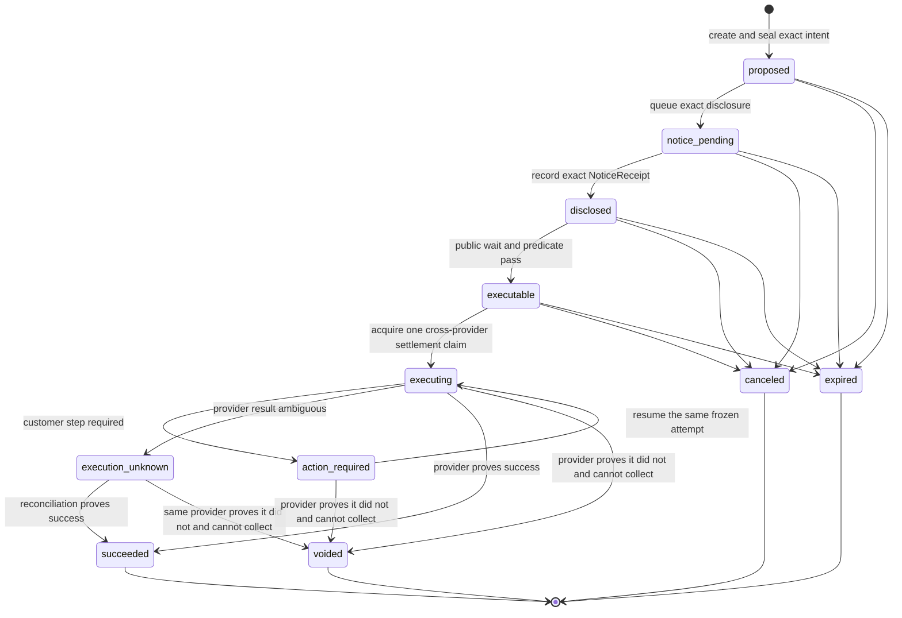
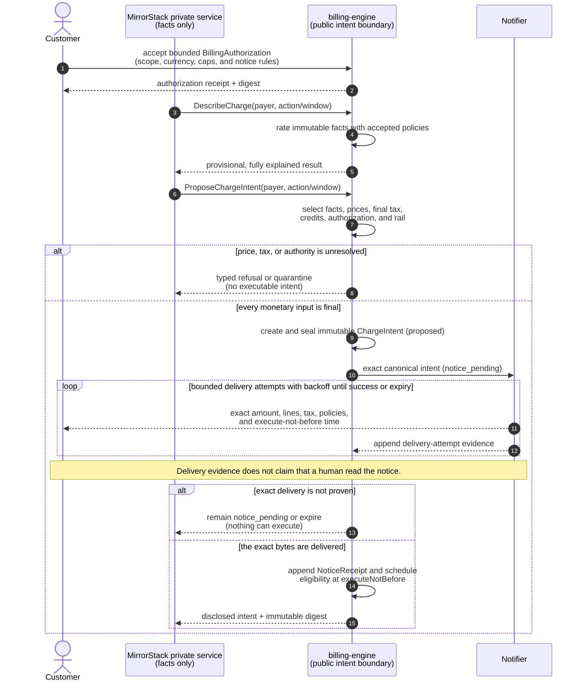
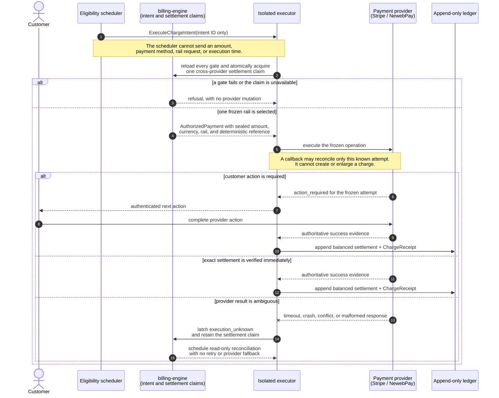
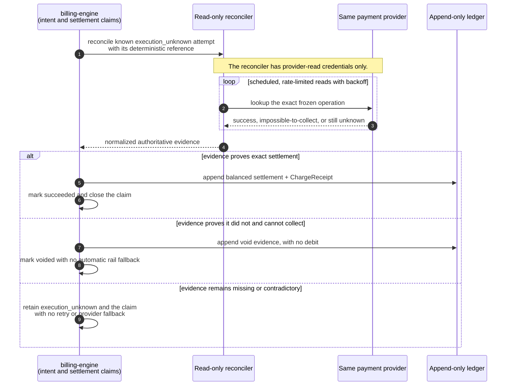
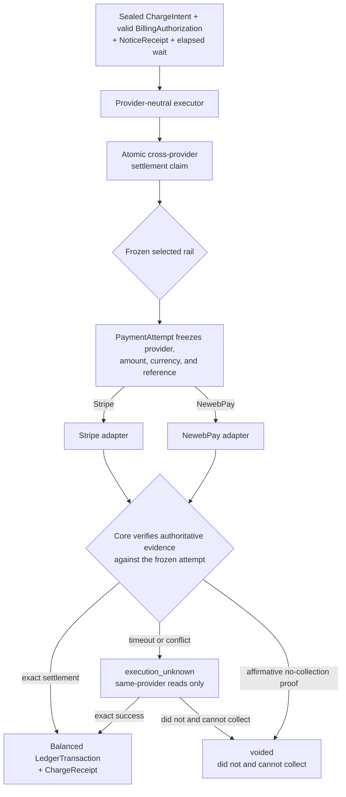

# The intent-only billing engine

The target shape of `billing-engine`: MirrorStack's private services report
facts and ask for a billing outcome, but they cannot name an amount, construct an
invoice line, select a tax result, claim that notice was delivered, or cause a
payment-provider mutation directly.

> **Status: proposed, not implemented, not deployed.**
>
> The current `main` branch contains several direct Stripe-writing paths. It has
> strong idempotency and recovery controls, but it does not have the immutable
> customer-visible intent, notice, authorization, and isolated execution boundary
> defined here. Until every legacy money-moving path is removed and
> `Capabilities` reports `legacyMoneyPaths: 0`, this repository must not claim
> that production billing is intent-only.
>
> Automatic merging and promotion of billing-engine changes are paused while
> this design is under review. This document describes the destination, not
> permission to charge under unfinished rules.

The question this repository must let a customer's developers settle is:

> **Can MirrorStack collect money for an amount, reason, tax treatment, or price
> revision that the customer was not shown and did not authorize?**

The desired answer is no, and each part of that answer must be reproducible from
public code and a customer-downloadable receipt.

---

## 1. Why reliable charging is not enough

The current engine already protects many operational invariants: integer money,
usage-event idempotency, frozen charge amounts, deterministic provider keys, and
reconciliation after ambiguous failures. Those controls answer:

> If the system decided to charge $N, can a crash accidentally charge $N twice?

They do not answer:

> Why was $N permitted, which accepted terms produced it, was the exact total
> disclosed before collection, and can the customer recompute it?

A billing run created immediately before a provider request is an execution
record, not customer intent. A mutable draft invoice hidden from the customer is
not notice. A post-charge "large amount" badge is not a pre-charge control. An
alert-only budget is not a stop.

This rebuild therefore separates five facts that are currently too close
together:

1. what happened (`UsageFact`),
2. what rules apply (`PriceBookRevision` and `TaxDetermination`),
3. what the customer authorized (`BillingAuthorization`),
4. what exact monetary effect is proposed (`ChargeIntent`), and
5. what an external rail actually did (`PaymentAttempt` and `ChargeReceipt`).

No one record substitutes for another.

---

## 2. The invariants

These are normative. A route, adapter, migration, or operator tool that violates
one is an architecture change, not an implementation detail.

### INV-001: the private caller reports facts, never money

Usage ingress may carry a payer or app subject, a declared meter, a module and
module version, an exact quantity/value, an occurrence time, and an idempotency
key. It may not carry `amount`, `price`, `rate`, `currency`, `subtotal`, `tax`,
`discount`, `credit`, `total`, `invoiceLine`, `paymentMethod`, `provider`,
`executeAt`, or notice/authorization status.

The closed request vocabulary is enforced by source/reflection tests. A new
field is rejected by default until its authority and consequence are documented.

### INV-002: one derivation powers preview and settlement

`DescribeCharge`, `ProposeChargeIntent`, invoice presentation, ledger posting,
and the offline verifier use the same pure rating model and canonical encoding.
There is no frontend formula and no alternate provider formula.

### INV-003: a sealed intent never changes

Once an exact `ChargeIntent` is sealed, none of its source references, lines,
policy versions, tax result, currency, rounding result, payer, authorization,
notice policy, execution window, or total may be updated. A one-unit change
creates a new intent, supersedes the old one, and repeats every required notice
and authorization check.

### INV-004: unknown produces no monetary effect

Missing or conflicting usage provenance, price policy, module manifest,
authorization, tax, notification evidence, payment-rail capability, or build
identity quarantines the intent. It never silently becomes zero, uses a mutable
fallback, guesses a jurisdiction, or calls a provider with a partial total.

### INV-005: no collection before exact notice

Automatic collection requires durable evidence that the exact sealed intent was
delivered under its notice policy and that `executeNotBefore` has passed.
Notification failure is a failed control and blocks execution.

Delivery evidence proves that a provider accepted delivery to the configured
destination. It does not prove that a human read the message, and no document or
UI may claim otherwise.

### INV-006: every debit has customer authority

Every debit references a valid `BillingAuthorization`. The authorization is
either one-time, for one exact intent, or standing, with bounded charge kinds,
currencies, cadence, price/terms revisions, per-charge and per-cycle ceilings,
notice rules, effective time, and expiry.

A private service credential cannot create, accept, widen, or revive an
authorization. Acceptance occurs on a customer-reachable route served by this
engine and binds the exact displayed bytes to the authenticated payer.

### INV-007: one isolated executor owns provider writes

Only the payment executor holds credentials that can collect, finalize, void, or
refund through a payment provider. It accepts an intent identifier, never an
amount. It reloads the sealed intent and independently evaluates every execution
precondition.

### INV-008: one intent can settle at most once across all providers

Stripe, NewebPay, and future rails may each create attempts, but a durable
cross-provider settlement claim permits one successful debit for an intent.
Reordered callbacks, retries, a rail switch, or an ambiguous timeout cannot
produce a second settlement.

### INV-009: provider callbacks reconcile; they never originate money

A webhook, return URL, or server callback must match a known `PaymentAttempt`,
intent, payer, provider account, currency, and exact amount. It may confirm or
refute a known attempt. It cannot create an intent, enlarge an amount, choose a
new payer, or insert a customer charge line.

### INV-010: infrastructure is not a customer charge dimension

Internal infrastructure cost may be measured for operations, publisher
settlement, or margin analysis, but it is outside the customer rating boundary.
The customer charge vocabulary contains no `infrastructure` line and no hidden
infrastructure multiplier. Platform costs must be recovered through a published
base or module price already covered by the customer's terms.

### INV-011: settled history is append-only

Late usage, pricing mistakes, tax corrections, disputes, refunds, and goodwill
credits never rewrite a settled intent or ledger entry. They produce a new,
linked adjustment, credit, reversal, or refund record with its own reason and
receipt.

### INV-012: source and policy identity are externally visible

Each intent and receipt names the engine Git commit, built artifact digest,
canonical schema version, terms revision, price-book digest, tax-policy digest,
and payment-adapter version. `Health` and `Capabilities` expose the running
identity rather than merely saying `ok`.

---

## 3. The durable model

### `UsageFact`

An immutable observation from an allowed producer. A fact contains no money.

Required identity includes:

- globally unique event id,
- producer and producer schema version,
- payer/account subject and app subject,
- module id and immutable module version where applicable,
- declared meter id and kind,
- exact integer/decimal quantity in the meter's declared scale,
- occurrence and ingestion times, and
- provenance needed to detect replay or cross-tenant substitution.

Corrections are new facts that reference the original. Deletion is not a billing
correction mechanism.

### `PriceBookRevision`

An immutable, content-addressed set of customer prices with a publication time,
future effective window, currency, rounding rules, and terms revision. A module
price is bound to an immutable module billing-manifest version. A later publish
cannot alter a rate that already accrued under an earlier revision.

There is no mutable "current price" fallback in rating. If a fact cannot resolve
one exact effective revision, rating stops.

### `TaxDetermination`

A versioned result with one of three semantic states:

- `final`: an amount and the evidence/rule that produced it,
- `not_applicable`: an explicit reason tax does not apply, or
- `unknown`: insufficient or unavailable evidence.

`final` may legitimately contain a zero amount. `unknown` is not zero and an
intent carrying it is never executable. See [`TAX.md`](TAX.md).

### `BillingAuthorization`

Customer authority to create monetary effects. The authorization binds:

- payer identity and billing entity,
- `one_time` or `standing` kind,
- permitted customer charge kinds,
- permitted currencies and payment rails,
- terms and price-book revision or accepted change policy,
- per-charge and per-cycle ceilings,
- cadence and notice policy,
- effective time, expiry, and revocation semantics,
- the customer-selected opaque payment-method/mandate reference, and
- the digest of the disclosure accepted by the customer.

The engine stores provider references as opaque, provider-scoped identifiers.
Provider secrets and reusable payment credentials never enter a public receipt.

Revocation blocks future intents and any waiting intent whose authority no
longer validates. It does not erase an already-settled obligation; the UI must
state the exact cutoff.

### `ChargeIntent`

The complete proposed monetary effect. It includes:

- intent id, schema version, payer, account, and billing period/action,
- each line's kind, source ids, quantity, unit/rate rule, exact arithmetic,
- subtotal, credits, tax, total, currency, and settlement rounding,
- price, module-manifest, tax, and terms revisions and digests,
- authorization id and the ceiling evaluated,
- selected payment rail, merchant-account policy, and opaque mandate/payment
  method reference covered by that authorization,
- canonical notice bytes, notice policy, and `executeNotBefore`,
- engine source/artifact identity,
- creation and expiry times, and
- a digest covering every field above.

No provider invoice id belongs in the intent. Payment providers are execution
rails, not the source of the debt.

### `NoticeReceipt`

Evidence that the exact intent digest and customer-readable explanation were
accepted by an allowed delivery channel. It records the destination class (not
unredacted personal data in public exports), channel, provider message id,
delivery status, timestamps, content digest, and policy revision.

A private caller cannot assert delivery. The notifier or a verified notification
provider callback writes this evidence.

### `PaymentAttempt`

One attempt to settle or refund an intent through one provider adapter. It
contains:

- provider and merchant-account identity,
- adapter version and declared capability set,
- opaque external object identifiers,
- the exact intent id/digest, payer, currency, and provider minor-unit amount,
- deterministic attempt/idempotency reference,
- customer-action/redirect state when required,
- verified callback and reconciliation history, and
- an append-only state transition log.

Provider-specific details live here, not in `ChargeIntent` or ledger semantics.

### `LedgerTransaction` and `ChargeReceipt`

The append-only ledger is monetary truth. A successful provider object without a
balanced ledger settlement remains a reconciliation incident, not a second
source of truth. Every transaction balances to zero and references the intent,
attempt, payer, and correction chain.

The customer receipt packages the intent, policy references, calculation proof,
notice evidence, authorization reference, payment attempt, and ledger entries.
It is sufficient for the public verifier to recompute the amount offline. See
[`LEDGER-AND-RECEIPTS.md`](LEDGER-AND-RECEIPTS.md).

---

## 4. Intent lifecycle

The canonical lifecycle is:



Terminal non-settlement exits are `canceled`, `expired`, and `voided`.
Superseding an intent creates a new intent; it does not edit the old one.

Proposal and disclosure are one bounded sequence:



The private caller names only the payer and action/window. The engine derives
every financial field, and any unresolved input fails closed. Notice retries are
bounded and backed off; waiting is scheduled rather than implemented as a busy
poll.

Execution uses a separate capability path:



Only the executor has provider-write credentials. Provider evidence is checked
against the frozen attempt before any balanced settlement or receipt is
appended.

Ambiguous outcome reconciliation is deliberately separate:



An ambiguous result retains the single settlement claim. Only same-provider
read-only reconciliation can resolve it; an operator may attach evidence but
cannot clear the latch by assertion.

### `DescribeCharge`

Read-only and side-effect free. It returns a provisional, fully explained view
using the same rater as sealing. It touches no notifier and no payment rail.

An estimate is labelled with every unresolved input. It cannot be transformed
into an executable intent by relabelling it as final.

### `ProposeChargeIntent`

Names a payer and a billing action/window. The engine selects all facts,
policies, lines, tax inputs, authorization candidates, currency, notice policy,
and execution time. The caller supplies none of them.

The output is either a complete immutable intent or a typed refusal. There is no
"best effort" monetary subset.

### Notice and waiting

The notifier sends the exact canonical intent. A material change after delivery
always means a new digest, new notice, and new wait. The minimum lead time and
which destinations count as delivered are unresolved product decisions and are
published by `Capabilities`; they are never hidden deployment constants.

### `ExecuteChargeIntent`

The scheduler queues an intent id only. The isolated executor loads all state and
requires this predicate:

```text
intent is immutable
AND exact notice is delivered
AND now >= executeNotBefore
AND authorization is valid and unrevoked
AND total <= every applicable ceiling
AND tax is final or explicitly not_applicable
AND every policy is published, effective, and digest-matching
AND the requested payment rail supports the required operation and currency
AND no settlement, void, expiry, or unresolved ambiguous attempt exists
```

Anything else is a refusal with no provider mutation.

### Customer-triggered payment

A one-time payment may become executable immediately when the engine-served page
shows the exact intent and the authenticated customer explicitly submits that
same digest. That customer action is both exact disclosure and one-time
authorization; it is not an exception that lets a private RPC bypass notice.

Whether a separate cooling-off period applies to one-time payments is a product
decision. Automatic collection always follows the standing authorization's
published notice period.

### Consolidation

Recurring base fees, module usage, module capacity/install charges, and other
periodic items should normally become one cycle intent per payer, currency, and
window. Immediate proration and per-module timer charges are removed rather than
copied into multiple intent executors. A charge that genuinely must occur
separately needs its own documented kind and authorization scope.

Auto top-up is a separate opt-in intent family with a separate standing
authorization, threshold, amount, frequency ceiling, payment method, notice
policy, and receipt. Enabling general billing never silently enables auto top-up.

---

## 5. Payment providers are adapters

The desired engine supports Stripe today and a NewebPay Taiwan adapter next.
Neither provider defines the domain model.



### Go structure: composition and narrow ports

Go does not use class inheritance. The equivalent boundary is built with small
interfaces defined by their consumers, composed structs, and package-private
constructors that make invalid authority difficult to represent.

The target is not one large `PaymentProvider` interface. Read and write
capabilities are deliberately separate:

```go
// Available to support, reconciliation, and customer trace views.
type PaymentReader interface {
	Capabilities(context.Context) (RailCapabilities, error)
	LookupAttempt(context.Context, AttemptReference) (ProviderEvidence, error)
	TraceCashFlow(context.Context, AttemptReference) (ProviderTrace, error)
}

// Injected only into the isolated executor binary.
type PaymentWriter interface {
	Execute(context.Context, AuthorizedPayment) (ProviderResult, error)
	Void(context.Context, AuthorizedVoid) (ProviderResult, error)
	Refund(context.Context, AuthorizedRefund) (ProviderResult, error)
}
```

`AuthorizedPayment`, `AuthorizedVoid`, and `AuthorizedRefund` can only be
constructed inside the executor package after loading an intent and passing the
full predicate in §4. An HTTP request cannot deserialize one. The scheduler's
interface is narrower still: it supplies only an intent id.

The Stripe and NewebPay packages adapt their SDKs and wire formats to these
domain ports. No Stripe SDK type, NewebPay request field, provider invoice
status, or webhook payload crosses into the intent or ledger packages.

### Adapter capability contract

Each adapter publishes machine-readable capabilities, including:

- supported currencies and settlement-unit exponent,
- customer-initiated and automatic collection,
- reusable mandate/payment-method support,
- redirect or other customer-action flow,
- asynchronous server callback and return-page semantics,
- authorize/capture, void, refund, and partial-refund support,
- provider idempotency and lookup/reconciliation support, and
- the maximum time an outcome may remain ambiguous.

The engine never assumes every provider behaves like Stripe. If a requested flow
needs a capability the selected adapter lacks, the intent remains non-executable
or moves to a documented manual path.

### Provider selection

The customer's accepted authorization names permitted rails and currencies. The
engine may choose among those rails according to published routing policy before
the intent is disclosed; the selected rail and routing-policy digest are then
frozen in the intent. A private caller cannot select a weaker adapter to bypass
notice, authentication, tax, ceilings, or reconciliation. Changing rail after
disclosure creates a replacement intent and repeats notice/authorization checks.

Locale alone never authorizes a payment method or currency. The supported
NewebPay products, recurring-payment capabilities, callback authentication,
TWD settlement behavior, and refund semantics must be documented from the
actual merchant agreement and adapter tests before that rail reports ready.

### Money representation

Rating uses exact integer arithmetic in a documented scale tied to a named
currency. Sealing performs the one documented conversion to that currency's
provider settlement unit. Adapters receive the already-authorized minor-unit
integer and may not re-rate it.

There is no implicit foreign exchange. If a payer changes currency, the engine
uses a published price-book revision in that currency or a separately disclosed,
versioned FX rule. An adapter fee is an internal cost unless it is an enumerated,
authorized customer line in [`CHARGES.md`](CHARGES.md).

### Ambiguous outcomes

A timeout after a provider request produces `execution_unknown`, not an automatic
retry. The adapter re-reads by deterministic reference and verifies provider,
merchant account, payer, amount, currency, and intent metadata. Only
provider-authoritative evidence that the operation did not and cannot collect
permits the attempt to close as `voided`; any later attempt requires a new
explicit eligibility decision and is never an automatic rail fallback. If the
provider cannot offer a safe lookup, the attempt remains `execution_unknown`.
Manual investigation may attach evidence but cannot clear the ambiguity latch by
assertion.

### Read-only provider cash-flow trace

Provider neutrality does not mean losing Stripe visibility. `PaymentReader`
reconnects a receipt to the provider and returns a normalized, read-only trace.
The canonical diagram and API contract are in
[`LEDGER-AND-RECEIPTS.md` §6](LEDGER-AND-RECEIPTS.md#6-cash-flow-trace-api).

Normal receipt and trace reads return append-only local evidence immediately and
make no provider call. An explicit refresh follows only exact stored references,
uses a rate-limited or batched `PaymentReader`, and appends observations without
changing the intent or ledger.

For Stripe, the adapter follows the Stripe objects and balance evidence that are
actually available for the account and API version. For NewebPay, the adapter
maps its order, payment, callback, settlement, and refund evidence into the same
normalized graph only where the contracted API exposes those relationships.
Unsupported edges are reported as unsupported, never invented.

Every observation records provider account, external id/type, amount, currency,
status, observed time, adapter version, and a digest of the canonical evidence.
Repeated observations are append-only snapshots so a later provider status
cannot rewrite what was observed earlier.

The provider trace corroborates the ledger and explains where cash went. It is
not allowed to create a customer obligation or silently repair a ledger total.
A mismatch opens a reconciliation incident and blocks dependent effects until a
typed resolution is recorded.

---

## 6. Capability separation

The boundary is enforced with separate binaries/IAM roles or equivalently narrow
process capabilities, not with comments around one omnipotent service.

| component | may do | must not do |
|---|---|---|
| usage ingress | validate and append constrained facts | read payment credentials; price; charge |
| pure rater | derive lines with immutable inputs | network, clock, database writes, provider calls |
| tax resolver | obtain/version tax evidence | collect money; silently return zero on uncertainty |
| intent sealer | append an immutable intent | notify; execute; edit a sealed intent |
| notifier | deliver exact sealed content and record evidence | alter totals; authorize; charge |
| eligibility scheduler | queue eligible intent ids | provide amounts or payment methods |
| payment executor | consume executable intents via adapters | accept caller-supplied money fields |
| webhook reconciler | authenticate and reconcile known attempts | originate or enlarge a charge |
| ledger writer | commit balanced transitions | infer success from an unverified callback |
| public verifier | recompute a receipt read-only | access provider secrets or mutate state |
| infrastructure analytics | calculate internal cost/margin | feed customer rating or invoice lines |

CI inventories imports and provider-write symbols. A new provider mutation
outside the executor fails the build. The executor interface contains no method
that accepts an arbitrary caller-provided amount.

---

## 7. What callers may send

The public request vocabulary is intentionally narrow.

| action | caller-supplied selection | monetary effect |
|---|---|---|
| `RecordUsage` | declared subject, meter, module version, quantity, occurrence, event id | none |
| `DescribeCharge` | payer + action/window | none |
| `ProposeChargeIntent` | payer + action/window | none |
| `AcceptBillingAuthorization` | engine challenge + exact displayed digest, on the customer route | grants bounded future or one-time authority; no immediate provider write |
| `ExecuteChargeIntent` | intent id only, from the scheduler | may create one bounded provider attempt |
| `CancelChargeIntent` | intent id + authenticated customer/operator reason | prevents future execution; cannot erase a settlement |
| `GetChargeReceipt` | customer-owned intent/receipt id | none |
| `Capabilities` / `Health` | none | none |

The internal private-service transport cannot call
`AcceptBillingAuthorization`. That route is served to the authenticated customer
by the engine that records the acceptance. The authorization receipt binds the
exact bytes and challenge; a boolean such as `accepted: true` from the private
caller is never a control.

Administrative corrections also name an existing intent/ledger entry and a
typed correction reason. The engine derives the reversal or credit. An operator
cannot post an arbitrary customer debit through a generic adjustment endpoint.

---

## 8. Pricing, module manifests, tax, and customer lines

The exhaustive customer-visible effect vocabulary lives in
[`CHARGES.md`](CHARGES.md). If a positive charge kind is not documented there,
the engine cannot produce it.

Key boundaries are:

- platform base pricing is an immutable, future-effective price-book revision;
- each billable module metric is declared in a versioned module billing
  manifest, with no mutable version-less fallback;
- module developers report usage facts but cannot send prices during usage;
- material price changes follow a published notice/grandfathering policy;
- tax is a separately versioned determination, never a hidden percentage;
- credits reduce an intent through explicit source entries; and
- infrastructure remains internal cost and never appears as a customer line.

The public receipt explains quantity, unit/rate/tier, source, arithmetic,
rounding, credits, taxable basis, tax rule, and total for every line.

---

## 9. Stops, ceilings, and already-accrued obligations

The word "budget" is not sufficient. Each control states which consequence it
has:

- `alert`: records and delivers a threshold event; never described as a stop,
- `service_cap`: prevents new billable work after the threshold,
- `collection_cap`: prevents automatic collection above the authorized amount,
- `authorization_revocation`: blocks new/waiting intents under that authority,
- `auto_topup_disable`: prevents new top-up intents, and
- `account_close`: stops new accrual and begins a disclosed finalization flow.

The product must decide whether the UI's current "stop" means service cap,
collection cap, or both. Until that is decided and implemented, the control is
labelled alert-only.

No stop silently forgives already-accrued debt. `DescribeCharge` must show the
amount accrued before the cutoff, and any later attempt to collect it still
requires an executable intent and its notice/authorization rules.

Lowering a ceiling while an intent waits is honored at execution time. Raising a
ceiling does not mutate the intent; it may make the same sealed total eligible if
all other terms still match.

---

## 10. Public verification and deployment identity

Each settled charge has a downloadable canonical bundle that includes:

- intent and digest,
- source event/aggregate ids or privacy-preserving hashes,
- module and billing-manifest versions,
- calculation steps and rounding,
- terms, price-book, tax-policy, and notice-policy digests,
- tax evidence and status,
- authorization and evaluated ceilings,
- exact notice content digest, delivery evidence, and wait,
- engine Git commit, artifact/container digest, build provenance,
- payment adapter and attempt evidence, and
- balanced ledger transaction and correction chain.

This repository ships an offline verifier:

```text
billing-verify verify charge-bundle.json
```

It recomputes without contacting MirrorStack or a payment provider. Sensitive
customer facts are available only to the owning payer, while code, schemas,
policies, golden vectors, and the verification algorithm are public.

`Health` publishes exact build identity on every response, including unhealthy
ones. `Capabilities` publishes at least:

- target-design and receipt schema versions,
- active price, terms, tax, notice, and routing policy digests,
- provider-adapter versions and readiness,
- executor and notifier readiness,
- configured minimum notice policy,
- whether customer authorization routes are reachable,
- public verification/transparency-log readiness, and
- an explicit count and names of reachable legacy money paths.

An unstamped build says `unknown` and cannot execute. Production enablement
requires `legacyMoneyPaths: 0`.

---

## 11. Migration and readiness gate

The rebuild proceeds without trusting the new calculator on day one:

1. Publish these documents as proposed and keep current gaps prominent.
2. Inventory every provider mutation and add a CI allow-list that names it.
3. Build the pure rater, canonical schemas, versioned policy store, and verifier.
4. Generate shadow intents from current usage without notifying or moving money.
5. Reconcile shadow totals against current invoices until every difference is
   explained; never tune the rater to hide an unexplained difference.
6. Add authorizations, notice receipts, tax fail-closed behavior, ceilings, and
   the customer review/download surface.
7. Isolate the executor and give provider-write credentials only to it.
8. Implement Stripe as the first adapter and NewebPay as an independent adapter
   against the same conformance suite.
9. Test crash, duplicate, reorder, ambiguous response, rail switch, notification
   outage, tax outage, revocation, and concurrent ceiling changes.
10. Migrate every caller to intents first, then remove direct charge code and
    revoke legacy provider credentials.
11. Enable collection only when `Capabilities` proves the whole deployment is
    intent-only and a manual billing/security review accepts the evidence.

The weakest reachable path defines the guarantee. Shipping an intent surface
next to a legacy direct-charge route does not make the deployment intent-based.

### Current money paths that require migration

At the time this proposal was written, current `main` includes provider effects
for cycle collection, app creation/proration, module capacity/overage, custom
domains, manual invoice payment, manual credit purchase, and auto top-up. The
exhaustive, source-linked inventory belongs in [`CHARGES.md`](CHARGES.md) and
must be generated/checked by CI before cutover.

---

## 12. Product decisions still required

These do not block documenting or implementing the safe skeleton. They do block
production execution, which fails closed until each is settled in a proposed
and then accepted ADR:

1. what counts as delivered notice, which contacts receive it, and the minimum
   lead time for automatic collection;
2. exact standing-authorization ceilings, cadence, expiry, and renewal;
3. whether the budget "stop" pauses billable service, blocks collection, or
   both;
4. price-change notice, module-version grandfathering, and cancellation policy;
5. merchant-of-record and tax responsibility, inclusive/exclusive display,
   location evidence, exemptions, reverse charge, rounding, and refunds;
6. supported currencies, TWD pricing, and whether any FX is offered;
7. NewebPay products/capabilities allowed by the merchant agreement;
8. proration, late usage, negative totals, small balances, and retry policy;
9. payer/organization transfer and responsibility for existing obligations; and
10. retention and customer export rules for financial evidence and personal
    data.

Until accepted, documentation names these as decisions rather than reconstructing
business policy from current constants or code comments.
