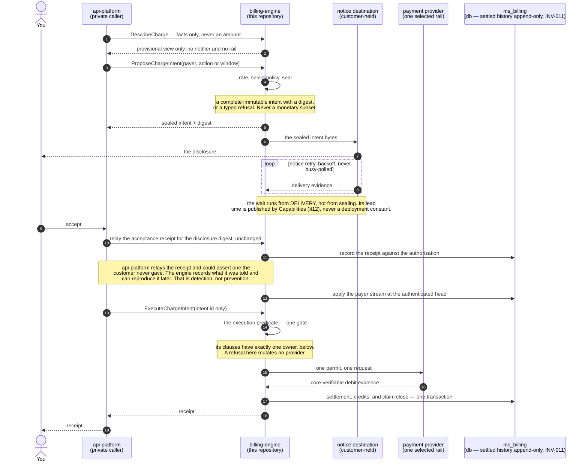
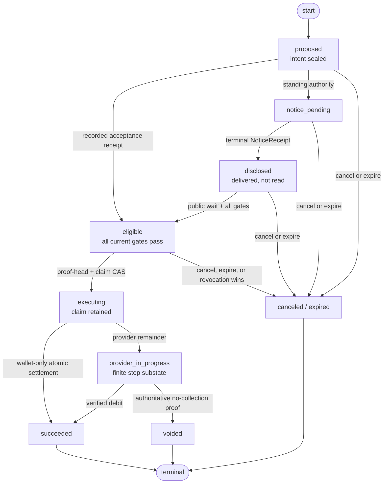
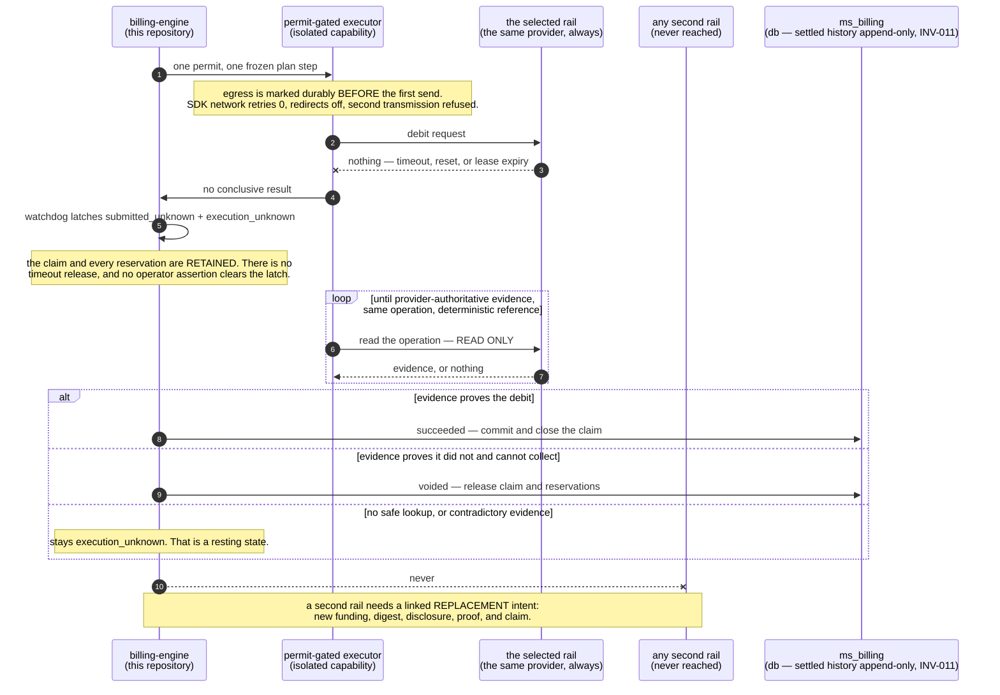

# The intent-only billing engine

The shape `billing-engine` is being rebuilt into. MirrorStack's private services
report what happened and ask for a billing outcome. On this surface they cannot
name an amount, build an invoice line, choose a tax result, claim that notice was
delivered, or cause a payment-provider mutation.

The question this repository has to let your developers settle by reading it:

> **Can the conforming path collect money that was never disclosed and authorized
> under the rule you accepted?**

Four things must survive that question separately — the amount, the reason, the
tax treatment, and the price revision that produced them. Answering it for the
total alone is not answering it.

The target answer is no, under the trust assumptions in
[`SECURITY.md` § Adversary model](../SECURITY.md#adversary-model). It is not a
proof against everyone. A replaced executor, or any other holder of an
unrestricted merchant credential, can charge out of band. Attestation, credential
isolation and reconciliation make that bypass narrow or detectable. They do not
make it impossible, and nothing here claims they do.

> **Status: target design. Not implemented, not deployed.**
>
> Every model type named below returns zero files from
> `git grep <Type> -- '*.go'` on `main`, and each is marked `(unbuilt)` where its
> section first names it. Present-state facts about shipped code appear only with
> a file path in the same paragraph. Read every other verb as *must*.
>
> **What is shipped is not a smaller version of this.** The engine already
> derives amounts, already holds the mutation-capable Stripe credential in the
> binary that serves the account API (`cmd/account-api/main.go:506`), and already
> collects. What it lacks is the ceremony that would make those amounts
> answerable to you. The trust you extend to MirrorStack today is therefore not
> the trust this document describes, and this document is not permission to
> charge under unfinished rules.
>
> 🔴 **The intent, notice and authority ceremony does not exist.** There is no
> sealed object you can be shown before collection, and no receipt you can
> recompute after. §3 says what each must be, §4 the order they run in.
>
> 🔴 **INV-006 is a trust assumption, not a control.** `api-platform` holds your
> session, and the engine treats the subject id it is handed as opaque
> (`internal/account/billing/service.go:105-109`). It can relay an acceptance you
> never gave. The engine records what it was told and can reproduce it later,
> which is detection rather than prevention. §3 says it plainly; the stronger
> form is decision 16 in §12.
>
> 🔴 **One mutation-capable credential is not one attested enclave.** INV-007 is
> that rule, and §9 is its only owner.
>
> 🔴 **A customer-visible infrastructure line carries a markup its own displayed
> unit price does not include.** INV-010 says infrastructure is not a customer
> charge dimension, and §6 owns that rule and the present state, with paths.
>
> The single enumeration of current defects is
> [`SECURITY.md` § Known current gaps](../SECURITY.md#known-current-gaps). This
> file links there and never restates it.

[`VERIFICATION.md`](VERIFICATION.md) owns the charge-bundle field contract and
the static architecture checks CI runs. [`../SECURITY.md`](../SECURITY.md) owns
the adversary model and the defect register.

---

## 1 · Why deriving the charge is the whole design

The shipped engine is careful. Money is integer. Usage events dedupe on
`event_id` (`internal/account/db/queries/usage.sql:210`). Charge amounts freeze
before dispatch, and ambiguous failures reconcile instead of retrying.

Every one of those answers the same question:

> If the system decided to charge $N, can a crash accidentally charge $N twice?

That is not your question. Yours is:

> Why was $N permitted? Which terms that I accepted produced it? Was the total
> shown to me before it was collected? Can I recompute it myself?

### What a caller-supplied amount costs you

Suppose the engine took the charge from its caller. The request would look like
this, and every field in it would pass validation:

```
POST /charge
  payer     acct_9f21
  amount    481200        # integer, non-negative, minor units
  currency  usd
  reason    "usage"
```

Everything a reviewer can check about that request is true. The amount is an
integer, the payer exists, the currency is supported, the reason is one of the
strings we allow. A stricter validator finds nothing more, because there is
nothing more in the request.

None of it is a *rule*. No field names a price revision, a usage fact, a tax
determination, or terms you agreed to. There is no artifact to rebuild the number
from, so nobody — you, us, or an auditor afterwards — can separate these two:

- a private service with an off-by-one in a proration branch, and
- a private service that has been replaced.

Both send a well-formed request for a number of their choosing. The engine
accepts both, collects both, and issues a receipt for both. The receipt says $N
was collected. It cannot say why $N.

That is not fixable with a bigger validator. The validator sees only the request,
and the reason a number is right or wrong is not in the request.

<a id="inv-001"></a>
**INV-001 — the private caller cannot make money authoritative.** Usage ingress
may carry a payer or app subject, a declared meter, a module and its immutable
version, an integer quantity, an occurrence time, and an idempotency key.

It must not carry `amount`, `price`, `rate`, `currency`, `subtotal`, `tax`,
`discount`, `credit`, `total`, `invoiceLine`, `paymentMethod`, `provider`,
`executeAt`, or a notice or authorization status.

### What deriving gives back

A derived charge is one you can rebuild. The engine selects the facts, resolves
one effective price revision, determines tax, applies your accepted terms, and
seals the result under a digest. The number stops being an assertion and becomes
an output — and an output has inputs, which can be named, published and checked.

That property survives only while exactly one implementation computes it.

<a id="inv-002"></a>
**INV-002 — one derivation powers preview and settlement.** `DescribeCharge`,
`ProposeChargeIntent`, invoice presentation, ledger posting and the offline
verifier must use the same pure rating model and the same canonical encoding. No
frontend formula and no per-provider formula may exist.

Two implementations of one question drift, and the looser one is the one that
charges. If the screen showing you a total runs its own arithmetic, the total you
approved and the total we collect are related by hope. Sharing the rater is what
turns a preview into a promise.

### The five facts that keep getting confused

Four substitutions are why today's shape cannot answer you. A billing run created
moments before a provider request is an execution record, not your intent. A
mutable draft invoice you cannot see is not notice. A post-charge "large amount"
badge is not a pre-charge control. An alert-only budget is not a stop — today's
budget service is alert-only by design
(`internal/account/budget/service.go:260`).

So the rebuild pulls five facts apart and gives each its own record:

| the fact | the object that carries it |
|---|---|
| what happened | `UsageFact` |
| which rules apply | `PriceBookRevision`, `TaxDetermination` |
| what you authorized | `BillingAuthorization` |
| what effect is proposed | `ChargeIntent` |
| what an external rail actually did | `PaymentAttempt`, `ChargeReceipt` |

Every type in that table is unbuilt. No one record may substitute for another,
and §3 spends its whole length enforcing that one sentence.

---

## 2 · What api-platform can ask for, and what it cannot

The private half has two ways to reach this engine about money, and neither one
is a charge.

**It can report a fact.** `RecordUsage` carries an observation and no money:

```
RecordUsage
  subject        payer or app
  meter          declared meter id and kind
  moduleVersion  immutable, taken from the manifest
  quantity       integer, in the meter's own scale
  occurredAt     when it happened
  eventId        idempotency key
```

There is no amount field, no rate, no currency, and no place to put one. A
quantity in a meter's scale is not money until a price revision resolves against
it, and the caller does not choose the revision.

**It can ask for an outcome.** `ProposeChargeIntent` names a payer and either a
billing action or a window. It may also relay one closed `ProposalSelection`: an
engine-signed catalog revision, an offer id, and only the choice fields that
template declares. A variable top-up amount is such a declared choice, and it is
not a charge amount. The engine verifies the template signature and the declared
range, then derives currency, lines, tax, funding and eligibility itself.

**It can name an intent id.** `ExecuteChargeIntent` takes one and nothing else,
which is §4. Customer product routes are a separate surface with its own
credential, and nothing typed there becomes authoritative by being relayed.

### What it may never send

- **An amount, in any spelling** — `amount`, `total`, `subtotal`, `rate`,
  `discount`, `credit`, rejected on every surface above.
- **A funding split.** Which part comes from wallet and which from a card is a
  `FundingPlan` (unbuilt) the engine freezes before you are shown anything.
- **A provider or rail.** Your accepted authorization names the permitted rails,
  and the engine chooses among them under published policy — §5.
- **A mandate.** A saved payment method is a receipt this engine holds, never a
  field a caller supplies.
- **A tax result.** §7 owns that, and it refuses to guess.
- **A notice claim.** `accepted: true` and "we notified them" are assertions. §3
  says what counts as evidence instead.
- **An execution time.** There is no `executeAt`. Eligibility is derived, and the
  waiting period runs from delivery.

Free-form money fields and a caller's own approval statement must be rejected. So
must a field nobody has documented yet.

<a id="inv-004"></a>
**INV-004 — an unknown input cannot dispatch an effect.** Missing or conflicting
usage provenance, price policy, module manifest, authorization, tax, notification
evidence, rail capability or build identity must quarantine the intent. It must
never silently become zero, fall back to a mutable default, guess a jurisdiction,
or call a provider with a partial total.

The default matters more than the list. A new request field is refused until its
authority and its consequence are written down. A validator that permits whatever
it was not taught to refuse is the §1 shape, arriving one field at a time.

---

## 3 · What must be true before any money moves

Nine rules, then the objects that carry them. Each rule closes one specific way
money escapes, and the objects only make sense once you know which.

### The intent is sealed, or it is not an intent

<a id="inv-003"></a>
**INV-003 — a sealed intent never changes.** Once sealed, a `ChargeIntent`
(unbuilt) may not update source references, lines, policy versions, tax result,
currency, rounding, payer, authorization, notice policy, execution window or
total. A one-unit change creates a new intent, supersedes the old one, and
repeats every notice and authorization check.

Otherwise the document says one thing when you read it and another when it
settles. Nobody can put a number on how far a mutable object drifts, so it is not
made mutable. Superseding is cheap; editing is unanswerable.

### Notice is delivery, not sending

<a id="inv-005"></a>
**INV-005 — no collection before notice.** Automatic collection requires durable
evidence that the sealed intent was delivered byte-for-byte under its notice
policy, and that `NoticeReceipt.eligibilityNotBefore` has passed
(`NoticeReceipt` is unbuilt). Notification failure is a failed control and must
block execution.

Delivery evidence means the carrier reported your configured destination in a
terminal status the accepted policy defines as destination-delivered. Queue
acceptance is not enough: handing a message to a queue proves only that we tried.

**It does not prove a human read it,** and no document, screen or receipt may
claim otherwise. It proves that the bytes you were sent are the bytes that will
be collected against, and that a clock started when they arrived.

### Authority is yours, and today we cannot prove you gave it

<a id="inv-006"></a>
**INV-006 — every debit has customer authority.** Every debit must reference a
valid `BillingAuthorization` (unbuilt), either one-time for one sealed intent or
standing. A standing authorization declares charge kinds, currencies, cadence,
price and terms revisions, ceilings, notice rules, effective time and expiry.

A private service credential must not create, widen or revive one by assertion,
and must never supply the amount. Authority must be established by an
engine-signed disclosure that `api-platform` relays unchanged, plus an acceptance
receipt bound to that disclosure's digest, recorded and later reproduced in the
charge bundle.

🔴 **That is a trust assumption, not a control.** `api-platform` holds your
session, and the engine treats the caller-supplied subject id as opaque
(`internal/account/billing/service.go:105-109`). It can assert an acceptance you
never made, and this engine cannot disprove it.

What survives is reproducibility: the disclosure, its digest and the receipt stay
readable, so a fabricated acceptance is something you can later point at. That is
detection. The stronger form — an engine able to distrust `api-platform` about
consent — is decision 16 in §12, and it is a separate identity product.

### One settlement, across every rail

<a id="inv-008"></a>
**INV-008 — one intent settles at most once, across all providers.** A
wallet-only intent has no provider attempt. Any other has one frozen semantic
`PaymentAttempt` (unbuilt) and one finite `ProviderExecutionPlan` (unbuilt),
which may hold several uniquely fenced step operations. No operation outside the
plan is permitted, and a second attempt or a second rail requires a linked
replacement intent with new funding, digest, disclosure and eligibility.

The control is a durable cross-provider settlement claim, not per-adapter
idempotency. Per-adapter idempotency cannot see a second rail, and a second rail
is where the second charge comes from. Reordered callbacks, retries and an
ambiguous timeout must never produce a second settlement.

### Callbacks reconcile. They never originate.

<a id="inv-009"></a>
**INV-009 — provider callbacks reconcile money, they do not create it.** A
webhook, return URL or server callback must match a known `PaymentAttempt`,
intent, provider and merchant account, currency, and amount. It must also match
an authoritative provider payer identity, or an authenticated deterministic
operation reference bound to the frozen local payer and attempt. The adapter
declares which it supports.

A callback may confirm or refute that known attempt. It must not create an
intent, enlarge an amount, choose a new payer, or insert a customer charge line.
Otherwise the public internet is an input to your bill.

### Settled history is append-only

<a id="inv-011"></a>
**INV-011 — settled history is append-only.** Late usage, pricing mistakes, tax
corrections, disputes, refunds and goodwill credits must never rewrite a settled
intent or ledger entry. Each produces a new linked adjustment, credit, reversal
or refund record, with its own reason and receipt.

A number you were shown stays shown. What changes is what comes after it, and the
chain between them is readable.

### You can name the code that charged you

<a id="inv-012"></a>
**INV-012 — source and policy identity are externally visible.** Each intent and
receipt must name the engine Git commit, the built artifact digest, the schema
version, the terms revision, the price-book digest, the tax-policy digest and the
adapter version. `Health` and `Capabilities` must produce engine-signed running
identity.

The independent evidence edge is the customer path. `api-platform` may relay
those bytes unchanged and must not replace them with a bare `ok`. Reading this
repository is worth something only when a receipt names which revision ran.

### Two operations take the lock, and metering is not one of them

<a id="inv-013"></a>
**INV-013 — proof ordering and the execution claim are one serialization
boundary.** The engine must append each recorded acceptance receipt to one
engine-owned, gap-free, monotonic authority log per payer: the payer stream. It
is internal, no external caller may append to it, and a sequence is assigned only
by a durable write.

Exactly two operations lock that stream:

1. **claim acquisition** — the transaction acquiring the core-owned settlement
   claim, and
2. **provider-dispatch capability consumption** — the transaction CASing a step
   from `active` to `dispatching`.

Both must do four things in one transaction:

- lock the payer stream head row,
- require `appliedHead == currentHead` on the authenticated head,
- apply every accepted sequence through that head, within the published
  `maxProofApplyBatch`, and
- carry a generation CAS, so a delayed consumer fails rather than commits.

A stale, missing, gapped or unverifiable head fails closed.

**No third locker.** The metering ingest path must not take this lock. Usage
admission races revocation and window close on the authority and checkpoint rows
instead, which is where those cutoffs live. Adding metering here would make one
Postgres row the ceiling on a customer's whole billing activity, and today that
path is a lock-free idempotent insert
(`internal/account/db/queries/usage.sql:210`).

The ordering this buys is precise. A revocation accepted before the capability
changes from `active` to `dispatching` revokes it and wins. One serialized after
that CAS receives the already-dispatching cutoff. Wall-clock arrival order is not
authority, and the receipt says which side of the CAS a revocation landed on.

### Your evidence must not depend on the relay

<a id="inv-014"></a>
**INV-014 — customer evidence does not depend on the private relay.** A signed,
customer-encrypted evidence record must commit through a billing-owned
transactional outbox. The list of events is closed: a sealed intent, a proof
result, a notice or eligibility result, a refusal, a nonterminal attempt state, a
settlement, a revocation and a correction.

The independent evidence edge may serve those records and must not create or
mutate one. Reads require a payer-bound `CustomerReadProof` (unbuilt); an
`api-platform` identity assertion, or possession of an object id, is not enough.

`CustomerReadProof` binds an independently enrolled customer factor that does not
exist today, so this stronger form also waits on decision 16 in §12. The outbox
is worth building first anyway: it makes your evidence a durable side effect of
the money moving, rather than a report the relay chooses to render.

### What the objects are for

Every type below is unbuilt. This table replaces the field-by-field catalogue an
earlier draft carried: it says which rule each object exists to carry, and the
schema says what is inside it. Four of them have a shape that is itself a
control, and only those four get paragraphs.

| type | carries | what it is for |
|---|---|---|
| `UsageFact` | INV-001, INV-004 | an immutable observation with no money in it; its occurrence time is never authority by assertion, and a post-close fact with an older bare timestamp is quarantined |
| `PriceBookRevision` | INV-002, INV-004 | one immutable, content-addressed price set with an effective window; there is no mutable "current price" fallback, because a fallback is how an unpublished number reaches a bill |
| `TaxDetermination` | INV-004 | a versioned three-state result — owned by §7 |
| `MerchantOfRecordBinding` | INV-003, INV-009 | the legal seller, then the settlement route, in that order; route selection must not change price, tax or gross obligation |
| `BillingAuthorization` | INV-006 | what you agreed to, with its ceilings — below |
| `SubscriptionOffer` | INV-006 | a billing-domain schedule, never a provider-native one; activation is settlement-gated and opens no billable window until the first settlement |
| `BillingResponsibilityTransfer` | INV-006, INV-011 | a typed payer cutoff, never a field update; accrued obligations stay with the old payer and facts cannot backdate across it |
| `CustomerProofStream` | INV-013, INV-014 | the payer stream itself, verified before a sequence is assigned; an invalid candidate consumes no sequence |
| `AuthorityEvidence` | INV-005, INV-006 | one tagged branch per bundle — setup, customer-present debit, or standing automatic — so a setup receipt can never verify as debit authority |
| `BillingDecisionProof` | INV-012, INV-014 | signed transition evidence stating its own ceiling; it reports `state_assurance: attested` because it cannot prove a compromised core hid a competing row |
| `FundingPlan`, `CreditReservation`, `AuthorizationExposureReservation` | INV-006 | how the obligation is paid, frozen before disclosure — below |
| `AutoTopupTriggerReservation` | INV-006, INV-008 | below |
| `RefundIntent`, `RefundPlan`, `RefundCapacityReservation` | INV-011 | below |
| `ReceivableCollectionReservation` | INV-008, INV-011 | one immutable receivable per refused or unpaid obligation; later collection links a new intent and never re-rates the source |
| `BillableSourceAllocation` | INV-008, INV-011 | the double-charge control on the source side: each immutable leaf enters one draft lineage, sealed all-or-nothing at a final barrier |
| `ServiceAccrualExposure` | INV-006 | below |
| `ChargeIntent` | INV-003 | the sealed proposal, with published size limits that refuse or split rather than truncate a total |
| `NoticeReceipt` | INV-005 | carrier-verified delivery and the clock it starts |
| `ProviderExecutionPlan` | INV-007 (§9), INV-008 | the finite ordered plan — §5 |
| `PaymentAttempt` | INV-008, INV-009 | the one semantic attempt and its claim — §5 |
| `LedgerTransaction`, `ChargeReceipt` | INV-011, INV-012, INV-014 | monetary truth and its receipt — §8 |

#### Authority, and the ceiling you cannot widen by lowering it

A `BillingAuthorization` carries fields that are controls rather than
description:

- permitted charge kinds, currencies, rails and effect classes,
- the `MerchantBindingSet`,
- separate gross-obligation, wallet, provider-remainder, per-charge and
  per-cycle ceilings,
- the notice policy,
- a mandatory `ProviderAutonomyPolicy = no_autonomous_future_debit`,
- the accepted evidence-strength class and a `PaymentInstrumentBinding`, and
- the digest of the disclosure you accepted.

Its `AuthorizationScopeKey` separates independent authority families — service
and collection, auto top-up, receivable collection — while grouping revisions
that must never coexist. One payer proof-stream transaction activates revision N,
supersedes N-1 and revokes older `active` grants. Exposure rows are keyed by
scope and window, never by revision id, so replacing a cap or a saved card cannot
reset exposure already settled or already reserved.

> If a lowered ceiling is already exceeded, the new revision may revoke future
> execution. It must not create capacity. Capacity returns only when exposure
> falls back within the accepted bound.

Without that clause, lowering a limit becomes a way to raise one. Raising a
ceiling or replacing a method requires a new acceptance ceremony, and old and new
revisions must never spend concurrently.

Service and collection authority are evaluated apart, even in one record. Every
service fact must reference the revision that permitted that service at its
service time. Later revocation stops future accrual and does not erase an accrued
receivable, while wallet consumption or external collection additionally requires
collection authority current inside the settlement transaction. A line with no
effective service authority is quarantined, never turned into customer debt.

#### Two kinds of credit that must never merge

Every intent freezes one provider-neutral `FundingPlan` before disclosure. It
carries the funding mode, credit-lot allocations and reservation ids, gross
obligation and wallet application. It also carries the optional provider
remainder, exposure reservation ids, cap evaluations, and an executable,
shortfall or cap-refused state. The typing rule under it is small and
load-bearing:

- A `rating_credit` — promotional, adjustment or tax credit — reduces the
  obligation under public rating and tax rules.
- A `stored_value` lot funds the resulting obligation. It must never appear as a
  second negative line, and must never change the taxable basis.
- Each credit source is typed one or the other, never both.
- A source id or lot carries a unique-use constraint across those two domains.

Without the last two, the same value is subtracted from what you owe and then
spent again to pay it. That double-spend is named in
[`SECURITY.md`](../SECURITY.md#known-current-gaps), which links back here. In
every target schema `ChargeIntent.total` is removed, or is a versioned alias for
`grossObligation`, whose equations by intent kind live in §6.

Lot selection is deterministic, under the account lock: compatibility, actual
expiry, accepted priority, then original stable lot id. Exceeding the published
`maxFundingLotsPerIntent` returns a typed capacity refusal rather than silently
skipping value. Funding eligibility is closed by intent kind: `credit_purchase`
and `auto_topup` create stored value, so `walletFunding = 0` and
`providerRemainder = grossObligation`.

**Prepaid value must survive its own expiry date.** A lot may back a deferred
prepaid reservation under one condition. Your accepted lot terms must preserve
its reserved slice past nominal expiry, until the bound service window reaches
terminal consume or release. A lot without that rule may fund only a
same-transaction wallet settlement completed while it is eligible. Admission
without the preservation proof is refused, with no service and no debt.

An expiry worker locks the same serialization boundary as allocation and may
retire only unreserved value. It must not expire, reallocate, refund or claw back
a reserved slice. Refund, clawback, close and expiry share one range fence, so a
crash leaves either the reservation or the terminal expiry, never both.

That binds to live code. Credit lots carry a nullable `expires_at`
(`migrations/billing/048_credit_wallet.up.sql:60-61`), and `WalletSpendableLots`
filters on `(lot.expires_at IS NULL OR lot.expires_at > CURRENT_TIMESTAMP)`
(`internal/account/db/queries/credit_wallet.sql:270-292`). A grant can therefore
be filtered out in the middle of a service window today.

#### Ceilings that are reservations, not counters

An aggregate ceiling read and then checked is a race with a name. For each
authorization, cap and window, planning locks exposure rows in a deterministic
order and requires:

```text
settled exposure + active reservations excluding candidate + candidate
  <= accepted ceiling
```

It then creates unique reservations for gross obligation, wallet application,
provider remainder, and frequency or count caps, so two concurrent intents cannot
each spend the same remaining cycle limit. Reservations are consumed into settled
exposure at settlement, and retained through `action_required`,
`provider_pending` and `execution_unknown`. They are released only by a
pre-dispatch cancellation or revocation, by expiry before dispatch, or by an
authoritative no-collection close.

**Exposure is gross and monotonic** inside its accepted window by default. A
verified pre-debit void or release frees its matching active reservation. A
settled debit, an established hold occurrence, and frequency or count use are
never restored — not by refund, chargeback, dispute credit, reversal or
write-off. Re-crediting cap capacity requires a separately accepted
`CapRecreditPolicy` naming the source effect, the amount restored, the window and
an anti-loop ceiling. It must never be inferred from a net ledger balance.

An automatic top-up may begin only by acquiring one durable
`AutoTopupTriggerReservation`, in the transaction that locks your payer and
currency balance row, under a predicate both planning and consume evaluate:

```text
projectedBalance = settledBalance + otherPendingFunding(excluding candidate)
triggerEligible  = projectedBalance < acceptedThreshold
```

If another funding operation already recovered the balance, the still-`active`
intent is canceled and its reservations released atomically. Without that second
evaluation, a queue of stale triggers tops your wallet up several times over.

#### Refund capacity, and the cap-reset attack

A `RefundIntent` is a separately typed immutable return effect, never a
`ChargeIntent` and never valid as debit authority: no `FundingPlan`, no debit
authorization, no provider debit remainder. It references one immutable settled
source effect and takes a source-linked capacity reservation in the transaction
that freezes its amount, operation identity and claim generation, requiring:

```text
candidate refund <= max(0,
  original refundable amount
  - settled refunds
  - active refund reservations
  - observed or conservatively reserved external source-return effects)
```

External source-return effects are every verified reversal, chargeback or dispute
credit the published finance policy says reduces remaining collectible value, and
pending versions reserve their conservative maximum. Externally imposed effects
are always appended even when they push net return past the original amount, and
that overflow opens an incident rather than hiding what the provider says.

The attack this closes is a loop: refund to free ceiling headroom, re-spend the
freed capacity, repeat. When the source is `credit_purchase` or `auto_topup`, a
cash return additionally requires a `GrantedValueClawbackReservation` over the
source-created lots. The refund is then executable only while those lots are
unspent and can be frozen. Gross-monotonic exposure and that clawback together
mean the loop cannot reopen cap capacity. Without both, the ceiling is a
suggestion.

#### The only ceiling on your liability while budgets alert

`ServiceAccrualExposure` is a per-fact reservation, and the only bound on your
liability while budgets stay alert-only
(`internal/account/budget/service.go:260`). Every billable service authority has
a finite service-time accrual ceiling, independent of the product budget control.
Service admission — not later collection — must require a current
`TimeReadinessPolicy`. It then reserves a deterministic gross-obligation upper
bound for each usage fact or recurring base window, including maximum rating
amount, tax and rounding. That bound derives inside the core from immutable
price, manifest, terms and tax evidence. The meter must not supply it, and a fact
with no safe derivable bound is quarantined rather than turned into debt.

The reservation is an insert guarded by a uniqueness or exclusion constraint on
(authorization scope, leaf fact id), plus a conditional bound check. It takes no
explicit row lock and, per INV-013, must not take the payer proof-head lock.
Concurrent facts are arbitrated by that constraint instead of queueing behind a
lock. Deployments should size this path against a stated per-payer contention
budget of at least 50 admitted facts per second.

**Why this cannot wait for period close.** Deferring the ceiling check to close
turns a prepaid wallet into an unauthorized credit line: the service is already
rendered and the money already spent. For prepaid mode the same
service-admission transaction must also reserve compatible settled wallet
capacity for that upper bound, and insufficient capacity refuses the fact or
triggers the accepted service-stop policy. Card-backed usage may accrue a
receivable within its service-authority ceiling; prepaid mode may not. A
deployment that cannot enforce the mandatory authority ceiling at service time
must not create the obligation at all.
---

## 4 · What happens after you accept

Nothing in this section runs on `main`. `ChargeIntent`, `NoticeReceipt` and
`PaymentAttempt` are unbuilt. Read every arrow as *must*.



Three things the picture carries that the state machine does not:

- **You appear twice, and the second appearance is relayed.** Step 7 is a
  disclosure this engine sent. Step 9 is an acceptance `api-platform` carries in
  step 10, which the engine records and cannot independently verify.
- **One arrow reaches the provider.** The permit authorizing step 15 is spent by
  the send, not by the reply.
- **Step 14 is one box on purpose.** Its clauses are enumerated once, below.

The lifecycle is deliberately small. Provider step detail is a substate, never a
second way to settle an intent.



Terminal non-settlement exits are `canceled`, `expired` and `voided`. Superseding
an intent creates a new intent and does not edit the old one. Attempt state is
subordinate to intent state, and must never release the core-owned claim alone:

| payment-attempt evidence | intent state / claim consequence |
|---|---|
| no attempt; typed gate or funding refusal | keep the pre-execution state; no claim exists |
| wallet-only atomic commit | `succeeded`; no `PaymentAttempt` exists |
| `created`, `dispatching`, or verified non-adverse result | `provider_in_progress`; retain claim and reservations; a next step needs a fresh full gate |
| `hold_active` | retain claim and exposure; allow only a freshly authorized capture or the frozen release cleanup |
| `client_dispatched` | customer-collectible point of no return; retain claim through provider cancellation proof or settlement |
| `provider_pending` | retain claim and reservations |
| `customer_action_required` | `action_required`; retain claim and reservations |
| `execution_unknown` | `execution_unknown`; retain claim; same-operation reads only |
| core-verifiable debit | `succeeded`; commit ledger and credits and close the claim atomically |
| authoritative proof every collectible path was released or cannot collect | `voided`; release claim and reservations atomically |
| generic decline, failure, missing, or contradictory evidence | attempt evidence only; never releases a claim unless it proves the no-collection condition above |

### Describing, proposing, waiting

`DescribeCharge` is read-only and side-effect free, returning a provisional view
from the same rater as sealing, touching no notifier and no rail. An estimate is
labelled with every unresolved input, and relabelling it as final must not make
it executable. `ProposeChargeIntent` names a payer and an action or window, and
the engine selects facts, policies, lines, tax inputs, authorization candidates,
currency, notice policy, eligibility and execution time. It returns a complete
immutable intent or a typed refusal.

The notifier then sends the sealed bytes. A material change after delivery always
means a new digest, a new notice and a new wait, and retries use backoff. The
minimum lead time, and which destinations count as delivered, are open decisions
published by `Capabilities` — §12. A wait nobody can read is a wait nobody can
hold us to, so they must never be hidden deployment constants.

`NoticeReceipt.eligibilityNotBefore` is append-only, equal to the later of the
sealed `notBeforeFloor` and `providerDeliveredAt + minimumLeadDuration`. A
delayed delivery therefore moves eligibility later and can never consume the wait
before delivery. A billing-contact change requires independent customer proof and
re-notices every waiting intent whose destination commitment no longer matches.

Carrier queue acceptance must not create a `NoticeReceipt`, and a private
caller's assertion cannot establish delivery. The receipt needs carrier-signed
evidence the core can verify, or a read-back through a credential-separated
attested notice reader. A verified bounce accepted before any adverse point — the
wallet commit, the server `dispatching` CAS, `client_dispatched` issuance —
clears readiness. After a point of no return it blocks the next not-yet-dispatched
debit and cannot release the claim.

Every money-authoritative time check uses the billing-owned monotonic time source
under the published `TimeReadinessPolicy`. A jump, a rollback, or an interval
overlapping the disallowed side of a cutoff must fail closed. Recovery may delay
execution and must never manufacture elapsed notice time.

### Saving a card is not authorizing a charge

Card binding creates a reusable provider mandate and a verifiable setup receipt.
It creates no debit and no `BillingAuthorization`; a subscription or an auto
top-up must later request its own authority against that mandate. The core seals
an immutable `PaymentMethodSetup` and returns an engine-signed disclosure that
`api-platform` must relay unchanged, including the "no debit" statement. Card
data goes to the provider, never through `api-platform` and never through this
engine.

The resulting `PaymentMethodSetupReceipt` is a historical bundle, not a live
status. It binds the setup digest and opaque reference to the provider-verified
identity: provider and entity, brand, masked suffix, expiry, mandate scope. It
also binds the acceptance receipt, the payer stream sequence and cutoff, and the
revocation state at dispatch and at completion. A current `Health` response is not
historical proof. Before an unattended dispatch the adapter must attest that the
mandate identity is immutable, or read it back authoritatively and compare. Any
security-relevant change revokes an `active` grant and requires the whole
ceremony again.

Mandate removal is a separate non-coercible operation, never a payment `void`. A
customer-signed `MandateRevocation` terminally revokes every standing lineage and
`active` grant referencing the method, and that engine cutoff is immediate even
while the provider detach is pending. Card binding must not start a billing
period either; the current `accounts.activated_at` stamp on a Stripe
`payment_method.attached` event is filed in
[`SECURITY.md` § Known current gaps](../SECURITY.md#known-current-gaps).

<a id="executechargeintent"></a>
### `ExecuteChargeIntent` — the execution predicate, in one place

The scheduler queues an intent id and nothing else. This is the single copy of
the predicate, and every other file links to this heading rather than restating a
clause. The eligibility core loads all sealed state and requires:

```text
intent is immutable
AND intent state is eligible
AND payer proof stream has an authenticated, gap-free current head
AND every accepted proof sequence through that head is applied in this claim transaction
AND CommercialIdentityBinding matches tax, source, and wallet state, and the final MerchantOfRecordBinding has an accepted membership/compatibility proof matching notice, funding, and rail
AND applicable source allocation/checkpoint and ServiceAccrualExposure are valid and uniquely owned
AND authorization is the valid, unrevoked current AuthorizationScopeKey lineage head with carried exposure
AND (
  debit_customer_present AuthorityEvidence binds fresh intent acceptance/proof, current one-time-or-standing authorization, factor/verifier revision, and execution window
  OR (
    standing_automatic AuthorityEvidence binds the standing-authorization acceptance proof
    AND its notice is terminally delivered
    AND now >= its NoticeReceipt.eligibilityNotBefore
    AND its RevocationPathReadinessReceipt is fresh and checkpoint-consistent
  )
)
AND grossObligation <= every applicable gross ceiling
AND FundingPlan proves gross = wallet allocation + sealed provider remainder
AND every credit lot is compatible, available, uniquely reserved, and within cap
AND every authorization exposure reservation is unique/current and, because this intent is already reserved, settled + all active reservations stays within its accepted window ceiling
AND FundingPlan mode, credit policy, split, provider permission, and gross/wallet/provider caps equal the accepted authorization
AND, for auto_topup, its trigger reservation is current and the consume-time projectedBalance excluding this candidate remains below the accepted threshold
AND, for subscription_start, the accepted responsibility/schedule generation is locked with claim acquisition and equals the current account generation
AND tax is independently reproducible final or explicitly not_applicable
AND every policy is published, effective, and digest-matching
AND TimeReadinessPolicy is ready and its trusted uncertainty interval lies wholly on the permitted side of every evaluated cutoff
AND (
  providerRemainder == 0
  OR (
    selected rail supports the currency and the frozen finite ProviderExecutionPlan
    AND ProviderAutonomyPolicy is no broader than accepted authority and the adapter can enforce/read it
    AND the first provider step, genesis prerequisite, purpose/effect matrix, amount, expiry, and cleanup branch match the frozen plan
    AND (
      saved_mandate binding is immutable or authoritatively read back to equal PaymentInstrumentBinding and its provider autonomy state is verified
      OR customer_present_one_time binding has a prepare step bound to the accepted tuple, and verified creation evidence proves autonomy settings before client_dispatched or any next adverse step
    )
    AND the scoped ProviderCredentialEnclave, writer, adapter, credential, evidence class, and artifact checkpoints are ready
    AND a frozen PaymentAttempt exists before any provider mutation
  )
)
AND no prior terminal or nonterminal settlement, attempt, or grant exists for this initial execution
AND the core-owned settlement claim is available for atomic acquisition
```

Anything else is a refusal, with no provider mutation.

`AuthorizeNextProviderStep` is a distinct transition, not a second initial
execution. It always requires the same immutable source and plan, the retained
claim and reservations, and the current proof head. It also requires a terminal
authoritative result for the prior step, the next plan index, and no conflicting
step.

- `mandate_setup`, prepare, hold and debit steps require the applicable live
  authority plus every gate that can create or increase exposure.
- A refund `return` requires current typed refund authority, source and refund
  capacity, and any granted-value clawback — not debit authority, and not notice.
- A customer-protective `release`, void or mandate-revoke step requires the
  engine-effective revocation or typed source authority, the retained claim and
  object, and proof it can only reduce exposure. It must never need revoked debit
  authority, or withdrawn price, tax and notice gates, to become valid.
- For `subscription_start`, every adverse or customer-collectible transaction
  also locks the accepted responsibility and schedule generation.
- Missing or ambiguous prior evidence retains the claim. It must not advance,
  retry under a new identity, or create a replacement attempt.

The third bullet is worth reading twice. A control that protects you must not
depend on the same gates as a control that charges you, or revoking your
authority would also disable your refund.

### Paying while you are watching

A one-time payment may become executable inside its short customer-present window
when two things hold. The engine must have sealed and signed the disclosure, and
`api-platform` must return an acceptance receipt naming that digest. The engine
checks that the receipt names the same payer, account, audience, digest, nonce,
expiry and replay identity, then records it. A bare `accepted: true` carrying no
disclosure digest has no effect at all.

The engine still cannot tell a relayed acceptance from an invented one, for the
reason INV-006 gives. Customer presence here is a trust assumption recorded for
later reproduction, not an independent proof. The two gates stay mutually
exclusive: a fresh intent acceptance receipt is the customer-present gate, while
a standing authorization requires a `NoticeReceipt` and its delivery-relative
wait.

Kinds in the closed catalog in §6 should normally become one cycle intent per
compatible group. A group requires equality of payer, commercial identity, tax
profile, currency, service and collection authority, funding mode, accepted route
set, instrument class and window. The engine deterministically partitions
incompatible sources into separate intents, then selects one route after tax and
wallet allocation. Auto top-up stays a separate opt-in family with its own
standing authorization, threshold, frequency ceiling and receipt, and enabling
general billing must never silently enable it.

---

## 5 · Paying, and what happens when the answer never comes

The engine supports Stripe today and a NewebPay Taiwan adapter next. Neither
provider defines the domain model. No Stripe SDK type, NewebPay request field,
provider invoice status or webhook payload may cross into the intent or ledger
packages.

None of it is built. The Go below is the target shape, not code on `main`, and
the insight the whole section rests on is short:

> **An ambiguous timeout is not a failure. Treating it as one is how a customer
> gets charged twice.**

Everything below is the machinery that lets the engine say "I do not know", and
keep saying it until the provider answers.

### Narrow ports, and why a type name proves nothing

Go has no class inheritance. The equivalent boundary is small interfaces defined
by their consumers, plus composed structs. Read and write capabilities are
separate, and the target is not one large `PaymentProvider` interface:

```go
// Available to support, reconciliation, and customer trace views.
// The name is a code boundary, not a credential guarantee — see §9.
type PaymentReader interface {
	Capabilities(context.Context) (RailCapabilities, error)
	LookupAttempt(context.Context, AttemptReference) (ProviderEvidence, error)
	TraceCashFlow(context.Context, AttemptReference) (ProviderTrace, error)
}

// Opaque permit types: unexported fields, no usable zero value. One per purpose
// (Setup, Payment, MandateRevoke, Void, Refund); they are not interchangeable.
type PaymentStepDispatchPermit struct { /* unexported authenticated fields */ }

// Envelopes are accepted only by the billing-owned grant consumer, which has one
// Consume* method per purpose. An envelope can never be passed to a writer.
type GrantConsumer interface {
	ConsumePaymentStep(context.Context, AuthorizedPaymentStepEnvelope) (PaymentStepDispatchPermit, error)
	// ConsumeSetupStep, ConsumeMandateRevokeStep, ConsumeVoidStep, ConsumeRefundStep
}

// One writer per purpose. Each executes exactly one journal-validated plan step.
type PaymentStepWriter interface {
	ExecutePaymentStep(context.Context, PaymentStepDispatchPermit) (ProviderResult, error)
}
```

Permit struct names are exported so adapters elsewhere can implement the writer
ports. Their fields and constructors are unexported — and another package can
still construct the zero value, so **type shape is not the authority boundary**.
The authority is durable instead. Before exposing operation fields or making an
SDK call, every writer asks the egress journal to authenticate the permit. The
journal checks its id and MAC, purpose, provider scope, claim and step
generation, and unused state. Zero,
copied, fabricated and stale values all fail closed. Which credential the writer
holds is a separate question, and §9 owns it.

The `Authorized*StepEnvelope` types are a tagged, non-coercible union, each with
its own signature domain. One binds purpose, source intent and attempt,
operation, provider and merchant, payer, amount, claim generation, issuer,
audience, key id, expiry and nonce. An envelope decodes only as input to its
matching consume procedure.

Before any provider write, the executor invokes that billing-owned consume
transaction. It re-applies the authenticated proof head, revalidates the closed
predicate for that purpose, CASes the step from `active` to `dispatching`,
persists the step fence, and returns one one-shot permit. A replay never returns
a second permit, and a delayed consumer fails its CAS.

### One plan, and every call in it visible

Every setup, payment, void, refund or mandate-revocation effect freezes a finite
purpose-typed ordered plan before disclosure. A flow needing create-then-finalize,
or authorize-then-capture, must not hide those calls behind one permit. Each step
binds a deterministic step id, operation kind and index, expected provider object
kind, amount or maximum, currency, prerequisite evidence, expiry and one distinct
egress identity. It also binds an effect class from a closed set:
`non_adverse_prepare`, `mandate_setup`, `funds_hold`, `debit`, `return`,
`release`.

- A hold is an adverse monetary effect, not harmless preparation. It binds an
  independently accepted amount and duration, and by default a plan permits at
  most one unreleased hold.
- A prepare step is non-adverse only if it cannot mint a customer-usable or
  provider-autonomous path to funds. Otherwise it is `funds_hold`.
- A setup plan holds at most one `mandate_setup`, a charge plan at most one
  `debit` for the sealed provider remainder, a refund plan at most one `return`.
- Reconciliation is a read-only prerequisite, never a plan step, and it never
  consumes a dispatch permit.
- `maxProviderPlanSteps`, `maxProviderPlanBranches` and
  `maxProviderPlanCanonicalBytes` are versioned limits in the adapter capability
  digest. One step over, or a hidden branch, refuses before disclosure.

Each step names its actor, `server_mutation` or `customer_hosted`. A
customer-hosted capability declares one effect class, and a provider session that
could choose hold versus debit, or widen mandate scope, is unsupported. Before
publishing such a capability the core reapplies the proof head and every gate,
then CASes the step to `client_dispatched`, which is its point of no return.

### One consumed permit emits one outbound request

This is a transport property, not an SDK-call-count property. Counting calls in
your own code proves nothing about what the HTTP client did after a reset.

- Every mutation transport must disable SDK and HTTP automatic network retries
  and automatic redirects. For Stripe that means `MaxNetworkRetries` set to zero.
- An instrumented permit-aware `RoundTripper`, or its equivalent, must sit at the
  actual request boundary.
- The guard durably marks the permit egress before the first send, then refuses
  every second transmission for that permit. That includes an SDK retry after a
  timeout, a connection reset, a `429` or a `5xx`.
- A transport whose retries or redirects cannot be disabled or intercepted is
  unsupported and must not report ready.
- Provider idempotency keys reduce provider-side duplicate risk. They never
  authorize another outbound request.

Server-step capability states are `active`, `dispatching`, `submitted_unknown`,
`result` and `revoked`; a customer-hosted collectible step also uses
`client_dispatched`. `ExecutionEvidence`, `ReconciliationEvidence` and
`NoticeEvidence` use different role credentials, audiences and signature domains,
and the core — never the evidence producer — decides the transition. Compile-time
negative tests must prove that raw envelopes cannot call any writer method; those
CI checks live in
[`VERIFICATION.md` §7](VERIFICATION.md#7-static-architecture-checks).

### What an adapter must publish about itself

Each adapter publishes machine-readable capabilities:

- supported currencies and the settlement-unit exponent,
- customer-initiated and automatic collection, and reusable mandate support,
- the customer-action flow and callback semantics, plus
  `CallbackAuthCredentialClass` with its scope, limits and verifier owner,
- authorize/capture, void and refund support, and provider idempotency and
  lookup,
- the mutation-transport retry policy, with proof of the one-request property
  above,
- the closed plan-step inventory, with proof that each SDK mutation is one
  visible step,
- disable, cancel and read-back controls for provider subscriptions,
  auto-advance, smart retry, dunning and delayed capture,
- the settlement evidence strength, and
- the expected consistency delay with its escalation schedule.

Evidence strength is one of `provider_signed`, `native_readonly_reconciler`,
`attested_enclave_broker_readback`, or `executor_assertion_only`, and it names
the credential and enclave scope. `executor_assertion_only` is never enough to
append `succeeded`. Where a provider exposes no core-verifiable signature,
read-back must use a provider-enforced read-only credential or the fixed-read
broker described in §9. Any enabled or unverifiable provider-autonomous
future-debit path makes the flow not ready, and if a requested flow needs a
capability the adapter lacks, the intent stays non-executable. No operator or
direct-provider exception may exist.

### Choosing a rail, and the arithmetic that crosses it

Your accepted authorization names permitted rails and currencies. The engine may
choose among those rails under published routing policy before disclosure, then
freezes the selected rail and the routing-policy digest in the intent. A private
caller must not select a weaker adapter to bypass notice, authentication, tax,
ceilings or reconciliation. Changing rail after disclosure creates a replacement
intent, and locale alone never authorizes a payment method or a currency.

Rating uses integer arithmetic with no floating point, in a documented scale tied
to a named currency. Sealing performs the one documented conversion into that
currency's provider settlement unit. Adapters receive the already-authorized minor-unit
`providerRemainder` — never `grossObligation`, never wallet funding — and must
not re-rate it. Implicit foreign exchange must not occur, and FX is not in the
closed effect vocabulary: if a payer changes currency, the engine proposes a new
same-currency-priced intent. An adapter fee is an internal cost unless §6 lists
it as an authorized customer line. NewebPay products, recurring capabilities,
callback authentication, TWD settlement and refund semantics must come from the
merchant agreement and adapter tests before that rail reports ready.

### The `execution_unknown` latch

A timeout after a provider request produces `execution_unknown`, never an
automatic retry. Every arrow below is unbuilt: `PaymentAttempt` and
`ProviderExecutionPlan` return zero files from `git grep -- '*.go'`.



- **The retry that is not drawn is the point.** Nothing follows step 2 to `Rail`.
  One ambiguous timeout costs one investigation, not two charges.
- **Steps 6 and 7 cannot collect.** They read the same operation at the same
  provider, so the loop is safe while the claim is still held.

The rules the latch runs under: the attempt retains its single settlement claim
and every reservation. Resolution comes only from a read against the **same
provider**, by deterministic reference, verifying provider, merchant account,
amount, currency, intent metadata and the adapter's declared correlation mode. A
cross-rail fallback is never a resolution, and any later provider operation
requires a linked replacement intent with new funding, digest, disclosure, proof
and claim.

Only provider-authoritative evidence that the operation did not and cannot
collect permits the attempt to close as `voided`. If the provider offers no safe
lookup, the attempt stays `execution_unknown`. An operator may attach evidence
and must not clear the latch by assertion, and the latch has no timeout-based
release.

That last pair is the part people want to remove, so it is worth saying why it
stays. A timeout-based release is a guess with a schedule attached, and an
operator override is a guess with a name attached. Both turn "we do not know
whether you were charged" into "we decided you were not". Only the provider
knows, so only the provider resolves it.

Read-only provider cash-flow tracing, the per-provider evidence graphs, and the
evidence-snapshot fields are owned by §8.

## 6 · What you can be charged for

<a id="inv-010"></a>

A bill you cannot recompute is a bill you have to trust. Recomputing one starts
with knowing which kinds of line it may hold at all, so this section is the only
place that enumerates them, and the enumeration is closed.

> **A positive customer charge kind that is not listed below must not be
> proposed, and must not be collected.**

No private caller, module, adapter, webhook, tax vendor or operator may
introduce a kind from free text. A kind arrives by being written here first,
under a published rule you accepted.

| kind | what it pays for | who fixes the quantity | who fixes the rate | when it lands |
|---|---|---|---|---|
| `platform_base` | published platform access for one app or account period | eligible app and account-period facts | an immutable platform price-book revision | the cycle; prorated only by a published rule |
| `module_usage` | one installed module's declared metered usage | immutable usage facts, aggregated by the rule its manifest declares | the immutable module-version manifest plus the effective price revision | the cycle |
| `module_capacity` | installed-module capacity above the included tier, if product policy keeps it | versioned installation and timer facts | an immutable platform price-book revision | the cycle; never an immediate sweep |
| `custom_domain` | the published domain feature, if product policy keeps it | immutable domain activation and active-window facts | an immutable platform price-book revision | the cycle; activation proration by a published rule |
| `tax` | tax on the listed taxable lines | the frozen taxable basis plus your tax evidence | an immutable tax-policy revision and a versioned determination | before notice, before the seal |
| 基礎設施 / `infra_total_micros` | **shipped today; not in the target vocabulary** — infrastructure as its own customer line, at cost × 1.2 | `infra.*` and `platform.*` usage rows | `ms_billing.metric_definitions` and `metric_model_prices` | a current-cycle read; the disclosure below |

`ChargeIntent` (unbuilt) carries these lines; `FundingPlan` (unbuilt) says what
pays for them. Prices, allowance, tier shape, grace windows and domain policy
are product decisions (§12). Today's compiled constants must not enter the
target rater until published as immutable, future-effective revisions.

### What a provider may be asked to do on your account

A charge kind says what you owe, not what Stripe or NewebPay may be asked to do.
Those differ: a hold is adverse to you even if nothing is captured. So every
provider plan step carries one closed effect class.

| effect class | the only consequence it permits |
|---|---|
| `non_adverse_prepare` | a prerequisite that collects nothing — no hold, no debit, no reusable mandate, no provider-autonomous future path |
| `mandate_setup` | only the accepted reusable mandate scope, under setup proof; never a hold, never a debit |
| `funds_hold` | one disclosed hold, for the accepted amount and duration; adverse, and it keeps the claim and exposure until capture or verified release |
| `debit` | collects the one sealed provider remainder; at most one per charge plan |
| `return` | returns the one sealed refund remainder; at most one per refund plan |
| `release` | releases one known hold, collectible continuation or unsettled object; it cannot collect or return new cash |

Each purpose admits only some of those, and the pairing is machine-checked:

| purpose | mutation effects it may use |
|---|---|
| `setup` | `non_adverse_prepare`, `mandate_setup`, a source-bound `release` cleanup |
| `payment` | `non_adverse_prepare`, a disclosed `funds_hold`, the sealed `debit`, that cleanup |
| `refund` | `non_adverse_prepare`, a source-linked `return`, that cleanup |
| `void` and `mandate_revoke` | a source-bound `release`, and nothing else |

Setup must never perform a verification hold, not even a temporary one. A pair
outside that matrix is refused before disclosure, before the envelope persists,
before a permit is consumed and before any adapter call. Every server mutation
is its own step, and every `release` names the prior collectible object.

The obligation is then derived per intent kind, so a stored-value purchase
cannot end up with zero principal by borrowing the service-line formula:

```text
serviceGrossObligation    = positiveServiceLines - eligibleRatingTaxCredits +
tax + rounding
fundingGrossObligation    = cashPurchasePrincipal + tax + rounding
collectionGrossObligation = sourceRemainingCollectibleReserved
grossObligation           = serviceGrossObligation OR fundingGrossObligation OR
collectionGrossObligation, selected by intent kind
grossObligation           = walletFunding + providerRemainder
```

`positiveServiceLines` means the positive non-tax service lines only. `tax` is
added once, as its own line.

### Lines that reduce a bill, and the rule that stops one lot paying twice

These may reduce or explain what you owe. None may hide a positive charge.

| kind | where it comes from | the rule it obeys |
|---|---|---|
| `promotional_credit` | a typed grant naming issuer, authorization, reason and terms | applied only to permitted kinds and windows; expiry and refundability disclosed |
| `adjustment_credit` | a reviewed correction linked to a prior intent or ledger entry | append-only; it never edits the original charge |
| `tax_credit` | a replacement or refund tax determination | it references the original tax line, its rule and its evidence |
| `rounding` | settlement conversion | one documented step, smaller than one settlement minor unit, never free-form |

A zero-valued line may explain an outcome, such as a final tax determination of
zero. Zero and unknown are different answers: unresolved tax, price, quantity or
credit provenance stops the intent sealing. A negative total is never sent
quietly to a provider — wallet credit, refund intent or carried credit is a
product choice (§12 item 9).

**The typing rule.** A settled stored-value lot is a funding source, allocated
after the obligation is calculated. It must not reduce the taxable basis, add a
second negative line, or change `grossObligation`. So every credit or grant kind
declares exactly one semantic class, `rating_credit` or `stored_value`, and the
same source id or lot must never appear in both equations. A unique-use
constraint across those domains enforces it. Without it, one lot is subtracted
from the obligation and then spent again as funding — the double-spend named in
[`SECURITY.md` § Known current gaps](../SECURITY.md#known-current-gaps).

Deferred prepaid service may reserve only a stored-value slice whose accepted
lot terms keep the reservation alive until the bound service window ends, past
nominal expiry. Prepaid service must never turn into debt or fall back to a
card. §3 owns that rule, under `ServiceAccrualExposure` (unbuilt).

### Funding and collection are not extra service lines

Buying credit is not a service you consumed, so it never rides on a recurring
bill. These four are their own intent kinds, with their own authority:

| intent | the authority it needs | how it is funded |
|---|---|---|
| `subscription_start` | an accepted immutable `SubscriptionOffer` (unbuilt), a `pending_first_settlement` schedule, one-time acceptance and replay identity | first-period `platform_base` plus only the kinds the offer names, each under a frozen policy revision |
| `credit_purchase` | your acceptance of engine-signed disclosure bytes naming currency, amount, credit received, restrictions, expiry, refund terms, rail and intent digest | `walletFunding = 0`; `providerRemainder = grossObligation` |
| `auto_topup` | its own standing authorization, binding the balance trigger, amount rule, provider and mandate, per-attempt, frequency and period ceilings, notice channel and lead time, effective time, expiry, revocation, and pending-or-failed treatment | `walletFunding = 0`; `providerRemainder = grossObligation` |
| `collect_receivable` | one-time authorization against the sealed receipt, or a standing authorization after notice and the wait | a linked intent for the remaining amount only, under a new `FundingPlan` and a source-capacity reservation |

`subscription_start` posts no receivable before settlement and grants no service
authority. Settlement is recorded either way, but it opens the first window only
when the responsibility-generation compare-and-swap succeeds.

**Turning on general billing must never turn on auto top-up.** A balance read, a
status read, a usage ingest, an infrastructure sync or a provider callback must
not collect money while you wait. Each may append a trigger fact, and no more.

### Returning value, and correcting a mistake

| effect | what it requires | what the provider is asked to do |
|---|---|---|
| `payment_method_setup` | setup acceptance, a `ProviderMerchantSetupBinding` (unbuilt), a finite plan with no debit step | create only the accepted reusable scope; it cannot debit |
| `mandate_revoke` | engine-effective revocation, the setup receipt and method identity, a finite revoke plan | revoke that mandate only; engine use is cut off while provider status is pending |
| `void` | a known unsettled attempt, intent ownership, a typed reason | cancel only the verified provider object, where the adapter supports it |
| `refund` | a settled attempt, a linked refund intent, an allowed amount and currency | refund through the executor, never above the remaining refundable amount |
| `partial_refund` | as refund, plus line and tax allocation | only where adapter capability and accepted policy support it |
| `reversal` | a known erroneous local ledger transaction | nothing — the local reversal is append-only, and any provider operation is linked separately |
| `dispute` / `chargeback` | authenticated provider evidence | nothing — it records provider cash state and never rewrites the intent |
| `write_off` | reviewed finance policy and a named actor | nothing — receivable treatment changes and no debit occurs |

A credit and a refund are not interchangeable, and the receipt must say whether
value returned to the original rail or only to a MirrorStack balance. A provider
callback may confirm one of these effects and must never originate an unlinked
refund or debit (INV-009, enforced in §8). Refunding a settled `credit_purchase`
or `auto_topup` also requires a `GrantedValueClawbackReservation` (unbuilt),
freezing the unspent granted lots in the same source-capacity transaction. Cash
must not go back while the granted value is still spendable. §10 says what that
closes.

### Every line has to say where it came from

Each line in a sealed intent carries six things. The closed `kind` enum, with
its schema version and subject. The immutable source facts, with their
aggregation rule. The policy id and digest, with its effective window. The
arithmetic applied, both pre-round and final. The taxable classification and tax
allocation. And when the obligation accrues. Descriptions are presentation;
those six are the authority.

A `module_usage` line names the installed manifest version. A module may emit
constrained facts for the metrics its manifest declares, and must not send a
price, change the aggregation for recorded facts, or bill an undeclared metric.
A new module price needs a new immutable manifest and price revision with future
effect, plus notice and acceptance. Proration is a formula attached to a
documented kind, never a hidden charge path. Its policy fixes the start and end
instants, the anchored period behavior, the denominator, the grace and
cancellation treatment, and the rounding point (§12 items 6 and 12).

Before an intent seals, the engine freezes the total, the `FundingPlan`, the
rail, the merchant-account policy and the routing-policy digest. A later rail
change requires a replacement intent, with a new digest and a new eligibility
decision. The integer handed to an adapter is the sealed `providerRemainder` —
never `grossObligation`, and
never wallet funding. The adapter must not re-rate, add tax,
add a fee, change currency, pick another payer, or split an amount.

CI must reject a charge-kind or effect enum value with no entry in this section,
and a provider mutation site with no mapped effect. Payout and remittance input
is evidence only, and exposes no writer in this repository. The checks that run
against today's tree are in
[`VERIFICATION.md` §7](VERIFICATION.md#7-static-architecture-checks).

### 🔴 Infrastructure is not a customer charge dimension — and today it is one

**INV-010, the target rule.** Internal infrastructure cost may be measured for
operations, publisher settlement or margin analysis, and must sit outside the
customer rating boundary. The vocabulary must contain no `infrastructure`,
`compute`, `egress` or `model_cost` kind, and no multiplier applied behind a
customer line. Platform cost must be recovered through a published base or
module price you already accepted.

🔴 **The shipped code does the opposite, and it is on your bill now.** `infra.*`
and `platform.*` metrics are ingested by `RecordInfraUsage`
(`internal/account/usage/infra.go:326`), fed by `cmd/infra-egress-sync` and
`cmd/infra-ssr-compute-sync`. They are priced from the same
`metric_definitions` and `metric_model_prices` tables `module_usage` reads; the
live priced catalog is migrations 018, 019, 020, 045 and 046 under
`migrations/billing/`. The markup is 12/10, cost × 1.2, declared at
`internal/account/cycle/types.go:59-60` and applied once in SQL. It reaches you
through `AppInfraBill` and `AppModuleInfraBill`
(`internal/account/usage/bill.go:500-530`), served by `GetAppBill` and
`GetAccountBill` (`cmd/account-api/main.go:690`) as the wire fields
`infra_total_micros`, `infra_lines` and `module_infra_lines`.

🔴 **And the line does not add up on its face.** The `UnitPriceMicros` shown to
you is pre-markup COGS, while `ChargedMicros` carries the 1.2 multiplier
(`internal/account/usage/types.go:446-448`). Quantity times the displayed unit
price does not equal the charge, so a customer who checks the arithmetic on a
基礎設施 line finds it wrong. **Until that is resolved, "the engine cannot charge
you for infrastructure" is a claim about the target and not about your invoice.**

Two seeds are dead and must not be cited as evidence about this plane: migration
017's `infra.compute.ms` row was removed by `022_drop_compute_alias.up.sql`, and
its `infra.egress.bytes` price was zeroed by
`migrations/billing/019_infra_catalog_hygiene.up.sql:80-82`.

Whether to disclose the markup, fold it into a published base price, or delete
the line is an open product decision (§12 item 15). It is not a migration step,
and this document does not decide it. Stripe, NewebPay, card-network, settlement,
payout, FX and adapter fees stay internal costs on the same reasoning. An
adapter must never append its own fee.

---

## 7 · Tax, and what it refuses to guess

Tax changes what you are asked to pay, and what MirrorStack may owe a
government. It lives inside the same immutable intent, notice, authorization,
receipt and verification boundary as every other line. This section is the only
owner of these rules. It gives no legal or tax advice, and infers no
jurisdictional obligation from code.

Every proposed intent carries a `TaxDetermination` (unbuilt) in one of three
states. `final` means the calculation is independently reproducible under one
immutable public policy and evidence snapshot; the amount may be zero or
positive. `not_applicable` means an immutable public rule and its inputs
reproduce why no tax applies. Both may execute, subject to
`verificationClass: independently_reproducible` and every other control. The
third is `unknown`: evidence, rule material, calculator result or jurisdiction
decision is missing, conflicting, unavailable, proprietary-only, or not
reproducible. **It cannot execute.**

🔴 **`unknown` must never become zero.** It must never fall back to an older
rule. It must never be handed to a provider as an `action_required` flow that
asks you to sort it out at the checkout. A final zero carries the reason,
the tax category and jurisdiction outcome, the rule revision, and the evidence
that tell it apart from an outage or an unsupported location.

`TaxDetermination.verificationClass` records `independently_reproducible`,
`provider_attested`, or `unverified`. A vendor-attested result may be kept and
disclosed as evidence. It must not promote a determination to `final` or
`not_applicable`, and for automatic collection the state stays `unknown` with an
`unsupported_verification` reason. Missing or incomplete evidence is
`unverified`, and also stays `unknown`.

### Who is allowed to decide

The private caller may relay an unchanged encrypted billing address, tax
registration or exemption document. It must not establish that those facts are
yours or valid. It supplies none of the jurisdiction verdict, taxable
classification, presentation rule, rate, exemption or reverse-charge verdict,
rounding result, tax line, or total.

Enrollment and every material change use an engine-issued envelope, relayed
unchanged and recorded on the payer stream. The versioned `TaxProfileReceipt`
(unbuilt) binds payer and account, the evidence commitments, issuer, validation
status, effective and expiry times, engine audience, replay identity, and the
payer-stream sequence and head. The resolver combines that evidence with an
immutable `TaxPolicyRevision` (unbuilt) and, where selected, a versioned
calculator result; it calls no provider and executes no intent. A wrong-payer
profile, unproven address, unvalidated tax id, or a profile changed after
acceptance is `unverified`, and yields `unknown`. A
`BillingResponsibilityTransfer` (unbuilt) never moves a tax profile or
commercial identity — the new payer enrolls its own receipt first.

Adapters must not calculate or alter your tax. If a provider-hosted flow needs
tax configuration, or returns a total differing from the sealed intent, the
attempt is refused or quarantined and the discrepancy recorded.

### The rule artifact is a table, not a program

A `TaxPolicyRevision` is append-only and content-addressed. Four parts decide
whether it can execute. The publicly retrievable rule artifact and its license.
The calculation and golden-vector revision that interpret it. The supported
jurisdictions and required location evidence. And the behavior when evidence is
unavailable. There is no mutable "current tax policy" — an intent names one
effective revision.

The artifact must be typed declarative data: an effective-dated table keyed by
jurisdiction, charge-kind classification and customer class. Each row gives the
rate, the inclusive or exclusive treatment, the component order, and the
rounding and allocation rule. Evaluation is a lookup plus integer arithmetic. It
must never be a plugin, a script or a WASM program, and it has no network,
filesystem, environment, clock, randomness, recursion or iteration. Pinned by
digest, it lets a verifier reproduce a lookup instead of running an interpreter.

`Capabilities` and the policy digest publish the artifact byte cap and row
count, and the same caps for the `MerchantBindingSet` (unbuilt). A parse
failure, an input one past a published maximum, an unknown operator, or an
ambiguous binding set returns `unknown` or refuses publication. None of those
may be resolved by truncating, or by scanning without a cap.

Public means retrievable without an operator, provider or tax-vendor secret, and
usable by the offline verifier. Sensitive payer inputs stay private: the intent
commits to their encoded form, and you supply the private evidence to your own
verifier. A rule source that cannot be redistributed or deterministically
evaluated makes that jurisdiction unsupported for automatic collection (§12 item
8), and must not fall back to an attestation.

### What a determination freezes, and how it rounds

A final determination freezes what audit and your own verification need. That is
the `CommercialIdentityBinding` (unbuilt) and its proof, the location evidence
and issuer, and the `TaxProfileReceipt` revision and proof-stream head. It is
also the verified tax id or exemption reference, each line's basis and credit
allocation, the rate components, the rounding steps, and the final amount. Raw
addresses, tax ids and
certificates are encrypted. Low-entropy personal fields must never be committed
with a plain deterministic hash: each uses a domain-separated
binding-and-hiding commitment with a fresh random nonce of at least 256 bits.
Conflicting required location evidence yields `unknown`.

Tax is calculated before the intent seals and before notice goes out, in a
stated order. Enumerate the lines, allocate eligible discounts and credits, then
derive the taxable basis. Then check that every required input is final and
reproducible from the pinned public rules. If it is, resolve jurisdiction and
rate components or the inclusive extraction, apply the documented rounding step,
and emit the tax line. Anything else sets `unknown`, and the intent cannot
execute. The rater uses integer or rational arithmetic in the named currency
scale — no float, and no second rounding point on the provider's side. If a
jurisdiction or invoice rule cannot be represented by the accepted policy, tax
stays `unknown` and no collection happens. Tax must not apply to an internal
infrastructure-cost line, because the target vocabulary has no such customer
line (INV-010); §6 records that the shipped code surfaces one today.

### When the number changes after you were told

The `ChargeIntent` (unbuilt) digest covers the whole determination and the tax
amount. The notice shows the subtotal before tax, credits with their tax
allocation, the taxable basis, the tax amount, the presentation rule, a readable
jurisdiction explanation, and the final amount.

If tax changes after disclosure, even by one settlement unit, the old intent is
superseded. A new intent, digest and authorization check are required, plus
fresh customer-present proof or standing notice and its wait. A calculator
outage after sealing must not change a sealed intent. Execution runs the
verifier against the frozen determination, committed inputs, rule artifact and
policy validity; a cache hit or a signed vendor response is no substitute.

Credits are allocated to lines before tax, under the versioned policy, never
subtracted from the final total with unstated tax treatment. A refund or
correction references the original intent, line allocation, determination,
settlement and ledger transaction, and never edits the original tax line. A
correction that increases what you owe is a new linked `ChargeIntent` carrying
its own positive tax line, replacement determination, digest, disclosure, and
either notice-and-wait or fresh proof. Partial refunds preserve the
jurisdiction's allocation and rounding rule.

### What a vendor's number can and cannot buy

An external calculator, if one is selected, is a constrained evidence source
behind a provider-neutral `TaxResolver` (unbuilt). It builds requests only from
enumerated intent lines and the verified profile, and records its ruleset and
API version with request and response digests. It validates the returned
currency, basis, line identity and total, and refuses lines it cannot match.
Timeouts and unsupported results are `unknown`, and it performs no provider
operation.

🔴 **A proprietary result cannot buy execution.** It is recorded as
`provider_attested`, disclosed as unsupported for independent verification, and
leaves the determination `unknown` for automatic collection. It may support a
labelled non-authoritative estimate, or a manual investigation. It must never be
called "verified" or "independently recomputed", and choosing a different vendor
cannot weaken this.

### Taiwan, and what is owed before collecting there

Stripe and NewebPay are payment rails, not tax authorities. The determination is
provider-neutral and frozen before either adapter runs. A future Stripe tax
product must be integrated through `TaxResolver`, never hidden inside Stripe
invoice finalization. If a NewebPay flow needs Taiwan invoice fields, the
adapter receives the frozen permitted presentation data and must return evidence
matching the sealed intent.

Taiwan e-invoice (電子發票) issuance is an obligation the engine must satisfy
before collecting in that market, and it is not behavior the engine has today.
Issuance, numbering, retention and correction duties must be settled and
recorded as an immutable policy revision (§12 item 10). The resulting invoice
identity must then bind into the receipt like any other frozen input.
This document makes no claim about NewebPay tax, e-invoice, refund or settlement
behavior until the merchant agreement and the official integration specification
are reviewed and tested.

Public golden vectors must cover inclusive and exclusive treatment, zero,
exemption, reverse charge, compound components, invoice and per-line rounding,
credits, refunds, an unsupported jurisdiction, a conflict, and an outage.

---

## 8 · Where the money is written down

> **Our ledger states the obligation. Provider evidence proves what an external
> rail did. Neither may quietly rewrite the other.**

A provider invoice is not an intent. A successful callback is not a ledger
entry. A ledger row is not proof that cash arrived. Five records answer five
questions, and none may stand in for another:

| record | the question it answers | may it move money? |
|---|---|---|
| `ChargeIntent` (unbuilt) | what effect was proposed and permitted? | no |
| `FundingPlan` (unbuilt) | which credit lots, exposure windows and external remainder fund it? | it reserves credit and exposure only; no debit |
| `PaymentAttempt` (unbuilt) | what did one frozen attempt and its finite step plan try to do? | through permit-gated writers only; absent for wallet-only settlement |
| `LedgerTransaction` (unbuilt) | what monetary state did MirrorStack commit? | it records the effect; it calls no provider |
| `ProviderEvidence` (unbuilt) | what does the provider report happened? | read-only |

A complete `ChargeReceipt` (unbuilt) ties intent, funding plan and ledger
together, plus attempt and provider evidence when an external remainder exists.
It is created only after the relevant ledger transition commits. The bundle you
verify against it is defined once, in
[`VERIFICATION.md` §3](VERIFICATION.md#3-canonical-charge-bundle).

### The ledger is append-only, and its writer is not a route

Three properties of a `LedgerTransaction` carry the weight. Its entries' signed
amounts balance to zero within one named currency. It carries a deterministic
idempotency key. And it links any reversal, refund, dispute or correction chain.
Posted transactions are never updated or deleted to correct money. A correction
is a new transaction referencing what it reverses — **INV-011** — which is why
your history stays readable after a mistake. Derived balance and cache rows may
be rebuilt, and are never the audit source.

The ledger writer must not be a generic service action. It runs inside the
trusted billing-core transaction, and accepts only a purpose-typed,
state-validated transition produced after the intent, source, authority, funding
and evidence checks. It commits reservations, claim state, balanced entries,
receipt and evidence outbox together. `api-platform`, executors,
callbacks, adapters, operators and ordinary queues must have no ledger-write
route, no IAM permission, and no DTO they can construct that posts even a
balanced obligation.

Each transaction balances in one named currency. Changing currency requires a
new same-currency-priced intent under a published price-book revision. An
administrative tool may issue a typed customer credit or reverse a known
incorrect debit; it must not post an arbitrary new customer debit.

Ten families are permitted, each with a required source:

| family | the source it requires |
|---|---|
| receivable | one sealed intent |
| external settlement | one successful attempt plus verified provider evidence |
| credit purchase | a customer-authorized purchase attempt |
| credit application | one intent plus traceable source lots |
| goodwill credit | a typed authorized issuer and reason |
| refund | a settled transaction plus an authorized refund intent |
| reversal / void | one known unsettled or incorrect operation |
| dispute / chargeback | verified provider evidence, recorded without rewriting settlement |
| tax adjustment | the original determination plus a replacement rule and evidence |
| write-off | accepted finance policy, with actor and reason |

A positive obligation arising from a tax adjustment needs a new authorized,
noticed intent. Late usage never reopens a settled intent. It produces a
separately disclosed adjustment intent, or a credit, under the accepted
late-event policy (§12 item 12).

### One attempt, one rail, one settlement

A wallet-only intent has no attempt at all. Any other charge has exactly one
semantic `PaymentAttempt` and one frozen finite `ProviderExecutionPlan`
(unbuilt). That plan may hold several separately fenced steps — prepare, hold,
debit, release — and at most one may debit. A second semantic attempt, or a
second rail, requires a linked replacement intent; a next step inside the same
plan does not. Across every provider, one intent settles at most once
(**INV-008**). The control is a durable cross-provider settlement claim rather
than per-adapter idempotency, because per-adapter idempotency cannot see a
second rail.

- Verified non-adverse preparation, or a hold, keeps the claim and reservations,
  and permits only the already-frozen next step after a fresh full gate.
  `provider_pending`, `action_required`, `execution_unknown`,
  `submitted_unknown`, `hold_active` and `client_dispatched` keep them too.
- A generic decline, error or provider `failed` label is evidence, not a
  conclusion.
- Release requires core-verifiable proof that every collectible path was
  released or never could collect. An operator may attach evidence or escalate,
  and cannot clear the latch by assertion. §5 owns that latch.

An attempt freezes the credential or enclave scope actually used, and the tagged
`AuthorityEvidence` (unbuilt). It also freezes the ordered plan, each step's
effect class and permit identity, and the transport digest proving automatic
retries and redirects are off.

Retries must never switch provider on their own. A rail switch needs proof the
prior rail did not collect and cannot collect later. It then needs a replacement
intent with a new funding plan, digest and eligibility, plus customer-present
proof or standing notice and its wait.

A saved reusable method is accepted only with a historical
`PaymentMethodSetupReceipt` (unbuilt). Unknown, substituted, revoked or expired
artifacts make it unusable for standing authority, and a runtime `Health` call
is no replacement. `MandateRevocationReceipt` (unbuilt) records
`engineRevokedAt` separately from provider status: a pending or unknown provider
detach must never re-enable engine use.

### What the provider tells us is evidence, not authority

Each adapter exposes a narrow `PaymentReader` (unbuilt). The conditions under
which a path may be called read-only are INV-007 in §9, and a Go interface alone
does not satisfy them. If neither holds, the adapter reports separated
reconciliation unsupported, and is not eligible for unattended execution.

An evidence snapshot's payer-correlation class must be either an authoritative
provider identity, or an authenticated deterministic operation reference bound
to the frozen local payer and attempt. A callback-sourced observation also
records the callback-auth credential class, the verifier artifact and its
attestation checkpoint, and the replay result. Raw payloads are encrypted and
access-controlled. Your exports carry normalized evidence, domain-separated
hiding commitments, no reusable credentials, and only amounts attributable to
your own attempt. A payout or settlement batch covering several payers must
never be exported with its aggregate total, unrelated membership, or a stable
identifier usable as a cross-tenant oracle. Where the provider exposes enough
structure, the bundle carries an inclusion proof for this attempt's amount.

**Stripe.** The adapter walks from a `PaymentAttempt` to the Stripe payment and
invoice objects, their success or failure evidence, attributable balance
movement, refunds and disputes — and back again. Given a Stripe object, it must
name the one intent, attempt, ledger transaction and receipt that own it. Every
relationship is verified by merchant account, amount, currency, deterministic
operation reference and the declared payer-correlation evidence. A matching text
description is never enough.

**NewebPay.** The adapter will normalize the order and payment, the
authenticated callback, the customer return, attributable settlement, refunds
and reversals — whatever the contracted APIs expose. This design claims no
NewebPay feature until the merchant agreement, the official integration
specification and conformance tests establish it. A return-page request alone
never proves payment.

If a provider reports an amount, payer, currency or status that disagrees with
the attempt, the engine records a reconciliation incident. It must not edit the
intent or ledger to make the mismatch disappear. Reconciliation is continuous
and never authoritative:

1. authenticate the callback or query through the provider adapter;
2. resolve one known attempt by deterministic reference;
3. verify merchant account, currency, amount and operation kind, plus the
   provider payer identity or the authenticated operation binding;
4. append the evidence snapshot and compare it to attempt and ledger state;
5. append the one allowed state transition, or open an incident; and
6. **never originate a new debit from an unmatched event (INV-009)**.

Duplicate and
reordered callbacks are absorbed by unique event ids and monotone transition
rules. A callback arriving before the local commit is held for reconciliation,
and must never be attached to a similar-looking customer. When evidence proves
money moved and the local commit failed, the engine recovers the frozen attempt
into the ledger; it must never call the provider again to ease local state.

### Following your own cash

This is the only description of the trace API. The default trace is served from
the independent evidence edge and needs no private RPC (**INV-014**). You send a
read carrying a `CustomerReadProof` (unbuilt). The edge calls only the
billing-owned `ReadEvidence` procedure, with that proof and the requested scope.
`ReadEvidence` verifies the proof, consumes the replay identity, and performs
only the scoped fetch. It returns a fixed-shape encrypted result under the
published size and timing policy, which the edge returns as a signed trace or a
same-shape not-found answer.

A refresh is asynchronous and separately rate-limited. You call
`TracePayment(id, refresh=true)` through `api-platform`, which relays the engine
challenge and proof unchanged and cannot authorize the read. The engine verifies
proof, ownership, replay, rate limit and the stored references before any
provider read, then returns a fixed-shape accepted token after the timing floor.
It refreshes each stale reference through the read-only `PaymentReader`, then
appends the snapshots, refreshed trace and a signed encrypted outbox record in
one commit. An absent or unauthorized object gets the same token shape after the
same timing floor, and schedules no provider read. Provider reads use a native
read-only credential, or the fixed-read broker of INV-007, so the external
reconciler holds no credential. Each node is labelled `recorded`,
`provider_verified`, `pending`, `unsupported` or `mismatch` — unsupported
evidence is not absent evidence.

`CustomerReadProof` binds your independently enrolled factor to the payer and
account, the requested scope, and the evidence-edge audience, plus a nonce,
expiry, replay identity and key version. An `api-platform` bearer token must not
be able to mint one. Authorized, absent and unauthorized requests use the same
published status shape, padded size class, minimum timing bucket with jitter,
and rate limit. That constrains the observable oracle; it does not claim
microarchitectural indistinguishability.

A refresh may append observations. It must not retry payment, finalize an
invoice, issue a refund, trigger auto top-up, mutate a budget, or change an
intent. Read paths must be incapable of provider writes, by interface and by
deployed credential. 🔴 **That separation is a migration requirement, not a
current property** — the read path that can reach auto top-up today is listed in
[`SECURITY.md` § Known current gaps](../SECURITY.md#known-current-gaps).

### 🔴 One invoice, two periods, and no split shown

The boundary invoice carries the closed period's netted usage arrears plus the
next period's advance base, module overage and custom domains, summed into one
total (`internal/account/cycle/charge.go:296-299`). That combination is
intended — it is what a cycle boundary is — and the allowance nets usage only,
so recurring account fees ride on top of it.

🔴 **What is missing is the split.** You are charged one number covering a period
that ended and a period that has not started, and nothing today shows which part
is which. The fix is presentation and receipt structure, not a change to when
money is collected. Every current defect is enumerated once, in
[`SECURITY.md` § Known current gaps](../SECURITY.md#known-current-gaps).

---

## 9 · Where the provider credential lives

<a id="inv-007"></a>

**INV-007. Each mutation-capable credential has one exclusive attested
`ProviderCredentialEnclave` (unbuilt) owner.** This section is the only owner of
that rule; every other file links here instead of restating it.

A credential that can move money is the shortest path to your account. So the
question is never which code is polite enough to avoid using it. The question is
which process may hold it at all.

- `ProviderCredentialEnclave` is a logical role with one exclusive owner per
  actual mutation-credential scope, and that owner's workload attestation must
  verify at the readiness gate, before any dispatch.
- The engine prefers separate provider × environment × merchant-account ×
  capability credentials, and must not claim a narrower boundary than the
  provider itself enforces.
- A credential spanning several merchant accounts must publish that scope and
  its blast radius; readiness fails when merchant policy forbids it.
- This is not one global process or vault holding every rail's secrets.
- Only purpose-matched guarded writers may set up a mandate, collect, finalize,
  void or refund, each requiring its matching consumed dispatch permit.

**A path may be called read-only under exactly one of two conditions.** Either
the provider *enforces* a read-only credential, which a reader outside the
enclave may then hold. Or a fixed-read broker runs inside that same attested
enclave, exposing only operation-bound read procedures to a credential-free
reconciler.

🔴 **A Go interface named `PaymentReader` (unbuilt) buys none of that.** Type shape is not
a credential boundary: a "reader" holding a full API key can write, and the
compiler has no opinion about it. If neither condition above holds, the adapter
must not report separated reconciliation, and must not report readiness for
unattended execution.

Callback authentication follows the same real boundary. Each adapter declares
`CallbackAuthCredentialClass` as `public_key`, `dedicated_verification_only`, or
`shared_mutation_scope`, naming the provider-enforced scope and the attested
workload owner, and public ingress may hold only the first two. If callback
verification needs a secret that can also mutate the merchant account, ingress
forwards the declared raw bytes and headers to a fixed `VerifyCallback`
procedure inside the enclave. That procedure returns a typed, replay-bound
observation and exposes no provider read or write method, so the public workload
never receives the secret. Unknown scope, duplicate ownership, or a provider
supporting neither path makes callbacks `unsupported`.

The eligibility core takes an intent identifier, reloads sealed state, and
evaluates every execution precondition — the one list of those clauses is in §5.
Only then may it persist a single-use, audience-bound provider operation, using
purpose-signed capability types that cannot be coerced across purposes. The
enclave accepts only successfully consumed permits, never an ordinary intent
request and never a caller-supplied amount.

🔴 **The honest limit:** compromise of the enclave together with its credential
is a declared member of the trusted computing base. Nothing in this design
survives that, and no arrangement of processes would.

---

## 10 · What you can stop, and what you cannot

Three controls are yours, and they differ in what they reach.

**Revoke the authorization.** Each authorization has an `AuthorizationScopeKey`,
a lineage revision and a predecessor digest, and only the current lineage head
may be claimed or consumed. The payer-stream transaction activates revision N,
supersedes N-1, and revokes every still-active older grant together. A
revocation that lands before the dispatch compare-and-swap wins outright: the
capability becomes `revoked`, and the claim and its reservations are released in
the same commit. §3 owns that ordering rule.

**Lower a ceiling.** An authorization carries separate gross-obligation, wallet,
provider-remainder, per-charge and per-cycle ceilings. Exposure rows are keyed
by authorization scope and window, never by revision id, so replacing a cap or a
saved payment method cannot reset exposure already settled or already reserved.

> If a lowered ceiling is already exceeded, the new revision may revoke future
> execution. It must not create capacity. Capacity returns only when exposure
> falls back within the accepted bound.

Raising a ceiling or replacing a method needs a new acceptance ceremony, and old
and new revisions must never spend at the same time.

**Cancel a specific intent.** `CancelChargeIntent` and
`RevokeBillingAuthorization` block future execution of a `ChargeIntent`
(unbuilt) or a `BillingAuthorization` (unbuilt), against an applied acceptance
receipt or a typed operator policy reason. Neither erases a settlement that
already happened.

Exposure is gross and monotonic inside its accepted window, which is what makes
those ceilings mean anything. A verified pre-debit void or release frees its
matching reservation. A settled debit, an established hold, and frequency or
count use are never restored — not by refund, chargeback, dispute credit,
reversal or write-off. Re-crediting cap capacity requires a separately accepted `CapRecreditPolicy`
(unbuilt), binding the source effect, the amount restored, the window and an
anti-loop ceiling. It must never be inferred from a net ledger balance. **The attack this closes:** refund to free headroom, re-spend
the freed capacity, repeat. Without the granted-value clawback of §6 and this
monotonicity together, a ceiling is only a suggestion.

### What you cannot stop

🔴 **An obligation that already accrued.** Later revocation stops future
accrual. It does not erase an accrued receivable. Every service fact references
the authorization revision that permitted that service at its service time, and
service authority and collection authority are evaluated separately even when
one record carries both. Revoking today does not unmake yesterday's usage.

🔴 **A dispatch already in flight.** A revocation serialized after the
`active` → `dispatching` compare-and-swap receives the already-dispatching
cutoff. The revocation receipt names that cutoff and must not claim a successful
cancellation. Wall-clock arrival order is not authority here, and saying
otherwise would be the more comfortable lie.

🔴 **A budget, today.** The shipped budget service is alert-only: spend can pass
the cap and nothing stops accrual
(`internal/account/budget/service.go:260`). It notifies. It does not refuse
service and it does not block collection. Whether a stop should pause billable
service, block collection, or both, is undecided (§12 item 2). Until that lands,
the only ceiling on liability while service runs is the per-fact
`ServiceAccrualExposure` (unbuilt) reservation in §3. A budget you set is a smoke alarm
rather than a circuit breaker.

---

## 11 · Getting from here to there

The rebuild proceeds without trusting the new calculator on day one:

1. Publish these documents as proposed, and keep the current gaps prominent.
2. Inventory every provider mutation, and add a CI allow-list naming each one.
3. Build the pure rater, the schemas, the versioned policy store and the
   verifier. Then generate shadow intents from current usage that notify nobody
   and move no money.
4. Reconcile shadow totals against current invoices until every difference is
   explained. Never tune the rater to hide an unexplained difference.
5. Add authorizations, notice receipts, fail-closed tax, ceilings, and the
   customer review and download surface.
6. Give each mutation-capable credential one exclusive scoped enclave owner,
   exposing writes only through permit-gated purpose writers (INV-007, §9).
7. Implement Stripe as the first adapter, and NewebPay as an independent adapter
   against the same conformance suite. Test crash, duplicate, reorder, ambiguous
   response, rail switch, notification outage, tax outage, revocation and
   concurrent ceiling changes.
8. Migrate every caller to intents, then delete the direct charge code and
   revoke the legacy provider credentials.
9. Enable collection only when `Capabilities` proves the deployment is
   intent-only, and a manual billing and security review accepts the evidence.

**The weakest reachable money path defines the guarantee.** Shipping an intent
surface beside a legacy direct-charge route does not make a deployment
intent-based. It makes it a deployment with two doors, one of which this
document does not describe. So the deployment must not be called intent-only
until three things hold together:

- `Capabilities` reports `legacyMoneyPaths: 0`;
- every caller has migrated to the intent surface; and
- the legacy provider credentials are revoked.

The money paths reachable on `main` today, each with the file that carries it,
are listed in [`SECURITY.md` § Known current
gaps](../SECURITY.md#known-current-gaps). That register is the migration
checklist, and this section does not copy it.

---

## 12 · What we have not decided

This is the one list, and it is deliberately the last thing you read. Each item
names the gate it holds shut. Ownership is the repository owner's to assign, and
is left **TBD** here rather than invented.

| gate | what stays closed until its items resolve |
|---|---|
| **G1 — production execution** | documenting and building the safe skeleton is unaffected; production execution fails closed until each item is settled in a proposed and then accepted ADR |
| **G2 — catalog acceptance** | the charge catalog in §6 cannot be accepted as closed |
| **G3 — production collection** | collection stays fail-closed until accountable tax, legal and finance owners decide and record these |
| **G4 — ledger cutover** | finance, product, legal and operations must settle these before the ledger cuts over |

1. **Notice and standing authority.** What counts as delivered notice, which
   contacts receive it, the minimum lead time, and the delivery-retry schedule.
   Also the ceilings, cadence, expiry and renewal of a standing authorization,
   including auto-top-up amount and frequency. Blocks G1 and G2: INV-005 has no
   threshold, and no standing collection can be gated without them.
2. **Budget stop semantics.** Whether a stop pauses billable service, blocks
   collection, or both. Blocks G1: the control vocabulary cannot otherwise name
   a consequence.
3. **Change policy.** Price-change notice, module-version grandfathering,
   cancellation terms, and whether a tax or price change requires renewed
   authorization. Blocks G1 and G3.
4. **Merchant of record.** The seller entity per market and rail, and who owns
   the tax liability. Blocks G1, G3 and G4: the settlement route and the tax
   determination both bind to it.
5. **Registrations and treatment.** Which registrations exist, which customer
   jurisdictions are supported, and how B2B versus B2C, tax-id validation,
   exemption and reverse charge are treated. Blocks G3.
6. **Tax classification, display and rounding.** The taxable classification for
   every charge kind, inclusive versus exclusive display, invoice versus
   per-line rounding, and credit allocation order. Blocks G2 and G3: §7 cannot
   publish a revision without them.
7. **Location evidence.** Which evidence types are accepted, and how conflicts
   and staleness resolve. Blocks G3.
8. **Rate source and verifiability.** The rate and rule source, its
   redistribution rights, and the public verifier artifact. Also whether an
   external calculator can supply independently reproducible evidence, since
   authority alone is insufficient. Blocks G3: without redistribution rights a
   jurisdiction is unsupported for automatic collection.
9. **Adverse outcomes and value return.** Cancellation, refund, partial refund,
   dispute, chargeback, bad debt, write-off, negative balance, minimum
   collection and small balances. Blocks G2, G3 and G4: §6 cannot say what a
   negative total becomes.
10. **Invoicing duties, Taiwan and NewebPay.** Invoice and e-invoice issuance,
    numbering, retention and correction duties; the Taiwan entity, business tax
    and TWD obligations; and which NewebPay products the merchant agreement
    permits. Blocks G1 and G3: the second rail cannot be specified without them.
11. **Currency.** Supported currencies, TWD price books, and whether any FX is
    offered as a customer line. Blocks G1, G2 and G4: §8 forbids implicit
    cross-currency entries.
12. **Which kinds exist, and their timing.** Whether `module_capacity` and
    `custom_domain` stay separately chargeable; the base, module and domain
    price and tier policy; and proration, grace, cycle consolidation and late
    usage. Blocks G1 and G2: §6 is not a closed vocabulary until this settles.
13. **Credit, wallet and developer settlement.** Credit expiry, refundability,
    exposure, allocation order and the legal characterization of stored value;
    plus developer take rate, reserve, refund and payout timing. Blocks G2 and
    G4: the deferred-prepaid rule in §6 depends on the accepted lot terms.
14. **Ledger and evidence policy.** The chart of accounts and
    revenue-recognition timing. Which payout and settlement evidence is
    exportable per provider. And the retention, export, deletion and access
    rules for financial, provider and personal data. Blocks G1, G3
    and G4: §8 refuses aggregate provider objects by default.
15. **Responsibility transfer, and the 基礎設施 line.** Payer and organization
    transfer cutoffs and the source-linked treatment of retained old-payer
    obligations — never liability reassignment. And whether the 基礎設施 line and
    its 12/10 markup is disclosed, folded into a published base price, or
    removed. Blocks G1 and G2: §6 and INV-010 disagree with the shipped code
    until the second half is decided.
16. **Consent authority, and reads you can verify yourself.** Whether
    billing-engine must be able to distrust `api-platform` about who accepted a
    charge, and about who may read the evidence.

    That independence needs a public consent edge. It was dropped as a mechanism
    and kept here as a costed option, because its price is a separate identity
    product and the requirements are concrete. The first customer factor must
    not be enrolled from an `api-platform` bearer, a session, or an email
    assertion. Enrollment must require proof of possession plus an
    `AccountAuthorityCredential` (unbuilt) under a pinned public identity root.
    A customer-held verifier must run at an independently distributed top-level
    origin, with a reproducible signed release and `frame-ancestors 'none'`. It
    must show amount and lines, seller, payment method, caps, destination and
    consequences before a distinct, non-programmatic approval gesture.
    Lost-factor recovery must use that root or a documented offline recovery
    authority, with a published cooling interval and notice to every enrolled
    destination. Operators must not shorten cooling or assert identity
    themselves. Native verifiers stay `unsupported` until each OS has a
    versioned public profile. The identity issuer, the verifier device and any
    offline recovery authority are trusted-computing-base members whose roots
    must be published in `Capabilities`.

    🔴 **Declining that cost is the current position, and this is what it costs
    you.** Acceptance rests on a receipt `api-platform` relays, so **INV-006**
    in its stronger form is a trust assumption with after-the-fact reproduction,
    not independent verification. **INV-014** has the same dependency, because
    `CustomerReadProof` (unbuilt) binds an enrolled factor that does not exist.
    One answer governs both. Blocks G1 and G4.

Until each of these is accepted as an immutable policy revision and an ADR, they
stay named decisions. They must not be reconstructed from current constants,
code comments, or the shape of today's Stripe-shaped schema.

**So the honest closing sentence is not "the engine cannot charge you without
your consent."** It is this. The engine can be made to derive every number, to
disclose it before collecting, and to reproduce it afterwards. The party that
tells it you agreed is still MirrorStack's own private half. Decision 16 is what
would change that answer, and it is not decided.
