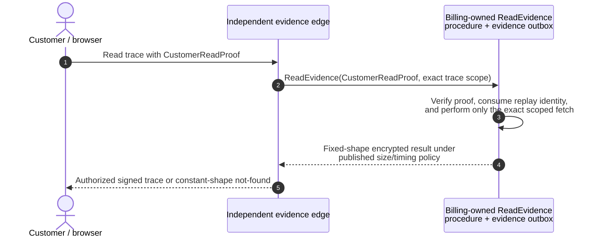
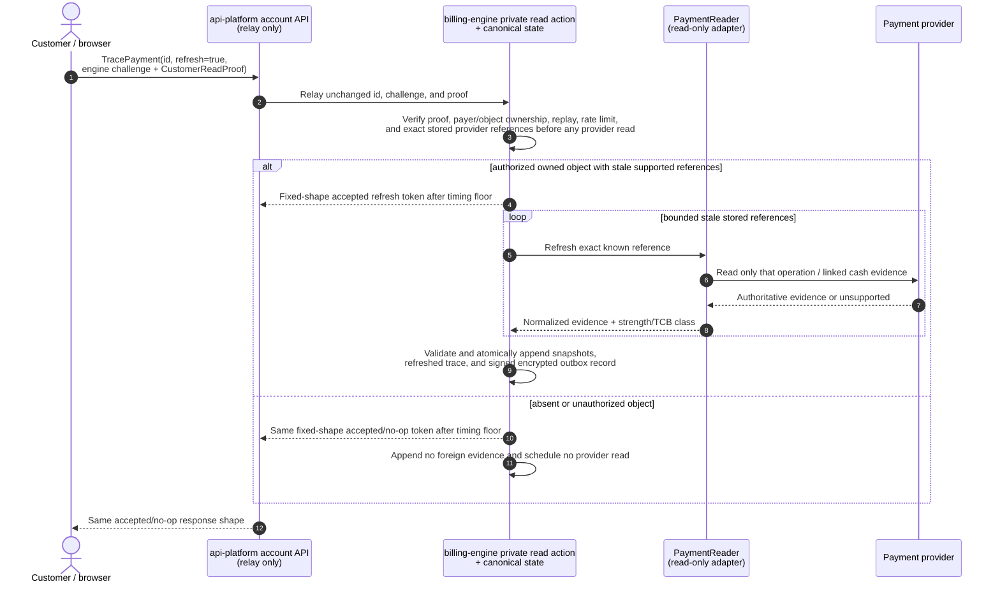

# Ledger, receipts, and provider cash-flow trace

This document defines the durable evidence behind the intent-only design in
[`DESIGN.md`](DESIGN.md).

> **Status: proposed, not implemented.** The current engine has useful frozen
> attempts, an invoice mirror, and an append-only credit ledger, but no single
> provider-neutral intent/attempt/ledger/receipt chain. Stripe invoice rows are
> currently carrying responsibilities that this design separates.

The central rule is:

> **Our ledger states the monetary obligation. Provider evidence proves what an
> external rail did. Neither silently rewrites the other.**

---

## 1. Five different records

| record | answers | may move money? |
|---|---|---|
| `ChargeIntent` | what exact effect was proposed and permitted? | no |
| `FundingPlan` | which exact credit lots/exposure windows and optional external remainder fund it? | reserves credit and authorization exposure only; no debit |
| `PaymentAttempt` | what did one frozen semantic attempt and its finite provider-step plan try to do? | through permit-gated writers only; absent for wallet-only settlement |
| `LedgerTransaction` | what monetary state did MirrorStack commit? | records the effect; does not call a provider |
| `ProviderEvidence` | what does the provider report happened? | read-only |

A provider invoice is not a `ChargeIntent`. A successful callback is not a
ledger entry. An internal ledger row does not prove the provider received cash.
A complete `ChargeReceipt` connects the intent, funding plan, and ledger. It
also connects the attempt and provider evidence when an external provider
remainder exists.

---

## 2. Append-only ledger contract

Every committed monetary transition has:

- a globally unique transaction id,
- a typed operation and schema version,
- payer/account and currency,
- intent and payment-attempt references where applicable,
- one or more source/reference ids,
- entries whose signed amounts balance to zero within one currency,
- exact creation and effective times,
- engine build and policy digests,
- a deterministic idempotency key, and
- a link to any reversal, refund, dispute, or correction chain.

Posted transactions are never updated or deleted to correct money. A correction
is a new transaction that explicitly references what it reverses or adjusts.
Derived balance/cache rows may be rebuilt and are never the audit source.

The ledger writer is not a generic service action. It runs inside the trusted
billing-core transaction and accepts only a purpose-typed, state-validated
transition produced after intent/source/authority/funding/evidence checks. It
atomically commits reservations/claim state, balanced entries, receipt, and
evidence outbox. `api-platform`, executors, callbacks, adapters, operators, and
ordinary queues have no ledger-write route, IAM permission, or constructible DTO
that can post even a balanced positive obligation.

The chart of accounts, revenue-recognition time, tax-liability accounts, and
legal retention period are finance/accounting decisions. This document does not
infer them from today's table names. Whatever chart is accepted must retain the
balanced, append-only, per-currency invariants above.

### No implicit cross-currency entry

Each transaction balances in one named currency. Cross-currency conversion is
not in the target's closed monetary-effect vocabulary. A currency change requires
a new same-currency-priced intent under a published price-book revision. An
adapter never converts an authorized total silently.

### No generic positive adjustment

Administrative tools may issue a typed customer credit or reverse a known
incorrect debit. They cannot post an arbitrary new customer debit. A positive
customer obligation follows the normal intent, notice, authorization, and
execution lifecycle.

---

## 3. Operational transaction families

The exact accounting entries remain finance-owned, but the engine must represent
these operational families explicitly:

| family | required source | customer consequence |
|---|---|---|
| receivable/obligation | one sealed intent | amount becomes due under the documented collection terms |
| external payment settlement | one successful attempt + verified provider evidence | cash collected; intent can settle once |
| wallet/credit purchase | customer-authorized purchase attempt | cash becomes customer credit/liability under accepted terms |
| wallet/credit application | exact intent + source credit lots | credit reduces that intent; source lots remain traceable |
| grant/goodwill credit | typed authorized issuer and reason | customer balance increases without external payment |
| refund | settled transaction + authorized refund intent | cash/credit returned; original history remains |
| reversal/void | known unsettled/incorrect operation | neutralizes a specific earlier record |
| dispute/chargeback | verified provider dispute evidence | disputed cash state recorded without rewriting settlement |
| tax adjustment | original tax determination + replacement rule/evidence | value-returning credit/refund is linked; any positive customer obligation requires a new exact authorized/noticed `ChargeIntent` |
| write-off | accepted finance policy + actor/reason | receivable treatment changes; customer history remains visible |

Late usage does not reopen a settled intent. It produces a separately disclosed
adjustment intent or a credit, according to the accepted late-event policy.

---

## 4. Payment attempts

A wallet-only intent has no attempt. A provider-funded charge has exactly one
semantic `PaymentAttempt` and one frozen finite `ProviderExecutionPlan`. The plan
may contain multiple separately fenced step operations—such as prepare, exact
hold, exact debit, and release—but at most one step can perform the exact debit.
A second semantic attempt or rail requires a linked replacement intent; a next
step inside the same plan does not. The settlement claim still permits at most
one successful debit across all providers.

The canonical intent and provider-step graphs live in
[`DESIGN.md` §4](DESIGN.md#4-intent-lifecycle); this document does not define a
competing state machine. Every step transition is appended. Verified non-adverse
preparation or an exact hold retains the claim/reservations and permits only the
already frozen next step after a fresh full gate. `provider_pending`,
`action_required`, `execution_unknown`, `submitted_unknown`, `hold_active`, and
`client_dispatched` also retain them. A generic decline/error/provider `failed`
label is evidence only. Release requires core-verifiable proof that every prior
and current collectible path was released or did not and cannot later collect.
An operator can attach evidence or escalate, but cannot clear the latch by
assertion.

The attempt freezes:

- intent id and digest,
- exact `MerchantOfRecordBinding`, provider, merchant account, environment,
  adapter artifact/version/capability digest, required evidence class, and actual
  credential/enclave scope,
- payer, tagged `AuthorityEvidence`, and exact accepted instrument/mandate binding,
- for `subscription_start`, accepted responsibility/schedule generation and the
  claim plus every adverse/customer-collectible consume-time generation check,
- currency and provider minor-unit total,
- frozen `ProviderAutonomyPolicy` and complete ordered `ProviderExecutionPlan`,
- current step plus every deterministic step/egress reference, effect class,
  envelope/consume/permit identity, and authoritative prior-step evidence,
- mutation-transport configuration digest proving automatic retries and redirects
  disabled, plus the single permit-bound outbound-request fence/ordinal and its
  started/result-or-unknown evidence,
- actual debit instrument identity, or for refunds the exact source object and
  return destination, and
- creation/expiry times and selected customer-action flow.

Retries do not automatically switch provider. After the prior rail is
authoritatively proven not to have collected and incapable of later collection,
a rail switch requires a replacement intent with a new funding plan, digest, and
fresh eligibility decision, plus either exact customer-present disclosure/proof
or standing notice and delivery-relative wait, as applicable. Only that
replacement intent may create an attempt on the new rail.

### Payment-method setup receipt

A reusable saved method is accepted only with a historical
`PaymentMethodSetupReceipt` binding the canonical setup disclosure/digest and
exact `ProviderMerchantSetupBinding`; the engine-effective customer acceptance receipt
and underlying proof commitment; payer proof-stream sequence/head/cutoff, factor
and verifier-release revisions, and dispatch-time plus terminal-completion proof-
head/revocation outcomes; the exact
no-debit `ProviderExecutionPlan`; every step envelope/consume/permit/egress
identity; setup-executor/enclave artifact, workload, scoped provider-credential
attestation and transparency checkpoint; adapter artifact/version; and either
direct core-verifiable provider-signed setup/session/mandate evidence or, when
read-back is used, the exact trusted session/mandate-reader evidence class plus
artifact/workload/credential-or-enclave attestation. It also binds normalized
provider evidence, `BillingDecisionProof`, and readable method identity/scope.
Unknown, substituted, revoked, expired, or wrong-role artifacts make the receipt
unusable for standing authority. Current runtime `Health` is not a replacement.

### Mandate-revocation receipt

`MandateRevocationReceipt` has its own signature domain. It binds the engine-
effective customer revocation/proof-stream cutoff, original setup receipt and
readable method identity, provider/entity/merchant, immediate engine cutoff of
linked standing authority and active pre-adverse grants, exact finite revoke plan,
every `AuthorizedMandateRevokeStepEnvelope`/consume/permit/egress identity,
provider-signed or trusted read-back evidence, `BillingDecisionProof`, and
separate `engineRevokedAt` and provider status. Pending/unknown provider detach
never re-enables engine use. Established hold or customer-collectible cleanup
remains source-bound and fenced rather than being erased by the revocation.

---

## 5. Provider evidence

Each adapter exposes a narrow `PaymentReader`. It may be called read-only only
when the provider enforces a read-only credential, or when a fixed-read broker
inside the one attested `ProviderCredentialEnclave` owns the broader credential
and exposes operation-bound reads to an external credential-free reconciler. No
separate reader owns another broad credential. A Go interface alone does not
constrain a compromised enclave. If neither control exists, the adapter must
report separated reconciliation unsupported and is not eligible for unattended
automatic execution.

An evidence snapshot contains:

- provider and merchant-account identity,
- adapter and provider API/schema version,
- external object type and opaque id,
- normalized status, amount, currency, and payer-correlation class/evidence
  (authoritative provider identity or authenticated deterministic operation
  reference bound to the frozen local payer/attempt),
- parent/child edges to related provider objects,
- provider event/callback identity when applicable,
- when callback ingress supplied the observation, callback-auth credential class/
  provider-enforced scope, bounded raw-request policy, verifier artifact/workload/
  owner and attestation checkpoint, replay identity/result, and public-ingress or
  fixed-enclave verification location,
- observation time and retrieval method,
- canonical payload digest, and
- verification result for signature/authenticity and expected intent fields.

Sensitive raw provider payloads are encrypted and access-controlled. Customer
exports contain normalized evidence plus domain-separated hiding commitments for
sensitive fields; canonical digests are used only for non-sensitive/high-entropy
artifacts. They contain no reusable credentials or unrelated personal data.

Customer exports include only attempt-attributable amounts/edges. A provider
payout, settlement batch, balance transaction, or other aggregate that contains
multiple payers is never exported with its aggregate total, unrelated membership,
merchant-wide metadata, or stable identifier usable as a cross-tenant oracle.
Where the provider exposes enough structure, the bundle carries a hiding
commitment plus a privacy-preserving inclusion/attribution proof for only this
attempt's amount. Otherwise that downstream edge is `unsupported`; a merchant-
wide object is not weakened into customer evidence merely because it is useful to
operators.

### Stripe trace

The Stripe adapter must be able to walk from a `PaymentAttempt` to the applicable
Stripe payment/invoice objects, their successful or failed payment evidence,
attempt-attributable balance movement, privacy-preserving payout/settlement
attribution where the account exposes it,
refunds, and disputes. The exact object graph is adapter-versioned because Stripe
APIs evolve.

The trace answers both directions:

- given a MirrorStack receipt, which Stripe objects and cash movements support
  it? and
- given a Stripe object/event, which one intent, attempt, ledger transaction,
  and customer receipt own it?

Every relationship is verified by provider/merchant account, amount, currency,
deterministic operation reference, stored metadata, and the adapter's declared
payer-correlation evidence. A rail without provider-side customer identity may
use an authenticated operation reference that uniquely binds to the frozen local
payer/attempt. A matching text description is never sufficient.

### NewebPay trace

The NewebPay adapter will normalize the order/payment, authenticated server
callback, customer return, attempt-attributable settlement/batch, refund, and reversal evidence that
the contracted APIs actually expose. This design intentionally makes no claim
about a NewebPay feature until the merchant agreement, official integration
specification, and adapter conformance tests establish it.

A return-page request alone never proves payment. The adapter's authenticated
server evidence and/or authoritative read API must reconcile the known attempt.

### Evidence is not authority to invent money

If a provider reports an amount, payer, currency, or status that disagrees with
the attempt, the engine records a reconciliation incident. It does not change
the intent or ledger to make the mismatch disappear.

---

## 6. Cash-flow trace API

The default trace is served from the independent evidence edge and requires no
private RPC. An optional live refresh is a private engine read action;
`api-platform` may relay the customer's proof unchanged but cannot authorize the
read. The engine follows only stored references into a normalized provider trace:

The normal local read has only the independent evidence path:



An explicit refresh is asynchronous and separately bounded:



The customer reads any resulting update through the normal evidence diagram.
Provider reads use a native read-only credential or a fixed-read broker inside
`ProviderCredentialEnclave`; the external reconciler remains credential-free in
the latter case.

Each node is labelled `recorded`, `provider_verified`, `pending`, `unsupported`,
or `mismatch`. Unsupported evidence is different from absent evidence.

`CustomerReadProof` binds the independently enrolled customer factor to the
 payer/account, exact object or bounded collection scope, evidence-edge/read
 audience, nonce, expiry, replay identity, and encryption-key version. The edge
 and engine verify the billing-owned factor mapping; an `api-platform` bearer or
 identity assertion cannot mint it. Authorized, absent, and unauthorized requests
 use the same published status/error shape, padded-size class, minimum timing
 bucket with bounded jitter, and rate limit. This bounds that observable oracle;
 it does not claim perfect network or microarchitectural indistinguishability.

The default trace is local and makes no provider call. An explicit refresh is
rate-limited or batched by the adapter and may append new observations, but it
cannot retry payment, finalize an invoice, issue a refund, trigger auto top-up,
mutate a budget, or change an intent. Read paths are incapable of provider writes
by interface and deployed credential.

This is a critical migration requirement: current `main` contains a status-read
path that can synchronously trigger auto top-up. The intent-only deployment may
not call itself read-only until query and reconciliation binaries cannot compile
against a payment-write port.

---

## 7. Charge receipt and verification bundle

A `ChargeReceipt` is created only after the relevant ledger transition commits.
It contains or references:

1. canonical `ChargeIntent` bytes/digest; exact `CommercialIdentityBinding` used
   by source/tax/wallet evaluation; and final composite
   `MerchantOfRecordBinding` with bounded `MerchantBindingSet` membership/
   compatibility proof and exact settlement route;
2. each applicable tagged source authority, including service leaf/window
   allocation root, signed local `SourceAllocationCheckpoint` transition evidence
   and optional asynchronous state-log inclusion,
   `ServiceAccrualExposure` upper-bound-to-exact-line arithmetic, one-time replay
   identity, auto-top-up trigger, or receivable capacity;
3. every rating source commitment/module billing-manifest version plus exact
   bounded-interpreter/limit revision, formula, integer scale, rounding, subtotal,
   rating/tax credit, tax, and total;
4. terms, price-book, tax, notice, `TimeReadinessPolicy`, rail-routing, autonomy,
   and execution-plan policy digests plus observed time uncertainty where used;
5. frozen `FundingPlan`, exact credit-lot and authorization-scope exposure
   reservations, gross obligation, wallet application, provider remainder,
   wallet active-index generation/range proof, aggregate gross monotonic cap/window
   arithmetic, any explicit `CapRecreditPolicy`, and funding/cap result; a deferred
   prepaid reservation also binds its expiry-preservation rule, reserved time,
   service window/scheduled close, nominal expiry, exact range/amount, generation,
   and terminal consume/release evidence;
6. exact mutually exclusive debit `AuthorityEvidence`:
   `debit_customer_present` acceptance/proof plus current one-time-or-standing
   authorization, or `standing_automatic` authorization acceptance/
   proof plus terminal `NoticeReceipt`, completed wait, and exact
   `RevocationPathReadinessReceipt`; both bind payer sequence/head/cutoff, factor/
   verifier revision, authorization scope/lineage, carried exposure, and
   dispatch-time revocation result;
7. accepted `SubscriptionOffer` and activation-gated
   `SubscriptionScheduleReceipt` when applicable, including cadence/time zone,
   anchor, first-period/recognition rules, responsibility/schedule generation and
   atomic first-settlement activation CAS or source-linked late-old-payer result;
   and any `BillingResponsibilityTransferReceipt` with the common canonical
   transfer commitment, two audience-specific disclosure/proof digests, both
   authenticated payer-stream heads/applied cutoffs, effective cutoff and proof/
   activation deadlines, exact accepted activation-failure disposition,
   deterministic lock/apply/time-barrier policy,
   responsibility/source generation CAS, source/exposure partition, retained old
   claims, and explicit non-transfer of mandates/wallet/tax/notice state; the
   transaction emits separate payer-encrypted views under one transaction
   commitment, and the new-payer view contains no old-payer private financial
   details;
8. for `auto_topup`, trigger reservation/epoch, canonical creation balance and
   other-pending-funding snapshot, owning intent, consume-time recheck snapshot/
   result/time, and atomic credit/bonus grant + trigger/pending-funding close;
9. exact signed `BillingDecisionProof`: closed key/predicate schema,
   authenticated proof head, before/after row commitments and generations,
   transaction/build/policy identities, matching outbox record, and optional
   asynchronous state-transparency status/checkpoint; its state assurance is
   explicitly `attested`;
10. engine Git SHA, artifact digest, receipt schema, and build provenance;
11. when provider execution exists, exact `ProviderAutonomyPolicy` and finite
   `ProviderExecutionPlan`, every step envelope/consume/opaque-permit/egress
   identity/effect class, exact scoped enclave/executor/adapter/workload/
   credential attestations and checkpoints, zero-retry/no-redirect transport
   configuration plus the one outbound-request fence/evidence, `PaymentAttempt`
   transitions, actual debit instrument binding, and normalized provider evidence
   with explicit evidence-strength/TCB class;
12. exact attested notice/reconciliation reader or enclave-broker artifact,
    workload/credential scope, evidence class, and checkpoint when that path
    supplied evidence; and, when callback evidence was used, the exact callback-
    auth credential class/scope, bounded-request policy, verifier artifact/owner/
    checkpoint, replay result, and verification location;
13. balanced ledger transaction ids/entries and evidence-outbox checkpoint; and
14. correction/refund/dispute links, if any.

The bundle has a canonical encoding and its own digest. The public verifier
recomputes the rating and structural invariants offline:

```text
billing-verify verify charge-bundle.json
```

A `RefundReceipt` uses a distinct schema and signature domain. It binds immutable
`RefundIntent`, source charge/settlement/ledger/provider commitments, typed return
authority, exact line/tax reversal, `RefundPlan` wallet-lot restorations and
provider-return remainder, refund-capacity arithmetic/reservations, any finite
provider execution plan and per-step evidence, actual source object/return
destination, `BillingDecisionProof`, balanced return ledger entries, artifact/
evidence-class attestations, and outbox checkpoint. For a `credit_purchase` or
`auto_topup` source it additionally proves the `GrantedValueClawbackReservation`
and atomic cancellation of the corresponding unspent granted/bonus lots; cash
return with still-spendable output is invalid. It never contains or satisfies
debit `AuthorityEvidence`, a debit `FundingPlan`, or a collection notice.

Provider live status is optional verification evidence and requires network
access plus customer authority. Offline arithmetic and policy verification do
not.

---

## 8. Reconciliation rules

Reconciliation is continuous but non-authoritative:

1. authenticate a callback or query through the provider adapter;
2. resolve exactly one known attempt by deterministic reference;
3. verify merchant account, currency, amount, operation kind, and either the
   provider payer identity or authenticated deterministic operation binding;
4. append the evidence snapshot;
5. compare it to attempt and ledger state;
6. append the one allowed state transition, or open an incident; and
7. never originate a new debit from an unmatched event.

Duplicate/reordered callbacks are absorbed by unique provider event ids and
monotone transition rules. A callback that arrives before local commit is held
for bounded reconciliation; it is not attached to a similar-looking customer.

When provider evidence proves money moved but local ledger commit failed, the
engine recovers the exact frozen attempt into the ledger. It never calls the
provider again to make local state easier.

---

## 9. Verification requirements

Before this design can be reported as deployed, tests must demonstrate:

- every ledger transaction balances per currency;
- concurrent intents cannot reserve more than one authorization/cycle/frequency
  ceiling; planning proves `settled + active reservations excluding candidate +
  candidate <= cap`, and execution proves `settled + all active reservations <=
  cap` because the candidate is already reserved;
- exposure reservations are retained through pending/unknown, consumed with
  settlement, and released only by the documented pre-dispatch/no-collection
  transitions;
- each finite plan step has one purpose/step envelope, one consumed permit, one
  egress identity, and at most one SDK mutation; prepare/hold cannot settle, and
  next-step authorization requires verified prior-step evidence plus a fresh gate;
- setup, payment, mandate-revoke, void, and refund signatures/permits are
  non-coercible, and mandate revocation records engine cutoff separately from
  provider detach status;
- funding-intent cash refunds cannot complete unless corresponding unspent
  granted/bonus output lots are atomically clawed back;
- subscription acceptance alone admits no billable usage; wallet/pre-adverse first
  settlement refuses on a responsibility/schedule-generation mismatch. An already-
  dispatched external debit is still recorded truthfully, but activates the
  accepted schedule/anchor/service only when that generation CAS succeeds;
  otherwise it enters source-linked old-payer resolution with no service;
- `BillingDecisionProof` replay validates the supplied transaction chain while
  reporting live-state completeness as `attested`, and asynchronous transparency
  detects conflicting published histories without blocking execution;
- a settled intent cannot settle through a second provider;
- an unknown provider outcome prevents retry until reconciled;
- provider callbacks cannot create attempts or change amounts;
- a read/trace/status call cannot reach any write interface;
- local evidence and live-refresh reads use the fixed response-shape/timing policy;
  guessed foreign ids schedule no provider read and disclose no ownership signal;
- provider evidence mismatches create incidents rather than ledger mutation;
- corrections are linked append-only entries;
- receipt verification reproduces every cent/minor unit;
- sensitive provider fields are absent from exports; and
- Stripe and NewebPay adapters pass the same provider-neutral conformance suite,
  with unsupported capabilities reported explicitly.

Mutation testing must deliberately break the cross-provider uniqueness guard,
amount comparison, callback-origin rule, per-currency balance, and read/write
interface separation, and record which test kills each mutation.

---

## 10. Decisions still required

Finance, product, legal, and operations must settle these before ledger cutover:

- chart of accounts and revenue-recognition timing;
- merchant-of-record and tax-liability ownership;
- wallet/credit legal characterization and expiry/refund rules;
- dispute, chargeback, write-off, and negative-balance treatment;
- TWD and other currency price books and any FX policy;
- payout/settlement evidence customers may see for each provider; and
- retention, export, and deletion rules for provider evidence and personal data.

Until accepted, they remain explicit decisions—not behavior inferred from the
current Stripe-shaped schema.
