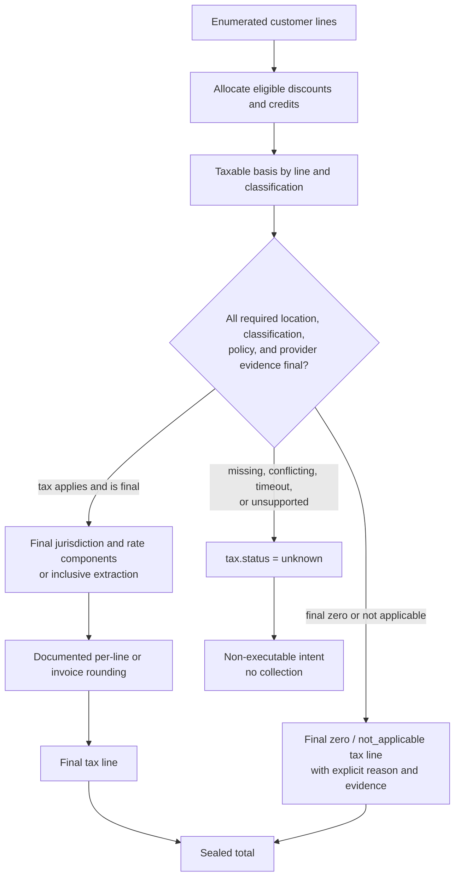

# Tax is a versioned input, never a hidden percentage

Tax changes the amount a customer is asked to pay and the amount MirrorStack may
owe a government. It therefore belongs inside the same immutable intent,
notice, authorization, receipt, and verification boundary as every other line.

> **Status: unresolved target policy.** Current `main` has no authoritative tax
> calculation, jurisdiction evidence, exemption model, tax line, or refund
> allocation. A mocked `$0.00` UI value is presentation only. Production
> collection under this design fails closed until the merchant-of-record and tax
> decisions in §11 are accepted and implemented.

This document defines the safety shape. It does not provide legal or tax advice
and does not infer a jurisdictional obligation from code.

---

## 1. Three tax states

Every proposed intent has a `TaxDetermination` in exactly one state:

| state | meaning | executable? |
|---|---|---|
| `final` | calculation completed under one immutable policy/evidence snapshot; amount may be zero or positive | yes, subject to all other controls |
| `not_applicable` | a versioned rule explicitly explains why no tax applies | yes, subject to all other controls |
| `unknown` | evidence, policy, provider result, or jurisdiction decision is missing/conflicting/unavailable | **no** |

`unknown` is never converted to zero. A final zero result includes the reason,
tax category/jurisdiction outcome, rule revision, and evidence that distinguish
it from an outage or unsupported location.

---

## 2. Authority boundary

The private caller may provide authenticated customer-owned facts through a
dedicated tax-profile flow—for example a billing address or tax registration
identifier—but it cannot supply:

- jurisdiction verdict,
- taxable classification,
- inclusive/exclusive rule,
- rate,
- exemption verdict,
- reverse-charge verdict,
- rounding result,
- tax line or total, or
- `taxKnown`/`taxExempt` boolean.

The tax resolver combines verified customer evidence with an immutable
`TaxPolicyRevision` and, where selected, a versioned external tax-calculator
result. It cannot call a payment provider or execute an intent.

Payment adapters do not calculate or alter customer tax. If a provider-hosted
flow requires tax configuration or returns a total that differs from the sealed
intent, the attempt is refused/quarantined and the discrepancy is recorded.

---

## 3. `TaxPolicyRevision`

A revision is append-only and content-addressed. It includes:

- policy id, digest, publication time, and future effective window,
- seller/merchant entity and registration scope,
- supported customer jurisdictions and required location evidence,
- product/charge-kind tax classifications,
- business/consumer and exemption/reverse-charge rules,
- tax-inclusive or tax-exclusive presentation rule,
- currency, precision, allocation, and rounding rules,
- external calculator/provider name and ruleset/API version when used,
- invoice/receipt evidence requirements,
- credit, refund, cancellation, and bad-debt adjustment rules, and
- behavior for unsupported, conflicting, stale, or unavailable evidence.

There is no mutable "current tax policy" fallback. An intent names one exact
effective revision. Publishing a replacement never changes an already-sealed or
settled intent.

Tax-law/rate updates use a new revision with the legally/product-required
effective time. Whether they require advance customer notice or renewed terms is
an accepted policy decision and is published, not hardcoded privately.

---

## 4. Frozen input evidence

A final determination records only the evidence needed for audit and customer
verification, with sensitive values protected:

- payer and billing entity,
- seller/merchant entity,
- transaction time and service/period location rule,
- customer location evidence types, issuer/source, collection time, and stable
  commitments to sensitive values,
- business/consumer classification where legally relevant,
- verified tax id/exemption certificate reference and validation status,
- currency,
- each taxable line's kind, classification, basis, discounts/credits allocation,
- jurisdiction/rule identifiers and rate components,
- inclusive/exclusive extraction formula,
- per-line and invoice rounding steps,
- external calculation request/response commitments and version, and
- final amount/status and explanation.

Raw addresses, tax ids, and certificates are encrypted and access-controlled.
The customer bundle contains readable outcomes and stable hashes/references
needed to prove which evidence was used without publishing personal data.

Conflicting required location evidence yields `unknown` unless an accepted rule
resolves that exact conflict.

---

## 5. Calculation and rounding

Tax is calculated before the intent is sealed and before exact notice is sent.
The receipt exposes the exact order:

The rater uses exact integer/rational arithmetic in the named currency scale.
There is no float and no second provider-side rounding point. If a jurisdiction
or invoice rule cannot be represented by the accepted policy/schema, tax remains
unknown and collection does not occur.

Tax never applies to an internal infrastructure-cost line because no such
customer line exists. Provider fees are also internal unless a future explicitly
enumerated customer kind is accepted.

---

## 6. Intent, notice, and changes

The `ChargeIntent` digest covers the complete determination and final tax amount.
The customer notice shows:

- subtotal before tax,
- credits/discounts and their tax allocation,
- taxable basis,
- tax amount,
- inclusive/exclusive presentation,
- customer-readable jurisdiction/treatment explanation,
- whether a tax id/exemption/reverse-charge result was used, and
- final amount/currency.

If tax changes after notice—even by one settlement unit—the old intent is
superseded. A new intent, digest, notice, waiting period, and authorization check
are required.

A tax calculator outage after an intent is sealed does not change that intent.
Execution verifies the frozen final determination and policy validity; policy
revocation rules must state whether a known defective determination blocks
execution and requires replacement.

---

## 7. Credits, refunds, and corrections

Credits are allocated to lines before tax according to the versioned policy;
they are not subtracted from the final total with unspecified tax treatment.

A refund or correction references the original intent, line allocation, tax
determination, payment settlement, and ledger transaction. It produces a new
refund/credit tax determination and append-only entries. It never edits the
original tax line.

Partial refunds must preserve the accepted jurisdiction's allocation and
rounding rule. The provider adapter cannot choose a tax refund amount from a
free-form request.

When the customer total is negative after corrections, the accepted finance/tax
policy decides whether to issue cash, wallet credit, or carry-forward. The
receipt states the result.

---

## 8. External tax calculator

An external calculator, if selected, is a constrained evidence source behind a
provider-neutral `TaxResolver` interface. The adapter:

- builds requests only from enumerated intent lines and verified tax profile,
- records calculator/ruleset/API version and canonical request/response digests,
- validates returned currency, basis, line identity, and total,
- refuses extra/missing/reordered lines that cannot be matched exactly,
- treats timeouts/ambiguous/unsupported results as `unknown`, and
- performs no payment-provider operation.

The public offline verifier can validate how the frozen result was incorporated
and rounded. Whether it can independently recompute the legal rate without the
external proprietary ruleset is a product/vendor decision and must be disclosed.
"Calculator verified" is not described as "fully independently recomputed"
unless it actually is.

---

## 9. Stripe and NewebPay relationship

Stripe and NewebPay are payment rails, not tax policy authorities by default.
The domain determination is provider-neutral and frozen before either adapter
executes.

If a future Stripe tax product is used, it is integrated through `TaxResolver`,
not hidden in Stripe invoice finalization. If a NewebPay flow requires Taiwan
invoice/tax fields, the adapter receives the frozen permitted presentation data
and must return evidence matching the exact intent. Neither rail may add tax at
payment time.

This document intentionally makes no claim about NewebPay-supported tax,
electronic-invoice, recurring-payment, refund, settlement, or currency behavior
until the official integration specification and merchant agreement are reviewed
and tested.

---

## 10. Verification requirements

Tests must demonstrate:

- `unknown` can never become executable or serialize as zero;
- final zero and not-applicable each require an explicit versioned reason;
- missing/conflicting/stale customer evidence fails closed;
- a new policy cannot apply before its effective time or retroactively;
- every charge kind has an explicit taxable classification;
- credits and partial refunds preserve line allocation and rounding;
- any provider/calculator amount or currency mismatch is refused;
- changing any input/rule/result changes the intent digest;
- tax changes after notice require a new intent and notice; and
- tax callbacks/results cannot call a payment writer.

Golden vectors cover inclusive/exclusive, zero, exemption, reverse-charge where
supported, compound/multiple components where supported, invoice/per-line
rounding, credits, full/partial refund, unsupported jurisdiction, conflict, and
calculator outage.

Mutation tests deliberately turn `unknown` into zero, bypass effective time,
remove evidence binding, change rounding, omit a refund allocation, and accept a
provider total mismatch; each mutation must be killed by a named test.

---

## 11. Decisions requiring tax/legal ownership

Production remains fail-closed until accountable tax/legal/finance owners decide
and record:

1. MirrorStack's merchant-of-record/seller entity for each market and rail;
2. registrations/nexus and supported customer jurisdictions;
3. B2B/B2C, tax-id validation, exemption, and reverse-charge treatment;
4. product/charge-kind classifications;
5. tax-inclusive versus tax-exclusive pricing/display;
6. location evidence and conflict/staleness rules;
7. rate/rule source and whether an external calculator is authoritative;
8. invoice versus line rounding and credit allocation;
9. cancellation, refund, partial refund, dispute, and bad-debt adjustments;
10. invoice/e-invoice issuance, numbering, retention, and correction duties;
11. Taiwan entity, business-tax/e-invoice, TWD, and NewebPay-specific obligations;
12. price/tax-change customer notice and renewed-authorization policy; and
13. retention/deletion/access rules for addresses, tax ids, and certificates.

Each accepted decision becomes an immutable policy revision and ADR. Until then,
the engine can calculate estimates for UI experiments only when clearly labelled
non-authoritative; it cannot collect them.
